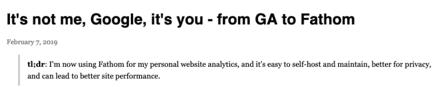

# 本周值得一读的 5 篇外星人文章👽📖

> 原文：<https://dev.to/xenoxdev/5-alien-articles-of-the-week-worth-reading--2aom>

大家好！我最近读了很多书，所以我想为什么不分享这些知识。以下是上周我最喜欢的片段...差不多吧。这些是在 Dev.to 之外发布的文章，因此被称为“alien”。👽

# 1。不是我，谷歌，是你——从 GA 到 Fathom

对于那些厌倦了谷歌从人们的数据中赚钱的人来说。如果您想在不使用 GA 的情况下跟踪分析，请查看 Jeff Geerling 的这篇文章。它谈到了 Fathom，这是一个非常受欢迎的产品。我们都知道谷歌向第三方企业出售我们的数据和我们网站的用户数据，我们中的许多人开始意识到从长远来看这有多糟糕。这就是 Fathom 的用武之地。使用 Fathom，您不必同意与那些第三方应用程序共享任何数据，因为每个用户跟踪数据都将仅存储在您自己的网站中。

# 2。你不知道的 5 个任务可以用纯 HTML 和 CSS 完成

August R. Garcia 的这篇文章向我们展示了纯 HTML & CSS 在正确使用时是多么强大。这是一篇短文，但我们中的许多人可能没有意识到这些事情，所以它绝对值得一读。它还谈到了 CSS 框架如何增加不必要的膨胀和复杂性，你可以在这里阅读更多关于[的内容](https://dev.to/teamxenox/do-we-really-need-a-css-framework-4ma6)。现在去做一个 HTML 忍者吧！

# 3。性能与可读性

在软件开发的世界里，团队的变化经常发生。人们来了又走，但是代码留下来了，所以保持代码的可读性和性能变得非常重要。但是有些时候我们不得不为了另一个而牺牲一个。Riccardo Polacci 的这篇文章可以根据项目的需要，指导您何时以及优先处理什么。

# 4。如何用纯 CSS 为你的情人创建一个跳动的心脏

情人节就要到了，你想为你的情人做些特别的事情。为什么不好好利用你的编码技能呢？查看 Dimitris Kiriakakis 的这篇文章。他用他的 CSS 技能创造了一个美丽的跳动的心脏。

# 5。初学者不要做的事情清单。

作为初级程序员，我们大多数人在学习过程中都容易犯愚蠢的错误，有些人比其他人更容易犯。这有时会导致挫折和延迟掌握新技能，而这是很容易避免的。我犯了很多新手的错误，这就是为什么我能欣赏 Srivats1212 在 Reddit 上的这篇文章，它涵盖了容易避免的新手错误。我相信你也会的。

# 让我知道你的想法！

你对上述文章有什么看法？你们都读了些什么？请在评论里告诉我！我也想知道你最喜欢的开发博客是什么。日安！❤

