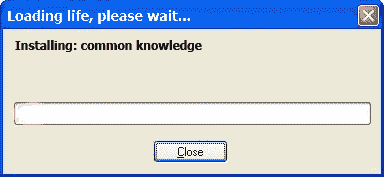

# 给初学者的 5 个调试技巧

> 原文：<https://dev.to/sofiajonsson/5-debugging-tips-for-beginners-7kk>

在学习如何编码的过程中，我们不可避免地会遇到问题。有些问题比其他问题更容易解决，但有时你会觉得自己陷入了困境，看不到任何希望。我们都经历过。陷入了深深的、永无止境的编码黑洞，引发了挫败感。太多了？我会低调一点。

作为初学者，我们不可避免地会遇到我们无法解决的问题，这篇博客的目的是提醒你退一步，从不同的角度来攻击它。当你在学习的时候，有一件事情看起来比实际要容易得多，那就是调试和排除你自己的代码。在全栈训练营的准备工作期间，我不知道如何正确地解决我的代码错误，希望写这篇文章来帮助指导其他处于学习代码早期阶段的人。

### 1。阅读错误信息

在我开始编码之旅的时候，错误消息看起来就像是愤怒的红色胡言乱语，只求被跳过。这个错误信息一开始很吓人，但是一旦你越过我们已经习惯于恐惧和憎恨的红色文本，你会发现它实际上是朝着正确方向的一个非常有用的推动。错误消息将比较收到的内容和预期的内容，错误存在于哪个文件中，以及错误位于哪一行。

[T4】](https://i.giphy.com/media/pK4av7uBK3I4M/giphy.gif)

### 2。写出来..又

这适用于进出服务器。有时错误小到多余的空格、符号、不正确的大写字母等等。在代码中，在运行错误的方法下面写出同样的方法，可以帮助你比较和对比，找到你的错误。大多数情况下，误差要大得多，这可能是方法使用不当的结果。保留原始代码，但将其注释掉，以便在工作和实现更改时可以引用。对于我们中的一些人来说，旧习惯很难改变，我们需要在一张纸上手工涂掉它。画出关系、关键点和迁移。无论你觉得需要采取什么步骤来巩固关键点，就去做吧！
T3T5】

### 3。如果有疑问，就用谷歌搜索一下

哦，我们的主和救世主，谷歌。编程的美妙之处在于，我们实际上不需要记住如何做每件事，只需要记住如何阅读它，这样你就可以实现它。很可能有人已经遇到了同样的问题，并在 stackoverflow.com 贴出了一个问题，其他人已经给出了解释和答案。这仍然很棘手，因为每个人用不同的语言编写不同的代码，以确保语言是相同的，并且你理解他们在回答中做了什么。如果你能解释它，你就可以使用它！
[T3】](https://i.giphy.com/media/3o7bu0mcp3ibhm0mvC/giphy.gif)

### 4。走开，呼吸点新鲜空气

如果你觉得自己在原地打转，感到疲劳，那就休息一下。在盯着电脑屏幕看了不知道多久之后，你的眼睛最不需要的就是另一个屏幕来“减压”。去喝点水，也许吃点零食，但是去外面。让新鲜空气和阳光照射在你的皮肤上对你的整体健康有很大的好处。吸入新鲜空气能让你呼吸得更深更久，从而增加输送到身体细胞的氧气量。根据 livestrong.com 发表的一篇文章，氧气的增加转化为更大的能量和思维的清晰。你将准备好回来并开始思考新的方法。
[T3】](https://i.giphy.com/media/33F5USzk3gJdZTinpS/giphy.gif)

### 5。请求帮助

管理你的时间。如果你发现你一直在解决同一个问题却毫无进展，并且经历了前面提到的步骤，那就伸出援手。有通过博客平台的在线社区，stackoverflow.com，pythontutor.com，以及更多的自学者。
*在你伸出手之前，确保你能回答这三个问题:*

1.  你想做什么？
2.  什么代码在运行错误？
3.  你尝试过做些什么来修复它？

那些能够获得面对面帮助的人绝对应该使用它。如果他们是在教学岗位上，他们能说的最糟糕的事情就是不，或者给你指出一个模糊的方向来帮助你进入下一步。

很容易让你筋疲力尽。采取必要的措施来提高你的生产力，当你没有选择的时候寻求帮助。
[T3】](https://i.giphy.com/media/11F0d3IVhQbreE/giphy.gif)

你最喜欢的初学者调试方法是什么？

参考:
[https://www . livestrong . com/article/436651-the-effects-of-sunlight-fresh-air-on-the-body/](https://www.livestrong.com/article/436651-the-effects-of-sunlight-fresh-air-on-the-body/)