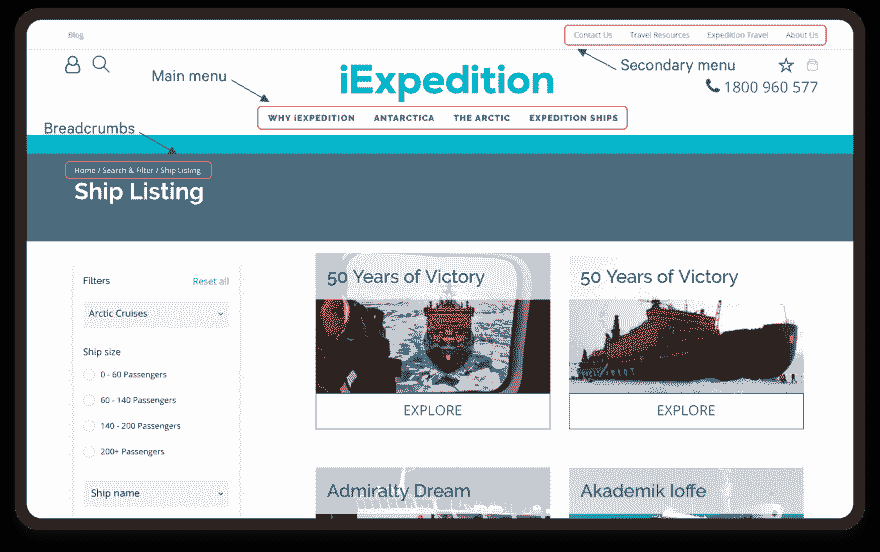
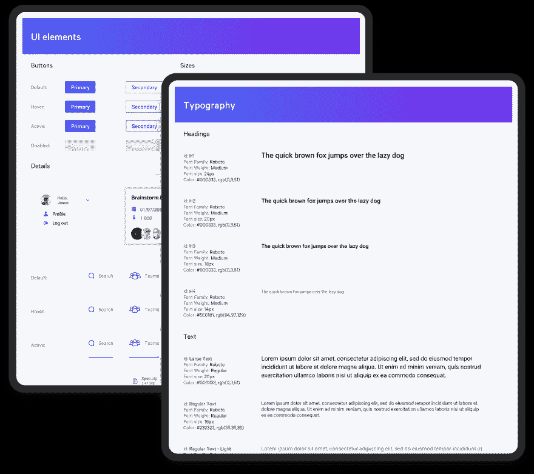
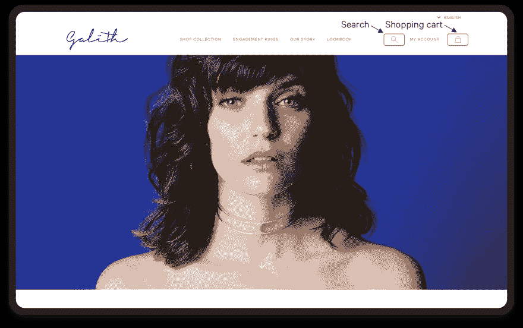
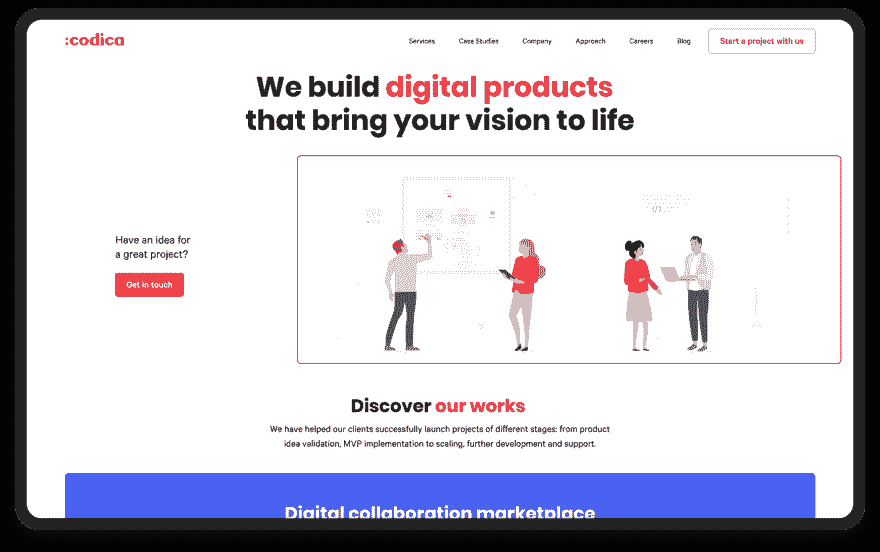
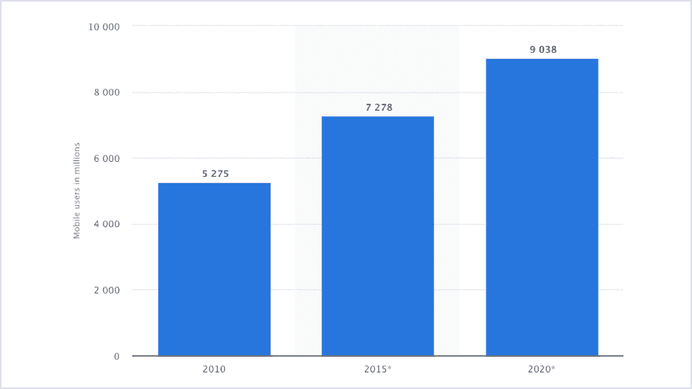
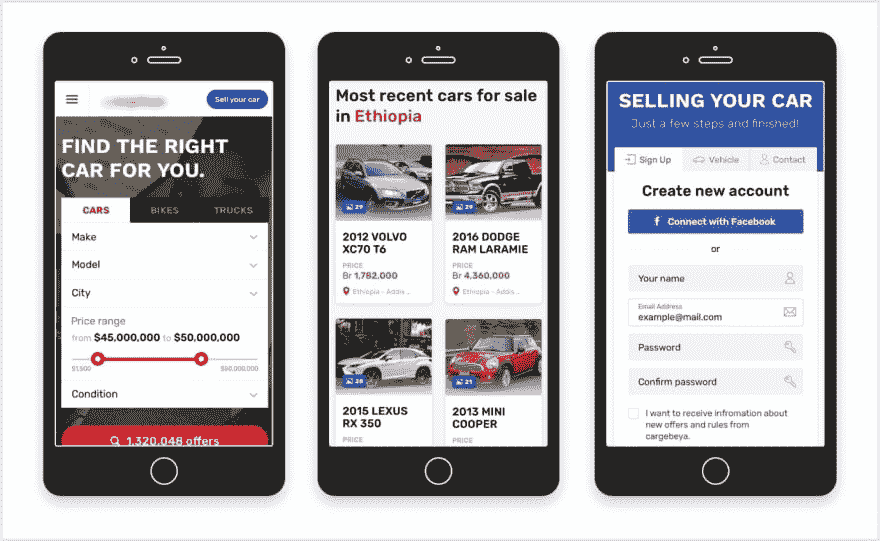
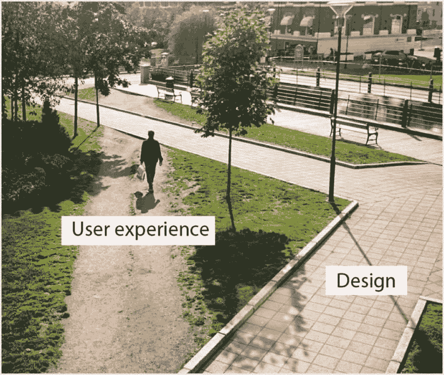

# 用户友好网站的 5 个关键原则

> 原文：<https://dev.to/codicacom/5-key-principles-for-a-user-friendly-website-338a>

*这篇文章最初发表在 [Codica 博客](https://www.codica.com/blog/5-key-website-usability-principles/)上。*

想象一下，只需要 [0.5 秒](https://ai.google/research/pubs/pub38315)就可以决定是留在网站上还是关闭标签。那么，你的网站让用户留下来了吗？

在大多数情况下，有趣的内容和吸引人的设计不足以吸引客户并帮助他们形成积极的看法。你的网站应该满足最初用户的需求。如果你能提供相关的经验和有用且简单的功能，这是可以实现的。

## 什么是网站可用性？

可用性是指使用网站的便利性和简单性。

为了让你的网站用户友好，你应该让它**与你的目标受众**相关。你需要分析你的用户和他们的最终目标。然后，你应该回答他们在访问你的网站后是否得到了他们所需要的一切？了解你的听众并了解他们的行为模式是很重要的。

为什么可用性很重要？

原因很简单:如果你的网站不够用户友好，用户会立即关闭标签并忘记它。原因可能如下:

*   用户可能会在航行中陷入热水中
*   可能找不到所需的按钮
*   可能无法购买。

## 如何让你的网站人性化？

### 1。轻松导航

导航是可用性的基础。如果客户在浏览网站时遇到问题，你的网站有多好看并不重要。简单的导航让用户有机会在几秒钟内理解网站的结构。因此，客户知道点击哪里才能到达特定的页面。

**案例分析**
[iExpedition](https://www.codica.com/case-studies/travel-management-platform/) 是一个预订航次的网络平台。因此，当我们开始开发网站时，我们非常关注导航面板及其元素，考虑它们的目标受众。

### 2。网站或应用程序的统一风格

让用户记住你的网站结构是没有意义的，也是相当困难的，所以组织一切以最大化用户体验是一个好的做法。出于这些目的，您可以为您的网站或应用程序创建一致性指南。

颜色和风格应该是显而易见的，网站应该是指向和拍摄。此外，所有的网页应该有一个共享的模板。所有这些元素允许用户在网站上快速导航。

**案例研究**
[数字村](https://www.codica.com/case-studies/collaboration-marketplace-and-smart-contract-system/)是一个在线协作平台，为创业者提供为特定项目寻找开发者和设计师的能力。

我们已经创建了一个指南，其中我们指出了可用的字体，颜色，按钮大小和悬停状态。因此，遵循指南中描述的建议有助于提高您的网站或应用程序的便利性。

### 3。遵循行业设计标准

当你开始开发一个网站时，你应该记住特定的行业标准。房地产代理网站的完美设计不适合娱乐应用。

如今，大多数用户在使用网站方面都有扎实的经验。许多人对元素的位置有特殊的期望，所以如果你试图改变元素的位置，这会对用户体验产生负面影响。

**案例分析**
[加利思](https://www.codica.com/case-studies/elegant-jewelry-store/)是一家网上珠宝店。像任何电子商务项目一样，有几个规则应该更好地遵循。

搜索选项应该在每个页面上都可用，这样用户可以随时找到他们需要的任何东西。此外，购物车按钮应该位于右上角，这是每个电子商务网站的通用标准和模板。

### 4。使用图像和插图

众所周知，我们的大脑处理视觉数据更简单。因此，使用图像和其他图形元素将有助于提高网站的知名度。当用户看到照片中的其他人时，就会留下好印象。

准确地说，插入与你的网站或应用主题相匹配的图片是至关重要的。万一你选错了，可能会显得很傻。当然，照片必须是高质量的。

而且，吸引用户注意力的有用方法之一就是插图。它有助于显示网站主题和主题。

**案例分析**
当我们创建 [Codica](https://www.codica.com/) 网站时，我们非常重视插图。我们的核心任务是确定它们全面展示了公司的价值观、服务和技术。所有这些都使网站更加有趣和用户友好。

### 5。手机版

很大一部分用户通过智能手机和平板电脑访问网站。每年，这个数字只会增加，它迫使你最初为你的网站或应用程序开发一个移动版本。通过这种方式，它提供了与来自世界各地的大量用户进行互动的机会。

继 [Statista](https://www.statista.com/statistics/218984/number-of-global-mobile-users-since-2010/) 之后，从 2010 年到 2020 年，移动用户数量几乎增加了两倍。预计 2020 年全球移动用户数量将达到 90.38 亿。

**案例研究**
这个[多供应商市场](https://www.codica.com/case-studies/multi-vendor-vehicle-marketplace/)是非洲第一个车辆交易平台。该地理区域的大多数客户更喜欢使用移动设备浏览平台网站。

### 测试

更好的做法是进行访谈，调查你的真实客户，跟踪他们的行为模式。

你应该永远记住，你为潜在客户开发在线平台和应用，而不是为你自己。此外，你应该定义最初的目标和兴趣的客户，而访问您的网站页面。

在这里，您可以观看 Jakob Nielsen 的一个有趣的视频，它涵盖了有声思维用户测试的主题，并发现了这种技术的优点和缺点。

[https://www.youtube.com/embed/v8JJrDvQDF4](https://www.youtube.com/embed/v8JJrDvQDF4)

## 结论

我们已经讨论了提高网站可用性的 5 个基本要素，这将帮助你使你的网站更加用户友好。您可以在开发、测试或分析您的网站时将它们考虑在内。

我们相信这篇文章将阐明如何使你的网站更加用户友好，变得更加面向客户。理解这一点将吸引更多的潜在客户，从而增加销售。

如需进一步阅读，请查看我们的文章:[一个用户友好网站的 5 个关键原则](https://www.codica.com/blog/5-key-website-usability-principles/)