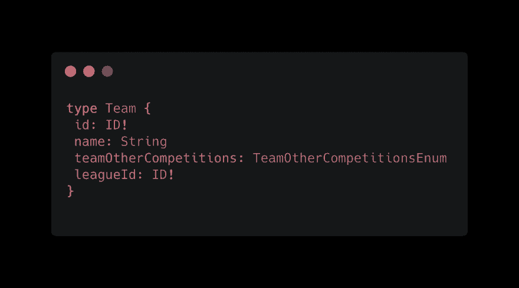
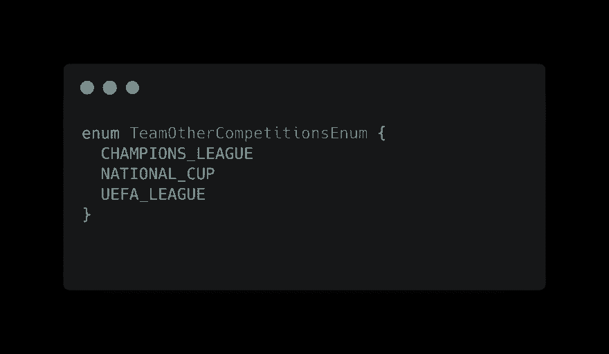
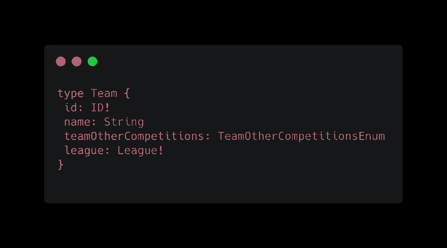
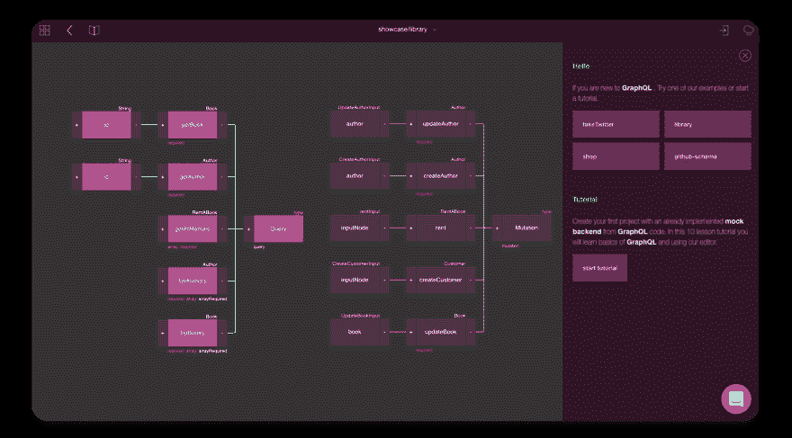

# 开始使用 GraphQL 时要避免的 5 个错误

> 原文：<https://dev.to/graphqleditor/5-mistakes-to-avoid-when-getting-started-with-graphql-4hg7>

## 目光短浅

这是一个会导致严重并发症的错误。考虑你的模式，当你的项目成长时，尽可能地预测将来会需要什么。即使您认为这种情况发生的可能性很小，也要花些时间来计划未来可能出现的元素，如附加字段或输出/输入对象类型。如果有一个很小的变化，你将来会需要它们，仔细考虑它们会防止你的项目在以后破坏这些变化。

> *记住:模式是任何 [GraphQL](https://graphql.org/) 项目中最重要的部分，所以一定要尊重对待它！*

## 命名不一致

保持命名约定的一致性非常重要。有些常见的做法你不应该忽视，比如:

*   将[驼峰](https://en.wikipedia.org/wiki/Camel_case)用于字段
*   使用 PascalCase 作为类型名
*   枚举值全部使用大写字母

## 展平查询中的对象

在“说”GraphQL 时，您可能会犯很多错误。不仅是可能妨碍你的项目正常工作的错误，而且是他们没有充分利用 GraphQL 的可能性。一个很好的例子就是我们上面创建的类型。

这里的`leageId`是一个问题，因为这将被视为不一致。当查询一个球队的联赛时，您需要执行两个数据库调用:

*   让团队拥有`leagueId`
*   将`leagueId`传递给另一个查询

这是非常疏忽的，因为 GraphQL 只是为了减少数据库调用的数量。GraphQL 更好的方法是嵌套输出类型，这使得用单个请求调用数据库和[批处理数据](https://blog.graphqleditor.com/GraphQL-Performance-issues-and-how-to-handle-them/) :
 变得更加容易

## 不使用图形界面

GraphQL 是一种非常现代的“语言”,所以有许多令人惊叹的工具、插件或编辑器可以加速模式设计过程，那么为什么不使用它们呢？如果您开始使用 GraphQL，那么用图形界面设计您的第一个模式是一个好主意。这将减少错误的数量，加快你的工作和 GraphQL 的学习曲线了很多！

## 不使用 GraphQL

如果你仍然专注于休息，你就犯了一个典型的错误。因为没有一个是完美的，都有优点和缺点，所以明智的做法是了解它们，然后做出更适合你的项目的理性决定。