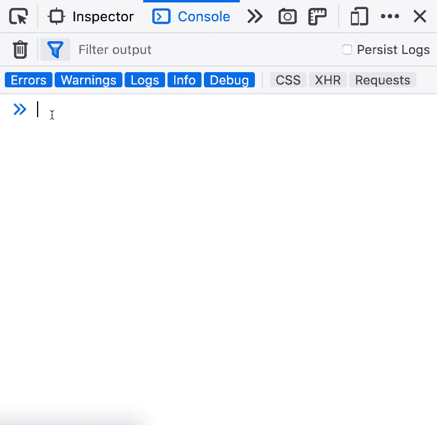
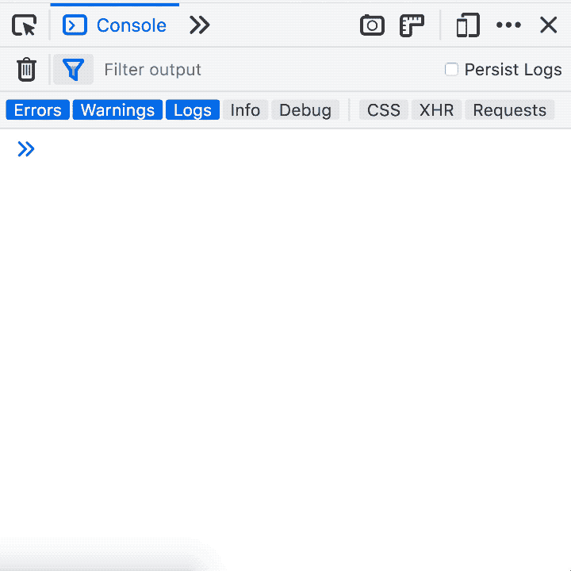
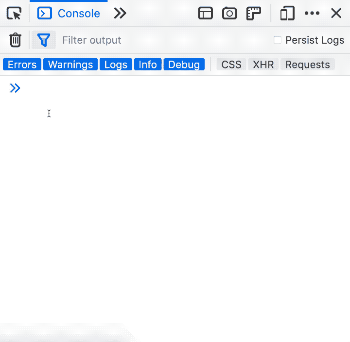
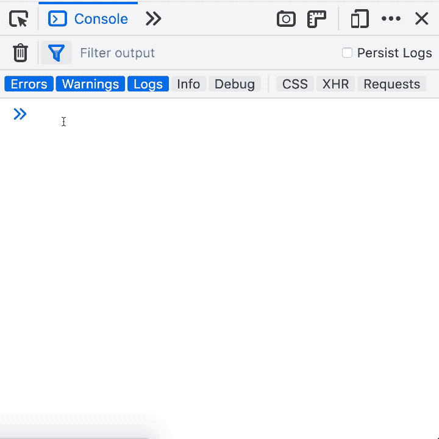

# Firefox DevTools - Web 控制台的 5 个提示和技巧

> 原文：<https://dev.to/lakatos88/5-tips-and-tricks-for-firefox-devtools-web-console-507k>

*这是[系列](http://alexlakatos.com/devtricks/)的第二篇文章，这是一系列帮助你用 Firefox Devtools 调试 web 应用程序的技巧和诀窍。它向你展示了在 Firefox 开发者工具中使用 Web 控制台和控制台 API 的 5 个技巧&。*

## Web 控制台输出中的 CSS 样式

```
console.log("#%c%s%c%s", "color: #bada55", "dev", "color: #c55", "tricks") 
```

Enter fullscreen mode Exit fullscreen mode

您可以使用 CSS 来设置 Firefox 开发工具 Web 控制台输出的样式。并非所有属性都受支持，但有相当一部分是受支持的。`%c`指令表示它后面的内容将被样式化，而`%s`是字符串替换。它非常方便:

*   突出日志的重要部分。
*   当`console.info`、`console.warn`、`console.log`不够时，测井的多种颜色编码级别。

[](https://res.cloudinary.com/practicaldev/image/fetch/s--pUbxIrc9--/c_limit%2Cf_auto%2Cfl_progressive%2Cq_66%2Cw_880/http://alexlakatos.com/img/posts/devtricks/console/console-style.gif)

## 搜索 Web 控制台历史记录

您可以通过在 Mac 上按 CTRL+R(在 Windows 和 Linux 上按 F9)来搜索 Web 控制台历史记录。之后，您可以使用 CTRL+R / CTRL+S (F9 / SHIFT+F9)在搜索结果中向前/向后移动。使用比使用箭头键更方便，特别是因为箭头键只对当前会话有效。

[](https://res.cloudinary.com/practicaldev/image/fetch/s--h2o5xcwx--/c_limit%2Cf_auto%2Cfl_progressive%2Cq_66%2Cw_880/http://alexlakatos.com/img/posts/devtricks/console/console-history-search.gif)

## 页面或页面上元素的截图

```
:screenshot --fullpage
:screenshot --selector .css-selector 
```

Enter fullscreen mode Exit fullscreen mode

您可以从 Web 控制台截取可视部分、整个页面或页面上用 CSS 选择器标识的元素的屏幕截图。当你想精确地截屏一个元素时，这真的很方便，当你试图从页面截屏中截取它时，不必猜测盒子模型。

[](https://res.cloudinary.com/practicaldev/image/fetch/s--ZHNyQaZy--/c_limit%2Cf_auto%2Cfl_progressive%2Cq_66%2Cw_880/http://alexlakatos.com/img/posts/devtricks/console/console-screenshot.gif)

## 切换 Web 控制台的 JavaScript 上下文

```
cd(iframe) 
```

Enter fullscreen mode Exit fullscreen mode

您可以使用`cd()`将 Web 控制台的 JavaScript 评估上下文切换到`iframe`。您可以使用 CSS 选择器来定位 iframe。在上下文中更改 iframe 真的很有用，尤其是在不能在 iframe 自己的窗口中打开它的地方，比如 Codepen。

[](https://res.cloudinary.com/practicaldev/image/fetch/s--aovwY5qt--/c_limit%2Cf_auto%2Cfl_progressive%2Cq_66%2Cw_880/http://alexlakatos.com/img/posts/devtricks/console/console-cd-iframe.gif)

## 在控制台 API 中标注计时器

```
console.time("#devtricks")
console.timeEnd("#devtricks") 
```

Enter fullscreen mode Exit fullscreen mode

您可以使用`console.time("label")`从控制台 API 启动一个带标签的计时器，并使用`console.timeEnd(label)`终止它。当您想要将函数执行时间记录到 Web 控制台、跟踪它们并相应地标记它们时，这真的很方便。

[](https://res.cloudinary.com/practicaldev/image/fetch/s--WUW99H_E--/c_limit%2Cf_auto%2Cfl_progressive%2Cq_66%2Cw_880/http://alexlakatos.com/img/posts/devtricks/console/console-time.gif)

## 这是每周的事

这是每周一次的事情，这些年来我已经收集了很多技巧。如果你喜欢这个或者想看更多，我是推特上的[@ Lakatos 88](https://twitter.com/lakatos88)，跟我去吧，那里是[魔法发生的地方](https://twitter.com/lakatos88/status/1119270904096264192)。