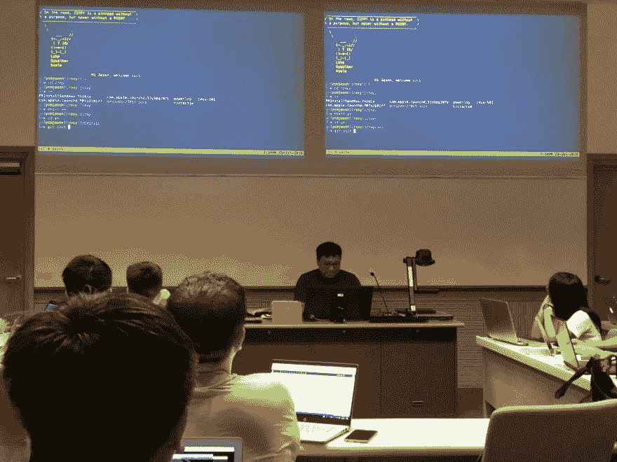
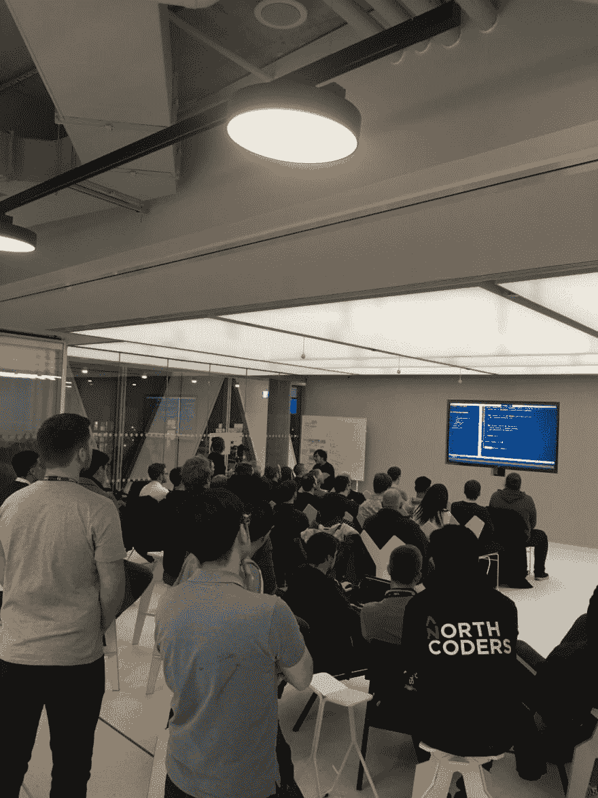

# 现场编码讲座的 5 个技巧

> 原文：<https://dev.to/ycmjason/5-tips-for-live-coding-talks-5cfe>

今年(2018 年)，我在不同的活动中做了 4 场技术演讲。

1.  7 月 5 日@ Vue.js 曼彻斯特会议:(我的第一次科技演讲！🎉🎉)
    “演示[翻转](https://aerotwist.com/blog/flip-your-animations/)和 Vue 如何使用”
    [看视频这里](https://www.pscp.tv/w/1OdKrpdzRWpJX?t=45m14s)
    [](https://res.cloudinary.com/practicaldev/image/fetch/s--hFus_scV--/c_limit%2Cf_auto%2Cfl_progressive%2Cq_auto%2Cw_880/https://thepracticaldev.s3.amazonaws.com/i/4n022a6wtoa6f7dbqfxn.jpg)

2.  7 月 26 日@ Vue.js 港 Meetup:
    《vue . js 简介》
    [](https://res.cloudinary.com/practicaldev/image/fetch/s--dK8q9R8A--/c_limit%2Cf_auto%2Cfl_progressive%2Cq_auto%2Cw_880/https://thepracticaldev.s3.amazonaws.com/i/aw1gdbfh61kcw3xaouye.jpeg)

3.  9 月 21 日@ Vue.js 伦敦会议:
    “演示如何用 VuePress 构建静态网站”
    [](https://res.cloudinary.com/practicaldev/image/fetch/s--NXT9FHFj--/c_limit%2Cf_auto%2Cfl_progressive%2Cq_auto%2Cw_880/https://thepracticaldev.s3.amazonaws.com/i/4d5cgrfpbndhfjc458mx.jpg)

4.  11 月 21 日@ Manchester Web Meetup:
    “从零开始构建一个简单的虚拟 DOM”
    [在此阅读后续文章](https://dev.to/ycmjason/building-a-simple-virtual-dom-from-scratch-3d05)
    [在此观看视频](https://www.youtube.com/watch?v=85gJMUEcnkc)
    [](https://res.cloudinary.com/practicaldev/image/fetch/s--XGhiKgbz--/c_limit%2Cf_auto%2Cfl_progressive%2Cq_auto%2Cw_880/https://media.licdn.com/dms/image/C4D22AQEnXRkWz6vYJw/feedshare-shrink_8192/0%3Fe%3D1544986800%26v%3Dbeta%26t%3DX29bK666UCczIp2ZWylsFFL1FwWPKOnf2Cn7IGe-K7k)

所有这些演讲都有一个共同点:**我做过现场编码**。

## 为什么我在所有的演讲中都做了现场编码？那不是很冒险吗？

我不确定。我觉得会说话的幻灯片很无聊；用实际代码吸引观众似乎更有趣。我只是有一种感觉，尽管我没有过去的经验，但我可能会做一个像样的现场编码演讲。估计是刚生下来就有吧！😂

我注意到许多人害怕进行现场编码。这就是为什么我决定写下一些我认为对于一个好的现场编码演讲来说必不可少的技巧。

## 秘诀 1:对话题真正充满热情

这不仅适用于现场编码讲座。谈论你热爱的事情会给你带来兴奋；兴奋给你能量；总的来说，能量吸引了观众的注意力！

如果你对这个话题没有“真正”的热情，说服自己或者至少在你演讲的过程中假装。假装你谈论的一切都是新发现。假设你写的每一行“小”代码，都是人类的一次“巨大”飞跃。说一些诸如“是不是很棒/很酷/很棒？”“哦，我的天哪”通常会让观众相信你对某件事真的很有热情。
*(有争议；除了在大学最后一年的项目陈述，我很少使用上面的技巧😂😂😂。)*

但是，要能装热情，需要很高的演技。所以如果你不擅长表演，干脆**把话题换成你喜欢的事情**。

## 技巧 2:通过推迟演讲让自己在台上感到舒服

从我过去在舞台上唱歌的经验中，我知道在舞台上让自己舒服会大大提高表演。我有很多在舞台上唱歌的经验。我在高中的时候参加过几次比赛。后来，我加入了伦敦的一个学生合唱团，在不同的活动中演唱歌曲。

如果我在舞台上紧张，我会用一个技巧。我会改变麦克风支架的位置。试图通过“搭建”舞台来拖延我的表演。这看起来像是你在“设置”，但这种延迟的真正目的是让你自己熟悉舞台；不要拘束。

你可以发明一些方法来延迟你的谈话开始。我发现自拍是拖延谈话最自然、最有趣的方式。

这里有一些你可以使用的其他想法:

*   自拍
*   播放一段与你的演讲相关的 30 秒钟的视频
*   如果场地允许，与观众聊天
*   去几个[没用的网站](https://theuselessweb.com/)和观众一起开怀大笑

## 提示 3:用`mkdir your-topic`开始实时编码

通过创建一个空的项目目录来开始现场编码的重要性我怎么强调都不为过！这可以让观众觉得他们知道正在发生什么，并会从一开始就跟随你的思路。

通过填充一些函数的行来进行现场编码不是一个好主意，因为观众中没有人知道应用程序的其他部分在做什么。

下面是我如何开始我的现场编码的标准程序:

```
"So let's start the live coding by creating an EMPTY directory"
$ mkdir /tmp/amazing-meetup

"Let's go into our directory"
$ cd /tmp/amazing-meetup

"Now let's do some basic project setup by initiating git and npm"
$ git init && npm init -y

"Now we got the pacakge.json and git directory setup"
$ ls -l
.git/
package.json

"Let's do our initial commit now!"
$ git add -A
$ git commit -am 'initial commit' 
```

## 提示 4:避免 IDE 特性

这不应该适用于像 Java 这样的语言，因为没有 IDE 就不可能编写代码。🤢🤢🤢

在你的 IDE 中可能有一些非常酷的技巧，可以一次做很多事情，请不要在实时编码时使用它们。你的观众可能会有不同的设置，如果事情神奇地发生了，他们会感到困惑。你希望你的观众一步一步地跟随你的代码**。**

以下是一些您应该避免使用的常见 IDE 功能:

*   如果你的 IDE 创建的项目包含一大堆文件，比如`.git/`、`.gitignore`、`package.json`、`.eslintrc`等等。，不要用那个！
*   如果您的 IDE 有将代码行提取到函数/变量/常量中的快捷方式，请不要使用它！
*   如果您的 IDE 有在终端中运行命令的快捷方式，只需在终端中运行命令！！！！

我推荐使用的唯一 IDE 特性是格式化/林挺代码。

如果你真的**需要**使用一个快捷方式，确保你在使用之前明确地谈论你正在使用的快捷方式。然而，我不认为有什么事情是你手动做不到的。

P.S. Vim 是我的主要编辑。我不是 IDE 的忠实粉丝。

## 技巧 5:让你的代码优雅！

当你准备好要进行现场编码的代码时，花额外的时间让代码变得优雅、干净和简单。

> 如果不能简单的解释，说明你理解的不够好。

简化代码的过程将在许多方面帮助您:

1.  帮助你更好地理解问题
2.  帮助你更好地解释代码
3.  帮助你的观众更容易理解
4.  帮助你以后写出更好的代码！

以下是一些简化代码的技巧:

1.  尽量保持较低的缩进水平。理想情况下不超过 4 级压痕。每一级缩进都意味着额外的复杂性。所以尽量消除缩进层次。例如，您可以使用[保护子句](https://en.wikipedia.org/wiki/Guard_(computer_science))来消除`else`阻塞。
2.  避免`for-i-loop`即`for (let i = 0; i < length; i++)`。使用`for-of`循环或其他更高级的循环。或者真的需要索引，做`Array.prototype.forEach`，把索引作为第二个参数；这是更可取的，因为我们不必用`arr[i]`而是直接用`x`来引用我们的元素。使用`for (const [k, v] of Object.entries(obj))`遍历对象的键和值。
3.  多使用纯函数，避免副作用。纯粹的函数更容易推理，我可以保证你的观众能更好地理解！
4.  避免过时的功能。你想提倡好的代码和现代的特性。例如在 Javascript 中，提倡使用`let`和`const`，停止使用`var`！

## 谢谢

我希望我的技巧对您的下一次现场编码演讲有所帮助！祝你好运，继续编码！