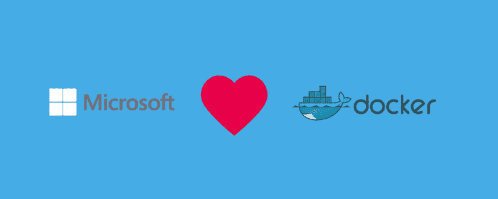

# 7 一般使用 docker、特别是 ASP.NET 核心的原因

> 原文：<https://dev.to/campusmvp/7-motivos-para-utilizar-docker-en-general-y-con-aspnet-core-en-particular-636>

正如我们几年前在文章[中已经解释过的那样，【是码头工人】？](https://www.campusmvp.es/recursos/post/Que-es-Docker.aspx)坞站的目的是允许您创建**【标准包】**用于部署**【容器】**，其中包括**应用程序运行所需的一切**(依赖项，第-我...。，并将其与底层系统隔离开来，以确保它们始终保持完全相同的功能。

docker 不是唯一的集装箱系统。他甚至不是第一个。但它已成为事实上的标准，也是所有操作系统和“云”的制造商和供应商考虑的标准。

想到坞站，它通常不会与 Microsoft 技术(如. NET 或 Windows)相关联，但实际上**有很多很好的理由将坞站与 ASP.NET**配合使用，特别是与. NET Core 和. NET Core MVC 配合使用。

本文将回顾在您的开发过程中一般使用 dock，特别是. net dock 的主要原因，并向您展示它可以如何帮助您进行开发。

## 1.-忘记操作系统和手动设置

通常，在配置物理或虚拟机时，需要安装操作系统、应用程序所需的软件(web 服务器、SDK、库、-我...。)并进行应用程序所需的特定设置。

如果您使用 docker，您可以在您的*docerfile*中指定所有这些内容，并且每次引导环境时，它都会确保在容器中安装适当的软件。

需要更新时，只需更新归档定义并重新部署即可。这可以大大减少维护时间。

## 2.-再见“但是-我...。在我的机器上工作。”

如果你在编程，你说了很多次都是安全的。如果你也在另一边他们会告诉你很多次。

而且，没有什么比(在您的机器上)准备和测试应用程序并将其投入生产并开始失败更令人沮丧的了。然后找出原因:-S

好了，坞站结束了。它给你的主要是一致性。保证容器内的东西在你的机器和世界上任何地方，在这里和中国都能以同样的方式运行。这值好几百万。

如果在开发中起作用，在生产中起作用，因为它们是一样的。

## 3.-比虚拟机轻得多，扩展性也强得多

定义虚拟机时，必须指定多少资源(内存、处理器、磁盘-我...。)从机器*主机*你将在你创建它的时候瞄准。这些资源也不再可供底层操作系统使用。

相反，Docker 容器在任何时候只使用它需要的资源。此外，同一容器的多个实例可以同时部署，而唯一的选择是为现有容器提供越来越多的硬件资源。

此外，您还可以控制一个容器或一组容器可以访问的主机的资源消耗。如果某个特定容器由于使用过多而超出容量，则不会停止所有机器资源，也不会导致其他容器落在该“T2”主机“”上。

将单个 Docker 容器转换为正在运行的农场是再简单不过的了。只是更新文件`docker-compose.yml`以说明该容器应运行多少个实例以及如何运行，并创建一个用作**反向*和负载平衡器的容器。nginx 已经创建了许多预制映像来帮助您在此场景中工作，因此大多数情况下，您只需将该容器添加到文件“*合成*”并对其进行配置即可。*

 *如果您还需要功能更强大的功能，库比涅斯特允许您对所有容器进行编排、监控、保护、定期运行等，以创建具有所需复杂性的业务环境。

## 4.-和虚拟机一样安全

docker 容器使用机器资源*主机*，但有自己的运行时环境(*运行时*。他们拥有操作系统用户空间的缩小版。这意味着您可以用与实际机器非常相似的方式来确保容器的安全，因为它在底部几乎就像实际机器一样。

归档无法存取其他归档或其基础作业系统(您授与权限的储存磁碟区除外)，而且会与其他网路和归档进行通讯，并使用您要授与它的特定网路组态。

此外，如果您授予对某个文件夹或操作系统单元 *host* 的访问权限，则实际上会将其视为内部操作系统中的一个文件夹，而不会记录(或访问)该文件夹以外的原始位置中的任何内容。

让一个容器像虚拟机一样隔离您，但它的重量要轻得多，所需的设置也少得多，而且您可以在需要时打开特定文件夹的“虫洞”。

## 5.-基础设施的版本控制

对我来说，这是一个突破性的概念。当然，总是会考虑源代码的版本控制。但是，由于 Docker(和 kubernetes)中的所有内容都是通过平面文本文件处理的，而这是您部署的唯一需要，因此您也可以转到源代码控制。

也就是说，在实践中，**对你的基础设施进行版本化！**。

当您升级运行上一节所述应用程序所需的软件版本(web 服务器、库等)时。)，则该环境将随应用程序代码一起更新。

当您试图了解为什么早期版本的应用程序具有特定行为时，这非常有用:您只需转到您感兴趣的代码版本，启动 Docker 容器，然后复制应用程序和基础架构。太好了。

## 6.-设计用于在云中工作

集装箱是用云来思考的。而且目前主要行为体*云*为在其基础设施中部署集装箱提供了极好的选择。

因此，Amazon Web Services、Microsoft Azure 或 Google Compute Engine(以及其他许多工具)都允许您使用命令行或可视工具，从椅子的便利性向云中部署容器。他们甚至允许你以每秒钟的速度对集装箱计费，这打开了一个充满可能性的世界。

此外，它们都支持库奈特族人，以便能够对多个已编入预算的容器进行复杂部署，从而能够独立工作和扩展。

部署简单或复杂的基础架构从来没有像现在这样容易。

## 7.-对. NET 的具体好处

docker 的另一个优点是，它还可以用于统一开发环境和工作流程。也就是说，您甚至不需要在您的计算机上安装工作 SDK 或编译器:为整个计算机定义一个基于 Docker 图像的工作环境，并确保所有计算机都拥有完全相同的工作环境，而且所有操作都将完全相同。Microsoft 为 Docker 社区做出了巨大贡献，并且在 Visual Studio 和 Visual Studio 代码以及 Team System 开发人员工具中提供了很好的 Docker 集成和这些工作流。

如果您创建. NET 核心应用程序，特别是使用. NET 核心 MVC 的 web 应用程序，它们可以像在此系统上使用的任何 com Node.js、Go、PHP 或其他语言应用程序一样在 Linux 容器中运行。

传统的 Linux 归档文件在 Windows Server 上运行已有一段时间(在 Windows 10 上:您不需要 Linux 或 Mac 即可使用 docker)，但现在还有**windows 本机归档文件**，使您能够以归档文件的形式运行此操作系统中的应用程序。这意味着，例如，如果您有一个旧的 ASP.NET Web Forms 应用程序，则可以在一个容器中使用该应用程序，并获得它所提供的所有好处，我们已经在上面讨论过了，最好将其与其他类型的应用程序容器结合使用，然后将其部署到云中。

事实上，如你所知，ASP.NET Core 使用 [Kestrel](https://www.campusmvp.es/recursos/post/3-consejos-para-hacer-hosting-de-aplicaciones-ASPNET-Core-con-Kestrel.aspx) 为应用程序服务，你必须使用某种[反向代理为 Kestrel](https://docs.microsoft.com/es-es/aspnet/core/fundamentals/servers/kestrel) 提供真正应用程序服务器的功能。如果您的应用程序部署在容器中，您可以通过多种标准化的方式实现这一点:从使用特定的 nginx 代理(从已创建的映像开始)到使用库服务器输入。

虽然 Docker 是在和 para linux 上创建的，但它在. NET 和 Windows 上的使用仍在不断增长，而且越来越好。微软与坞站团队及其社区密切合作。

我希望他已经向您说明了使用 dock 的主要优点，并且您希望在. NET(或其他平台或语言)上开发并部署您的下一个应用程序到 Docker 容器。老实说，我相信在未来几年里，所有的 web 应用程序都将使用 docker 来部署。还有很多其他的。

并且记住，如果你对[有兴趣的话，无论是码头工人还是库柏人](https://www.campusmvp.es/recursos/catalogo/Product-Docker-y-Kubernetes-desarrollo-y-despliegue-de-aplicaciones-basadas-en-contenedores_237.aspx) 都要深入学习，我们有你需要的课程。*