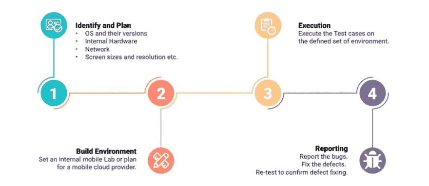
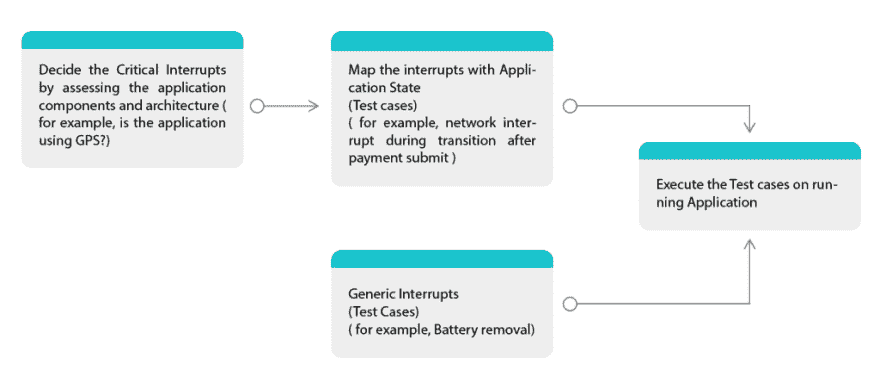
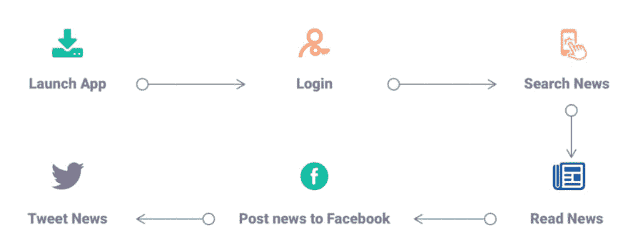
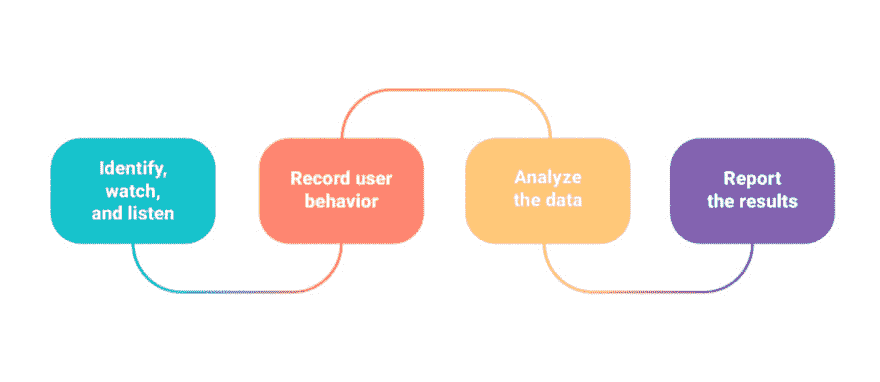

# 7 种移动应用测试

> 原文：<https://dev.to/pcloudy/7-types-of-mobile-app-testing-4g7j>

由于移动应用程序市场有许多参与者，因此竞争是无止境的。为了应对挑战，并不断为用户提供增强的移动应用体验，应用需要随着变化不断更新，为此，有不同类型的移动应用测试技术。下面让我们深入了解一下测试方法的类型。

**1。兼容性测试**

兼容性测试是一项关键的 QA 任务。它可以确保给定的应用程序在选定的操作系统、具有不同屏幕尺寸分辨率的选定设备和内部硬件(内存大小、处理器速度和按钮/输入差异)下正常工作。它根据客户的要求，为特定的测试任务定义了可行的设备和接口兼容性组合。

**兼容性因素:**

有不同的因素在[移动兼容性测试策略](https://www.pcloudy.com/start-to-end-guide-for-mobile-app-testing/?utm_source=techinexpert&utm_medium=gpost&utm_term=p&utm_campaign=pcloudy)中扮演着非常重要的角色。移动操作系统及其支持的版本、由不同制造商开发的移动设备、具有不同分辨率的不同设备屏幕尺寸以及包括设备的不同输入类型、处理器速度和存储器大小的内部硬件。

让我们为兼容性测试开发一个测试策略。第一步是根据上一张幻灯片中描述的关键因素确定操作系统和设备。一旦根据不同的兼容性因素确定了设备，就需要设置测试环境。你可以建立自己的内部测试实验室，也可以选择像 pCloudy 这样的外部云提供商。现在，下一步是在一组定义的环境中执行您的测试用例。报告测试中出现的缺陷，并将这些缺陷报告给你的开发团队。

兼容性测试的主要目的是确保不同的软件是否与不同的配置兼容，以及应用程序是否与客户端的环境兼容。

**2。安装测试**

手机带有不同类型的移动应用程序，如本地、网络和混合应用程序。换句话说，这是在移动应用生命周期的初始阶段进行的测试，或者可能是用户的第一印象。安装测试测试手机 app 安装、卸载、更新是否正常，没有任何中断。

**安装测试因素:**

有一些因素在应用程序的安装测试中起着重要的作用。例如应用程序支持哪些平台和操作系统，以及它们将如何分发，是直接在 app store 中提供，还是将在 mail 本身上获得可安装文件，还是在应用程序分发平台上提供，并可以通过公共 URL 访问。关于安装的用户行为因人而异。例如:开发人员可以安装应用程序(通过使用 [ADB](https://www.pcloudy.com/executing-adb-sell-commands/) install 命令),不同的用户可以直接从应用程序商店或公共 URL 安装。

**安装测试中需要注意的要点:**

可以转换为标准测试用例的一些常见检查点有:

在手机内存中安装应用程序。
在手机内存中安装应用程序已满。
在外部 SD 卡上安装应用程序。
在外置 SD 卡上安装应用已满。
安装后检查内存空间。它不应占用比承诺更多的空间。
检查移除后是否释放空间

安装和卸载测试的另一部分是补丁/更新的测试。这些都是我们在更新后需要测试 app 的常见情况。

检查更新:

我可以下载更新吗？
有多个可用更新时，我可以更新应用程序吗？
如果我不更新会怎么样？

**App 升级时:**

检查用户是否仍然登录
检查数据是否仍然相同
向后兼容性:-检查数据库更改是否不会影响当前数据。
测试从旧版本到当前版本的更新

**操作系统升级时:**

检查应用程序兼容性。
应用程序更新优雅，没有崩溃。

**3。中断测试**

中断测试是将突然(意外)中断复制到应用程序的过程。这样做是为了了解在恢复到原始状态之前，应用程序在某些中断下的行为。这可以通过各种方式和技术来实现，具体取决于测试中的应用。

以下是一些常见的中断:

1.  当应用程序正在运行或处于后台时的电话呼叫
2.  当应用程序正在运行或处于后台时，电池电量高、电池电量低、来电或短信时，请取出电池
3.  插电或不充电
4.  设备关闭
5.  操作系统升级
6.  网络损耗和恢复等。

**使用网络的应用的一些特定场景:**

1.  连接到网络，但从路由器上移除 LAN 连接，以便设备可以感知设备上的 wifi 状态，但无法连接到互联网
2.  通过 VPN 的连接和 VPN 断开

**应用使用服务的场景:**

1.  通过点击最近的按钮并向右滑动应用程序来关闭应用程序和服务，从而关闭服务
2.  使用第三方应用杀手杀死应用
3.  从设置->管理应用程序中取消特定服务
4.  链接到帐户管理器的应用程序的方案从设置中删除帐户->帐户管理器

**收发短信和彩信:**

一个应用程序正在您的手机上运行，您从另一部手机向您的手机发送短信/彩信。在这种情况下，SMS/MMS 通知应该显示一段时间，然后关闭，应用程序应该继续运行。

**来电和去电:**

您正在登录页面尝试登录，您刚刚按下了提交按钮，这将带您到应用程序主页。这是一个过渡期，因为正在加载。如果我们在此期间收到一个调用，那么应用程序应该不会突然结束或崩溃。

**电池拆除:**

如果应用程序正在运行，取下手机的[电池](https://www.pcloudy.com/android-app-testing-for-battery-drain/)，它将关闭。重新启动手机后，再次运行应用程序，它应该运行顺利，没有崩溃。

**数据线插拔:**

当应用程序运行时，连接 USB 电缆，系统应该显示“USB 连接屏幕”,如果用户返回到应用程序，那么应用程序应该不会崩溃或突然结束

**中断测试策略**

让我们准备一个测试策略来测试中断测试:

这个过程的第一步是根据您的应用程序组件和架构决定关键中断。例如，如果您的应用程序正在使用 GPS，则包括与 GPS 相关的常见中断。让我们包括两种类型中断:

**应用特定中断:**

准备您的测试用例，并尝试使这些中断测试用例符合应用程序的状态。例如，在执行支付时中断网络。

**中断测试过程:**

**常见中断列表:**

电话、短信、应用程序通知、电池警告、强制更新、语音邮件、摇动手机、不同手势、在应用程序之间切换、锁定和解锁屏幕、更改方向、使用应用程序时播放音乐、内存不足(一般性能中断)、数据应用程序中断(什么 Sapp、Viber、Tango)、来自多个来源的音频中断(iPod、媒体播放器、其他音频应用程序)、手机处于待机模式、将网络切换到平面模式。

**测试中断测试的工具:**

使用 Joule Unit (Android)等工具，在 iOS 上使用仪器的能源使用功能，Android 版 Monkey 对您的应用程序进行压力测试并查看中断的处理情况，iOS 版 UI Auto Monkey

**场景**

a)一旦用户将移动耳机插孔与诺基亚 Lumia 连接并启动音乐播放器。现在，当用户恢复应用程序时，购物车会变空。

**4。本地化测试**

这种测试是一种测试技术，它检查移动应用程序是否符合本地文化设置，根据目标国家和语言以及语言方面定制应用程序。本地化也被称为“L10N ”,因为 L 和 n 之间有 10 个字符。例如:百度提供的中文搜索引擎在中国击败了谷歌。百度比谷歌做得更好，因为它看起来和感觉上都完全是中国人的母语。

还有，说地区语言的人用自己的语言玩不到很多游戏，就转而玩种族游戏，简单易懂。我们一定注意到在这些例子中，语言是共同的问题。除了翻译之外，本地化还有其他不同的元素，如使用正确的时区、日期、地址和电话号码的本地格式、适合翻译文本的设计和布局、转换为本地要求(如货币和计量单位)、使图形适应目标市场、修改内容以适应其他市场的口味和消费习惯、满足本地法规和法律要求。

**为什么要本地化？**

为了理解特定地区的文化和语言方面，本地化是很重要的。在测试过程中，测试人员不断重复测试，以检查排版、语言错误、UI 的文化适宜性等。研究表明:

1.  56.2%的消费者表示，用自己的语言获取信息的能力比价格更重要。(《常识咨询，不会读，不会买:为什么语言在全球网站上很重要》，2006 年)
2.  74%的跨国企业认为从全球运营中增加收入是重要的或最重要的。(加州州立大学奇科分校，2007 年。
3.  95%的中国在线消费者表示对使用他们语言的网站更加满意。(Forrester Research，零售网站的翻译和本地化，2009 年)
4.  跨国并购交易的一个关键成功因素是用多种语言清晰准确地交流信息的能力。(美林公司，如何做更好的跨国 M&A 交易，2008 年)

**本地化测试的类型:**

在本地化测试中，尤其是验证移动应用程序是否能够在给定的地理位置执行。它包括四个主要的测试，如语言，文化，美容和功能测试。

1.  语言测试——确保 UI 文本与语言一起出现在集会中，不会被误译或误用。这需要语言技能和产品知识。误译，不相关的语言用法是其中的几个错误。

2.  文化测试——几个词在不同的文化中可能意味着不同的意思。因此，这必须根据目标文化进行适当的翻译。

3.  化妆品测试——为了便于理解，让我们使用这个场景。例如，在阿富汗使用的应用程序中，文本将是阿拉伯语，从右向左开始，不像其他语言，如英语，法语，从左向右阅读。

4.  功能测试——在这个测试中，测试人员按照规定的测试脚本运行产品的所有方面，以确保它在本地化环境中按照设计运行。功能测试通常包括验证本地化产品是否与各种操作系统和第三方产品兼容。功能测试通常需要对目标语言有很好的了解，并且完全熟悉产品。一些主要的功能测试问题可能包括不正确或缺失的 UI 元素、图形和窗口、不正确的错误消息、可能导致软件崩溃的本地化错误、在本地化的操作系统上安装本地化软件所产生的错误。

**5。性能测试**

[性能测试](https://www.pcloudy.com/mobile-app-performance-monitoring-basics-to-advanced/)是在预期的工作负载场景中测试移动应用的性能，并消除性能障碍。它检查应用程序的响应是否快速，应用程序的负载能力，以及应用程序在这些负载情况下的稳定性。性能非常重要，因为如果应用程序出现故障，用户更有可能会卸载该应用程序，并转向更好的竞争对手的应用程序。

[移动应用性能测试](https://www.pcloudy.com/why-mobile-app-performance-is-critical-for-successful-mobile-testing/)的三大支柱是:

**设备性能**

从用户的角度来看，应用启动时间是最关键的性能参数。用户点击应用程序的图标后，应用程序的第一个屏幕应该不会超过 2 秒钟。电池时间是第二重要的问题。一些应用消耗大量的电池寿命。过度的资源使用给处理器造成了负担，并且电话变热。在某些情况下，可以观察到新安装的应用程序使用的电池量与操作系统相同。如果在应用程序中添加更多功能，其内存消耗也会增加。这就是为什么在测试应用程序时应该检查内存消耗。

**网络性能**

该应用需要在不同的[移动网络](https://www.pcloudy.com/test-your-apps-on-different-network-environments/)和网络属性上进行测试。如果有数据包丢失，应用程序应该生成警报或重新发送信息请求。接收信息时的抖动或延迟

**服务器/API 性能**

性能与服务器的响应时间成正比。在这种情况下，运行测试来检查应用程序处理来自服务器的数据传输的效率，以及应用程序传输数据的速度和格式。应用程序生成的 API 调用的数量应该更少，在“服务器宕机”的情况下，数据如何保存以及保存在哪里是这里测试的全部内容。

移动应用测试工具让测试人员更容易识别和纠正任何出现的错误。不同的操作系统有不同的移动应用工具。对于 Android，我们可以使用 Robotium 和 Monkey Runner，对于 IOS，我们可以使用 Automator。

**6。可用性测试**

执行可用性测试是为了检查移动应用程序在导航、应用程序易用性、灵活的应用程序控制等方面的用户友好程度。它也被称为用户体验测试。可用性测试中什么最重要？

工作流程:为了便于理解，下图展示了用户在应用程序控件中导航时如何达到目标的工作流程。

为了使用应用程序的功能，我们必须了解用户需要做什么。如果工作流过长，并且包含重复的动作，那么在执行任务时可能会让用户感到厌烦。设计和布局:好的布局和设计可以让用户轻松完成任务。一个应用程序不需要提供太多的功能或内容，以至于很难导航。一个友好的应用程序有一个设计，允许更少的用户文本输入，帮助区分选择的项目，手指大小的目标，应该提供直观的文本提示，等等。

应用程序的响应时间:这是关键因素之一。这意味着用户完成一项任务需要多长时间。应用程序与服务器交互时的长时间延迟通常会影响用户体验标准。

用户的情绪状态:用户的情绪状态衡量用户使用应用程序的动机。应用程序应该足够智能，能够理解用户想要什么以及如何吸引他们，这可以通过可用性测试来实现。

**可用性测试策略:**

第一步是识别符合你预期受众的用户。当他们使用你的产品时，观察和倾听他们。您可以使用视频和音频记录设备来存档测试会话，以备以后需要查看。然而，我们的主要工具是用纸和铅笔做笔记！这仍然是我们发现的向开发者和设计者快速获取信息的最快方法。你有你的数据。你现在需要组织和分析它。如何将结果纳入报告，以便对产品变更有用。

**可用性测试的工具和技术**

1.  塔皮:这是一个用来捕捉用户如何自然地与应用程序互动的工具。如此生成的用户数据可以用于更好的用户体验。

2.  纸上原型:这是一种技术，包括创建用户界面的手绘，以使它们能够被快速设计、模拟和测试。尽管这种技术看起来很简单，但它自 20 世纪 80 年代以来一直被有效地使用，并有可能在未来许多年里继续使用，并取得一定程度的成功。

3.  Magitest:它允许你对本地应用和网站进行移动用户测试。在会议期间捕捉参与者的声音和面部表情。在这里，用户完成您指定的任务，并允许在他们与您的移动应用程序交互时听到他们大声说出自己的想法。

4.  Reflector:这个应用程序允许我们在 MAC 或 PC 上看到 iPad、iPod、iPhone 屏幕。这些设备通过无线连接来继续执行更多功能。

**7。一致性测试**
一致性测试，也称为符合性测试，用于验证应用程序是否符合市场和企业政策指南。这就像是检查是否符合某些标准的审计。一致性测试主要集中在两个方面——应用商店指南和企业政策合规性。每个市场都有自己的指导方针。我们需要验证应用程序是否遵循这些应用程序商店的指导方针。

1.与用户界面、媒体内容、隐私、间谍软件和网络钓鱼、裸体、宗教、文化、暴力等相关的 App store 指南。

2.与一组不同的行业标准相关的企业策略合规性。例如，对于制药行业，食品药品监督管理局(FDA)通过的法规开始出现；对于制药行业，食品药品监督管理局(FDA)通过的法规开始出现；在医疗保健行业，健康保险携带和责任法案(HIPAA)包括一个管理简化部分，该部分要求保护患者的信息资产。因此，迫切需要测试组织遵循必要的准则和合规性，以限制不合规可能带来的风险。

**享受移动应用测试的好处**

在这个时代，移动应用程序的质量是最重要的，因为市场竞争非常激烈。我们需要关注用户体验以及应用的性能。如果应用程序包含错误，应用程序的评级就会下降，应用程序下载的数量也会下降。如果我们能让我们的应用程序没有 bug，那么应用程序受欢迎的机会就会增加。在本系列的下一篇博客中，我们将讨论

观看此视频了解更多信息:

[https://www.youtube.com/watch?v=WUgAjm4BG3Y](https://www.youtube.com/watch?v=WUgAjm4BG3Y)