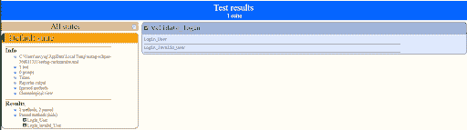

# 8 个可行的见解，以编写更好的自动化代码

> 原文：<https://dev.to/lambdatest/8-actionable-insights-to-write-better-automation-code-4mn1>

当您开始自动化时，您可能会遇到各种各样的方法、技术、框架和工具，您可以将它们合并到您的自动化代码中。有时，这种多功能性会导致代码更加复杂，而不是提供更好的灵活性或更好的解决问题的方法。在编写自动化代码时，我们能够清楚地描述自动化测试的目标以及我们如何实现它是很重要的。话虽如此，重要的是编写“干净的代码”来提供更好的可维护性和可读性。编写干净的代码也不是一件容易的事，你需要记住许多最佳实践。下面的主题强调了编写更好的自动化代码应该掌握的 8 个要点。

## 1。命名约定

当我们从[手动转向自动化](https://medium.com/r?url=https%3A%2F%2Fwww.lambdatest.com%2Fblog%2Fstarting-automation-testing-from-scratch-here-is-what-you-need-to-know%2F?utm_source=devto&utm_medium=organic&utm_campaign=sep09_sd&utm_term=sd&utm_content=blog)或者实际上用任何编程语言编写代码时，这确实是要记住的经验法则之一。遵循正确的命名约定有助于更容易理解代码和维护。这种命名惯例隐含在变量、方法、类和包中。例如，您的方法名称应该具体到它的用途。“Register_User()”方法描述了在该方法中显示用户注册的方法。明确定义的方法名增加了脚本的易维护性和可读性。这同样适用于变量命名。我注意到许多人把变量称为 a、b、c 等等，甚至把 Web 元素称为 Weblelement1、Webelement2 等等。这对于用户将变量名视为它想要做的事情没有任何线索。

下面是一个显示命名错误的示例:

```
public void Register_User() throws InterruptedException
 {
  driver.manage().timeouts().implicitlyWait(15, TimeUnit.SECONDS);
  driver.get("[https://www.lambdatest.com/](https://www.lambdatest.com/) ");
  driver.manage().window().maximize();
  WebElement web1= driver.findElement(By.xpath("//a[text()='Free Sign Up']"));
  web1.click();
  WebElement web2=driver.findElement(By.xpath("//input[[@name](http://twitter.com/name)='organization']"));
  web2.sendKeys("LambdaTest");
  WebElement web3=driver.findElement(By.xpath("//input[[@name](http://twitter.com/name)='first_name']"));
  web3.sendKeys("Test");
  WebElement web4=driver.findElement(By.xpath("//input[[@name](http://twitter.com/name)='last_name']"));
  web4.sendKeys("User");
  WebElement web5=driver.findElement(By.xpath("//input[[@name](http://twitter.com/name)='email']"));
  web5.sendKeys("[sadhvi.singh@navyuginfo.com](mailto:sadhvi.singh@navyuginfo.com)");
  WebElement web6=driver.findElement(By.xpath("//input[[@name](http://twitter.com/name)='password']"));
  web6.sendKeys("TestUser123");
  WebElement web7=driver.findElement(By.xpath("//input[[@name](http://twitter.com/name)='phone']"));
  web7.sendKeys("9412262090");
  WebElement web8=driver.findElement(By.xpath("//button[text()='SIGN UP']"));
  web8.click();
  Thread.sleep(3500);

 } 
```

Enter fullscreen mode Exit fullscreen mode

[](https://res.cloudinary.com/practicaldev/image/fetch/s--d3HGLXzo--/c_limit%2Cf_auto%2Cfl_progressive%2Cq_auto%2Cw_880/https://cdn-images-1.medium.com/max/2000/0%2ACH3h-3kjA7VEgM_C.png)

上面的代码显示了“method1”没有给用户任何提示，说明这个方法到底做了什么。此外，所有 web 元素都通过 web1、web 2…等等来表示。用户无法识别哪个 web 元素捕获哪个字段。

对于上述代码，正确的表示方法可以标记如下:

```
public void Register_User() throws InterruptedException
 {
  driver.manage().timeouts().implicitlyWait(15, TimeUnit.SECONDS);
  driver.get("[https://www.lambdatest.com/](https://www.lambdatest.com/) ");
  driver.manage().window().maximize();
  WebElement link= driver.findElement(By.xpath("//a[text()='Free Sign Up']"));
  link.click();
  WebElement organization=driver.findElement(By.xpath("//input[[@name](http://twitter.com/name)='organization']"));
  organization.sendKeys("LambdaTest");
  WebElement first_name=driver.findElement(By.xpath("//input[[@name](http://twitter.com/name)='first_name']"));
  first_name.sendKeys("Test");
  WebElement last_name=driver.findElement(By.xpath("//input[[@name](http://twitter.com/name)='last_name']"));
  last_name.sendKeys("User");
  WebElement email=driver.findElement(By.xpath("//input[[@name](http://twitter.com/name)='email']"));
  email.sendKeys("[sadhvi.singh@navyuginfo.com](mailto:sadhvi.singh@navyuginfo.com)");
  WebElement password=driver.findElement(By.xpath("//input[[@name](http://twitter.com/name)='password']"));
  password.sendKeys("TestUser123");
  WebElement phone_number=driver.findElement(By.xpath("//input[[@name](http://twitter.com/name)='phone']"));
  phone_number.sendKeys("9412262090");
  WebElement button=driver.findElement(By.xpath("//button[text()='SIGN UP']"));
  button.click();
  Thread.sleep(3500);
  String url= driver.getCurrentUrl();
  assertEquals("fail- unable to register", url, "[https://accounts.lambdatest.com/user/email-verification](https://accounts.lambdatest.com/user/email-verification)");

 } 
```

Enter fullscreen mode Exit fullscreen mode

[](https://res.cloudinary.com/practicaldev/image/fetch/s--Y_LKeSAN--/c_limit%2Cf_auto%2Cfl_progressive%2Cq_auto%2Cw_880/https://cdn-images-1.medium.com/max/2000/0%2ABi55BHTVgFbmmjRN.png)

这里，方法名“Register_User”通过名称清楚地定义了用户，表明该方法包含与用户注册相关的代码。类似地，所有 web 元素或变量都具有与用于定义意图的捕获字段相关的名称。

通常，鼓励使用 camel 大小写来写方法或变量，因为它在可读性和维护脚本方面更清晰。

## 2。三个 R-减少，再利用和回收

确保你的方法被分解成最小的用户场景块是很重要的。它们应该涵盖简单和单一的流程。不要让你的方法过于复杂，在一个方法中包含多个功能。例如，登录功能需要用户在应用程序上注册。将注册特性保存到另一个方法中，如果需要，在登录方法中调用该方法。降低方法的复杂性使得代码易于维护。

此外，在需要的地方重用你的方法，不要在不同的方法中复制粘贴相同的代码。这导致代码中不必要的重复和冗余。增加代码行数并不意味着你写了一个好的代码。重构和优化您的代码是编写稳定、健壮和更好的自动化代码的关键。

回收也是编写更好的自动化代码的另一个有用的技巧。我有一些经验丰富的自动化遗留系统的人，他们不倾向于在自动化框架中改变现有的方法，并且每当现有的功能发生变化时就重写另一个方法。这只会使框架变得脆弱。每当流程改变时，总是更新现有的方法，尽管它有自己的挑战，新用户可能没有意识到方法可能具有的依赖性，但是我相信我们应该总是从更长远的角度考虑事情，而不是实现那些更短期的目标。

下面是一个例子，说明如何将登录代码简化为一小块功能，并使用另一种注册方法来简化整个过程。

```
[@Test](http://twitter.com/Test)
 public void Register_User() throws InterruptedException
 {
  driver.manage().timeouts().implicitlyWait(15, TimeUnit.SECONDS);
  driver.get("[https://www.lambdatest.com/](https://www.lambdatest.com/) ");
  driver.manage().window().maximize();
  WebElement link= driver.findElement(By.xpath("//a[text()='Free Sign Up']"));
  link.click();
  WebElement organization=driver.findElement(By.xpath("//input[[@name](http://twitter.com/name)='organization']"));
  organization.sendKeys("LambdaTest");
  WebElement first_name=driver.findElement(By.xpath("//input[[@name](http://twitter.com/name)='first_name']"));
  first_name.sendKeys("Test");
  WebElement last_name=driver.findElement(By.xpath("//input[[@name](http://twitter.com/name)='last_name']"));
  last_name.sendKeys("User");
  WebElement email=driver.findElement(By.xpath("//input[[@name](http://twitter.com/name)='email']"));
  email.sendKeys("[sadhvi.singh@navyuginfo.com](mailto:sadhvi.singh@navyuginfo.com)");
  WebElement password=driver.findElement(By.xpath("//input[[@name](http://twitter.com/name)='password']"));
  password.sendKeys("TestUser123");
  WebElement phone_number=driver.findElement(By.xpath("//input[[@name](http://twitter.com/name)='phone']"));
  phone_number.sendKeys("9412262090");
  WebElement button=driver.findElement(By.xpath("//button[text()='SIGN UP']"));
  button.click();
 } 

 [@Test](http://twitter.com/Test)
 public void Login_User()
 {

driver.get("[https://accounts.lambdatest.com/login](https://accounts.lambdatest.com/login)");
    driver.findElement(By.xpath("//input[[@name](http://twitter.com/name)='email']")).sendKeys("[User2@gmail.com](mailto:User2@gmail.com)");
    driver.findElement(By.xpath("//input[[@name](http://twitter.com/name)='password']")).sendKeys("TestUser123");
    driver.findElement(By.xpath("//button[[@class](http://twitter.com/class)='sign-up-btn']")).click();

 }

[@AfterClass](http://twitter.com/AfterClass)
 public static void BrowserClose()
 {

  driver.quit();
 }

} 
```

Enter fullscreen mode Exit fullscreen mode

## 3。组织好你的测试

嗯，这确实是确保更好的自动化代码的主要可操作的见解之一。它不仅容易理解，而且维护起来也不费力。从长远来看，借助于 framework 来构建您的测试增加了您工作的价值，并减少了维护工作。您可以通过使用 JUnit 和 TestNG 等框架提供的注释来控制应用程序的流程。例如，使用像@BeforeClass 这样的注释可以帮助您指导您的时间密集型活动，例如连接到数据库、设置浏览器等与@BeforeClass 注释关联的方法中的相关代码。这有助于自动化测试人员立即知道该方法具体做什么以及何时被调用。想象一下，你的设置过程是清晰的，并且是从你的代码的其他部分中挑选出来的。类似地,@AfterClass 注释帮助您执行清理活动，比如断开与数据库的连接、关闭当前的浏览器会话等。

下面是一个例子，通过 TestNG 框架展示了一种更好的结构化方法:

```
import static org.junit.Assert.*;

import java.util.concurrent.TimeUnit;

import org.openqa.selenium.By;
import org.openqa.selenium.WebDriver;
import org.openqa.selenium.WebElement;
import org.openqa.selenium.chrome.ChromeDriver;
import org.testng.annotations.AfterClass;
import org.testng.annotations.BeforeClass;
import org.testng.annotations.Test;

public class Lamdatest {

static WebDriver driver;

 [@BeforeClass](http://twitter.com/BeforeClass)
 public static void BrowserOpen()
 {
  System.setProperty("webdriver.chrome.driver", "chromepath"); 
     driver= new ChromeDriver() ;
     driver.manage().timeouts().implicitlyWait(5, TimeUnit.SECONDS);
 }

 [@Test](http://twitter.com/Test)(priority=1)
 public void Register_User() throws InterruptedException
 {
  driver.manage().timeouts().implicitlyWait(15, TimeUnit.SECONDS);
  driver.get("[https://www.lambdatest.com/](https://www.lambdatest.com/) ");
  driver.manage().window().maximize();
  WebElement link= driver.findElement(By.xpath("//a[text()='Free Sign Up']"));
  link.click();
  WebElement organization=driver.findElement(By.xpath("//input[[@name](http://twitter.com/name)='organization']"));
  organization.sendKeys("LambdaTest");
  WebElement first_name=driver.findElement(By.xpath("//input[[@name](http://twitter.com/name)='first_name']"));
  first_name.sendKeys("Test");
  WebElement last_name=driver.findElement(By.xpath("//input[[@name](http://twitter.com/name)='last_name']"));
  last_name.sendKeys("User");
  WebElement email=driver.findElement(By.xpath("//input[[@name](http://twitter.com/name)='email']"));
  email.sendKeys("[sadhvi.singh@navyuginfo.com](mailto:sadhvi.singh@navyuginfo.com)");
  WebElement password=driver.findElement(By.xpath("//input[[@name](http://twitter.com/name)='password']"));
  password.sendKeys("TestUser123");
  WebElement phone_number=driver.findElement(By.xpath("//input[[@name](http://twitter.com/name)='phone']"));
  phone_number.sendKeys("9412262090");
  WebElement button=driver.findElement(By.xpath("//button[text()='SIGN UP']"));
  button.click();
  String url= driver.getCurrentUrl();
  assertEquals("fail- unable to register", url, "[https://accounts.lambdatest.com/user/email-verification](https://accounts.lambdatest.com/user/email-verification)");

 } 

 [@Test](http://twitter.com/Test)(dependsOnMethods="Register_User") 
 public void Login_User()
 {

driver.get("[https://accounts.lambdatest.com/login](https://accounts.lambdatest.com/login)");
    driver.findElement(By.xpath("//input[[@name](http://twitter.com/name)='email']")).sendKeys("[User2@gmail.com](mailto:User2@gmail.com)");
    driver.findElement(By.xpath("//input[[@name](http://twitter.com/name)='password']")).sendKeys("TestUser123");
    driver.findElement(By.xpath("//button[[@class](http://twitter.com/class)='sign-up-btn']")).click();

 }

 [@AfterClass](http://twitter.com/AfterClass)
 public static void BrowserClose()
 {

  driver.quit();
 }

} 
```

Enter fullscreen mode Exit fullscreen mode

决定什么注释应该与什么测试方法相关联是很重要的。有了明确的依赖关系和优先级定义，测试和代码就可以基于应用程序的流程来构建。

## 4。彻底验证您的测试

作为一个 QA，你知道，它是关于验证你的预期和实际的会议，同样代表你的自动化代码。如果你的脚本不能进行验证，那么创建一个脚本就没有任何意义，也没有任何实质意义。理想情况下，每一个用户操作都应该被验证，就像你的测试用例步骤一样，无论是验证一个元素的可见性，还是记住[排版提示](https://www.lambdatest.com/blog/19-typography-tips-that-will-change-the-way-you-design-mobile-web/?utm_source=devto&utm_medium=organic&utm_campaign=sep09_sd&utm_term=sd&utm_content=blog)，文本表示，页面重定向或任何类型的视觉验证，甚至是关于评估数据库的结果。

即使您的验证未能确保成功，也会显示失败消息，以便用户可以找到问题所在。在验证代码方面，我们犯的最大错误是从确保验证通过的角度出发。我们从来不考虑如果代码失败或者没有执行预期会发生什么，继续前进需要什么。

如果您希望在验证失败后立即中断测试并跳转到另一个测试，可以使用硬断言，而如果您希望在同一页面上验证多个检查，可以选择软断言。决定使用哪个断言完全取决于用例。

下面是在登录页面上执行的断言的示例。在这个不同的方法中，创建了用户使用有效凭据登录的方法，然后创建了另一个方法，确保用户不会使用无效凭据登录并显示错误消息。

```
//validate user able to login with valid credentials
     [@Test](http://twitter.com/Test)
  public void Login_User() throws IOException
  {

      driver.get("[https://accounts.lambdatest.com/login](https://accounts.lambdatest.com/login)");
            driver.findElement(By.xpath("//input[[@name](http://twitter.com/name)='email']")).sendKeys("[User2@gmail.com](mailto:User2@gmail.com)");
   driver.findElement(By.xpath("//input[[@name](http://twitter.com/name)='password']")).sendKeys("TetsUser123");
      driver.findElement(By.xpath("//button[[@class](http://twitter.com/class)='sign-up-btn']")).click();
     WebDriverWait wait= new WebDriverWait(driver, 15);
     wait.until(ExpectedConditions.visibilityOf(driver.findElement(By.xpath("//a[[@class](http://twitter.com/class)='user-profile dropdown-toggle']"))));
     String Current_url= driver.getCurrentUrl();
     Assert.assertEquals("[https://accounts.lambdatest.com/user/email-verification](https://accounts.lambdatest.com/user/email-verification)", Current_url);
     System.out.println("user logged in sucesfully");
     driver.findElement(By.xpath("//a[[@class](http://twitter.com/class)='user-profile dropdown-toggle']")).click();
     driver.findElement(By.xpath("//a[contains(text(),'Logout')]")).click();
      }

  //validate user is unable to login with invalid credentials
          [@Test](http://twitter.com/Test)
    public void Login_invalid_User() throws IOException
    {

driver.get("[https://accounts.lambdatest.com/login](https://accounts.lambdatest.com/login)");
       driver.findElement(By.xpath("//input[[@name](http://twitter.com/name)='email']")).sendKeys("[User21@gmail.com](mailto:User21@gmail.com)");
       driver.findElement(By.xpath("//input[[@name](http://twitter.com/name)='password']")).sendKeys("TestUser123");
       driver.findElement(By.xpath("//button[[@class](http://twitter.com/class)='sign-up-btn']")).click();
       WebDriverWait wait= new WebDriverWait(driver, 15);
       String str= driver.findElement(By.xpath("//p[[@class](http://twitter.com/class)='error-mass']")).getText();
       String Current_url= driver.getCurrentUrl();
       Assert.assertEquals("[https://accounts.lambdatest.com/login](https://accounts.lambdatest.com/login)", Current_url);
       System.out.println(str);
    } 
```

Enter fullscreen mode Exit fullscreen mode

可能有不同的方法来覆盖您的多个验证检查，或者您可以像我上面所做的那样选择为每个验证使用不同的方法，或者您可以选择在 try-catch 块下的一个方法中进行所有的验证。

## 5。睡眠不会提高稳定性

我们倾向于相信的最大的神话，特别是当我们是这个自动化行业的新手时，是通过给我们的脚本提供足够的等待必要的或不必要的将导致我们的脚本顺利执行。相反，它使我们的脚本变得古怪，并增加了总的执行时间。这种静态睡眠的主要问题是，我们不知道运行测试的机器的负载，因此这可能导致超时。因此，为了维护更好的自动化代码，应该避免使用 thread.sleep。对脚本使用 wait 的一个更好的方法是通过条件绑定，其中脚本可以像人一样等待，直到满足某个条件。例如，等待直到某个元素可见或不可见。

显式和流畅的等待更适合作为开发更好的自动化代码的选项。

***在线在[安卓模拟器](https://www.lambdatest.com/android-emulator-online?utm_source=devto&utm_medium=organic&utm_campaign=sep09_sd&utm_term=sd&utm_content=webpage)上测试你的网络和移动应用。确保您的应用程序兼容最新和传统的 Android 操作系统、设备和浏览器。***

## 6。进行数据驱动的测试

当跨多种形式的数据进行测试时，测试变得更加有效，当编写更好的自动化代码来测试 web 应用程序或任何其他软件时也是如此。在自动化中，关键是通过多种形式的数据测试您的测试代码，而不是为每种数据编写不同的测试脚本。这可以通过数据驱动的测试框架轻松实现。它有助于将测试数据输入存储到外部数据库中，例如 CSV 文件、excel 文件、文本文件、XML 文件甚至 ODBC 存储库。这些数据被调用到您的脚本中，并反复运行相同的测试代码。与手动操作相比，这有助于减少冗余和提高执行速度。这种方法使你的测试更加真实，因为你总是有优势改变你的测试数据，并在相同的测试代码上一遍又一遍地运行它，从而帮助[发现新的 bug](https://www.lambdatest.com/blog/what-is-holding-a-software-tester-from-finding-bugs/?utm_source=devto&utm_medium=organic&utm_campaign=sep09_sd&utm_term=sd&utm_content=blog)。这种方法的另一个好处是它减少了你必须添加的测试脚本的数量，[加速了你的测试周期](https://www.lambdatest.com/blog/speed-up-testing-cycle/?utm_source=devto&utm_medium=organic&utm_campaign=sep09_sd&utm_term=sd&utm_content=blog)。

与它保持同步，它也有助于脚本的易维护性。如果应用程序发生任何变化，代码中所有硬编码的值都可能会中断。实现这一点的更简单的方法是将所有硬编码的组件都变成变量驱动的。例如，所有定位器都可以不包含在代码中，方法是将它们各自的值存储在 excel 表中，然后在脚本中调用它们。万一你的定位器坏了，你只需要在 excel 中改变定位器的值，根本不需要修改脚本。

数据驱动测试的一个基本例子是:

```
[@Test](http://twitter.com/Test)
  public void Login_User() throws IOException
  {

      File f1= new File("C://Users//navyug//Desktop//Test.xlsx");
      FileInputStream scr= new FileInputStream(f1);
      XSSFWorkbook book= new XSSFWorkbook(scr);
      XSSFSheet sheet=book.getSheetAt(0);
      for(int i=0; i<=sheet.getLastRowNum(); i++ )
      {
       //XSSFCell cell= sheet.getRow(i).getCell(1);
    Row row = sheet.getRow(i);
    Cell cell = row.getCell(0);

driver.findElement(By.xpath("//input[[@name](http://twitter.com/name)='email']")).sendKeys(cell.toString());
     cell= row.getCell(1);

     driver.findElement(By.xpath("//input[[@name](http://twitter.com/name)='password']")).sendKeys(cell.toString());

      driver.findElement(By.xpath("//button[[@class](http://twitter.com/class)='sign-up-btn']")).click();
     WebDriverWait wait= new WebDriverWait(driver, 15);
     wait.until(ExpectedConditions.visibilityOf(driver.findElement(By.xpath("//a[[@class](http://twitter.com/class)='user-profile dropdown-toggle']"))));
     String Current_url= driver.getCurrentUrl();
     Assert.assertEquals("[https://accounts.lambdatest.com/user/email-verification](https://accounts.lambdatest.com/user/email-verification)", Current_url);
     System.out.println("user logged in sucesfully");
     takescreenshot();
     driver.findElement(By.xpath("//a[[@class](http://twitter.com/class)='user-profile dropdown-toggle']")).click();
     driver.findElement(By.xpath("//a[contains(text(),'Logout')]")).click();
      }
  } 
```

Enter fullscreen mode Exit fullscreen mode

[](https://res.cloudinary.com/practicaldev/image/fetch/s--E5IdiVLy--/c_limit%2Cf_auto%2Cfl_progressive%2Cq_auto%2Cw_880/https://cdn-images-1.medium.com/max/2000/0%2AmwXtZy8scNoFuBAL.png)

上面的代码显示了从 excel 中为不同的登录凭证提取的数据。这同样可以扩展到 XPath，XPath 值也可以从 excel 中提取。这里，通过数据驱动方法解决的关键点是从我们的代码中删除硬编码的值，使其面向变量，并在多组输入中运行相同的代码。

***现在[手机上的考点](https://www.lambdatest.com/blog/5-excellent-ways-for-mobile-website-testing/?utm_source=devto&utm_medium=organic&utm_campaign=sep09_sd&utm_term=sd&utm_content=blog):手机网站测试的 5 个绝佳方法***

## 7。不要错过报道！

如果自动化代码没有向您报告结果，它就不会有好的表现。作为一名自动化工程师，为了优化您的工作，了解哪些测试代码通过了，哪些测试代码失败了，并附上截图，这一点很重要。你可以向利益相关者展示的最佳投资回报是通过[报告](https://www.lambdatest.com/blog/advanced-guide-on-writing-a-bug-report/?utm_source=devto&utm_medium=organic&utm_campaign=sep09_sd&utm_term=sd&utm_content=blog)。共享这些详细的报告提供了可见性，并减少了您验证测试执行脚本的时间。您可以通过各种技术实现报告，如 TestNG HTML 报告生成、JUnit 报告生成或通过使用扩展库。

以下代码显示了一个示例，其中登录功能完成后，屏幕截图被用作验证通过的证明，以下是执行后生成的 TestNG 报告的示例:

```
//validate user able to login with valid credentials
     [@Test](http://twitter.com/Test)
  public void Login_User() throws IOException
  {

      driver.get("[https://accounts.lambdatest.com/login](https://accounts.lambdatest.com/login)");
            driver.findElement(By.xpath("//input[[@name](http://twitter.com/name)='email']")).sendKeys("[User2@gmail.com](mailto:User2@gmail.com)");
   driver.findElement(By.xpath("//input[[@name](http://twitter.com/name)='password']")).sendKeys("TetsUser123");
      driver.findElement(By.xpath("//button[[@class](http://twitter.com/class)='sign-up-btn']")).click();
     WebDriverWait wait= new WebDriverWait(driver, 15);
     wait.until(ExpectedConditions.visibilityOf(driver.findElement(By.xpath("//a[[@class](http://twitter.com/class)='user-profile dropdown-toggle']"))));
     String Current_url= driver.getCurrentUrl();
     Assert.assertEquals("[https://accounts.lambdatest.com/user/email-verification](https://accounts.lambdatest.com/user/email-verification)", Current_url);
     System.out.println("user logged in sucesfully");
     takescreenshot();
     driver.findElement(By.xpath("//a[[@class](http://twitter.com/class)='user-profile dropdown-toggle']")).click();
     driver.findElement(By.xpath("//a[contains(text(),'Logout')]")).click();
      }

     public void takescreenshot() throws IOException
  {
   TakesScreenshot scr= ((TakesScreenshot)driver);
      File file1= scr.getScreenshotAs(OutputType.FILE);

     FileUtils.copyFile(file1, new File("C:\\Users\\navyug\\Desktop\\Login_user.PNG")); 
  } 
```

Enter fullscreen mode Exit fullscreen mode

[](https://res.cloudinary.com/practicaldev/image/fetch/s--K9q7Gh2M--/c_limit%2Cf_auto%2Cfl_progressive%2Cq_auto%2Cw_880/https://cdn-images-1.medium.com/max/2000/0%2AGB46WMkWJ2A7rQME.png)

***LT 浏览器上的手机网站视图！构建、测试&调试世界级[手机查看](https://www.lambdatest.com/mobile-view-website?utm_source=devto&utm_medium=organic&utm_campaign=sep09_sd&utm_term=sd&utm_content=webpage)网站*T5】**

## 8。别忘了跨浏览器测试！

今天所有的 web 应用程序都支持多种浏览器和版本。重要的是，你的代码应该针对多种浏览器，而不是针对特定的浏览器。在特定的浏览器上运行代码会剥夺应用程序的跨浏览器兼容性。执行[跨浏览器测试](https://www.lambdatest.com/?utm_source=devto&utm_medium=organic&utm_campaign=sep09_sd&utm_term=sd&utm_content=webpage)为了确保您的应用在所有主流浏览器上提供无缝的用户体验，我们可以扩展我们的自动化测试。像 TestNG 这样的框架有助于跨各种浏览器轻松执行测试。

下面的代码展示了如何通过 TestNG 在多个浏览器上运行自动化代码

```
public class crowssbrowser {

 static WebDriver driver;

[@Parameters](http://twitter.com/Parameters)("browser")
 [@BeforeClass](http://twitter.com/BeforeClass)
 public static void Browser_Select(String browser)
 {
  if(browser.equalsIgnoreCase("firefox")) {

System.setProperty("webdriver.firefox.marionette", "geckodriverpath");
     driver = new FirefoxDriver();

// If browser is IE, then do this

}else if (browser.equalsIgnoreCase("chrome")) {

// Here I am setting up the path for my IEDriver

System.setProperty("webdriver.chrome.driver", "chromedriverpath"); 
       driver= new ChromeDriver() ;
    }

     driver.get("[https://accounts.lambdatest.com/login](https://accounts.lambdatest.com/login)");
    driver.manage().timeouts().implicitlyWait(10, TimeUnit.SECONDS);
 } 
```

Enter fullscreen mode Exit fullscreen mode

**XML 代码:**

```
<?xml ve
rsion="1.0" encoding="UTF-8"?>

<!DOCTYPE suite SYSTEM "[http://testng.org/testng-1.0.dtd](http://testng.org/testng-1.0.dtd)">

<suite name="Suite" parallel="none">

 <test name="FirefoxTest">

 <parameter name="browser" value="firefox" />

 <classes>

 <class name="crowssbrowser" />

 </classes>

 </test>

 <test name="chrometest">

 <parameter name="browser" value="chrome" />

 <classes>

 <class name="crowssbrowser" />

 </classes>

 </test>

</suite> 
```

Enter fullscreen mode Exit fullscreen mode

上面的代码显示了一个方法，该方法将一个浏览器作为一个参数来设置不同的浏览器驱动程序。使用 TestNG XML 文件，我们将参数作为不同的浏览器进行传递，代码将在这些浏览器上运行，以便在 firefox 和 chrome 上实现登录功能。

[LambdaTest](https://www.lambdatest.com/?utm_source=devto&utm_medium=organic&utm_campaign=sep09_sd&utm_term=sd&utm_content=webpage) 是一个跨浏览器测试工具，它提供了一个由 3000 多个浏览器组成的 [Selenium](https://www.lambdatest.com/selenium?utm_source=devto&utm_medium=organic&utm_campaign=sep12_sd&utm_term=sd&utm_content=webpage) 网格。LambdaTest 的 [Selenium grid](https://www.lambdatest.com/selenium-grid-online?utm_source=devto&utm_medium=organic&utm_campaign=sep09_sd&utm_term=sd&utm_content=webpage) 提供了对与各种编程语言相关的框架的支持，所以你可以加速你的[持续集成和持续交付](https://www.lambdatest.com/blog/what-is-continuous-integration-and-continuous-delivery/?utm_source=devto&utm_medium=organic&utm_campaign=sep09_sd&utm_term=sd&utm_content=blog)。

那都是从我这边来的。我希望这些技巧能为编写更好的自动化代码提供有用的可操作的见解。请随意分享帮助您交付更好的自动化代码的技巧。干杯！

[](https://res.cloudinary.com/practicaldev/image/fetch/s--ZbnID2uH--/c_limit%2Cf_auto%2Cfl_progressive%2Cq_auto%2Cw_880/https://cdn-images-1.medium.com/max/2000/0%2AwJto5EdgngGruA98.jpg)