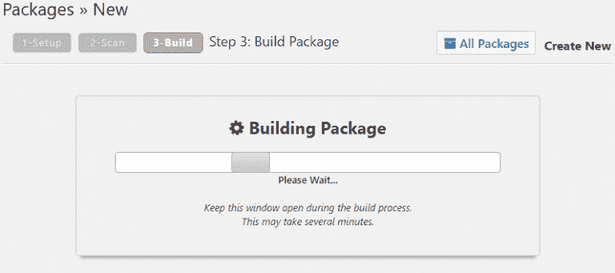
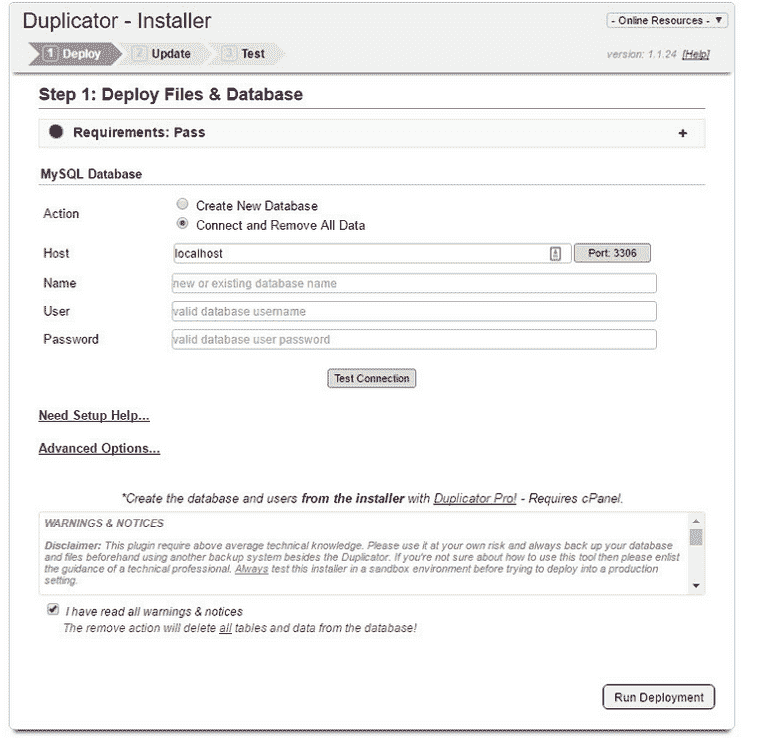
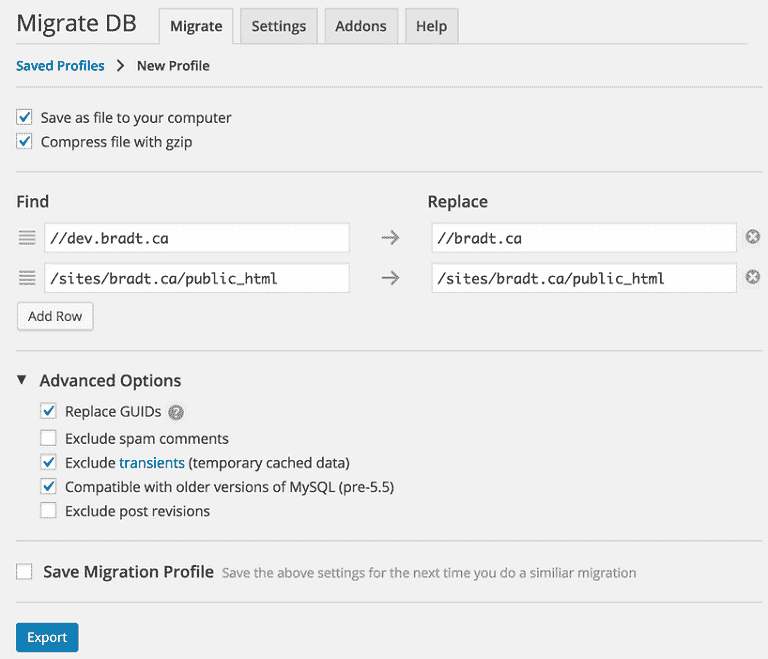
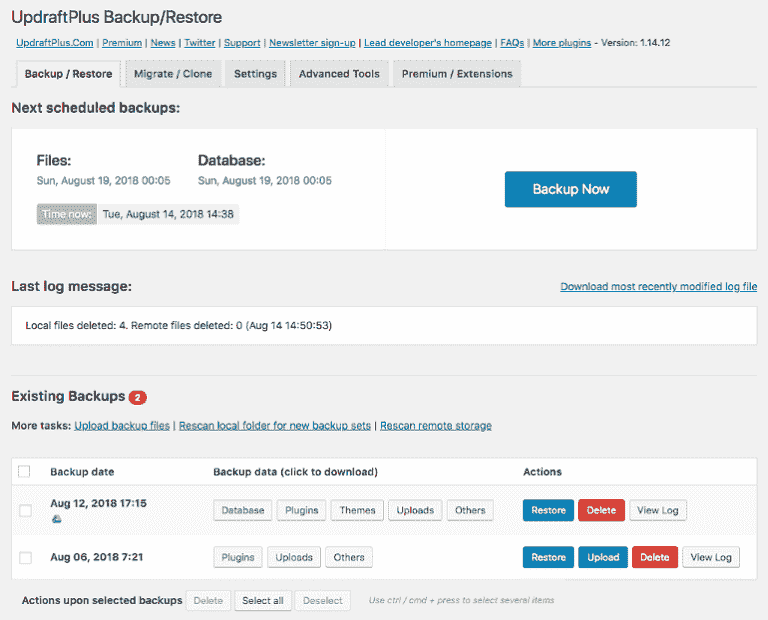
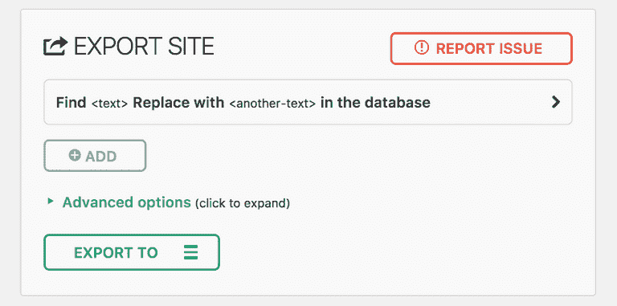
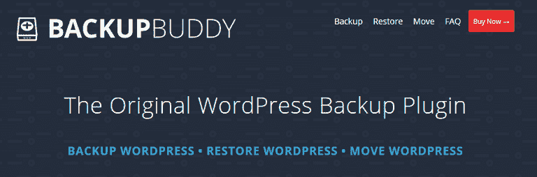
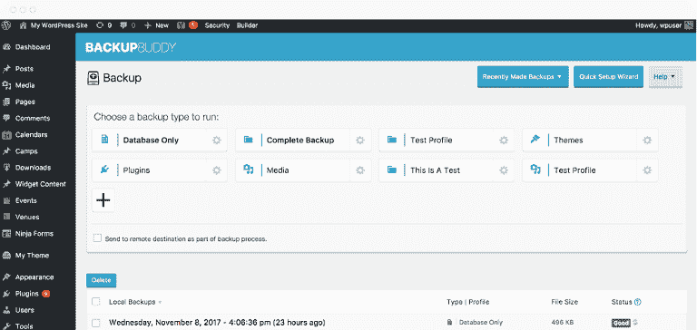
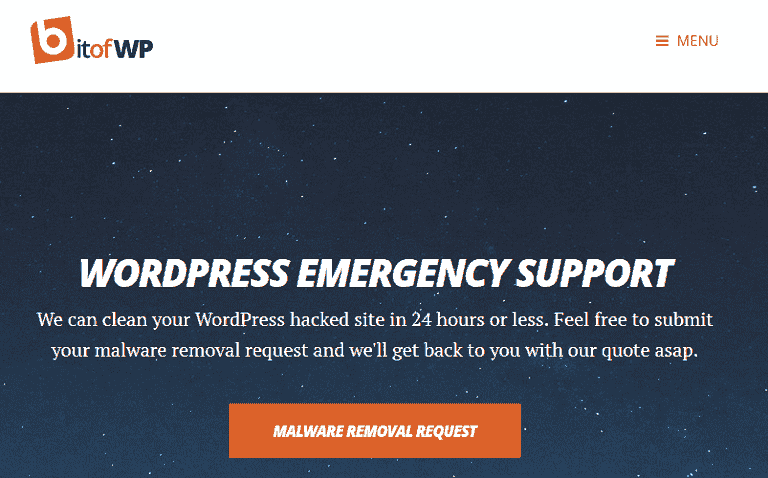

# 8 个高质量的 WordPress 迁移插件和服务

> 原文：<https://dev.to/bitofwp/8-high-quality-wordpress-migration-plugins-and-services-1p2b>

建立一个 WordPress 网站很容易，即使你没有经验。另一方面，把你的网站从一个地方搬到另一个地方会是一件很头疼的事情，即使你知道你在做什么。

你可能需要迁移你的 WordPress 网站有很多原因。例如，您可能将它从本地开发转移到生产服务器，或者从您的服务器复制到客户的服务器上。或者，也许你正在[更换 web 主机](https://bitofwp.com/blog/siteground-wordpress-hacked/)，需要为即将到来的项目创建一个副本，或者只是需要你的站点的备份。

不管是什么原因，重要的是在迁移过程中不要犯任何影响网站设计、功能和内容的错误。虽然手动迁移网站是可行的，但这非常耗时，而且会让您面临犯下不可挽回的错误的风险。

如果你想省去手动迁移 WordPress 网站的压力，试着使用 WordPress 迁移插件或服务。这些解决方案实现了网站迁移、克隆、数据库移动和备份的无缝连接。它们还能防止数据丢失，让你更快、更好地移动整个网站—*而不出错*。

看看这个迄今为止市场上最高质量的 WordPress 迁移插件和服务的综述，享受它们在迁移你的站点时提供的便利。

## WordPress 迁移插件

市场上有很多免费和优质的 WordPress 迁移插件来帮助你复制、备份、迁移和克隆你的网站。

### 1。[复印机](https://wordpress.org/plugins/duplicator/)

Duplicator 是迄今为止最受欢迎的迁移插件之一。它不仅有助于迁移你的 WordPress 站点，还有助于复制、移动、克隆和创建备份，使它成为一个灵活的解决方案。这可能是它拥有 4.9 颗星和超过 100 万活跃安装的原因。

这个迁移插件将你站点的插件、主题、内容、数据库和 WordPress 文件打包成一个整洁的叫做包的小 zip 文件。这个过程使得移动你的站点变得如此容易。

当你有你的网站所有的包，你所要做的就是把它上传到你的新服务器，让复印机为你设置好一切。也就是说，这个插件确实需要你有一点技术知识。如果这让你担心，你应该寻找一个更加用户友好的解决方案。

Duplicator 是一个免费的 WordPress 迁移插件，可以帮你完成这项工作。然而，该插件的专业版确实提供了如下特性:

*   自动备份和云存储( *Dropbox，Google Drive，亚马逊 S3，等等*
*   多站点迁移
*   从安装程序连接到 cPanel
*   电子邮件通知
*   多线程支持大型站点和数据库
*   专业支持

价格:免费( [pro 版](https://snapcreek.com/)59 美元起)

### 2。 [WP 迁移数据库](https://wordpress.org/plugins/wp-migrate-db/)

WP Migrate DB 插件使得迁移你的 WordPress 站点最困难的部分，移动数据库，变得更容易。它将 WordPress 数据库导出为 MySQL 数据转储，在 URL 和文件路径上运行查找和替换功能，并在保存为 SQL 文件之前处理序列化数据。

从那里，您需要将 SQL 文件导入到您的数据库，替换现有的文件。它还让用户能够更好地控制迁移和备份，而不仅仅是简单地克隆原始站点。

如果这听起来有点复杂，那是因为它确实很复杂。因此，这个迁移插件最适合需要将站点从生产站点迁移到本地安装，或者将本地开发的站点迁移到过渡或生产站点的开发人员。此外，这个插件完全基于移动你的数据库。如果你需要一个为你做所有事情的解决方案，你需要去别处看看。

该插件的专业版具有多种功能，如推送和拉取数据库、迁移前的数据库备份、迁移暂停和恢复功能、多站点迁移和优先电子邮件支持。

价格:免费( [pro 版](https://deliciousbrains.com/wp-migrate-db-pro/)99 美元起)

### 3。[up plus](https://wordpress.org/plugins/updraftplus/)

UpdraftPlus 是一个简单的备份和恢复插件。你所要做的就是手动备份你的网站或者安排自动备份，让插件把你的网站保存在云中( *Dropbox，Google Drive，email，亚马逊 S3，等等*)。当您需要恢复您的站点时，只需点击一下。

如果您想使用 UpdraftPlus 迁移您的站点，您需要升级到该插件的高级版本，或者购买单独的 [UpdraftPlus 迁移器插件](https://updraftplus.com/migrator/)。如果您升级到 UpdraftPlus Premium，您将获得 Migrator 附加组件以及以下功能:

*   增量备份
*   高级报告
*   数据库加密
*   多站点支持
*   简单的复制和移植
*   其他云存储选项

有了 UpdraftPlus Migrator 附加组件，您将能够克隆和迁移无限的 WordPress 站点，访问数据库工具以从数据库中删除您的旧网站，并获得 12 个月的优先支持。

价格:免费( [UpdraftPlus Premium](https://updraftplus.com/shop/updraftplus-premium/) 起价 70 美元，Migrator 附加软件起价 30 美元)

### 4。[一体式 WP 迁移](https://wordpress.org/plugins/all-in-one-wp-migration/)

一体式 WP 迁移是一个免费的 WordPress 迁移插件，旨在帮助你将网站迁移到一个新的服务器或域名。它可以移动数据库、媒体文件、插件和主题，并且不需要任何技术知识，这使得它成为这个列表中最用户友好的迁移解决方案之一。还有一个简洁的查找和替换数据库功能，使得移动后修复损坏的文件和链接更加容易。

这一全面的解决方案具有以下能力:

*   在所有虚拟主机平台和操作系统上工作
*   通过分时段导入/导出，绕过主机提供商设置的所有上传限制
*   函数与 PHP 版本无关( *2 及更高版本*)
*   支持 MySQL 和 MySQL
*   通过移动设备备份和迁移站点

您可以使用一些高级扩展来扩展您的迁移能力，如 Dropbox 存储、多站点支持、无限制导入大小、FTP 导出/导入等。

价格:免费(高级扩展价格不同)

### 5。 [BackupBuddy](https://ithemes.com/purchase/backupbuddy/)

BackupBuddy 是这个列表中唯一一个免费的 WordPress 迁移插件。然而，这并不意味着它没有相应的功能。它不仅为网站所有者提供了一种简单的方法来安排每天、每周甚至每月的备份，因为它备份网站的方式，迁移也很容易。

这个简单的插件备份你的整个 WordPress 安装，这样你就有了你的数据库和 WordPress 文件的副本，并把它放入一个方便的 zip 文件中。然后这个文件可以保存到你喜欢的异地云存储中，包括亚马逊 S3、BackupBuddy Stash、Dropbox 等等。此外，您可以将备份直接发送到您的电子邮件中。

使用 BackupBuddy，您还可以获得这些惊人的功能:

*   轻松的站点恢复
*   可定制的备份
*   电子邮件通知
*   免费恶意软件检查
*   用于检测托管问题的内置服务器工具
*   交互式网站目录地图
*   数据库扫描和修复
*   可定制的备份存储限制

价格:计划起价 80 美元

## WordPress 迁移服务

如果你不想在你的网站上安装另一个插件，或者需要帮助迁移你的网站，你可以使用几个著名的 WordPress 迁移服务。

### 1。[选择。io](https://www.valet.io/)

Valet.io 是一个高级 WordPress 迁移服务，可以处理各种类型和规模的网站。除了帮助您进行托管和站点迁移，他们还在市场营销、速度优化、可用性和站点安全方面提供专业级支持。

看看 Valet.io 的一些最佳服务:

*   A/B 测试
*   SEO 优化
*   内容营销
*   电子商务商店和产品支持
*   网站设计和开发

这个解决方案非常适合那些需要专业迁移服务和其他 WordPress 相关项目帮助的人。

价格:更多信息请联系

### 2。 [AccessWP](https://accesswp.com/)

AccessWP 为 WordPress 用户提供无限制的 WordPress 支持，每月付费。例如，您可以让经验丰富的美国开发团队帮助您完成以下工作:

*   网站维护
*   速度优化
*   网页设计
*   SEO 优化
*   网站安全
*   紧急事件
*   转换优化

当然，迁移你的 WordPress 网站包括在你用 AccessWP 得到的这个长长的任务列表中。关键是，一旦你的网站被转移，AccessWP 会提供其他服务来帮助你继续发展你的博客或在线网站。

价格:每月 99 美元起

### 3。 [BitofWP](https://bitofwp.com)

在这篇关于 WordPress 迁移服务的综述中，我们不能不提到我们自己的 WordPress 支持服务。作为一家专门从事安全审计和[恶意软件移除](https://bitofwp.com/security/web-malware-guide/)的 WordPress 支持机构，我们也为提供额外的 WordPress 服务而自豪，例如:

*   SSL 证书设置和从 HTTP 到 HTTPS 的转换
*   帖子和页面上的内容创建和更新
*   当你决定[使用古腾堡](https://bitofwp.com/blog/introduction-to-gutenberg-wordpress-editor/)时，插件、主题和内容迁移
*   网站克隆从 HTML，Joomla，Drupal，PHP。NET 和静态站点
*   网站维护:网站备份、更新、安全检查、月度报告、网站修复、速度优化和垃圾邮件清除

最后，我们将 WordPress 站点从旧主机迁移到新主机，将非 WordPress 站点迁移到 WordPress 站点。每个站点迁移都附带一个月的支持、页面和帖子移动、主题迁移、菜单和图像迁移、现场 SEO 设置、SEO 永久链接设置、垃圾邮件防护和 302 重定向。最重要的是，在迁移之前，所有工作都在我们自己的托管环境中完成，以减少错误并确保无缝迁移。

价格:必须联系以获取有关站点迁移的更多信息(维护计划每月 19 美元起)

这就是你想要的！今天，一些最可靠的 WordPress 迁移插件和服务提供给 WordPress 用户。您选择的解决方案将取决于您的预算和个人需求。但是稍加研究，你会发现插件或服务可以帮助你轻松地迁移你的 WordPress 网站。

8 个高质量的 WordPress 迁移插件和服务首先出现在由 BitofWP 提供的 [WordPress 支持服务上。](https://bitofwp.com)