# 一个软件工程职位有超过 86 名优秀的候选人，下面是我们是如何做到的

> 原文：<https://dev.to/willemwijnans/86-quality-candidates-for-a-software-engineering-position-heres-how-we-did-it-a6l>

像任何早期公司一样，在 Slite 招聘人才是至关重要的。和其他创业公司一样，我们的知名度有限。我们努力工作，聪明地让优秀的候选人申请我们的职位。我们投入时间和精力去接触人们，让他们注意到我们。

最重要的是，Slite 是一家产品公司。任何加入我们团队的人都是潜在的 Slite 用户。这从我们发现自己的人，到申请我们的人。我们所有的招聘努力都可能导致潜在的新公司使用 Slite。公平地说，我们在招聘方面做得越好，它就越能发挥二级营销渠道的作用。

我们希望开始分享我们不断发展的招聘方法。这第一篇文章将关注任何初创公司在有限的预算下可以尝试的快速成功。他们帮助我们为一个软件工程师空缺职位找到了 86 名合格的候选人:

[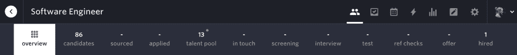](https://res.cloudinary.com/practicaldev/image/fetch/s--muuhodNe--/c_limit%2Cf_auto%2Cfl_progressive%2Cq_auto%2Cw_880/https://storage.googleapis.com/slite-api-files-production/files/be85438d-ebaa-472d-be18-61e38505d009/Screenshot%2525202018-11-30%25252014.22.11.png)

* * *

# 先做第一件事

Slite 正处于一个有趣的阶段:我们处于早期阶段，正在发展一种[远程优先的文化](https://medium.com/slite/how-were-building-our-remote-culture-as-we-build-slite-2b7a8365268)，面临有趣的技术挑战，并使用一些最新的技术。理论上，吸引优秀的候选人应该不会太复杂。实际上，这很大程度上是关于获得“第一次正确”。

# 把话传出去

我们开始让我们的名字出现在那里，专注于有创业精神的人所在的平台。

## Y Combinator 在招聘谁

最好的起点是 Y Combinator 的月度“谁在招聘”帖子。这是 HackerNews 上一个名为[问 HN:谁在招人](https://news.ycombinator.com/item?id=18354503)的月度帖子，来自世界各地的初创公司在这里发布空缺职位，招聘(被动)人才。这篇文章产生了最好的结果:我们联系了 13 个顶尖的申请人，包括我们最终聘用的朱利安。

***趣闻:*** 我们两年前就和朱利安联系过，但他当时还没在找工作。他在招聘网站上发现了我们，并主动联系我们:如果我们没有在那里发帖，我们可能会错过他。_

[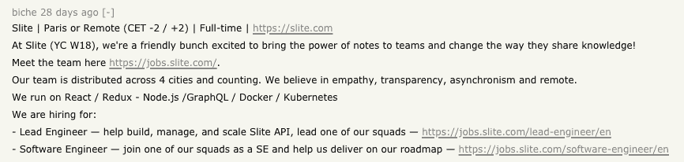](https://res.cloudinary.com/practicaldev/image/fetch/s--uuxz1RFU--/c_limit%2Cf_auto%2Cfl_progressive%2Cq_auto%2Cw_880/https://storage.googleapis.com/slite-api-files-production/files/c80b3c89-c935-410a-8d1f-53422cf1aa32/Screenshot%2525202018-11-30%25252014.53.44.png)

张贴和祈祷结果在这里不起作用。与任何 HackerNews 帖子一样，有参与度的帖子(评论、upvotes)排名会更高。鼓励我们的团队开始对话并回答问题产生了奇迹。它让我们在第一页获得最大的知名度，自然增加了申请人数。

[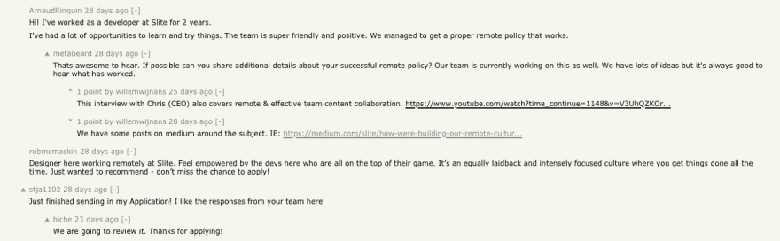](https://res.cloudinary.com/practicaldev/image/fetch/s--lyvORHVe--/c_limit%2Cf_auto%2Cfl_progressive%2Cq_auto%2Cw_880/https://storage.googleapis.com/slite-api-files-production/files/dfb980bc-4590-4ee2-a304-35ea0d88fb00/Screenshot%2525202018-11-30%25252015.05.08.png)

## 天使

AngelList 也可以在很短的时间内，用很少的预算为你找到高质量的候选人。这是一个为有创业精神的人提供的平台，所以你不会错的。简单地创建[一个公司页面并发布空缺职位](https://angel.co/slite/jobs)就给我们带来了 26 名申请人，包括 7 个相关匹配:

[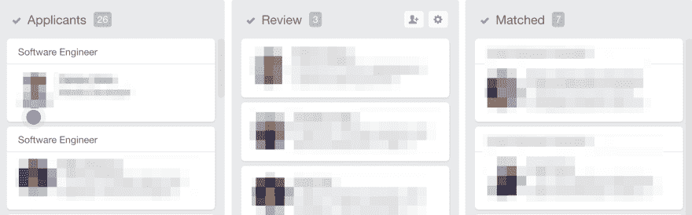](https://res.cloudinary.com/practicaldev/image/fetch/s--71xGmryu--/c_limit%2Cf_auto%2Cfl_progressive%2Cq_auto%2Cw_880/https://storage.googleapis.com/slite-api-files-production/files/f9c6ceb3-2258-4a89-898e-cdd2c3cbe03a/Screenshot_2018-11-30_15_15_47.png)

虽然我们还没有通过 AngelList 招到人，但是这是一个速战速决的方法。几乎不用花多少时间就能确定对 Slite 感兴趣的候选人。

额外收获:由于产品搜索被 AngelList 收购，一个小小的“招聘”标签会出现在你的产品搜索简介上，在你的名字旁边。例如，我们最近推出了 [Slite 的移动应用](https://www.producthunt.com/posts/slite-for-mobile)，为我们提供了对相关人员的额外免费可见性。

# 自己走出去

现在，我们已经确保通过在相关渠道发表意见来产生正确的兴趣，我们想分享一下我们如何自己寻找候选人并联系他们。

根据我们的经验，成功的招聘策略应该将两者结合起来。获得高质量的入境申请人(数量)，并通过接触有趣的人来支持招聘漏斗(质量)。

记住你是在为长期目标而努力。你联系的人现在可能不会留意，但当他们留意时，会把你记在心里。

## 什么对我们有用

那么我们如何找到该联系的人呢？

我们首先决定尽可能缩小我们的人才库，这样我们就可以进行精确的搜索。为了取得最大的成功，我们设定了以下标准:

*   **远程优先** —我们关注以前远程工作过的人
*   **领域**——我们寻找曾经在初创公司工作过的人，特别是为生产力应用工作过的人
*   我们寻找 Nodejs & Graphql 方面的专家，因为我们最大的挑战是交付 Slite 公共 api
*   简介(Profile)——我们被那些有副业/会议演讲者/科技博客作者/领导才能的候选人所吸引

然后，我们列出了所有可能拥有我们正在寻找的工程师的公司:

[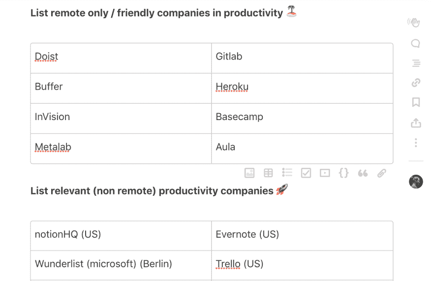](https://res.cloudinary.com/practicaldev/image/fetch/s--kj0GsQHR--/c_limit%2Cf_auto%2Cfl_progressive%2Cq_auto%2Cw_880/https://storage.googleapis.com/slite-api-files-production/files/2988e0b0-7c57-4ead-8126-e3a93fde68d6/Screenshot%2525202018-12-05%25252010.41.42.png)

这是 Slite 中的一个动态文档，我们会定期添加公司以保持域名的最新状态。现在，我们去哪里寻找符合这个标准的人呢？

## 领英

我们为这些公司建立了 Linkedin 搜索过滤器，每周通知我们他们所有员工的活动:

[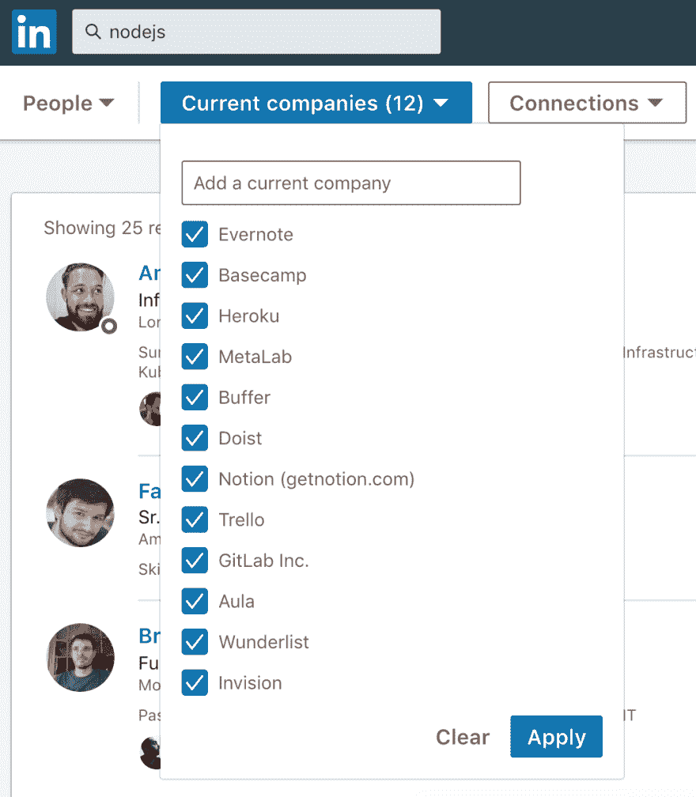](https://res.cloudinary.com/practicaldev/image/fetch/s--SOzmdisN--/c_limit%2Cf_auto%2Cfl_progressive%2Cq_auto%2Cw_880/https://storage.googleapis.com/slite-api-files-production/files/1d5aa7d0-008f-4ce4-aaf7-66621a60190a/Screenshot%2525202018-12-05%25252011.56.11.png)

## 相关简讯

我们也对开源社区中的活跃人士感兴趣，他们撰写和/或谈论相关的技术主题。在像 [Node Weekly](https://nodeweekly.com/) 、 [GraphQL Weekly](https://graphqlweekly.com/) 、&、 [Dev.to](https://dev.to) 这样的时事通讯上搜索，每周都会给我们带来两个相关的人，与他们开始谈论他们做了什么以及我们为什么喜欢它。

## 中等

Medium 也是一个很好的地方，让我们写下如何解决我们的技术挑战，以及如何构建我们的工具。但这也是一个找到对解决我们正在解决的同类问题感兴趣的人的好地方。使用 GraphQL 和 NodeJS 进行超级简单的中型搜索，每天都会将热情的作家送到我们家门口:

[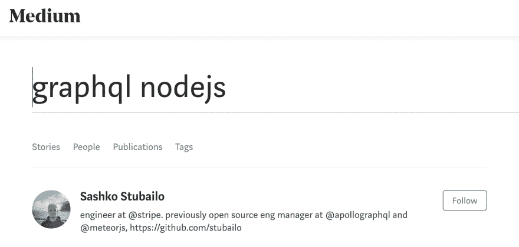](https://res.cloudinary.com/practicaldev/image/fetch/s--1TxPIyd5--/c_limit%2Cf_auto%2Cfl_progressive%2Cq_auto%2Cw_880/https://storage.googleapis.com/slite-api-files-production/files/4f8c9258-7450-4d55-b4dc-3e913fb066a9/Screenshot%2525202018-12-05%25252012.22.34.png)

我们试图每周向我们认为适合 Slite 的人发送至少五封高度相关的电子邮件。你注意到上面图片中“人才库”里的 13 个人了吗？考虑一下这 13 个被动的、高度相关的候选人，他们是用我刚才描述的方法找到的。

## 实际伸手

在早期，我们给候选人发邮件主要是解释 Slite 是什么，而不是关注是什么让他们对我们感兴趣。

看这里:
[从皮耶到首席工程师](https://slite.com/api/public/notes/01dvbSFugA/redirect)

去年 11 月，我们改变了策略，转而写完全专注于收件人的电子邮件，而不是关于我们自己的。以下是一些例子:

[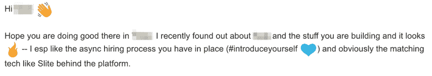](https://res.cloudinary.com/practicaldev/image/fetch/s--B_9Q7n2i--/c_limit%2Cf_auto%2Cfl_progressive%2Cq_auto%2Cw_880/https://storage.googleapis.com/slite-api-files-production/files/8f041d27-9061-4383-801a-193ccf94dd7c/Screenshot_2018-12-05_12_49_24.png)

* * *

[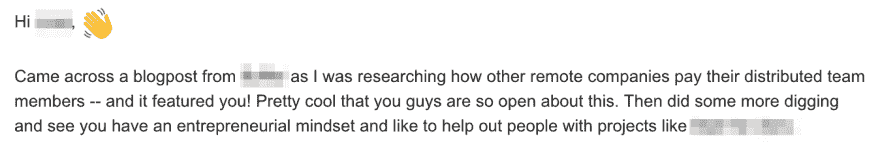](https://res.cloudinary.com/practicaldev/image/fetch/s--PTWrBJn1--/c_limit%2Cf_auto%2Cfl_progressive%2Cq_auto%2Cw_880/https://storage.googleapis.com/slite-api-files-production/files/08d6325b-47d6-48ed-873f-9c3994566fa7/Screenshot_2018-12-05_12_50_01.png)

* * *

[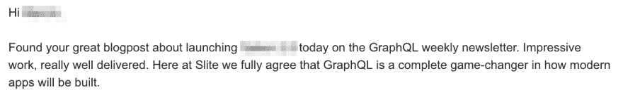](https://res.cloudinary.com/practicaldev/image/fetch/s--4AZzMH9N--/c_limit%2Cf_auto%2Cfl_progressive%2Cq_auto%2Cw_880/https://storage.googleapis.com/slite-api-files-production/files/11f2b686-f2dd-46bc-ab7d-940b56425d50/Screenshot_2018-12-05_12_49_36.png)

* * *

[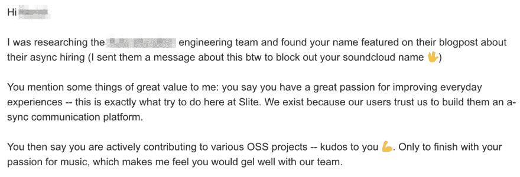](https://res.cloudinary.com/practicaldev/image/fetch/s--Yj6uOzQY--/c_limit%2Cf_auto%2Cfl_progressive%2Cq_auto%2Cw_880/https://storage.googleapis.com/slite-api-files-production/files/58f89aff-758c-495e-a6e2-f5d52fc2fb18/Screenshot_2018-12-05_12_51_01.png)

* * *

像这样雇用被动的候选人需要时间，但真的有回报。创建您自己的管道让您可以完全控制它，并确保它总是充满了相关的，合格的工作人员。我们确信，作为一家企业，我们在这项重要计划上花费的每一分钟都是无价的。

## 将你的候选人视为潜在客户

另一件我们想要表达的重要事情是，在招聘过程中，如何对待所有与你接触的人。我们在这方面还不是最好的，我们仍在学习如何有效地做到这一点。

有一点我们可以和你分享:当你是一家产品公司(或任何其他有价值的公司)时，用标准的拒绝邮件拒绝候选人是不明智的。我们与候选人互动的方式直接反映了我们的业务和品牌。

然而，当我们在摸索我们的新招聘系统 Homerun 时，它发出了一个批量拒绝，我们立刻后悔了！我们完全忘记了考虑到所有这些人都是潜在客户。所以我们尝试了我们的错误:

文森特非常欣赏我们的坦诚，甚至在推特上发了这条微博:

[https://twitter.com/\_cmdv\_/status/1060141615824674816](https://twitter.com/%5C_cmdv%5C_/status/1060141615824674816)

对于拒绝申请人，我们现在有一个标准规则:任何努力写申请的人(在我们的情况下，他们希望在 Slite 工作的明确动机)可以期待我们的努力作为回报。在这种情况下，让他们了解为什么我们现在觉得我们不匹配。

# 结束语

招聘很难，而且永远都很难。交付质量通常意味着交付难以扩展的东西。这就是为什么我们专注于通过在 Y Combinator、Angel & Product Hunt 等平台上生存来获得尽可能多的相关候选人，同时在被动人才方面积极主动地做好自己的工作。

如果你继续在招聘上投入时间，并愿意做需要扩大规模的事情，成功几乎总是会随之而来。