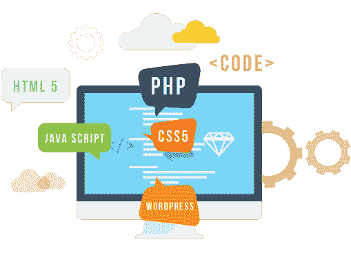
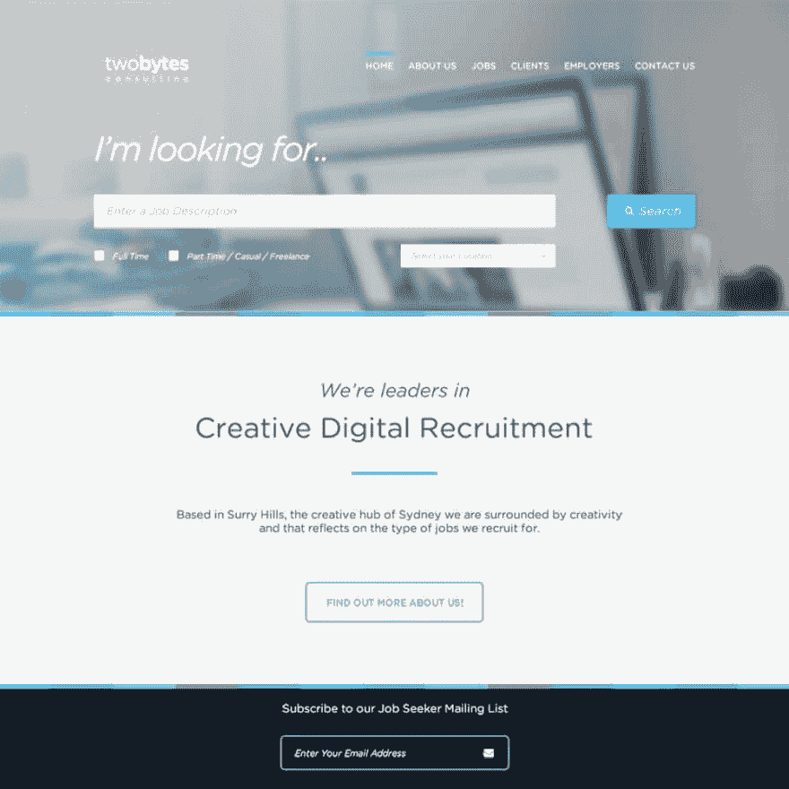
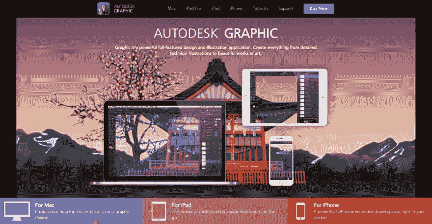
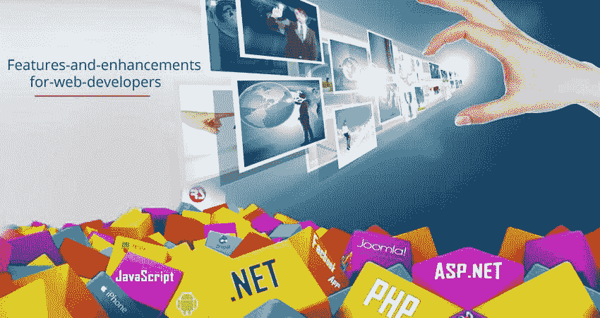
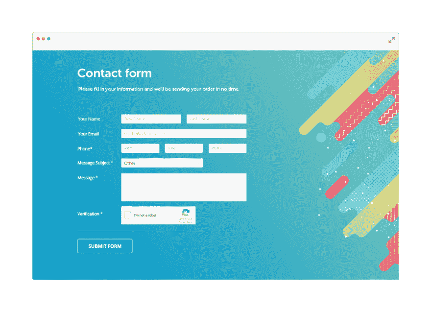
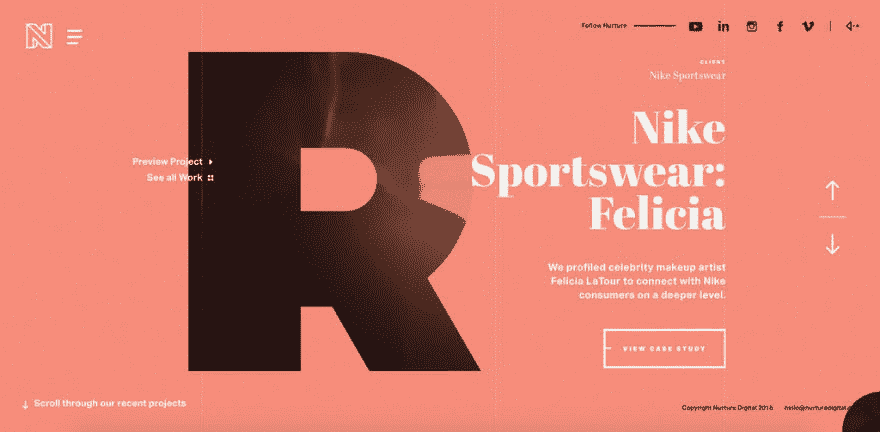
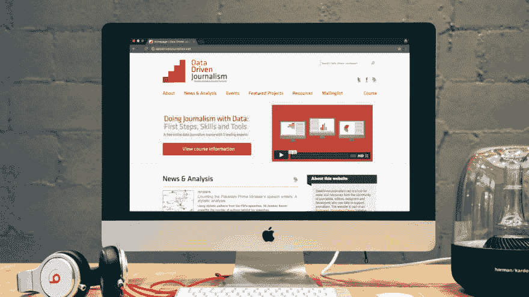
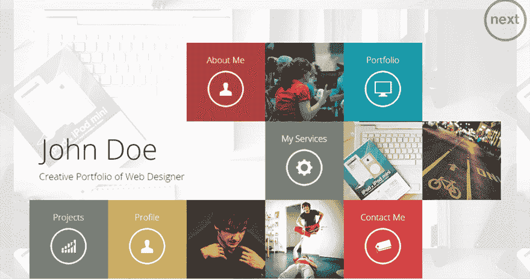

# 主导 2019 年的 9 大网络发展趋势

> 原文：<https://dev.to/umerbilal1/9-web-development-trends-that-will-dominate-2019-52p0>

[# web dev](/t/webdev)[# web design](/t/webdesign)[# Dubai web design](/t/dubaiwebdesign)

在寻求改善业务和减少噪音的过程中，公司正在完善他们的网站，以吸引更多的访问者，并给观众提供良好的用户和视觉体验。

2018 年，我们看到了加密货币、聊天机器人和增强现实的兴起。2019 年对网络开发者和企业意味着什么？

以下是将主导 2019 年的顶级 [**网络发展**](https://www.grafdom.com/web-design-services/) 趋势。

**1。单页网站**

大多数人不喜欢在网页中寻找他们想要的东西。明年，将会有更多的单页网站。主要趋势将是更简单的用户导航、方便和速度。

**2。适应性设计**

没有迹象表明全球智能手机用户数量会减少。明年，更多的企业将会看到他们有一个适应性强的网站。它应该是移动和平板电脑友好的。人们已经不再使用电脑了。网站变得自适应已经成为一个普遍规律。

**3。更多插图**

尽管有一条规则，少即是多。2019 年，预测的趋势是，企业将更热衷于图形密集型网站。更多的插图意味着更好的用户体验。

企业会不择手段地吸引网络访问者的注意力。

**4。Javascript 和 PHP 7 支持的网站**

这是 web 开发人员最常用的两种语言。2019 年，将有可能分组导入广告、匿名类、Unicode 转义码的语法以及许多其他功能。Web 开发人员现在可以开始更新了，因为 PHP 也提高了网站的性能。

**5。不同形状、大小的表单**

大部分网站都改成了软界面，从结构化、角度化的格式。网页设计师也创造了不同的形式——不同的形状、颜色和形状。

**6。排版**

下一年，我们将见证具有创造性排版的网站——这是一个在开发网站时通常被忽视的特征。从昨天的无衬线字体，到今天网站上的创意、时髦、吸引眼球的排版。

7 .**。多媒体朗读**

以前，长篇大论是由一大段文字和一些照片组成的。今年 2019 年，一篇长阅读将变成一页插图——文本、照片和图形的结合。

Longread 在 2019 年的目标是减少文本，增加视觉效果。

**8。替代设计**

一个独特的网页设计是任何公司都可以拥有的最好的资产。网页设计师将努力创造出独一无二的设计，并突破界限。

**9。加密货币**

加密货币趋势不会在 2019 年消亡。交易平台、P2P 交易所和其他数字区块链产品将继续蓬勃发展。专家预测将会有一种智能合约语言来创造他们自己的加密货币。

10。渐进式网络应用(PWA)

渐进式 web 应用程序在很大程度上依赖于三种语言:JS、HTML 和 CSS。这些旨在刺激转换和客户忠诚度。

更多的网站将完全适应智能设备，并能够独立更新。