# 限时的每日# 100 日代码前端开发课程

> 原文：<https://dev.to/nas5w/a-100daysofcode-timeboxed-front-end-development-curriculum-8i7>

[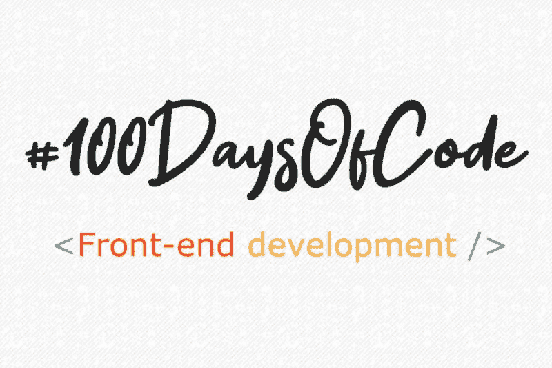](https://res.cloudinary.com/practicaldev/image/fetch/s--VaXF8D0f--/c_limit%2Cf_auto%2Cfl_progressive%2Cq_auto%2Cw_880/https://i.imgur.com/F0tiB1v.jpg)

* * *

这是一个在#100DaysOfCode 期间学习前端开发的有点自以为是的课程。由于它涵盖了广泛的前端开发主题，因此可以认为它更像是一门“调查”式的课程，而不是对任何一个领域的深入研究。理想情况下，完成本课程后，您将对每个主题有所熟悉，并有能力在将来必要时轻松深入任何领域。

该课程受到 Kamran Ahmed 的[现代前端开发人员](https://medium.com/tech-tajawal/modern-frontend-developer-in-2018-4c2072fa2b9c)路线图的显著影响。请检查它——它是极好的。

如果您觉得本课程有用，请启动[相关的 Github 知识库](https://github.com/nas5w/100-days-of-code-frontend)以实时跟踪更新，并在 reach 社交媒体上分享！

**注意**:我知道前端开发对很多人来说意味着很多不同的事情！如果你是一名前端开发人员，并且你认为这个指南可以改进，请通过提出相关 Github 库的[贡献](https://github.com/nas5w/100-days-of-code-frontend/blob/master/README.md#contributing)部分中描述的问题让我知道。谢谢大家！

# 📆课程

这个存储库的基本原理是[时间盒](https://en.wikipedia.org/wiki/Timeboxing)。如果你在过去花了一定的时间尝试学习网页开发或类似的技能，你很可能经历过在任何一个特定的主题上掉进兔子洞。这个存储库旨在为每项技术分配一定的天数，并鼓励您在该天数到期时转移到下一项技术。

预计每个人在开始这个挑战时都有不同的熟练程度，这没关系。初学者和专家前端开发人员都可以从这些领域的时间框实践中受益。

建议的日常活动如下:

*   第 1-8 天:HTML
*   第 9-16 天:CSS
*   第 17-24 天:JavaScript 基础知识
*   第 25-27 天:jQuery
*   第 28-33 天:响应式网页设计
*   第 34-36 天:无障碍
*   第 37-39 天，去吧
*   第 40-44 天:节点和 NPM
*   第 45-50 天:萨斯
*   第 51-54 天:引导
*   第 55 天:很好
*   第 57-61 天:吞咽
*   第 62-65 天:网络包
*   第 66 天:斯洛文尼亚
*   第 68-83 天:做出反应
*   第 84-89 天:还原
*   90-94 日:是
*   第 95-97 天:打字稿
*   第 98-100 天

# 🔎细节

下面你可以找到关于课程中每个主题的一些信息，以及关于每个主题应该做什么的一些想法/指导。要获得与本课程一起进行的项目的灵感，请参见[项目创意部分](#project-ideas)。

作为时间框原则的一部分，如果你没有完成“学习领域和想法”部分的所有项目也没关系。相反，你应该专注于从分配给每个领域的天数中获得最大的收益，然后继续前进。

[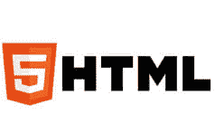](https://res.cloudinary.com/practicaldev/image/fetch/s--e0YRtEv5--/c_limit%2Cf_auto%2Cfl_progressive%2Cq_auto%2Cw_880/https://i.imgur.com/O0F5XSR.jpg)

超文本标记语言(HTML)是创建网页和 web 应用程序的标准标记语言。它与层叠样式表(CSS)和 JavaScript 一起构成了万维网的三大基石技术。Web 浏览器从 web 服务器或本地存储器接收 HTML 文档，并将文档呈现为多媒体网页。HTML 在语义上描述网页的结构，并且最初包括文档外观的提示。(来源:[维基百科](https://en.wikipedia.org/wiki/HTML))

### 💡快速外卖

HTML 确实是 web 开发的基础。即使在基于 javascript 的框架中，您最终还是会以这样或那样的形式编写 HTML。

### 📖学习领域和理念

*   以 freeCodeCamp 上的[基础 HTML 和 HTML5 部分](https://learn.freecodecamp.org/)为例。
*   HTML 页面结构
*   HTML 元素
*   嵌套 HTML 元素
*   语义标记
*   链接/多页
*   形象
*   音频/视频媒体
*   表单和表单元素
*   创建一个多页网站！(如果您需要一些灵感，请参见[项目创意](#project-ideas))。

[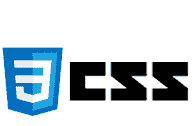](https://res.cloudinary.com/practicaldev/image/fetch/s--qHP7ktl---/c_limit%2Cf_auto%2Cfl_progressive%2Cq_auto%2Cw_880/https://i.imgur.com/028GOR0.jpg)

级联样式表(CSS)是一种样式表语言，用于描述以 HTML 等标记语言编写的文档的表示。CSS 是万维网的基石技术，与 HTML 和 JavaScript 齐名。CSS 旨在实现表示和内容的分离，包括布局、颜色和字体。这种分离可以提高内容的可访问性，在表示特征的规范方面提供更多的灵活性和控制，通过在单独的。css 文件，并减少结构内容的复杂性和重复性。(来源:[维基百科](https://en.wikipedia.org/wiki/Cascading_Style_Sheets))

### 💡快速外卖

CSS 是 web 开发的另一个重要组成部分。虽然它主要用于样式化和定位 HTML 元素，但是它已经越来越能够处理曾经由 javascript 处理的更动态的任务(例如，动画)。

### 📖学习领域和理念

*   以 freeCodeCamp 上的[基本 CSS、CSS flexbox 和 CSS grid 部分](https://learn.freecodecamp.org/)为例。
*   内嵌 CSS
*   `<style>`标签
*   带`<link>`的外部 CSS
*   造型元素
*   选择器
*   浮子，清除浮子
*   布局(网格、flexbox)
*   字体，自定义字体
*   设计你在学习 HTML 时制作的 HTML 页面！

JavaScript，通常缩写为 JS，是一种符合 ECMAScript 规范的高级解释编程语言。它也是一种动态的、弱类型的、基于原型的和多范例的语言。与 HTML 和 CSS 一起，JavaScript 是万维网的三大核心技术之一。JavaScript 支持交互式网页，因此是 web 应用程序的重要组成部分。绝大多数网站都使用它，所有主要的网络浏览器都有专门的 JavaScript 引擎来执行它。(来源:[维基百科](https://en.wikipedia.org/wiki/JavaScript))

### 💡快速外卖

JavaScript 在前端世界变得越来越重要。虽然它曾经主要用于使页面动态化，但现在它是许多前端框架的基础。这些框架处理许多以前由后端处理的任务(例如，路由和显示不同的视图)。

### 📖学习领域和理念

*   以 freeCodeCamp 上的[基础 JavaScript 和 ES6 部分](https://learn.freecodecamp.org/)为例。
*   太多的语言基础在这里列出来了！
*   `<script>`标记和放置
*   访问 HTML 元素
*   事件循环、调用堆栈和事件队列
*   原型遗传
*   参考与价值
*   给你之前开发的 HTML/CSS 页面添加一些动态元素或逻辑！

jQuery 是一个快速、小巧、功能丰富的 JavaScript 库。它通过一个跨多种浏览器工作的易于使用的 API，使 HTML 文档遍历和操作、事件处理、动画和 Ajax 变得更加简单。jQuery 结合了多功能性和可扩展性，改变了数百万人编写 JavaScript 的方式。(来源:[jQuery.com](https://jquery.com/))

### 💡快速外卖

在使用普通(也称为“vanilla”)JavaScript 一段时间后，您可能会发现有些任务有点麻烦，尤其是那些与访问和操作 HTML 元素相关的任务。在相当长的一段时间里，jQuery 是使这类任务变得更容易和跨不同浏览器保持一致的首选库。如今，由于普通 javascript、CSS 和更新的 javascript 框架的进步，jQuery 不一定是“强制性的”学习(我们将在后面讨论框架)。尽管如此，花一点时间学习一些 jQuery 并将其应用到一个小项目中是有益的。

### 📖学习领域和理念

*   以 freeCodeCamp 上的 [jQuery 部分](https://learn.freecodecamp.org/)为例。
*   文档就绪
*   选择器
*   切换类别
*   动画
*   添加或移动 HTML 元素
*   将 jQuery 添加到您的站点！

[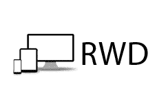](https://res.cloudinary.com/practicaldev/image/fetch/s--Nexg43Ks--/c_limit%2Cf_auto%2Cfl_progressive%2Cq_auto%2Cw_880/https://i.imgur.com/Bt1zWwq.jpg)

响应式网页设计(RWD)是一种网页设计方法，使网页在各种设备和窗口或屏幕尺寸上呈现良好。最近的工作也考虑到观众的接近作为 RWD 的延伸观看环境的一部分。内容、设计和性能对于所有设备都是必要的，以确保可用性和满意度。使用 RWD 设计的网站通过使用流动的、基于比例的网格、灵活的图像和 CSS3 媒体查询(对@media 规则的扩展)来调整布局以适应查看环境。(来源:[维基百科](https://en.wikipedia.org/wiki/Responsive_web_design))

### 💡快速外卖

响应式 web 设计就是让 web 应用程序在所有类型的建议下看起来和功能都正常。一个简单的例子是，一个网站应该在桌面网络浏览器和移动电话浏览器中外观和功能都正常。对响应式设计的理解对于任何前端开发人员来说都是至关重要的！

### 📖学习领域和理念

*   参加 freeCodeCamp 上的[响应式网页设计原则部分](https://learn.freecodecamp.org/)。
*   媒体查询，断点
*   响应图像
*   让你的网站响应迅速！
*   使用 Chrome DevTools 在不同的设备/视窗上查看您的站点。

网页无障碍是一种包容性做法，确保没有任何障碍阻止残疾人与万维网上的网站互动或访问万维网上的网站。当网站被正确地设计、开发和编辑时，一般来说所有用户都有同等的机会获得信息和功能。(来源:[维基百科](https://en.wikipedia.org/wiki/Web_accessibility))

### 💡快速外卖

可访问性，通常被写成 a11y，是前端 web 开发中最重要的主题之一，然而它似乎经常被忽视。创建可访问的 web 应用程序不仅在伦理上是合理的，而且考虑到当您的应用程序可访问时，将有更多的受众能够查看它们，这也具有很大的商业意义。

### 📖学习领域和理念

*   以 freeCodeCamp 上的[应用可访问性部分](https://learn.freecodecamp.org/)为例。
*   阅读关于 A11Y 项目的一些内容
*   查看他们的[清单](https://a11yproject.com/checklist)
*   根据此清单更新您的网站的可访问性

[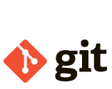](https://res.cloudinary.com/practicaldev/image/fetch/s--WEfsg0ZQ--/c_limit%2Cf_auto%2Cfl_progressive%2Cq_auto%2Cw_880/https://i.imgur.com/5QoNJqs.jpg)

Git 是一个免费的开源分布式版本控制系统，旨在快速高效地处理从小到大的项目。(来源:[git-scm.com](https://git-scm.com/))

### 💡快速外卖

版本/代码控制是任何 web 开发人员工具包的重要组成部分。有许多不同的版本控制系统，但是 Git 是目前最流行的。你可以(也应该！)当你学习的时候，用它来跟踪你的项目！

### 📖学习领域和理念

*   [Git 初学者教程(视频)](https://www.youtube.com/watch?v=HVsySz-h9r4)
*   Install git
*   建立一个 [github](https://github.com) 账户
*   了解最常用的 git 命令:
    *   初始化
    *   克隆
    *   增加
    *   犯罪
    *   推
    *   拉
    *   合并
    *   重定…的基准
*   将您现有的项目添加到 github！

[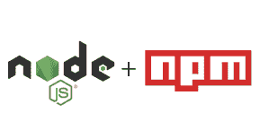](https://res.cloudinary.com/practicaldev/image/fetch/s--i4fa5OIN--/c_limit%2Cf_auto%2Cfl_progressive%2Cq_auto%2Cw_880/https://i.imgur.com/8ik2alD.jpg)

Node.js 是一个开源的、跨平台的 JavaScript 运行时环境，它在浏览器之外执行 JavaScript 代码。JavaScript 主要用于客户端脚本，其中用 JavaScript 编写的脚本嵌入在网页的 HTML 中，并由用户的 web 浏览器中的 JavaScript 引擎在客户端运行。Node.js 允许开发人员使用 JavaScript 编写命令行工具和服务器端脚本，即在页面被发送到用户的 web 浏览器之前，在服务器端运行脚本来生成动态网页内容。因此，Node.js 代表了一种“JavaScript 无处不在”的范式，围绕一种编程语言统一了 web 应用程序开发，而不是针对服务器端和客户端脚本的不同语言。(来源:[维基百科](https://en.wikipedia.org/wiki/Node.js))

### 💡快速外卖

虽然 nodejs 通常被认为是后端解决方案，但它经常被用来支持前端开发。它以多种方式做到这一点，包括运行构建工具、测试和林挺(所有这些都将很快被涵盖！).节点包管理器(npm)是 Node 的另一个重要特性，可以用来管理项目的依赖性(例如，项目可能依赖的代码库——jQuery 就是一个例子！).

### 📖学习领域和理念

*   研究节点以及它与浏览器有何不同
*   安装节点(npm 附带)
*   创建一个简单的 javascript 文件并用 node 运行它
*   使用 NPM 来管理现有项目中的任何依赖项(例如，jQuery！)

Sass 是 CSS 的扩展，它为 basic 语言增添了力量和优雅。它允许您使用变量、嵌套规则、混合、内联导入等等，所有这些都具有完全兼容 CSS 的语法。Sass 有助于保持大的样式表组织良好，并快速启动和运行小的样式表，特别是在 Compass 样式库的帮助下。(来源:[sass-lang.com](https://sass-lang.com/documentation/file.SASS_REFERENCE.html))

### 💡快速外卖

Sass 允许你以更程序化的方式编写 CSS。如果你做过一些 CSS，你可能会注意到你最终会重复很多信息——例如，指定相同的颜色代码。在 Sass 中，您可以使用变量、循环和嵌套来减少冗余并提高可读性。用 Sass 编写代码后，您可以快速轻松地将其编译成常规 CSS。

### 📖学习领域和理念

*   [用 npm 全局安装 Sass](https://sass-lang.com/install) ！
*   [萨斯速成视频](https://www.youtube.com/watch?v=roywYSEPSvc)
*   遵循 [Learn Sass](https://sass-lang.com/guide) 教程和/或 [freeCodeCamp](https://learn.freecodecamp.org/) Sass 教程。
*   使用 Sass 更新您现有的站点以生成您的 CSS！

[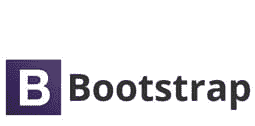](https://res.cloudinary.com/practicaldev/image/fetch/s--xa3HdoMX--/c_limit%2Cf_auto%2Cfl_progressive%2Cq_auto%2Cw_880/https://i.imgur.com/cJ21eH2.jpg)

*一些备选方案:基金会、布尔玛、物化

Bootstrap 是一个用于开发网站和 web 应用程序的免费开源前端框架。它包含基于 HTML 和 CSS 的设计模板，用于排版、表单、按钮、导航和其他界面组件，以及可选的 JavaScript 扩展。(来源:[维基百科](https://en.wikipedia.org/wiki/Bootstrap_(front-end_framework)))

### 💡快速外卖

对于 web 应用程序的布局、样式和动态化，有许多选择，但是您会发现从框架开始会极大地帮助您取得良好的开端。Bootstrap 就是这样一个框架，但它绝对不是唯一的选择！我建议熟悉这样的一个框架，但是掌握 HTML、CSS 和 JavaScript 基础知识比沉迷于任何一个框架都要重要得多。

### 📖学习领域和理念

*   了解什么是 Bootstrap，以及为什么要使用它
*   [Bootstrap 4 速成班(视频)](https://www.youtube.com/watch?v=hnCmSXCZEpU)
*   在 [freeCodeCamp](https://learn.freecodecamp.org/) 上完成引导部分
*   使用 bootstrap 重构您的站点！

[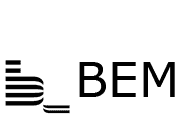](https://res.cloudinary.com/practicaldev/image/fetch/s--yu9wcqiD--/c_limit%2Cf_auto%2Cfl_progressive%2Cq_auto%2Cw_880/https://i.imgur.com/MCvMRQl.jpg)

块、元素、修饰符方法(通常称为 BEM)是 HTML 和 CSS 中类的一种流行命名约定。由 Yandex 的团队开发，其目标是帮助开发人员更好地理解给定项目中 HTML 和 CSS 之间的关系。(来源:[css-tricks.com](https://css-tricks.com/bem-101/))

### 💡快速外卖

了解像 BEM 这样的命名和组织系统的存在以及为什么使用它们是很重要的。在这里做一些研究，但是对于初学者来说，我不建议在这个主题上花太多时间。

### 📖学习领域和理念

*   阅读 [BEM 简介](http://getbem.com/introduction/)
*   [我为什么使用 BEM(视频)](https://www.youtube.com/watch?v=SLjHSVwXYq4)
*   使用 BEM 惯例创建一个简单的网页。

[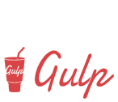](https://res.cloudinary.com/practicaldev/image/fetch/s--Lq086Smr--/c_limit%2Cf_auto%2Cfl_progressive%2Cq_auto%2Cw_880/https://i.imgur.com/KQrByqq.jpg)

Gulp 是一个工具包，用于自动化开发工作流中痛苦或耗时的任务，因此您可以停止浪费时间并构建一些东西。(来源:[gulpjs.com](https://gulpjs.com/))

### 💡快速外卖

在现代前端开发中，您经常会发现自己需要自动执行诸如捆绑、移动文件和将引用注入 HTML 文件之类的任务。Gulp 是一个可以帮助你做这些事情的工具！

### 📖学习领域和理念

*   用 npm 安装 gulp
*   遵循[初学者指南](https://css-tricks.com/gulp-for-beginners/)中的 CSS 技巧
*   在您的网站中，设置 gulp 以:
    *   为你编译 Sass
    *   将生成的 CSS 文件放在`build`子目录中
    *   将您的网页移到构建目录
    *   将对生成的 CSS 文件的引用注入到您的网页中

[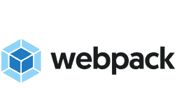](https://res.cloudinary.com/practicaldev/image/fetch/s--9dUsz6_y--/c_limit%2Cf_auto%2Cfl_progressive%2Cq_auto%2Cw_880/https://i.imgur.com/0rx82Kl.jpg)

webpack 的核心是现代 JavaScript 应用程序的静态模块捆绑器。当 webpack 处理您的应用程序时，它会在内部构建一个依赖图，映射您的项目需要的每个模块，并生成一个或多个包。(来源:[webpack.js.org](https://webpack.js.org/concepts/))

### 💡快速外卖

想象一下，你有一个大型的 web 开发项目，有许多不同的开发人员从事许多不同的工作。与其在同一个文件中工作，不如尽可能将它们模块化。Webpack 通过让您的团队模块化工作来帮助实现这一点，然后，到了构建应用程序的时候，Webpack 会把所有的东西粘在一起:HTML、CSS/Sass、JavasScript、images 等等。Webpack 不是唯一的模块捆绑商，但它似乎是目前的领跑者。

### 📖学习领域和理念

*   阅读[网络包概念](https://webpack.js.org/concepts/)
*   什么是 Webpack，它是如何工作的？(视频)
*   [本网络包教程](https://hackernoon.com/a-tale-of-webpack-4-and-how-to-finally-configure-it-in-the-right-way-4e94c8e7e5c1)

[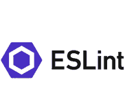](https://res.cloudinary.com/practicaldev/image/fetch/s--EctNoIkM--/c_limit%2Cf_auto%2Cfl_progressive%2Cq_auto%2Cw_880/https://i.imgur.com/CJb6ZnL.jpg)

ESLint 是一个开源的 JavaScript 林挺实用程序，最初由 Nicholas C. Zakas 于 2013 年 6 月创建。代码林挺是一种静态分析，常用于发现有问题的模式或不符合特定风格指南的代码。大多数编程语言都有代码换行符，编译器有时会在编译过程中加入林挺。(来源:[eslint.org](https://eslint.org/docs/about/))

### 💡快速外卖

林挺是提高代码质量、可读性和一致性的绝佳工具。使用 linter 将有助于您在语法和格式错误进入生产之前发现它们。您可以手动运行 linters，或者将它们包含在您的构建/部署过程中。

### 📖学习领域和理念

*   使用 npm 安装 eslint
*   [如何设置 VS 代码+漂亮+ ESLint(视频)](https://www.youtube.com/watch?v=YIvjKId9m2c)
*   Lint 您的 JavaScript

[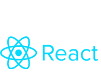](https://res.cloudinary.com/practicaldev/image/fetch/s--IHqmDZix--/c_limit%2Cf_auto%2Cfl_progressive%2Cq_auto%2Cw_880/https://i.imgur.com/uLYz15W.jpg)

*一些替代品:Vue、Angular、Ember

React(也称为 React.js 或 ReactJS)是一个用于构建用户界面的 JavaScript 库。它由脸书和一个由个人开发者和公司组成的社区维护。React 可以用作开发单页面或移动应用程序的基础。复杂的 React 应用程序通常需要使用额外的库来进行状态管理、路由和与 API 的交互。(来源:[维基百科](https://en.wikipedia.org/wiki/React_(JavaScript_library)))

### 💡快速外卖

前端 JavaScript 框架处于现代前端开发的前沿。这里重要的一点是，尽管 React 非常受欢迎，但它只是一个用于构建用户界面的库，而像 Vue 和 Angular 这样的框架旨在实现更全面的功能。例如，如果您用 in React 构建一个需要路由到不同视图的应用程序，您将需要引入类似于`react-router`的东西。

### 📖学习领域和理念

*   参加 [React 教程](https://reactjs.org/tutorial/tutorial.html)
*   [学习用 Mosh 反应](https://www.youtube.com/watch?v=Ke90Tje7VS0)
*   将你的网站重构为一个 React 应用！
*   注意:`create-react-app`是一个支持新 React 项目的便利工具。

Redux 是 JavaScript 应用程序的可预测状态容器。它帮助您编写行为一致、在不同环境(客户机、服务器和本机)中运行、易于测试的应用程序。最重要的是，它提供了出色的开发人员体验，例如结合了时间旅行调试器的实时代码编辑。(来源:[redux.js.org](https://redux.js.org/introduction/getting-started))

### 💡快速外卖

随着您构建越来越大的前端应用程序，您开始意识到维护应用程序状态很难:比如用户是否登录，用户是谁，以及应用程序中正在发生的事情。Redux 是一个很棒的库，它帮助您维护应用程序逻辑所基于的单一状态源。

### 📖学习领域和理念

*   本 [Redux 视频教程](https://www.youtube.com/watch?v=93p3LxR9xfM)
*   这个 [Redux 视频系列](https://egghead.io/courses/getting-started-with-redux)由 Redux 的创作者丹·阿布拉莫夫制作
*   注意[还原三个原则](https://redux.js.org/introduction/three-principles)
    *   真理的单一来源
    *   状态为只读
    *   变化是由纯函数产生的
*   添加 Redux 状态管理到您的应用程序！

[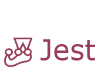](https://res.cloudinary.com/practicaldev/image/fetch/s--J2u3jcEu--/c_limit%2Cf_auto%2Cfl_progressive%2Cq_auto%2Cw_880/https://i.imgur.com/Cr39axw.jpg)

Jest 是一个令人愉快的 JavaScript 测试框架，专注于简单性。它与项目一起使用:Babel，TypeScript，Node，React，Angular，Vue 等等！(来源:[jet js . io](https://jestjs.io))

### 💡快速外卖

为你的前端项目设置自动化测试是非常重要的。设置自动化测试将允许您满怀信心地进行未来的更改——如果您进行了更改并且您的测试仍然通过，您将会相当放心，您没有破坏任何现有的功能。测试框架太多，无法一一列举；开玩笑只是我的爱好之一。

### 📖学习领域和理念

*   学习[笑话基础知识](https://jestjs.io/docs/en/getting-started)
*   如果你使用了`create-react-app`， [Jest 已经配置了](https://facebook.github.io/create-react-app/docs/running-tests)。
*   向您的应用程序添加测试！

*备选方案:流动

TypeScript 是一种由微软开发和维护的开源编程语言。它是 JavaScript 的一个严格的语法超集，并为该语言添加了可选的静态类型。TypeScript 是为开发大型应用程序和转换为 JavaScript 而设计的。由于 TypeScript 是 JavaScript 的超集，现有的 JavaScript 程序也是有效的 TypeScript 程序。TypeScript 可用于开发客户端和服务器端(Node.js)执行的 JavaScript 应用程序。(来源:[维基百科](https://en.wikipedia.org/wiki/TypeScript))

### 💡快速外卖

JavaScript 是动态类型的。然而，人们普遍认为静态类型(即提前指定变量类型、类、接口)既更清晰又减少了缺陷/bug 的可能性。不管你对这个话题的感觉如何，重要的是至少要对静态类型的 JavaScript 版本有所了解，比如 TypeScript。请注意，TypeScript 向下编译为 JavaScript，因此它可以被浏览器解释(即，浏览器本身不解释 TypeScript)。

### 📖学习领域和理念

*   [5 分钟学会打字稿](https://medium.freecodecamp.org/learn-typescript-in-5-minutes-13eda868daeb)
*   [50 分钟学会打字(视频)](https://www.youtube.com/watch?v=WBPrJSw7yQA)
*   可选地[用类型脚本](https://levelup.gitconnected.com/typescript-and-react-using-create-react-app-a-step-by-step-guide-to-setting-up-your-first-app-6deda70843a4)创建一个 React 应用

js 是一个用于服务器渲染的 React 应用程序的极简框架。(来源: [Next.js — React 服务器端渲染完成正确](https://hackernoon.com/next-js-react-server-side-rendering-done-right-f9700078a3b6))

### 💡快速外卖

现在我们越来越先进了！到目前为止，您已经构建了一个 React(或 Vue 或 Angular)应用程序，它在浏览器中做了相当多的工作。出于各种原因(例如，SEO、对客户端性能的关注)，您可能实际上希望您的前端应用程序呈现在服务器上而不是客户端上。这就是像 next.js 这样的框架的用武之地。

### 📖学习领域和理念

*   Next.js [入门](https://nextjs.org/learn/)
*   [Next.js 速成班(视频)](https://www.youtube.com/watch?v=IkOVe40Sy0U)
*   创建 Next.js 应用程序或将现有应用程序迁移到 Next.js

# 但是 X 呢？

该列表旨在让您广泛接触前端生态系统，但不可能触及每个主题，更不用说每个领域中的无数工具了！如果你认为我错过了一些非常重要的东西，请查看[贡献](https://github.com/nas5w/100-days-of-code-frontend/blob/master/README.md#contributing)部分，看看你如何能帮助使这个指南更好。

# 项目创意

随着你学习#100DaysOfCode，你会想要一个或多个项目来应用你的新知识。在这一节中，我试图提供一些您可以使用的项目想法。或者，我们鼓励你提出自己的项目想法，因为这些想法可能会让你更感兴趣、更有动力。

*   初学者的想法:
    *   建立一个作品集网站
*   中级/高级想法:
    *   构建一个推文分析应用程序(如果你已经知道后端和 API 集成的话)

# 需要帮助？

总的来说，我发现以下资源对学习软件开发非常有价值:

*   谷歌搜索这个问题
*   (你的问题很有可能已经被问过了，并且在谷歌搜索时会得到一个排名靠前的结果)。
*   [Mozilla MDN 网络文档](https://developer.mozilla.org/en-US/)
*   [freeCodeCamp](https://www.freecodecamp.org/)
*   本地软件开发聚会！大多数对所有经验水平都非常友好。

如果你想听我的意见，请随时通过 Twitter 与我联系，我会尽力提供帮助。如果你认为课程有问题或者有建议，请看下面的[投稿部分](https://github.com/nas5w/100-days-of-code-frontend/blob/master/README.md#contributing)。

# 投稿

## 广而告之

如果您欣赏这里所做的工作，您可以通过传播关于这个存储库的信息做出重大贡献，包括:

*   主演和运作这个资料库
*   在社交媒体上分享这个知识库

## 贡献给这个知识库

这是一项正在进行的工作，我非常感谢任何帮助维护这个知识库！

在向此存储库投稿时，请先讨论您希望通过问题进行的更改，然后再进行更改。否则，将很难理解你的提议，并可能导致你为一个不会被合并的变更投入大量的工作。

请注意，参与这个项目的每个人都在努力学习或试图帮助-请友好！

## 拉式请求流程

1.  创建一个概述建议的拉动式请求的问题。
2.  获得项目所有者的批准，以进行提议的变更。
3.  创建拉取请求。