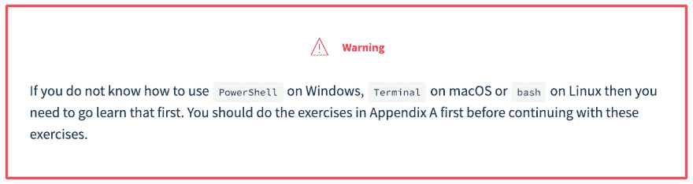
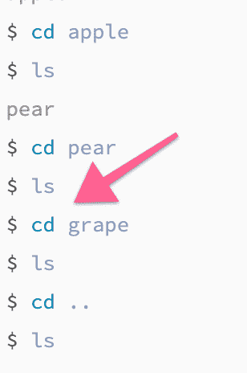
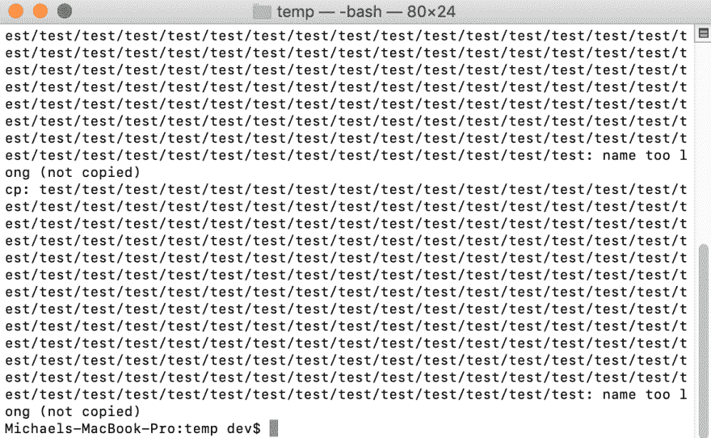
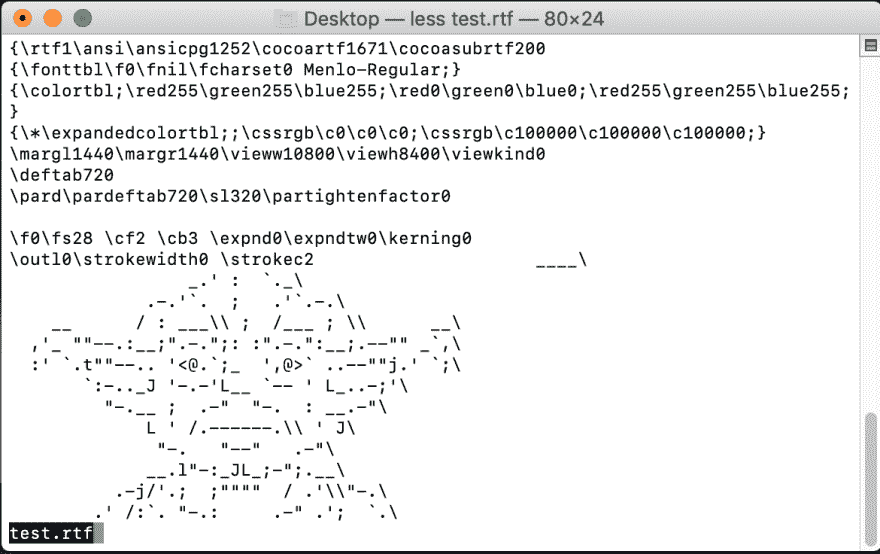
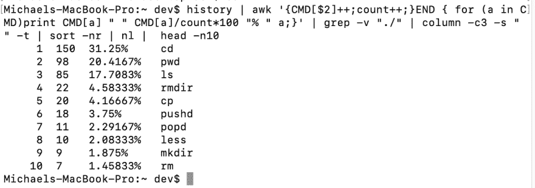

# 几乎没有能力的 shell 用户

> 原文：<https://dev.to/michaeltharrington/a-barely-capable-shell-user-3ki8>

两周多以前，我开始了我的编码之旅:

 [## 婴儿学步...

### 迈克尔·塔林顿(他/他)1 月 3 日 192 分钟阅读

#beginners #python #raspberrypi](/michaeltharrington/baby-steps-44fd)

但是，不可否认的是，这些进入 Python 的小步骤还没有实现。我想我爬得比走得多。

但是，嘿，爬行至少暗示了我正在做*某事*，而且我正在做！

我开始阅读 [Learn Python the Hard Way](https://learnpythonthehardway.org/python3/intro.html) ，这是我选择的第一个真正的编码资源，在作者的推荐下:

...我花了几周时间通过这本书的[附录 A:命令行速成班](https://learnpythonthehardway.org/python3/appendixa.html)来熟悉终端。

你猜怎么着？

🥁🥁🥁...

我现在可以正式地说我是一个“勉强合格的 shell 用户”

🎉🎉🎉

## 我是怎么来的

为了避免埋头苦干，我听了作者的话，写下了一叠带有命令及其相应定义的便笺。虽然当时我并不理解每一个定义，但我还是对它们进行了自我测验，直到我能说出它们的名称。

 

<figure>

<figcaption>终端术语...xargs 在那边翻了过来！😛

<figcaption></figcaption>

</figcaption>

</figure>

在我记下笔记卡后，我尽可能密切地关注每一课，输入每个单独的命令，仔细检查我的输入和输出，并试图找出系统的古怪之处。我密切关注这些课程，并在继续学习新内容之前，尽最大努力掌握每个命令的作用。

实际上，我敢打赌，在[练习 6:列出目录(ls)](https://learnpythonthehardway.org/python3/appendix-a-cli/ex6.html) 中，会有一个小的输入错误，导致输出丢失:

...我相信“葡萄”这个词应该列在那里。🍇

哈哈，我不想成为那些人的一员。😛但是，我学到的一点是细节决定成败。😈

命令输入错误意味着它不起作用...或者更糟，它做了一些你不想让它做的事。不知道一个命令意味着你必须去查找它，这会减慢你的速度。花时间“艰难地”学习东西(即集中注意力和记忆)真的会让*得到回报。*

说了这么多，我并不是想把终端说得这么隐晦。事实上，那是另一回事...现在我已经输入了一些命令，终端看起来不再那么可怕或困难了。

## 我认为终端是怎么一回事

终端提供了一种基于文本的方式来控制电脑上的东西，您通常可以通过 UI 来控制这些东西。

例如，我可以创建文件夹`mkdir`，在它们之间切换`cd`，查看它们里面的内容`ls`，查看它们里面的文件`less`，等等。我做过一些相对来说更高级的事情——*——`pushd`&`popd`——但是我还没有创造出任何真正的逻辑，只是找到了在文件夹中进进出出跳舞的方法，而不用把我的手从键盘上抬起来。诚然，我还不是很优雅——我输入的`pwd` & `ls`比你能想象的还要多——但是，嘿，我正在学习。*

 *也许随着时间的推移，终端将变得对我更重要，但这是我目前看到的全部。

## 我在候机厅做过的几件趣事

我偶然发现的第一个有趣的逻辑发现是，当我使用命令`copy -r test test`将一个名为“test”的文件夹复制到它自身中时。事情是这样的:

所以基本上，文件夹在内部无限复制。最棒的是，这是我希望发生的事情。😎我得去看看！

虽然这对我来说没有任何用处，但它很有趣。

我喜欢玩的另一个东西是`less`。当我意识到我可以在终端中预览一个文本文件时，我就去找一些 ASCII 图片。瞧！

是的，确实有点紧张...

在一个开发伙伴的建议下，我做的另一件很酷的事情是计算我最常用的命令。

 [ Valentin Baca ](/val_baca) • [<time datetime="2019-01-11T19:34:13Z" class="date-short-year"> Jan 11 '19 </time>](https://dev.to/val_baca/comment/84c9) 

祝你好运！

我认为这篇文章会很有帮助，因为它给出了其他开发者使用最多的命令:

[dev.to/abhinav/which-is-the-most-u...](https://dev.to/abhinav/which-is-the-most-used-command-in-your-shell-history-5ca1)

好建议，瓦伦汀！这绝对是一个很棒的帖子，可以看看真正的开发者最常用的命令是什么。另外，计算我自己最常用的命令所需的命令就在帖子里。

那么，我最常抨击的命令是什么呢？

如我所说，我现在非常依赖`ls` & `pwd`。也许将来我会少一点偏执于我在航站楼的位置，但现在我会让那两个离我很近，哈哈。

这最后一个命令还告诉我，您可以在终端中键入公式...有意思。

## 稳扎稳打

在这里，我一直以相对缓慢的速度前进，但是我认为我做出了正确的决定，先停下来学习一点 bash。毕竟，我听说稳扎稳打会有回报。🐢🐢

现在我已经掌握了一些终端术语，我相信是时候进行一些实际的编码了。蟒蛇，我们来了！🐍🐍*