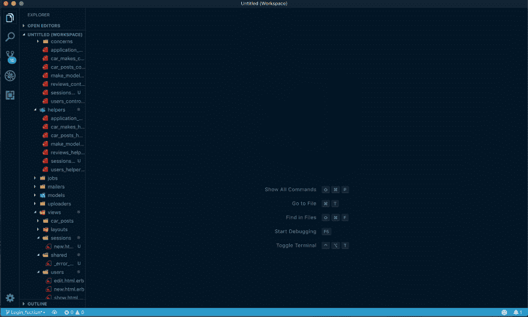
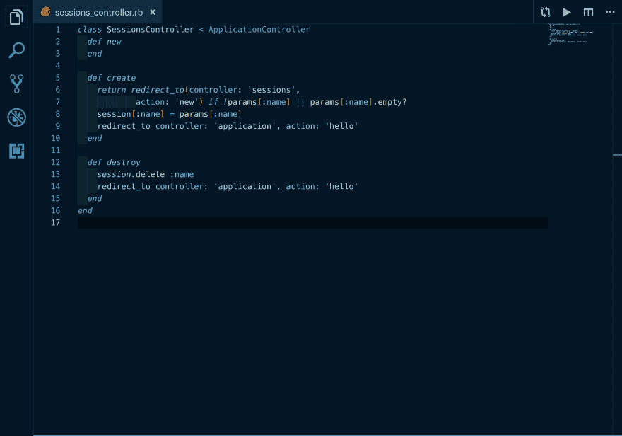
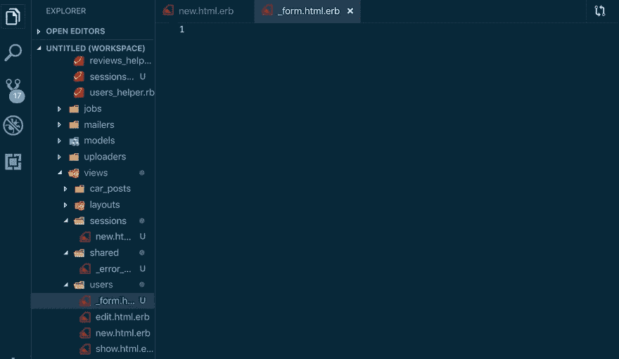
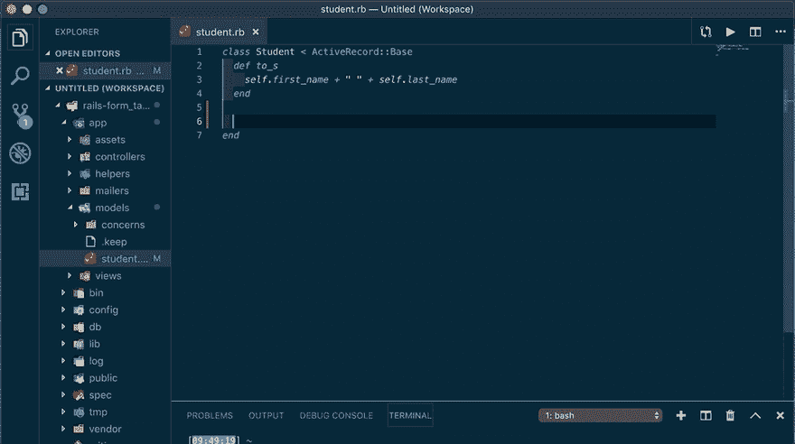

# VSCode 扩展带来更好的编程体验

> 原文：<https://dev.to/vadims4/a-better-programming-experience-with-vscode-extensions-kel>

作为软件工程师，我们的很多时间都花在盯着电脑屏幕看了无数个小时。不停地在文本编辑器中输入代码。大多数文本编辑器都配备了“标准”特性，可以提供良好的用户体验。但是一些文本编辑器，如 VSCode，允许您下载各种扩展，以提供更有用和更愉快的编程体验。

作为 Flatiron school 的一名学生，我最近与一名教师和几名学生讨论了 VSCode 和不同类型的扩展以及它们的作用，因此我被迫发表了一篇评论性的帖子，以帮助任何其他希望为 VSCode 添加一些扩展的学生，进一步丰富他们的编程体验。

我已经编译了一个各种 VSCode 扩展的列表，我用它来使我的编码体验更加容易和愉快。

# vs code-Icons-vs code Icons 团队

这个扩展有助于组织。有小图标也使它在视觉上更有吸引力。如果您为您的代码打开一个新文件夹，小图标将根据您拥有的文件类型填充。例如，红宝石。rb 文件会有一个小的红宝石宝石图标。另一个例子是，如果你有一个包含代码的文件夹，图标是一个很小的文件夹。虽然这种扩展不是必须的，但它可以使你的工作场所更具视觉吸引力，并有助于组织和了解所有东西的位置。

# 括号对彩色化器- CoenraadS

括号对着色是我最喜欢的扩展之一！如果你想让你的代码易于读/写，这是一个必不可少的扩展。在我安装括号对着色程序之前，我的很多代码都是用相同的颜色编写的，看起来都一样。更难找到括号结束的位置，以及哪个代码属于哪个位置。安装后，我发现我的代码更容易阅读。所有的括号都有自己的颜色，字体也会改变颜色。这种颜色上的对比有助于识别括号内应该是什么代码。这也有助于代码从视觉角度看起来更好。

# 简单的红宝石 ERB -维克多·奥提兹埃雷迪亚

使用 ruby 和 MVC 结构，很多时间都花在了视图上。观点是。呈现为 HTML 文件的 erb 文件。当在 ruby web 应用程序内部创建视图时，这个扩展对于自动完成标签以及提供其他有用的工具非常有用。

# 红宝石-吕鹏

如果你使用的是 Ruby 语言，这个扩展是必须的。它包含非常有用的功能，如调试器、linters、自动完成功能，以及许多其他有用的工具。ruby 扩展为每个 Ruby 用户提供了他们需要的几乎所有有用的特性。要安装一些功能，您需要将 gems 下载到您的工作区。此后，分机将完全为您服务。

使用 VSCode 扩展，您可以丰富您的编码体验。作为程序员，我们在代码上花了很多时间。所以，为什么不找点乐子，让它看起来很酷，给你的编码体验带来一些便利呢？正因如此，VSCode 扩展应运而生！