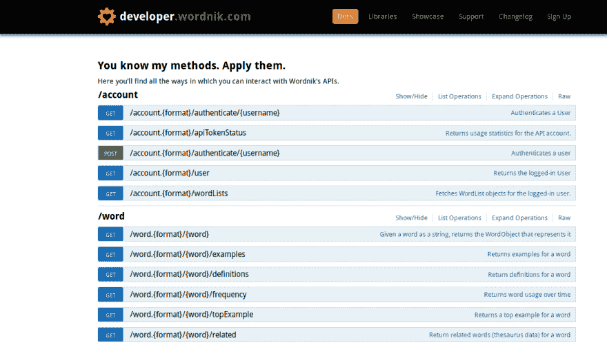

# OpenAPI 规范的简史

> 原文：<https://dev.to/mikeralphson/a-brief-history-of-the-openapi-specification-3g27>

2009 年，Wordnik(在线词典服务)的 Tony Tam 开始着手制定 Swagger 规范。Swagger 用于描述 Wordnik 的 JSON API，用于驱动 Wordnik 的开发人员控制台/文档(在[https://developer.wordnik.com/docs](https://developer.wordnik.com/docs)仍然可以看到)、他们的服务器集成和公司内部的代码生成。

最初被称为 SWAGR -“为什么是 WADL，当你可以 SWAGR？”Wordnik 的同事 Zeke Sikelianos 在与 Tam 讨论该项目的潜在名称时表示(尽管如果 SWAGR 曾经代表过什么，它似乎已经消失在时间的迷雾中)——Tam 在 2011 年 8 月发布了 Swagger 规范的第一个版本(1.0)，就在 Mashery 宣布 I/O Docs 的一个月后，尽管内部已经使用了至少 0.1a 版本。

在 Reverb Technologies 工作期间，Tam 于 2012 年 8 月发布了 Swagger 规范的 1.1 版本。这只是规范的一个小的改进。

Swagger 规范的 1.2 版本是 2014 年 3 月作为正式规范文档编写的第一个版本，将规范本身与 Swagger 实现分开。对类型系统进行了改进，使其更符合 JSON Schema Draft 4。这是第一个被 API 行业广泛采用的版本，今天仍被一些 API 提供商使用。

2014 年 9 月，Swagger 规范 2.0 发布。这见证了从 Swagger 1.2 和更早版本的双文件格式到单个文档结构的重组，但是仍然可以使用 JSON-Reference 标准引用子文档。对类型系统/ JSON 模式支持进行了进一步的改进，对`contact`和`license`对象提供了更全面的 API 元数据支持，允许在描述中使用降价，支持供应商扩展(现在称为规范扩展)和响应头，以及其他更小的变化。Swagger 2.0 在整个行业得到了更多的发展和采用，支持商业解决方案和开源产品的数量也大幅增加。

2015 年 3 月，领先的 API 测试和开发工具公司 SmartBear Software 从 Reverb Technologies 收购了 Swagger 知识产权和开源项目的权益。

2015 年 9 月，Tam 加入 SmartBear Software，担任产品副总裁 Swagger。

2015 年 12 月，SmartBear Software 将 Swagger 规范捐赠给了一个新的开放治理组织，该组织是在 Linux 基金会的支持下成立的:open API Initiative([https://openapis.org](https://openapis.org))。

OpenAPI 规范的 2.0 版本(现在的名称)与 Swagger 2.0 规范完全相同。尽管在 Swagger 和 OpenAPI 这两个术语的使用上存在一些混淆，但这是向新的治理机构和规范的新名称过渡的积极的第一步。

十家公司是 OpenAPI 倡议的创始成员(3Scale、Apigee、CapitalOne、Google、IBM、Intuit、Microsoft、PayPal、Restlet 和 SmartBear ),成员组织的数量现在超过 30 个。

OpenAPI 规范现在由一个技术指导委员会(TSC)管理，自 Tony Tam 在 2017 年离职以来，该委员会一直由 SmartBear Software 的长期贡献者 Ron Ratovsky、微软的 Darrel Miller、现在都在谷歌的 Jeremy Whitlock 和 Marsh Gardiner、Mulesoft 的 Uri Sarid 以及本博客的作者组成。TSC 从更广泛的技术开发人员社区中吸取经验，以开放、透明的方式开发规范。OAI 的成员并不授予对规范本身内容的投票权。

2017 年 7 月，OpenAPI 倡议宣布发布 3.0.0 版本的 OpenAPI 规范，其中包含多项结构改进，与 JSON Schema draft 5 更紧密地保持一致，新增了`links`和`callbacks`等功能，对 CommonMark 进行了标准化描述，并进行了许多小的调整和澄清。2018 年发布了两个 3.0 系列的补丁。该规范的 3.1.0 版本正在积极工作，预计将于 2019 年年中发布。

OpenAPI 倡议用以下术语定义了 OpenAPI 规范:

> “OpenAPI 规范(OAS)为 REST APIs 定义了一个标准的、与编程语言无关的接口描述，它允许人类和计算机发现并理解服务的功能，而无需访问源代码、附加文档或检查网络流量。当通过 OpenAPI 正确定义时，消费者可以用最少的实现逻辑理解远程服务并与之交互。与接口描述为低级编程所做的类似，OpenAPI 规范消除了调用服务时的猜测。”

正如 REST 不是新的 SOAP，OpenAPI 也不是新的 WSDL。它的设计优先开发能力、广泛的工具和跨平台支持将它带到了 web 服务梦寐以求的地方。

像任何 API 描述语言一样，OpenAPI 规范不能完全描述每一个可以想到的 API 设计，因此将其改造成现有的代码库可能是一场艰苦的斗争。但是当您熟悉 OAS 并采用或过渡到设计优先的工作流时，您将开始看到规范中出现的模式，这将有助于形成您的设计决策。您不仅将使用该规范而不是违反它，您还将获得与使用 OAS 描述的其他 API 的通用性，这将转化为您的 API 的用户对它的熟悉和清晰理解，这些用户也理解 OAS，并且可能具有使用它描述的许多其他 API 的经验。

OpenAPI 规范拥有丰富的工具生态系统，包括商业工具和开源工具(其中已知有 2000 多个项目，尽管并非所有项目都支持 OpenAPI 3.0)。这包括编辑器、低级解析器和验证器、文档生成器和动态控制台、测试工具和代码生成服务。

感谢 Tony Tam 对本文进行了更正。