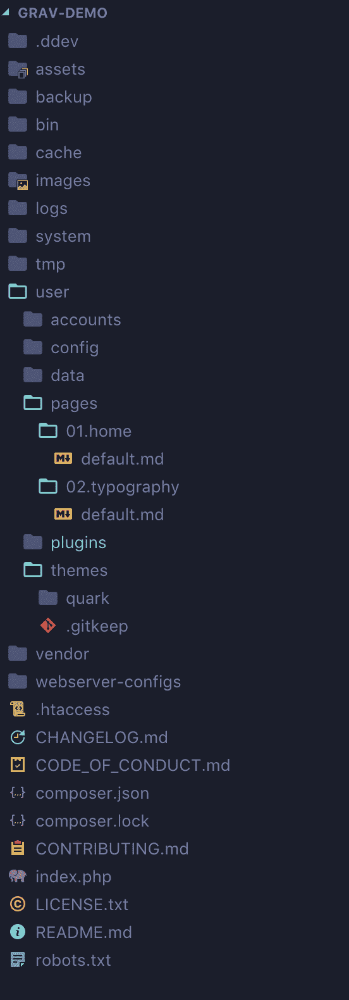
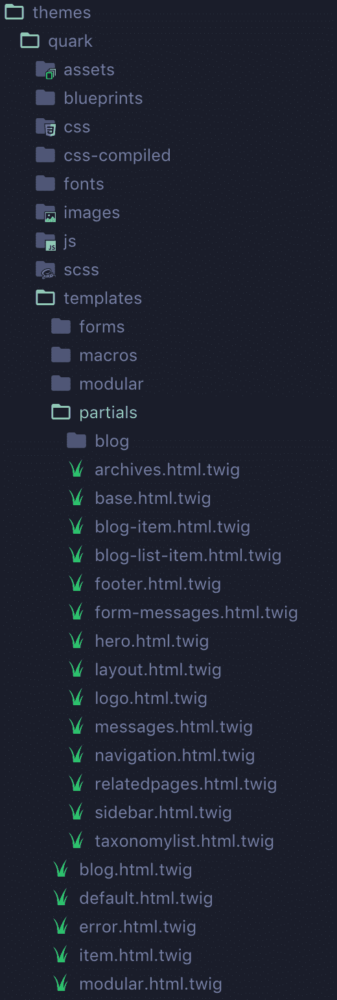
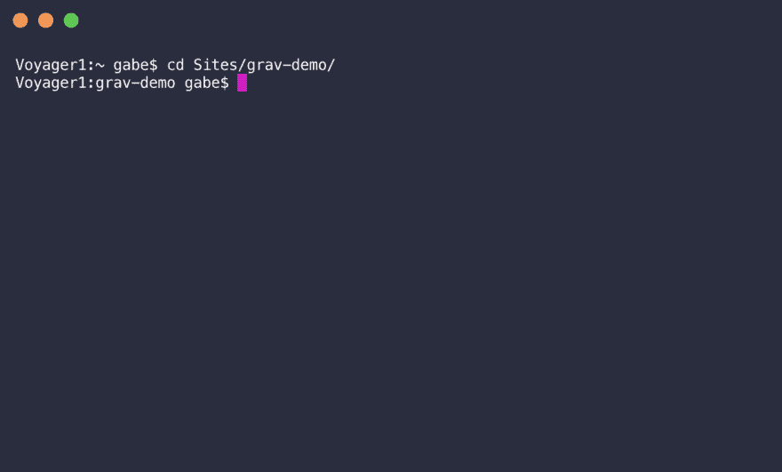
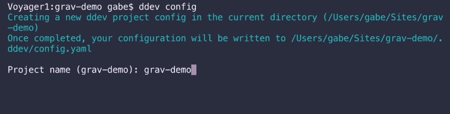
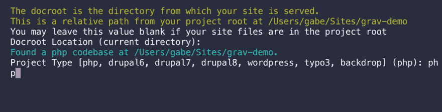
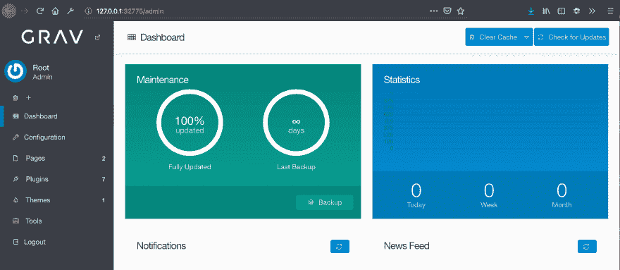
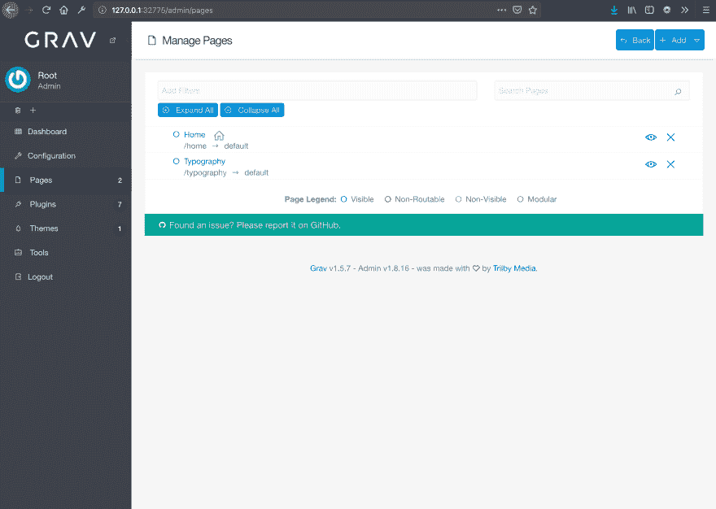
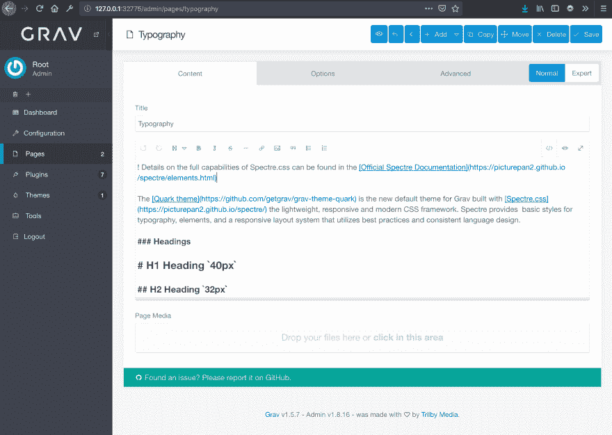
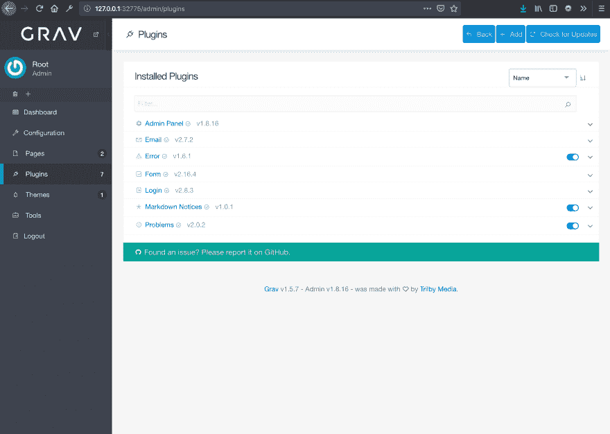
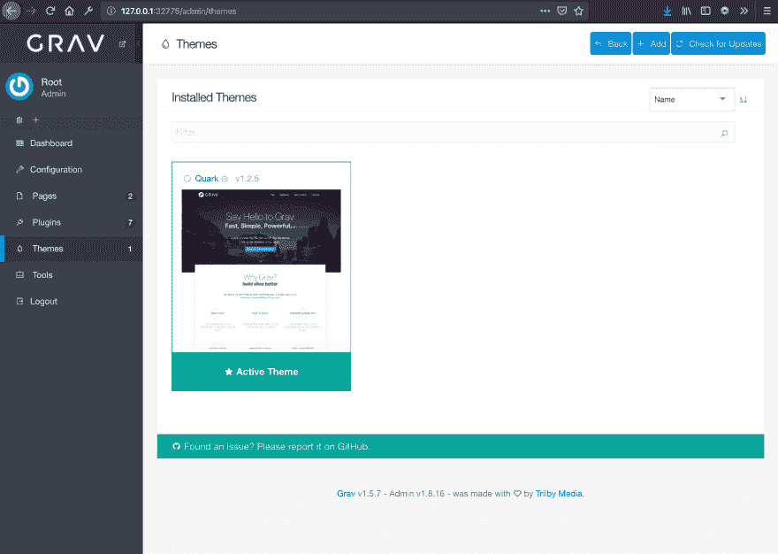

# 微型 CMS 简介

> 原文：<https://dev.to/gabe/a-brief-introduction-to-tiny-cms-4ae1>

我最近用一个叫做 [GRAV](https://getgrav.org/) 的“平面文件”内容管理系统建立了自己的[博客](https://gabemade.com)。如果你不知道什么是平面文件 CMS，它本质上是一个像 WordPress 一样的 CMS，它使用 PHP 来处理逻辑。它的不同之处在于它没有数据库，它使用平面文本文件来存储帖子和其他数据。很整洁。在我安装后的短时间内，我已经安装了五个令人惊奇的小插件，并且使用 CSS 和 TWIG 构建了我自己的自定义主题。和小型 CMS 一起工作是一次有趣的经历，我特别喜欢拥有一个大约 30mb 大小的完整博客。它快得令人难以置信。所以在这篇文章中，我将简单介绍一下 CMS。

我们将前往 [Grav 的下载页面](https://getgrav.org/downloads)并获取“Grav 核心+管理插件”捆绑包。一旦你下载并解压了 zip 文件，你会在 20mb 的文件夹中找到整个 CMS 和管理插件。

## 盒子里是什么？

我在下面附上了一个几乎默认的文件夹结构的截图，唯一的修改是添加了。ddev 文件夹。

### 页面

几乎所有你需要的东西都在用户文件夹下。这是这个 CMS 真正的优点。GRAV 并不像传统的 CMS(如 WordPress 或 Drupal)那样将文章存储在数据库中，而是直接存储在用户/页面目录中。然后，这些页面被组织到包含它们各自的降价文件的文件夹中。

### 主题

主题可以，或许也应该有自己的帖子。当谈到主题时，有太多的东西要看，而且都很酷。在这篇文章中，我将保持简短。GRAV 中的主题是使用 PHP 模板引擎 TWIG 制作的。对于我自己的定制主题，我下载了一个[空白的开始主题](https://github.com/steroyle/grav-blank-theme)，并从两个模板文件开始，一个是用于我的博客文章的“blog.html.twig ”,另一个是用于任何非博客页面的“default.html.twig”。在这些 TWIG 文件中，有 PHP 代码拉进我的模板部分，比如我的页脚、页眉等等。从我的档案夹里把它们拼凑起来。我附上了默认主题 Quark 的文件夹结构的截图，以给出更清晰的图像。

## 设置本地

为了建立并开始在当地发展，我们必须先做一些准备工作。我们需要安装[码头](https://docs.docker.com/docker-for-mac/install/)和 [DDEV](https://ddev.readthedocs.io/en/stable/) 。Docker 是一个简单的安装程序，创建一个帐户，下载 DMG，将 Docker.app 放入你的应用程序文件夹。对于 DDEV，我选择通过 [BREW](https://brew.sh/) 安装。假设您已经安装了 BREW，我们必须首先使用

`brew tap drud/ddev`

添加 ddev 库。一旦添加了 ddev 库，我们就可以运行以下代码将 ddev 安装到我们的机器上。

`brew install ddev`

此时，我们应该已经安装了 DDEV 和 Docker，所以现在我们可以开始了。让我们将 Grav 文件夹从下载移到一个更安全的位置。我把我的移动到我的主目录的“站点”文件夹中。打开终端，让 CD 进入我们的站点文件夹。

一旦到了那里，我们要运行

`ddev config`

然后系统会提示我们输入项目的名称。在这个例子中，我选择了 grav-demo。

出现另一个提示，询问我们 DocRoot 的位置，留空。最后，最后一个提示会要求我们输入项目类型，在我们的例子中是 PHP。

而现在我们运行

`ddev start`

这可能需要一点时间，因为它正在构建我们的容器。一旦完成，它应该吐出一个很好的链接，我们可以查看我们的本地安装。

### 管理面板

您将看到的第一个屏幕是管理用户创建屏幕，因为我们默认安装了管理插件，但没有管理帐户。创建一个，它会让你直接进入管理面板。

这里我们有一个我们网站的备份和更新状态的简要概述，以及访问者数量。在侧边栏，我们可以看到快速链接到我们的网站配置，页面，插件，主题等。

### 页面

如果我们进入页面，我们可以看到 GRAV、HOME 和排版附带的默认页面。在这一部分，我们可以添加文件夹和页面到我们的网站，并按照我们喜欢的方式组织它们。

如果我们点击一个页面，我们将能够通过所见即所得来编辑它。默认情况下，它看起来如下，但是如果你愿意，你可以安装其他更高级的编辑器。

### 插件

直接向前，安装的插件将显示在这里。你甚至可以通过+add 按钮搜索新的插件来安装，这非常方便。

### 主题

您创建或安装的主题将显示在此部分，并且可以在此处激活/停用。

## 最后的想法

现在，在一个简短的 5 分钟的阅读中，这就是对微型 GRAV CMS 的介绍。一个小平面文件 CMS，真的可以做很多！对我来说，尝试 GRAV 让我对其他小型内容管理系统产生了兴趣，比如 [WonderCMS](https://www.wondercms.com/) 和 [OctoberCMS](https://octobercms.com/) 。到目前为止，我一直在玩 WonderCMS，但我很好奇十月是否会尝试它的 Laravel 框架。现在，我将坚持在我当前的 GRAV 安装上工作，并尝试主题化。