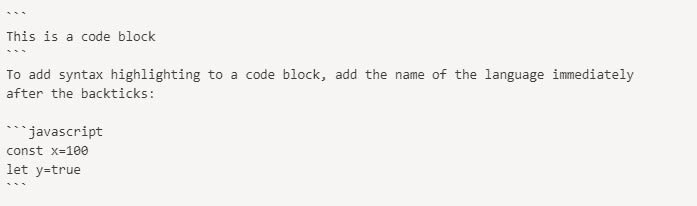

# 降价综合指南

> 原文：<https://dev.to/madhavgupta/a-comprehensive-guide-on-markdown-3o2n>

大家好。希望你做得很好。我是马达夫·古普塔，这篇文章将致力于 markdown。在这篇文章结束时，我真的希望你对 markdown 有足够的了解，可以在日常生活中使用它。

让我们从一堆问题开始，

什么是降价销售？
A- Markdown 是一种轻量级的标记语言，具有纯文本格式语法。简单来说，markdown 是一种在 web 上设计文本样式的方法，它的语法比 HTML 简单。

问:为什么要学它？
答——学习 Markdown 可以有很多理由，我将列举其中一些

*   易学易读
*   在 Github 文档中使用
*   可以很容易地转换成其他格式
*   *学完之后，你可能会开始在 dev.to 上写文章*

问题问够了，我们上船吧。

*   **标题**

从 H1 到 H6 有六种标题。您可以通过两种方式使用标题。
首先-使用#后跟文本
其次-在文本下方插入 3 ===(适用于 H1)或-(适用于 H2)。走这条路的缺点是你只能使用 H1 和 H2。因此，我建议坚持前一种方式。

**例题** -

```
# H1
## H2
### H3
#### H4
##### H5
###### H6 
```

(为了可读性，给出了空格)

# H1

## H2

### H3

#### H4

##### H5

###### H6

```
H1
=== 
```

# H1

```
H2
--- 
```

## H2

*   **文本格式**

在 markdown 中格式化文本非常容易。你可以通过将文本变成*斜体*、**粗体**或~~醒目~~来改变文本的感觉和外观。

**例题** -

```
_italic_ or *italic* 
```

*斜体*T2】

```
__bold__ or **bold** 
```

**加粗**

```
~~strikethrough~~ 
```

~~删除线~~

因为文本有两种斜体和粗体的方式。所以为了避免混淆，我会推荐使用`*italic*`和`**Bold**`。这将有助于您在设计文本样式时减少可能面临的歧义和混乱。

*   **列表**

你总是为了这样或那样的目的而列清单。你可以根据需要在 markdown 中使用无序列表和有序列表

无序列表
下面是 markdown 中无序列表的语法。你可以用*或-
代替+

```
+ First item in the unordered list
+ Another item in the unordered list
+ one more item 
```

上面的代码被转换成这个。

*   无序列表中的第一项
*   无序列表中的另一个项目
*   再一次

**下令列出**

```
1\. The first item in the ordered list
2\. The second item in the ordered list
3\. The third item in the ordered list 
```

除了上面的语法，你还可以使用

```
1\. The first item in the ordered list
1\. The second item in the ordered list
1\. The third item in the ordered list 
```

这两个示例都将产生以下列表

1.  有序列表中的第一项
2.  有序列表中的第二项
3.  有序列表中的第三项

*   **链接**

通过使用以下语法，可以在 markdown 中使用链接。

```
[Text](the link you want to relate with text) 
```

**举例** -

```
[Link to my first article](https://dev.to/madhavgupta/visual-studio-code-and-its-magic-1a2m) 
```

[](https://res.cloudinary.com/practicaldev/image/fetch/s--6DSUbuHx--/c_limit%2Cf_auto%2Cfl_progressive%2Cq_auto%2Cw_880/https://thepracticaldev.s3.amazonaws.com/i/ovt5mg83z5bg0ow06si8.PNG)

[链接到我的第一篇文章](https://dev.to/madhavgupta/visual-studio-code-and-its-magic-1a2m)

这两种方法都可以用来引用外部链接，但是为了增强可读性，我将推荐后者。不用`[1]`，你可以用【喵】或者【blah】之类的任何东西，都可以。
如果没有文本，那么你可以使用`<link>`高亮显示链接。

*   **图像**

可以使用以下语法将图像嵌入到 markdown 文档中。不仅仅是图像，你也可以通过使用相同的语法来使用 gif。

```
 
```

**举例** -

```
 
```

[](https://res.cloudinary.com/practicaldev/image/fetch/s--I3Ym0vg4--/c_limit%2Cf_auto%2Cfl_progressive%2Cq_auto%2Cw_880/https://images.unsplash.com/photo-1515524738708-327f6b0037a7%3Fixlib%3Drb-1.2.1%26ixid%3DeyJhcHBfaWQiOjEyMDd9%26auto%3Dformat%26fit%3Dcrop%26w%3D1050%26q%3D80)

*   **水平标尺**

取决于您的解析器如何制定水平规则，在您的文章/文档中包含一些水平规则总是很好的。

**举例** -

```
--- or *** or ___ 
```

* * *

*   **代码块**

给你的文章添加代码块，用三个
反勾把你的代码括起来，如果你想突出语法，那么在反勾后面写上语言的名字。

[](https://res.cloudinary.com/practicaldev/image/fetch/s--M6eIzmjs--/c_limit%2Cf_auto%2Cfl_progressive%2Cq_auto%2Cw_880/https://thepracticaldev.s3.amazonaws.com/i/d1rltcn17x7vfwx03gzu.jpg)

*   批量报价

特别强调引语，让它们突出。

```
> Quote 
```

**举例** -

```
> “Websites promote you 24/7: No employee will do that.” 
― Paul Cookson 
```

> "网站 24/7 都在宣传你:没有员工会这样做."保罗·库克森

*   桌子

以表格的形式显示数据非常方便，而且我必须说，在 markdown 中制作表格并不美观。还有一点， **:** 负责对齐行中的元素。下面给出的例子将使这种说法更加清楚。

```
|Songs|Creators|
|:-----|:-----|
|Without Me|Helsey, Khalid and Benny Blanco|
|Hope|Chainsmokers|
|Never Gonna give you up|_I'll leave it here_| 
```

| 歌曲 | 创造者 |
| --- | --- |
| 没有我 | 海尔赛，哈立德和本尼·布兰科 |
| 希望 | 烟鬼 |
| 永远不会放弃你 | *我会把它留在这里* |

```
|Songs|Creators|
|-----:|:-----|
|Without Me|Helsey, Khalid and Benny Blanco|
|Hope|Chainsmokers|
|Never Gonna give you up|_I'll leave it here_| 
```

| 歌曲 | 创造者 |
| --- | --- |
| 没有我 | 海尔赛，哈立德和本尼·布兰科 |
| 希望 | 烟鬼 |
| 永远不会放弃你 | *我会把它留在这里* |

如果你觉得有必要，你也可以在 markdown 中使用*古老的* HTML 标签(pre，code，img，table)。降价很好，它能确保你的全部注意力都集中在内容上。

如果你全都知道，恭喜你。这篇文章可能会对你有所启发。如果是反过来，希望有帮助。

那么，今天就到此为止。我很快会带着另一个(开放的想法)回来。希望你喜欢。
祝您愉快。谢了。
T3T5】