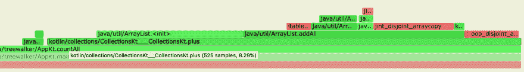

# Kotlin 中的串联迭代器示例

> 原文：<https://dev.to/alediaferia/a-concatenated-iterator-example-in-kotlin-1l23>

有时候你可能需要遍历多个列表。例如，当实现树遍历算法时，就会发生这种情况。多亏了[尾递归](https://kotlinlang.org/docs/reference/functions.html#tail-recursive-functions)和 Kotlin，一个简单的实现如下:

```
tailrec fun countAll(nodes: List<Node>, acc: Int): Int {
    return when {
        nodes.isEmpty() -> acc
        else -> countAll(nodes.first().children + nodes.subList(1, nodes.size), acc + 1)
    }
} 
```

首先在根节点(例如`countAll(listOf(root), 1)`)上调用`countAll`，该函数将迭代累加所有的子节点*，直到所有的子节点都被遍历并计数。*

 *这种方法的问题是，通过将操作数的所有元素复制到一个新的列表中，它花费了大部分时间来产生连接的结果。

[](https://res.cloudinary.com/practicaldev/image/fetch/s--K8mYC9in--/c_limit%2Cf_auto%2Cfl_progressive%2Cq_auto%2Cw_880/https://thepracticaldev.s3.amazonaws.com/i/czu8nouss7tf5x7lvoyu.png)

从火焰图中可以看出，大部分时间都花在了构造`ArrayList`实例和调用`addAll`上。

我们在这里连接列表的原因只是为了能够随着更多条目的添加而不断遍历我们的节点集合。

## 让我们做得更好

为了避免连接列表的开销，我们可以使用另一种方法，即利用可以跨越列表边界的迭代器。

如果我们有一个函数，我们可以将我们的`countAll`函数重写如下:

```
tailrec fun countAll(nodes: Iterator<Node>, acc: Int): Int {
    return when {
        !nodes.hasNext() -> acc
        else -> {
            val node = nodes.next()
            countAll(nodes + node.children.iterator(), acc + 1)
        }
    }
} 
```

## 🏃‍♂️编码时间到了！

在我们的理想实现中，*加*操作符将负责存储子列表的迭代器，而不会抢先复制新列表中的所有项目。

我们来看看迭代器的实现:

```
class ConcatIterator<T>(iterator: Iterator<T>) : Iterator<T> {
    private val store = ArrayDeque<Iterator<T>>()

    init {
        if (iterator.hasNext())
            store.add(iterator)
    }

    override fun hasNext(): Boolean = when {
        store.isEmpty() -> false
        else -> store.first.hasNext()
    }

    override fun next(): T {
        val t = store.first.next()

        if (!store.first.hasNext())
            store.removeFirst()

        return t
    }

    operator fun plus(iterator: Iterator<T>): ConcatIterator<T> {
        if (iterator.hasNext())
            store.add(iterator)
        return this
    }
} 
```

当迭代器得到串联的*时，它们在`store`中排队。在这种情况下，商店使用一个[数组队列](https://docs.oracle.com/javase/8/docs/api/java/util/ArrayDeque.html)，它是一个*队列*的轻量级非并发实现，它在*摊余常数时间*中执行其大部分操作。*

 *## 最后一碰

通过在`Iterator`上实现`plus`操作符，可以使迭代器的使用更加舒适。

```
operator fun <T> Iterator<T>.plus(iterator: Iterator<T>): ConcatIterator<T> =
    when {
        this is ConcatIterator<T> -> this.plus(iterator)
        iterator is ConcatIterator<T> -> iterator.plus(this)
        else -> ConcatIterator(this).plus(iterator)
    } 
```

这个扩展函数通过产生一个`ConcatIterator`，帮助我们轻松地将两个现有的迭代器连接成一个新的迭代器。这个函数的好处在于，如果两个实例中有一个现有的`ConcatIterator`实例，它就重用这个实例。

## 让数字说话

现在我们已经实现了另一个版本的`countAll`函数，让我们看看它是如何执行的。

我已经用一个小 Kotlin 游乐场测试了我的假设，这个小 kot Lin 游乐场是我用树木做的实验。这里可以找到[。](https://github.com/alediaferia/treewalker)

下面的结果来自对一个有 65201277 个节点的树测试这两个实现。

```
Total count (countAll without ConcatIterator): 65201277 nodes (9227 ms)
Total count (countAll with ConcatIterator): 65201277 nodes (1288 ms) 
```

如你所见，`ConcatIterator`版本几乎快了 10 倍。我们不再承担连接列表的开销，所以大部分计算都花在了计数上。

## 结论

我希望你喜欢。让我知道你如何处理这种问题，以及在科特林是否有更好的方法来实现这一点。

干杯！**