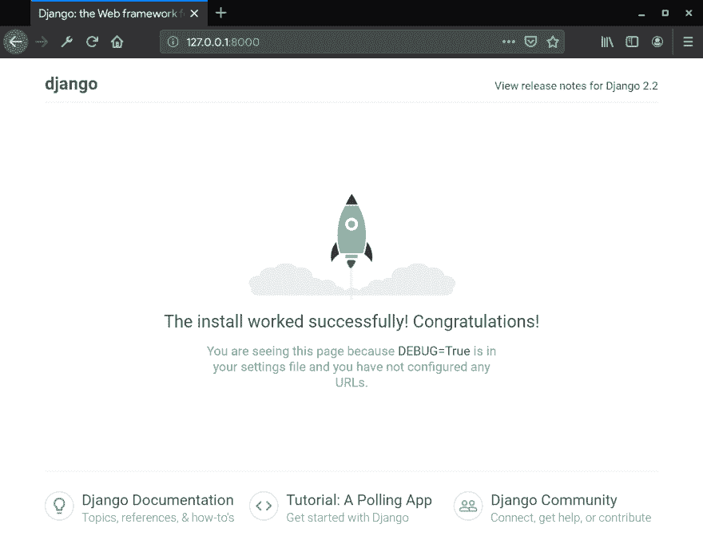
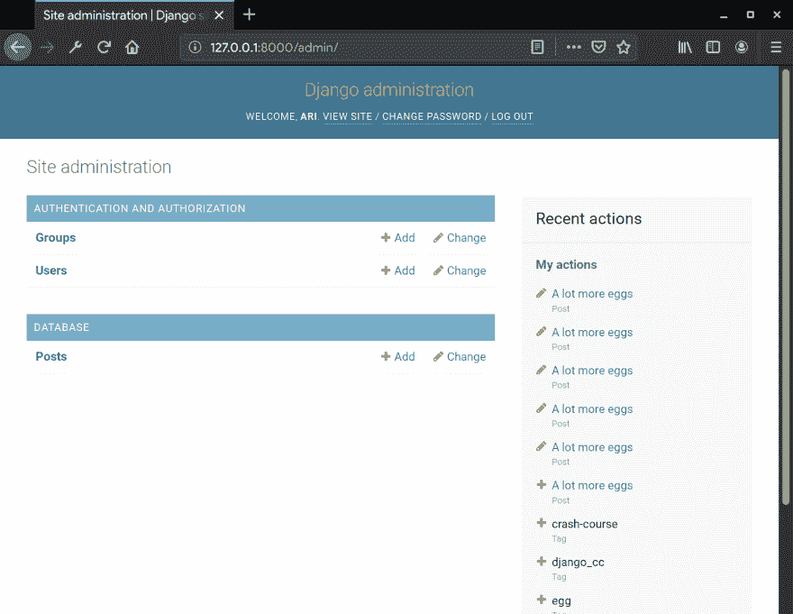
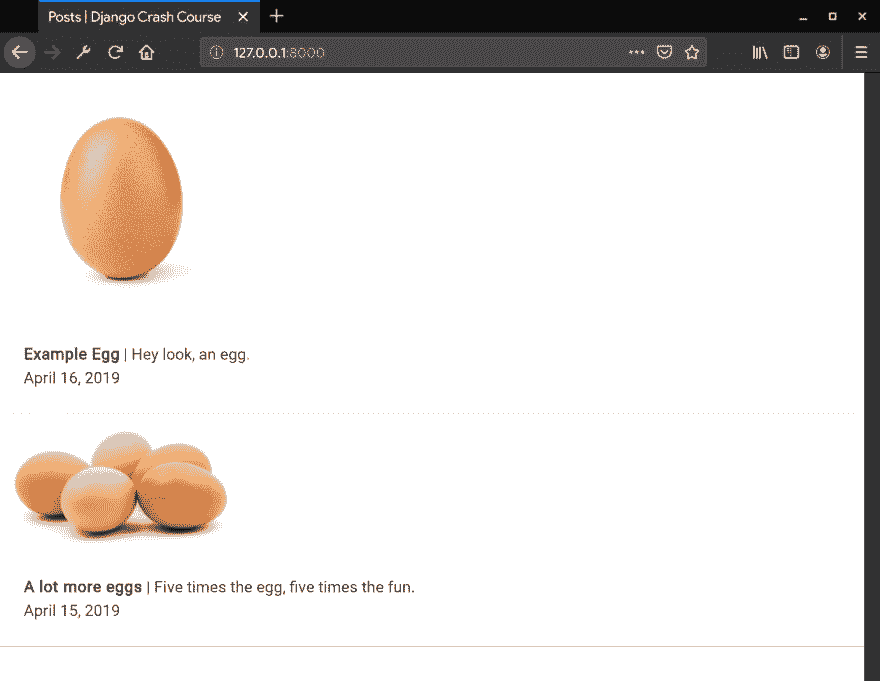

# 姜戈的速成班

> 原文：<https://dev.to/ceiphr/a-crash-course-in-django-knl>

在[ceiphr.com](https://cphr.co/accid)更新版本。

## 简介

这不是一个教程。这个速成班是一个快速入门制作一个基本 Django 网站**的方法，而不需要**深入了解制作复杂 web 应用程序所需的底层概念。对于这个速成课程的每一步，我都会链接一个对你正在使用的工具和概念的更全面的解释，这样你就可以在创建你的第一个项目时更好地理解 Django。

### 先决条件

[基础 Python](https://www.learnpython.org/en/Hello%2C_World%21) 、 [HTML](https://www.w3schools.com/html/) 、 [CSS](https://www.w3schools.com/css/) 和 [Unix 命令行](https://www.learnenough.com/command-line-tutorial/basics)。只要你对这一切感到舒适，你就很棒。

### 我们的目标

我们正在制作一个网站，你可以**上传带有标题、日期和描述的图片**。简单。

### 那么，Django 是什么？

Django*/JANG-哦/*——一种工具( [web 框架](https://en.wikipedia.org/wiki/Web_framework))，最出名的是帮助人们快速制作整洁的网站，而且很少出错。

在 Django 制作东西遵循以下模式:

1.  建模——*如何储存物品。*我们将在这里告诉 Django 如何存储我们的图片、标题、日期和描述。
2.  **查看**——*你的项目想到哪里。*这就是我们的网站如何根据我们的**模型**获取我们存储的内容，并为用户进行处理。
3.  **模板**——*你的项目如何呈现它所思考的东西。***视图**将使用它来显示基于我们的**模型**处理的内容。

Django 做更复杂(也很有趣)的事情，但是如果你是新手，你现在只需要知道这些。[【深入】](https://developer.mozilla.org/en-US/docs/Learn/Server-side/Django/Introduction#What_is_Django)

* * *

## 设置我们的项目

**Windows 用户注意:**默认情况下，Windows 没有 Unix 命令行，这是本速成班的前提条件。Windows 10 的 2018 年 10 月更新提供了 Linux 子系统，如 Ubuntu。请安装并设置一个 Linux 子系统来使用 Unix 命令行。

我们将使用您的计算机终端来设置我们的 python 环境和 Django。让我们在我们计算机的`Documents`文件夹中创建项目，因此输入这些命令:

```
cd ~/Documents
python3 -m venv django_cc 
```

Enter fullscreen mode Exit fullscreen mode

`python3 -m venv django_cc`将在一个名为`django_cc`的文件夹中为我们的项目创建一个虚拟环境，这样我们为它安装的所有东西都不会干扰你系统上的任何东西。[【深入】](https://virtualenv.pypa.io/en/stable/)

接下来，我们将进入项目文件夹，启用新的 python 环境并安装 Django。

```
cd django_cc
source bin/activate
pip install django 
```

Enter fullscreen mode Exit fullscreen mode

`source bin/activate`将激活我们创建的虚拟环境。这意味着当我们安装 Django 时，它不会安装在整个系统上，只是在我们的项目中。`pip install django`将使用 Python 的包管理器安装 Django 的最新版本。

现在安装了 Django，我们得到了一些新命令。让我们首先在 Django 中创建一个项目，迁移我们的开发数据库，最后第一次启动我们的本地开发服务器，以确保我们做的一切都是正确的。

```
django-admin startproject django_cc
cd django_cc
python3 manage.py migrate
python3 manage.py runserver 
```

Enter fullscreen mode Exit fullscreen mode

`django-admin start project django_cc`告诉 Django 制作我们项目的主干，其他所有东西都将连接在这里(即 Django 应用程序)。这也是我们将找到用于与 Django 交互的文件`manage.py`的地方。[【深入】](https://docs.djangoproject.com/en/2.2/ref/django-admin/)

用于让 Django 知道我们的模型已经被修改了。由于我们刚刚开始我们的项目，这将是我们的初始迁移，它建立了 Django 自己制作的模型(即帐户、活动日志、权限等)。).[【深入】](https://docs.djangoproject.com/en/2.2/topics/migrations/)

将启动我们的开发服务器，我们将在那里测试我们的项目。

要查看运行中的开发服务器，请在浏览器中转至 [127.0.0.1:8000](http://127.0.0.1:8000/) 。应该会出现一个 Django 启动页面:

[](https://res.cloudinary.com/practicaldev/image/fetch/s--eQxa1JpT--/c_limit%2Cf_auto%2Cfl_progressive%2Cq_auto%2Cw_880/https://thepracticaldev.s3.amazonaws.com/i/x4gu2pd6hoyeix4p2wpi.png)

### 数据库

接下来拿起你最喜欢的文本编辑器或 python IDE，因为我们要深入研究 Django。我们将从创建一个 Django 应用程序开始，在那里我们将为这个项目编写所有的模型。

```
python manage.py startapp blog 
```

Enter fullscreen mode Exit fullscreen mode

为了让我们的核心项目识别这个应用程序，我们需要通过将它添加到`django_cc/settings.py`中的`INSTALLED_APPS`来让它知道我们的`blog`应用程序的存在，就像这样:

```
# Application definition 
INSTALLED_APPS = [
    'django.contrib.admin',
    'django.contrib.auth',
    'django.contrib.contenttypes',
    'django.contrib.sessions',
    'django.contrib.messages',
    'django.contrib.staticfiles',
    'blog',
] 
```

Enter fullscreen mode Exit fullscreen mode

### 媒体文件支持

让我们将以下内容添加到`settings.py`的底部，这样 Django 就知道在哪里存储媒体文件，比如我们上传的图像:

```
# Media file support 
MEDIA_ROOT = os.path.join(BASE_DIR, 'media')
MEDIA_URL = '/media/' 
```

Enter fullscreen mode Exit fullscreen mode

我们需要对我们的模板文件夹做同样的事情，通过更新`DIRS`来处理`[os.path.join(BASE_DIR, 'templates')]`而不是默认的`[]` :

```
TEMPLATES = [
    {
        'BACKEND': 'django.template.backends.django.DjangoTemplates',
        'DIRS': [os.path.join(BASE_DIR, 'templates')],
        'APP_DIRS': True,
        'OPTIONS': {
            'context_processors': [
                'django.template.context_processors.debug',
                'django.template.context_processors.request',
                'django.contrib.auth.context_processors.auth',
                'django.contrib.messages.context_processors.messages',
            ],
        },
    },
] 
```

Enter fullscreen mode Exit fullscreen mode

我们还需要在`django_cc/urls.py`的底部添加一些导入和一个条件，这样文件就可以在开发服务器上访问:

```
from django.conf.urls import url
from django.contrib import admin

# Add these imports for static file support and to get
# directory details from Django's settings.py from django.conf.urls.static import static
from django.conf import settings

urlpatterns = [
    url(r'^admin/', admin.site.urls),
]

# Add this to enable media file support on the development server if settings.DEBUG:
    urlpatterns += static(settings.MEDIA_URL, document_root=settings.MEDIA_ROOT) 
```

Enter fullscreen mode Exit fullscreen mode

[【深入】](https://docs.djangoproject.com/en/2.2/howto/static-files/)

太好了，我们的项目现在已经设置好了，我们可以开始编写模型了。

* * *

## 编写我们的模型

在我们新的`blog`应用程序中，我们将找到一个`models.py`文件，我们将在其中为我们的数据库编写模型。类`Post`将作为我们上传带有图片、标题、描述和发布日期的帖子的第一个模型。

```
from django.db import models
import datetime

class Post(models.Model):
    image = models.FileField(upload_to='images/')
    title = models.CharField(default="", max_length=64)
    description = models.CharField(default="", max_length=512)
    date = models.DateField(default=datetime.date.today) 
```

Enter fullscreen mode Exit fullscreen mode

`models.FileField(upload_to='images/')`作为一个字段，我们将在此将图像上传到我们在设置中配置的媒体目录中的图像文件夹。

`models.CharField(default="", max_length=n)`是一个基本文本字段，其中最大字符长度为 **n** 。

`models.DateField(default=datetime.date.today)`不言自明，它是一个日期/时间字段，设置为当前日期和时间。

[【深入】](https://docs.djangoproject.com/en/2.2/topics/db/examples/many_to_many/)

为了完成我们的模型，让我们告诉 Django 按照从最新到最老的顺序来排序:

```
class Post(models.Model):
    image = models.FileField(upload_to='images/')
    title = models.CharField(default="", max_length=64)
    description = models.CharField(default="", max_length=512)
    date = models.DateField(default=datetime.date.today)
    class Meta:
        ordering = ['-date']
    def __str__(self):
        return self.title 
```

Enter fullscreen mode Exit fullscreen mode

`Meta`类可以做很多事情，在我们的例子中，我们将使用它来基于时间对模型进行排序。`__str__`函数告诉 Django 显示标题(而不是说文章 1、文章 2 等等。)供我们稍后在 Django 管理面板中与条目交互时使用。[【深入】](https://docs.djangoproject.com/en/2.2/ref/models/options/#ordering)

### 迁移我们的新模型

用下面两个命令结束我们的模型，这两个命令告诉 Django 我们已经做了一些更改，它们应该应用到我们的数据库:

```
python3 manage.py makemigrations
python3 manage.py migrate 
```

Enter fullscreen mode Exit fullscreen mode

恭喜你！我们的数据库已经为我们的帖子准备好了。不过，有一个问题。我们现在无法编辑它们。让我们用 Django 管理面板来设置你，这样你就可以发布一些帖子了。

### 管理控制面板

在我们的`blog`应用程序中，进入`admin.py`并添加以下内容:

```
from django.contrib import admin
from blog.models import Post

admin.site.register(Post) 
```

Enter fullscreen mode Exit fullscreen mode

`from blog.models import Post`导入我们刚刚创建的所有模型。`admin.site.register(<model_name>)`告诉 Django 在控制面板中显示该模型。

接下来，我们将创建一个超级用户，这样我们就可以登录到管理面板。键入以下命令并按照提示进行操作。您只需要填写用户名和密码提示。

```
$ python3 manage.py createsuperuser
Username (leave blank to use 'ari'):
Email address:
Password:
Password (again):
Superuser created successfully. 
```

Enter fullscreen mode Exit fullscreen mode

完成后，前往 [127.0.0.1:8000/admin](http://127.0.0.1:8000/admin) 并使用您刚刚填写的凭据登录。您应该会看到这个页面:

[](https://res.cloudinary.com/practicaldev/image/fetch/s--0vZ8EVVI--/c_limit%2Cf_auto%2Cfl_progressive%2Cq_auto%2Cw_880/https://thepracticaldev.s3.amazonaws.com/i/syayxdhqc4yrc0k4y906.png)

在这里，您可以向 Django 项目添加帖子。我们正式完成了我们的模型。下一步将设计我们的观点，所以 Django 可以为我们的职位。

* * *

## 查看逻辑

一个视图是当我们请求一个页面时 Django 如何知道该做什么。我们要做的第一件事是在`django_cc`中创建一个`views.py`文件。在该文件中粘贴以下内容:

```
from django.shortcuts import render
from django.views.generic.base import View
from django.views.generic import TemplateView
from blog.models import Post

class PostFeed(TemplateView):
    template_name = 'index.html'

    def get_context_data(self, *args, **kwargs):
        context = dict()
        context["posts"] = Post.objects.all()
        return context 
```

Enter fullscreen mode Exit fullscreen mode

允许我们使用 Django 的基本模板视图，这是我们显示帖子所需要的。`from blog.models import Post`导入我们所有的数据库模型，供我们的视图函数使用。

`PostFeed`是我们的基本模板视图，它将使用我们接下来创建的一个`index.html`文件来呈现我们的数据库内容。

`get_context_data`是我们将如何从数据库中发送我们的模板信息。`context["posts"] = Post.objects.all()`我们的模板将引用我们的`context`字典中的`posts`,以获得使用`Post.objects.all()`从数据库中收集的所有帖子的列表

[【深入】](https://docs.djangoproject.com/en/2.2/ref/class-based-views/base/)

在`urls.py`中，我们需要添加一个新的路径，这样 Django 就知道何时该 URL 被请求调用我们的视图:

```
from django.conf.urls import url
from django.contrib import admin
from django.conf.urls.static import static
from django.conf import settings

# import path for easy urls from django.urls import path

# import our views so urls.py can call them from django_cc.views import PostFeed

urlpatterns = [

    # Path for root of our website that will display the post feed
    path('', PostFeed.as_view(template_name="index.html"), name="PostFeed"),
    url(r'^admin/', admin.site.urls),
]

if settings.DEBUG:
    urlpatterns += static(settings.MEDIA_URL, document_root=settings.MEDIA_ROOT) 
```

Enter fullscreen mode Exit fullscreen mode

我们的基本视图逻辑现在已经完成，现在我们需要构建索引模板来显示我们的文章。

* * *

## 带样式的模板

在 Django 项目的根目录下，你可以找到我们的`blog`和`django_cc`文件夹，创建一个`templates`文件夹，并在里面创建一个`index.html`文件。对于我们网站的设计，我们将使用框架[布尔玛](https://bulma.io/documentation/)，所以我们不需要写任何 CSS。这是一个样板文件，我们可以用它作为模板。

```
<!DOCTYPE html>
<html lang="en">
  <head>
    Posts | Django Crash Course
    <link
      rel="stylesheet"
      href="https://cdnjs.cloudflare.com/ajax/libs/bulma/0.7.4/css/bulma.min.css"
      integrity="sha256-8B1OaG0zT7uYA572S2xOxWACq9NXYPQ+U5kHPV1bJN4="
      crossorigin="anonymous"
    />
  </head>
  <body></body>
</html> 
```

Enter fullscreen mode Exit fullscreen mode

Django 模板利用了一个叫做 Django HTML 的干货版本。这就是我们将如何发送我们的上下文来呈现在我们的`index.html`模板中。在样板文件的主体中，让我们添加一个基本的卡片，上面有我们文章的上下文。

```
<div class="container">
  
  <div class="card">
    <div class="card-image">
      <figure class="image">
        
      </figure>
    </div>
    <div class="card-content">
      <div class="content">
        <b>{{ post.title }}</b> | {{ post.description }}
        <br />
        <time datetime="{{ post.date }}">{{ post.date }}</time>
      </div>
    </div>
  </div>
  
</div> 
```

Enter fullscreen mode Exit fullscreen mode

``作为一个 for 循环，为`posts`中的每个帖子复制内容。

每次 for 循环运行时，当使用`{{ <variable> }}`引用当前迭代中的文章时，该文章的上下文被放置在 HTML 中

你如何引用图片的网址，你不能只引用图片本身。

当我们访问 [127.0.0.1:8000](http://127.0.0.1:8000) 时，应该会有我们在控制面板中添加的所有帖子的列表:

[](https://res.cloudinary.com/practicaldev/image/fetch/s--JGKeqtzR--/c_limit%2Cf_auto%2Cfl_progressive%2Cq_auto%2Cw_880/https://thepracticaldev.s3.amazonaws.com/i/pupq43hi4tabtfth0o0h.png)

现在我们有了一个网站，可以显示我们在布尔玛卡片中添加到控制面板的内容。干净利落。

[【深入】](https://docs.djangoproject.com/en/2.2/topics/templates/)

* * *

## 总结起来

Django 是一个构建网站和其他复杂事物的极好框架。今天，你已经创建了一个非常基本的网站，能够显示类似于 Instagram 的帖子，未来希望你可以自己创建 Instagram。现在，我建议通过[他们的文档](https://docs.djangoproject.com/en/2.2/)或者[这个介绍(它让我开始)](https://rnvarma.gitbooks.io/intro-to-django-real/content/)来了解更多关于 Django 的信息。

**参考消息** —跟随[数字海洋](https://www.digitalocean.com/community/tutorials/how-to-set-up-django-with-postgres-nginx-and-gunicorn-on-ubuntu-18-04)的这个教程，这样你就可以学习如何让全世界看到你的 Django 作品。如果你想主持数字海洋，[用我的推荐链接打折](https://m.do.co/c/b95c2a8a5568)。

文章封面照片由 [Fabian Grohs](https://unsplash.com/@grohsfabian?utm_source=unsplash&utm_medium=referral&utm_content=creditCopyText) 在 [Unsplash](https://unsplash.com/@ceiphr/likes?utm_source=unsplash&utm_medium=referral&utm_content=creditCopyText) 上拍摄。

*编辑:将类重命名为坚持 PEP 8，将数据库 app 重命名为博客。*

*编辑:修复了`return context`、`settings.py`模板目录问题和对博客模型的引用。*感谢 Chris Merck 的反馈。