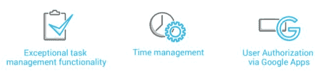

# 如何使用定制软件提高生产力|案例研究

> 原文：<https://dev.to/devcom/a-dedicated-development-team-how-it-works-3j27>

### **产品描述**

任务管理应用程序是一个支持所有业务流程的时间报告工具。**任何用户都可以轻松使用该应用程序，无需技术细节，只需通过 Google Apps 进行授权。**另外，定制软件解决方案有一个很棒的 UI，它提供了一个很棒的 UX。

### **商业挑战**

德国客户在内部管理任务时遇到了问题。一开始，客户对 Basecamp 充满热情，这是一款领先的任务管理工具。该公司将其视为应对挑战的灵丹妙药。然而，当最初的耀斑消失时，很明显一些基本功能在 Basecamp 中不存在。简而言之，该工具没有反映客户的业务模型，并且没有时间管理功能。

挑战显而易见。 **该公司想要一个具有时间报告功能的易于使用的任务管理定制软件解决方案。** 此外，还应该体现出客户的商业模式和创新精神。

### **项目描述**

在与 DevCom 沟通时，客户对他们需要什么样的任务管理工具了如指掌。长话短说，三个功能是整个项目的基石:

**此外，客户想要一个真正用户友好的解决方案** **让非技术人员也能轻松使用。**这样，客户集成定制软件就不成问题了。

### **值交付**

这个项目获得了巨大的成功。 **可靠的质量控制，无停机时间，难以置信的前瞻性和极高的成本效益。** 客户可以为开发提出一个想法，在一天的时间里，DevCom 交付了一个可行的开发评估。

**“DevCom 很主动。客户**说:“从来没有一个案例让我觉得我需要将问题上报给主管。”

在最初的产品发布之后，DevCom 开始使用任务管理解决方案与客户进行通信。特别是，DevCom 将该系统用于项目计费以及即将进行的相关项目。最后，也是最重要的一点，客户很好地接受了定制软件解决方案，并且几乎从第一天就开始使用。

*牢记在心。DevCom 在开发定制任务管理解决方案方面有丰富的经验。万一你有类似的项目，* [跟我们分享一下](http://devcom.com/#contacts) *。T15】*

*更多案例分析，请阅读* [资产管理软件如何省钱](https://devcom.com/tech-news/asset-management-software-saves-money/) 。