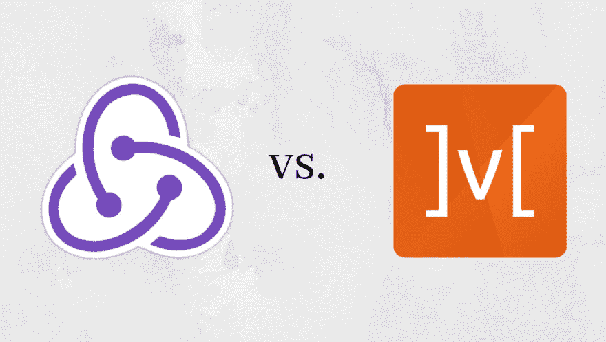
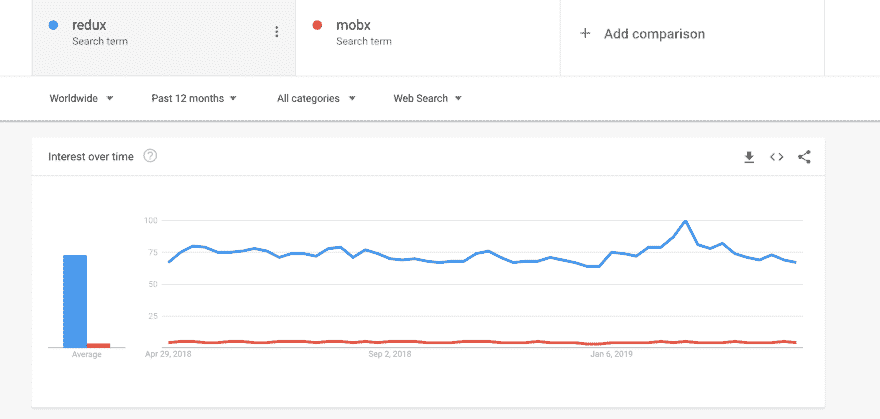
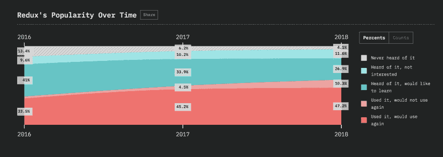
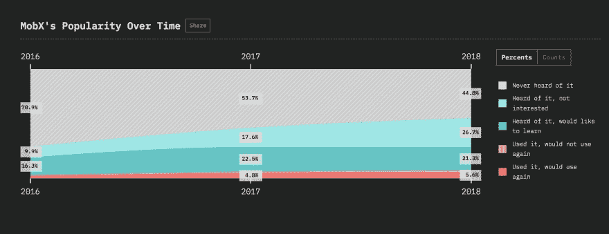
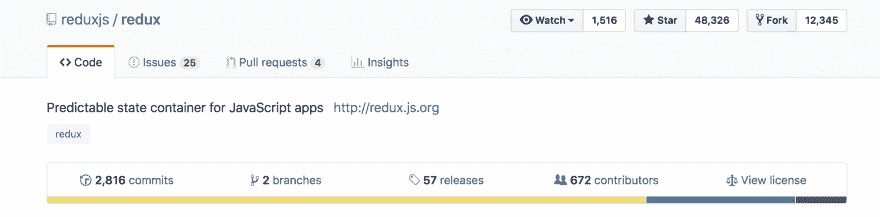
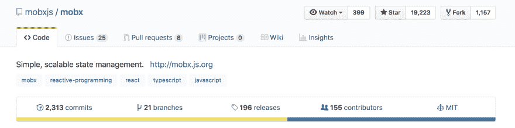
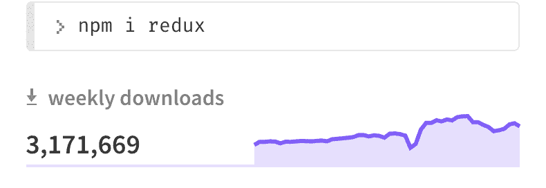
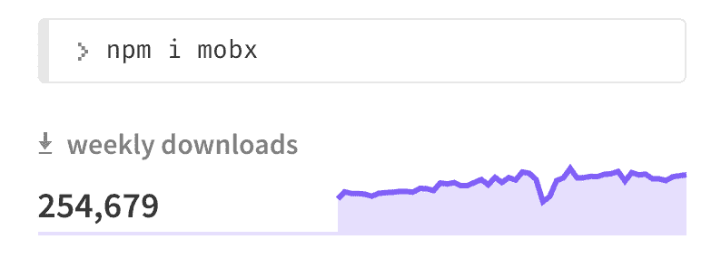

# Redux 与 MobX 的权威指南

> 原文：<https://dev.to/bnevilleoneill/a-definitive-guide-to-redux-vs-mobx-2l1i>

[](https://res.cloudinary.com/practicaldev/image/fetch/s--VP70m80K--/c_limit%2Cf_auto%2Cfl_progressive%2Cq_auto%2Cw_880/https://thepracticaldev.s3.amazonaws.com/i/ldrxs7iwx95lbknrtr52.png)

大型前端应用程序中最难解决的问题之一是状态管理。虽然有几种方法可以解决状态管理问题，但在前端应用程序中，Redux T1 和 T2 MobX T3 是两种最流行的外部库。在本帖中，我们将看看每个库以及它们是如何匹配的。

本文假设您对 web 应用程序中的[状态管理是如何工作的](https://kentcdodds.com/blog/application-state-management)有一个基本的概念。Redux 和 MobX 都是框架不可知的，可以与任何框架或普通 JavaScript 一起工作。

### Redux

Redux 是一个流行的状态管理解决方案，它结合了 Flux 和函数式编程概念。Redux 的一些核心原则是:

*   Redux 只有一个商店——一个真实的来源
*   存储中的状态是不可变的
*   动作调用对存储的改变
*   减速器更新状态

### MobX

**MobX** 是一个状态管理解决方案，有助于管理应用程序中的本地状态。

MobX 的一些核心原则是:

*   MobX 可以有多个存储来存储应用程序的状态
*   任何可以从状态中导出而没有任何进一步相互作用的东西都是*导出*
*   动作是可以改变状态的任何一段代码
*   当*状态*改变时，所有 d _ erivations _ 被自动和原子地更新

现在让我们比较一下 Redux 和 MobX 的一些关键特性，看看哪一个更适合你的需求。

[T4】](https://logrocket.com/signup/)

## 人气

在开始学习 Redux 或 MobX 之前，让我们看看哪一个更受欢迎。

看看下面的谷歌趋势图。截至 2019 年 4 月，与 MobX 相比，Redux 似乎是谷歌上更受欢迎和搜索的概念。

[](https://res.cloudinary.com/practicaldev/image/fetch/s--1sXKj0ZU--/c_limit%2Cf_auto%2Cfl_progressive%2Cq_auto%2Cw_880/https://paper-attachments.dropbox.com/s_1C7AE425DB57F860ED57A4916B82A7241BDFC6545BA841BA6580FBEB79C1B933_1556561131890_Screen%2BShot%2B2019-04-29%2Bat%2B1.02.52%2BPM.png)

为了更深入地了解他们的受欢迎因素，我们来看看 2018 年 JavaScript 调查的[状态。它发布了过去三年 Redux 和 MobX 在开发者中受欢迎程度的数据。](https://stateofjs.com/)

### Redux

[](https://res.cloudinary.com/practicaldev/image/fetch/s--Q0bvJ5u8--/c_limit%2Cf_auto%2Cfl_progressive%2Cq_auto%2Cw_880/https://paper-attachments.dropbox.com/s_1C7AE425DB57F860ED57A4916B82A7241BDFC6545BA841BA6580FBEB79C1B933_1556561355599_Screen%2BShot%2B2019-04-29%2Bat%2B1.08.59%2BPM.png)

### MobX

[](https://res.cloudinary.com/practicaldev/image/fetch/s--SOh24yrp--/c_limit%2Cf_auto%2Cfl_progressive%2Cq_auto%2Cw_880/https://paper-attachments.dropbox.com/s_1C7AE425DB57F860ED57A4916B82A7241BDFC6545BA841BA6580FBEB79C1B933_1556561376436_Screen%2BShot%2B2019-04-29%2Bat%2B1.08.49%2BPM.png)

在过去的几年里，Redux 获得了极大的欢迎，并成为国家管理的首选解决方案。尽管 MobX 没有 Redux 受欢迎，但它也有自己的优势。

### 赢家:Redux

## 学习曲线

### Redux

开发者对 Redux 的普遍看法是，不太好学。2018 年 JavaScript 调查状况，分析了 redux 最不喜欢的[方面。在这里，开发人员投票表示，他们不喜欢 Redux 的复杂特性及其带来的艰难学习曲线。](https://2018.stateofjs.com/data-layer/redux/)

理解它的模式和范例需要一些时间。它是 Flux 体系结构和函数式编程概念的结合。如果你是一个函数式程序员，你可能会发现 Redux 更容易掌握。然而，如果您来自面向对象的编程背景，Redux 代码看起来很复杂，最初很难理解。

学习 Redux，也意味着你需要学习像[Thunk](https://github.com/reduxjs/redux-thunk)T2 或 [Sagas](https://github.com/redux-saga/redux-saga) 这样的 Redux 中间件，这增加了更多的学习材料。

### MobX

众所周知，MobX 比 Redux 更容易掌握。大多数 JavaScript 开发人员都精通面向对象编程，这使得学习 MobX 变得很简单。此外，在 MobX 中有很多事情是在幕后完成的，为开发人员创造了更好的学习体验。您不需要担心规范化状态或实现像 Thunks 这样的概念。因为抽象已经是内置的，所以它导致编写更少的代码。

### 获胜者:MobX

## 存储数据–单店与多店

商店是我们存储本地数据的地方。它保存了整个应用程序的状态。该存储通常将应用程序的状态保存在一个巨大的 JSON 对象中。

### Redux

在 Redux 中，只有一个商店，它是真实的唯一来源。存储中的状态是**不可变的**，这让我们更容易知道在哪里可以找到数据/状态。在 Redux 中，尽管有一个巨大的 JSON 对象来表示存储，但是您总是可以将代码分割成多个 reducers。通过这种方式，您可以从逻辑上分离多个减速器的问题。对于许多开发人员来说，这是一种更直观的方法，因为他们总是可以参考单个存储来了解应用程序的状态，并且没有与数据的当前状态相关的重复或混淆的可能性。

### MobX

另一方面，MobX 允许多个商店。你可以从逻辑上把存储区分开，所以应用程序的所有状态都不在一个存储区中。大多数应用程序被设计为至少有两个商店。一个用于 *UI 状态*，一个或多个用于*域状态*。以这种方式分离存储的优点是，您也可以在其他应用程序中重用该域。并且 UI 存储将特定于当前应用程序。

### 赢家:Redux

这个类别的赢家是主观的。这要看开发商的喜好。我个人喜欢将应用程序的整个状态存储在单个存储中的想法。这帮助我把同一个地方称为真理的唯一来源。有些人可能会说，多个商店对他们来说更好，他们更喜欢 MobX。

## 数据结构

### Redux

Redux 使用普通的 JavaScript 对象作为数据结构来存储状态。使用 Redux 时，必须手动跟踪更新。在有大量状态需要维护的应用程序中，这可能会更加困难。<

### MobX

MobX 使用可观察的数据。这有助于通过隐式订阅自动跟踪更改。在 MobX 中，更新是自动跟踪的。因此，对开发人员来说更容易。

### 获胜者:MobX

## 纯净与不纯净

### Redux

在 Redux 中，存储中的状态是不可变的，这意味着所有的状态都是只读的。Redux 中的动作可以调用状态的变化，reducers 可以用新的状态替换以前的状态。这是 Redux 的核心原则之一。

下面是一个简单的纯函数的例子:

```
function sumOfNumbers(a, b) {
 return a + b;
} 
```

Enter fullscreen mode Exit fullscreen mode

给定相同的输入，函数将总是返回相同的输出。它没有任何副作用，也不受外界影响。

Redux 函数是用下面的模式编写的。Reducers 是纯函数，它接受一个状态和动作，然后返回一个新的状态。

```
function(state, action) => newState 
```

Enter fullscreen mode Exit fullscreen mode

这让 Redux 很纯粹。如果你有兴趣了解更多关于[纯函数](https://codeburst.io/redux-reducers-are-coffee-makers-8a78dd8bb7a0)以及它们如何在 Redux 中操作，你可以阅读这篇[文章](https://codeburst.io/redux-reducers-are-coffee-makers-8a78dd8bb7a0)来更好地理解。这是 Redux 最好的特性之一。

### MobX

在 MobX 中，状态是可变的，这意味着您可以简单地用新值更新状态。这就使得 MobX 不纯。不纯的函数更难测试和维护，因为它们并不总是返回可预测的输出。

### 赢家:Redux

因为 Redux 存储是纯的，所以它更容易预测，并且很容易恢复状态更新。就 MobX 而言，如果做得不好，状态更新会使调试变得更加困难。

## 样板代码

### Redux

对 Redux 最大的抱怨之一是它附带的大量样板代码。当您集成 React 和 Redux 时，会产生更多的样板代码。这是因为 Redux 本质上是显式的，许多功能必须显式编码。

### MobX

MobX 更含蓄，不需要很多特殊的工具。与 Redux 相比，它的样板代码要少得多。这使得 MobX 更容易学习和设置。

### 获胜者:MobX

## 开发者社区

在开发者社区方面，Redux 轻而易举地胜出。Redux 自带的[**“Redux**](https://github.com/zalmoxisus/redux-devtools-extension)[**开发工具”**](https://github.com/zalmoxisus/redux-devtools-extension) 被成千上万的开发者使用。它为调试 Redux 代码提供了惊人的支持。

MobX 也提供开发人员工具，但是它们没有 Redux 提供的同样质量的调试支持。

GitHub 统计数据很好地表明了这两个库的社区参与度。Redux 拥有约 48k 颗恒星，贡献者超过 672 人。[另一方面，MobX](https://github.com/mobxjs/mobx) 有大约 19k 名明星和 155 名贡献者。

与 MobX 相比，Redux 显然吸引了大量的开发人员。

[](https://res.cloudinary.com/practicaldev/image/fetch/s--XyBbFITo--/c_limit%2Cf_auto%2Cfl_progressive%2Cq_auto%2Cw_880/https://paper-attachments.dropbox.com/s_1C7AE425DB57F860ED57A4916B82A7241BDFC6545BA841BA6580FBEB79C1B933_1556568054423_Screen%2BShot%2B2019-04-29%2Bat%2B2.59.55%2BPM.png)

[](https://res.cloudinary.com/practicaldev/image/fetch/s--vUXgR75h--/c_limit%2Cf_auto%2Cfl_progressive%2Cq_auto%2Cw_880/https://paper-attachments.dropbox.com/s_1C7AE425DB57F860ED57A4916B82A7241BDFC6545BA841BA6580FBEB79C1B933_1556568054413_Screen%2BShot%2B2019-04-29%2Bat%2B3.00.20%2BPM.png)

如果我们从 npm 的下载量来看，Redux 遥遥领先。Redux 平均每周下载 300 万次，MobX 平均每周下载 25.4 万次，MobX 平均每周下载 25.4 万次。由此可见 Redux 被广泛采用的程度。

[ ](https://res.cloudinary.com/practicaldev/image/fetch/s--onsFMWbp--/c_limit%2Cf_auto%2Cfl_progressive%2Cq_auto%2Cw_880/https://paper-attachments.dropbox.com/s_1C7AE425DB57F860ED57A4916B82A7241BDFC6545BA841BA6580FBEB79C1B933_1558986721375_Screen%2BShot%2B2019-05-27%2Bat%2B2.50.07%2BPM.png) [ ](https://res.cloudinary.com/practicaldev/image/fetch/s---WwQN3C2--/c_limit%2Cf_auto%2Cfl_progressive%2Cq_auto%2Cw_880/https://paper-attachments.dropbox.com/s_1C7AE425DB57F860ED57A4916B82A7241BDFC6545BA841BA6580FBEB79C1B933_1558986721383_Screen%2BShot%2B2019-05-27%2Bat%2B2.50.03%2BPM.png)

### 赢家:Redux

## 可扩展性

由于 Redux 更固执己见，期望 [reducer 函数是纯](https://www.freecodecamp.org/news/why-redux-needs-reducers-to-be-pure-functions-d438c58ae468/)的，所以比 MobX 更容易伸缩。Redux 固执己见且纯粹的特性使得应用程序具有可扩展性。

纯函数更容易测试，因为它们是可预测的和简单的。这导致可维护的代码可以伸缩。这是选择 Redux 而不是 MobX 的核心好处之一。

### 赢家:Redux

## 结论

好吧，结论是什么？基于开发者社区，流行度和可伸缩性 Redux 比 MobX 表现更好。但是，如果您希望构建简单的应用程序，并且希望快速学习较少的样板代码，MobX 可能是您的朋友。

* * *

### Plug: [LogRocket](https://logrocket.com/signup/) ，一款适用于网络应用的 DVR

<figure>

### [T4】](https://logrocket.com/signup/)

<figcaption>[https://logrocket.com/signup/](https://logrocket.com/signup/)</figcaption>

</figure>

LogRocket 是一个前端日志工具，可以让你回放问题，就像它们发生在你自己的浏览器中一样。LogRocket 不需要猜测错误发生的原因，也不需要向用户询问截图和日志转储，而是让您重放会话以快速了解哪里出错了。它可以与任何应用程序完美配合，不管是什么框架，并且有插件可以记录来自 Redux、Vuex 和@ngrx/store 的额外上下文。

除了记录 Redux 操作和状态，LogRocket 还记录控制台日志、JavaScript 错误、堆栈跟踪、带有头+正文的网络请求/响应、浏览器元数据和自定义日志。它还使用 DOM 来记录页面上的 HTML 和 CSS，甚至为最复杂的单页面应用程序重新创建像素级完美视频。

[免费试用](https://logrocket.com/signup/)。

* * *

帖子[Redux vs . MobX](https://blog.logrocket.com/redux-vs-mobx/)的权威指南首先出现在 [LogRocket 博客](https://blog.logrocket.com)上。