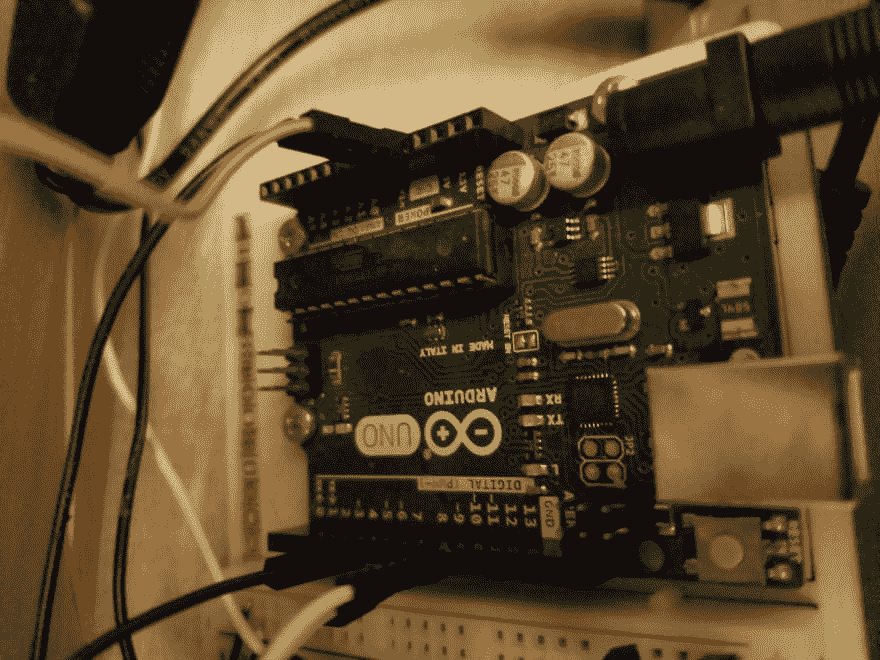
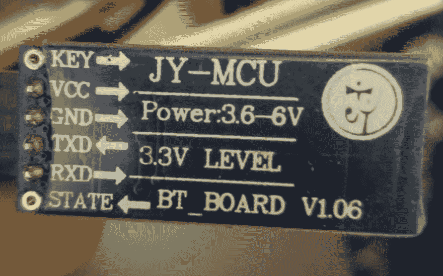
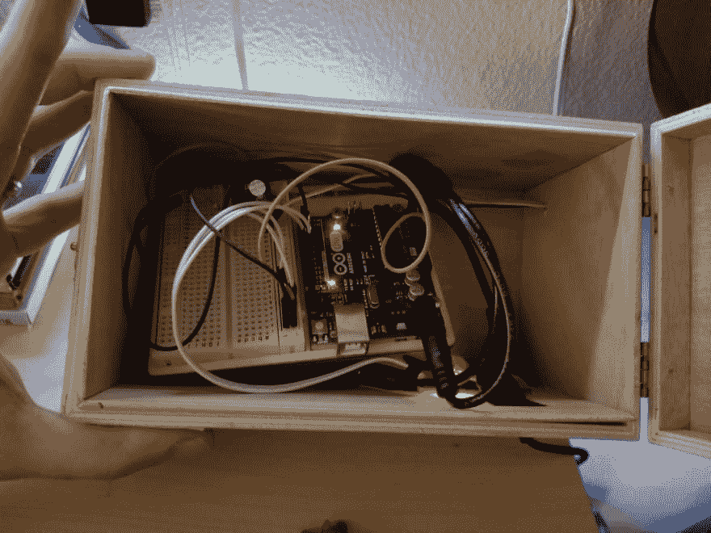
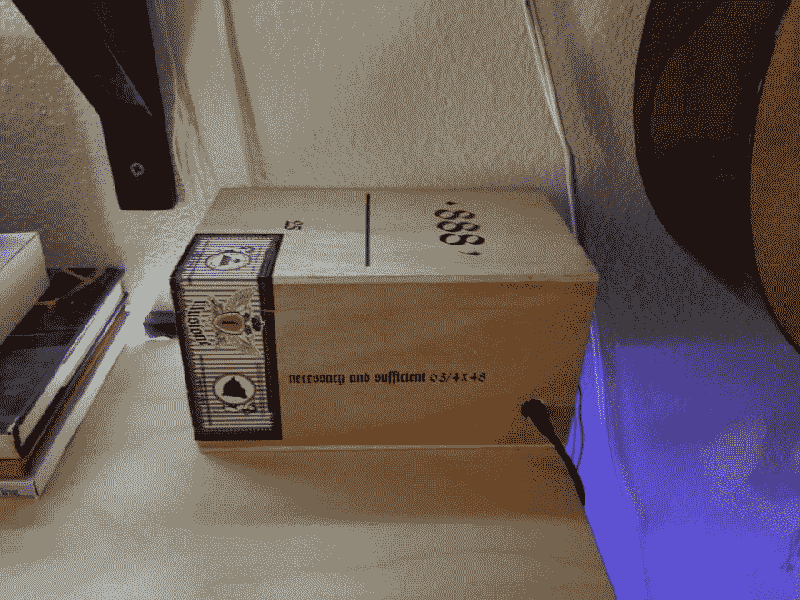
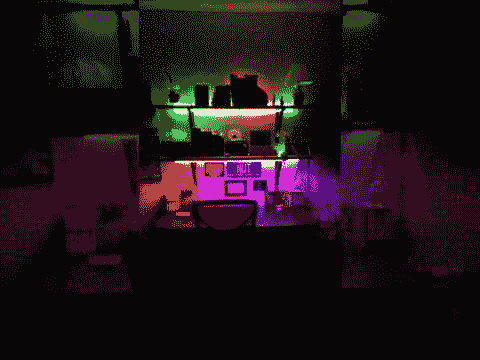

# 一个台灯项目！进入开发世界的第一步

> 原文：<https://dev.to/joshualoran/a-desk-light-project-first-steps-into-devdom-4iig>

因为这是我的第一篇博文，就像……在任何地方，我认为告诉你们这些优秀的人我是如何开始我的开发世界之旅的是合适的。微型控制器！不久前，我偶然发现了一个 Arduino Uno 入门箱，并迅速翻阅了附带的书中解释的所有入门项目。

微控制器很棒！它们不仅给了我们创造新事物的能力，还给了我们侵入几乎所有用电设备的能力，包括许多不用电的设备。

微控制器顾名思义，它控制事物，更重要的是它以你决定的方式控制事物。现在市场上有很多控制器，树莓 Pi 和 Arduino 是爱好者最熟悉的两个。我的一个朋友给我看了他的树莓派，它看起来有点神奇。除了在大学里上过四分之一的 Java 入门课程，我没有任何编程经验。我完全不知道是什么让圆周率有效，但我想知道如何变魔术。

我让我的朋友给我演示一下私家侦探是如何做事的。他不知道。他在上面放了一个任天堂模拟器和数百万个游戏，做了一个小盒子，并把它连接到他的电视上。酷！！他知道如何在上面加载软件和运行程序，但不知道如何编写游戏或让它打开电灯开关。

Arduino Uno...
[T3】](https://res.cloudinary.com/practicaldev/image/fetch/s--Sj6uvwSN--/c_limit%2Cf_auto%2Cfl_progressive%2Cq_auto%2Cw_880/https://github.com/WTFCodingPotato/NeoPixelDeskShelves/blob/master/20190314_194714.jpg%3Fraw%3Dtrue)

我将向你们展示我用控制器做的第一个有价值的项目。

我在妻子的桌子上方放了一些搁板，这样她就可以有更多的储物空间，但这样做让工作区的桌子变得有点暗，用台灯来照明就有点可笑了。

我已经有了一个 Arduino，所以我知道我可能会做一些整洁的东西。我想尝试制作一些可以用手机控制的灯。因此，我订购了一个 jy-mcu 蓝牙芯片，这样我的 arduino uno 就可以通过蓝牙与另一台设备通话。我还订购了 3 米的 neopixel WRGB LED 灯条用于照明。

JY 单片机蓝牙发射器...
[T3】](https://res.cloudinary.com/practicaldev/image/fetch/s--bo1y4uj5--/c_limit%2Cf_auto%2Cfl_progressive%2Cq_auto%2Cw_880/https://github.com/WTFCodingPotato/NeoPixelDeskShelves/blob/master/5fER7MVjT3yHrvvDimidcQ_thumb_2.jpg%3Fraw%3Dtrue)

在阅读了我所有组件的规格并在网上做了一些调查后，我相应地将它们连接在一起。这是相当直接的布线，我学到了不少。neopixel 照明仅使用一根数据线来控制每盏灯，每个像素都可以与其邻居进行通信。我添加了一个 1000uf 的电容，以消除数据线中的任何能量尖峰，因为脏的电源信号可能会导致脏数据。数据线上也需要一个 220 欧姆的电阻。它看起来像这样...

盒子里面...
[T3】](https://res.cloudinary.com/practicaldev/image/fetch/s--_19X2aIb--/c_limit%2Cf_auto%2Cfl_progressive%2Cq_auto%2Cw_880/https://github.com/WTFCodingPotato/NeoPixelDeskShelves/blob/master/20190314_064930.jpg%3Fraw%3Dtrue)

从外面...
[T3】](https://res.cloudinary.com/practicaldev/image/fetch/s--RNrDXUH5--/c_limit%2Cf_auto%2Cfl_progressive%2Cq_auto%2Cw_880/https://github.com/WTFCodingPotato/NeoPixelDeskShelves/blob/master/20190314_064949.jpg%3Fraw%3Dtrue)

我用来驱动灯光的一个主要资源是 Adafruit.com，那是我购买灯带的地方。他们有一个 neopixel 库，总是让你选择一个像素并输入 WRGB 值。我问我的妻子她想要什么样的颜色，并着手寻找相关的 wrgb 值。一旦我明白发生了什么，我写了按钮来变暗和变亮，以及分离 3 层，这样他们就可以单独选择或分组。然后我为光明节和圣诞节添加了一些动画。Adafruit 也有一个彩虹动画我没有完全看懂，但还是用了！

增加层的选择意味着你可以选择不同的颜色来照亮你的桌子，而上面架子的重点照明可以是柔和的蓝色或紫色、醒目的红色或橙色，或者酷的动画彩虹。[这里的](https://github.com/WTFCodingPotato/NeoPixelDeskShelves)是我的 github 的一个链接，以便更仔细地看。

