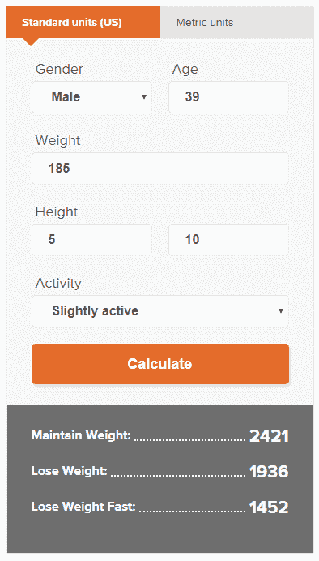

# 健身开发者指南

> 原文：<https://dev.to/httpjunkie/a-developers-guide-to-getting-fit-pif>

**🐰TLDR:这篇文章是关于间歇性禁食的，我这样做了，而且在大多数日子里，我不在晚上 10 点以后或下午 1 点以前吃东西。我每天至少锻炼 30 分钟，随着时间的推移，在新的进食时间里，我吃得比以前少了一整天。我已经在一年内减掉了将近 40 磅的脂肪，而且不会再回来了。**

在过去的几年里，我已经知道了一种可以重新控制体重的方法，但这需要我的儿子对我坦诚(孩子们擅长这一点)，根据这些信息采取行动并做出改变。我不再是二十几岁的人了，我的新陈代谢现在对我不利，我需要最终推回去。我终于有动力了！

这让我渴望开始间歇性禁食，出于某种原因，我想了解更多关于糖原储备。一晃一年过去了，几个乔·罗根的播客后来谈到了间歇性禁食和我自己的一些额外研究，我和我的儿子去了游泳池，他告诉我，我有男人的胸部。就这样，我要给他看。我已经有点不好意思在游泳池脱掉衬衫了，事实上，在我们计划的夏季旅行之前，我想晒晒太阳。我不仅想把皮肤晒成古铜色，还考虑了节食或锻炼养生法，这样到了六七月份，我会对自己的外表感觉更好。

我们都想变得更好看。这就是我们做这些事情并决定锻炼或保持身材的原因。老实说，在我的一生中，我从未尝试过减肥。几年前我去过健身房，但当时我的饮食习惯与我吃的东西不匹配，我不知道每天应该摄入多少卡路里，尤其是我不知道我吃东西的时间也很重要。

长话短说，在研究并找到了大量关于乔·罗根的播客和 YouTube 上的广告视频(不要骗你)的信息后，我开始了间歇性禁食和简单的锻炼养生法，视频名为:[科学六块腹肌](https://www.youtube.com/watch?v=KzbRp0DvNVw)。

根据我从这个播客和 YouTube 频道学到的信息，我在几个小时内写出了我的计划。我认为这个计划可以让任何人保持体形，如果他们这样做的话。

我从全职工程师变成了 Telerik/Progress 的开发者代言人。这一改变让我可以在想训练的时候自由训练，因为我可以在家工作，周末也可以。所以我理解人们说这很难，但是我说如果你遵循这个养生法，这是值得的。在我做全职工程师工作的前两个月，我确实是这样做的，开车上下班。所以有可能。

我将在这里做一些假设，并尝试预测我认为任何人都可以做的事情，如果他们同意这个养生法，它只包括我承诺的两件事。

*   你将在限定的时间内进食(而不是暴饮暴食)
*   你将一周锻炼几天(希望在你禁食的时候)

如果你这样做，我认为你可以...

*   两个月内减掉 20 磅并保持下去
*   更好看，一个月见成效
*   在食物上省钱
*   开始吃得更健康
*   看起来更好，感觉更好

有些人很难用这种方法来治疗糖尿病或其他胰岛素问题。有两种类型的糖尿病，我不是糖尿病方面的专家，我对这个问题知之甚少。如果你有疾病，在尝试这种养生方法之前咨询你的医生。据我所知，它对一种类型的糖尿病很有效，对另一种类型的糖尿病，我不确定。

回到正题！

当我儿子告诉我我有男人的胸部时，我意识到他想对我说些什么。“爸爸，我相信你可以对你的多余脂肪做些什么”。但真的，在某种程度上，他是诚实的，这让我想到我可以做些什么来扭转这一列车。我走错了方向。

我是乔·罗根播客的忠实粉丝，我听过他和朗达·帕特里克博士的对话。播客的这一集[强调了她最近在养生方面的成功，或者至少我是这么认为的。](https://www.youtube.com/watch?v=9M8X_bs_fzI)

我也多次听一本书，当我面临饥饿或对糖的渴望时，我经常听，以提醒我应该做什么，以及为什么做事情完全是自然的方式。

所以我开始做一些事情:

*   晚上 10 点以后不吃东西
*   下午 1 点前不吃饭
*   一周锻炼四次
*   减少热量摄入
*   将健康碳水化合物作为我的第一餐

运动是需要做的，禁食本身会让你走得更远，但你需要锻炼肌肉，慢慢瘦下来，不要看起来像一袋骨头。不要自杀，如果需要的话，慢慢开始，一周试几次。如果你做简单的有氧运动可以燃烧 200 卡路里，这是一个很好的开始。当你开始对养生有信心时，做更多，但不要走回头路。重要的是不要脱离圈子。走得太难、太极端最初可能会产生一些好的结果，但这可能是不可持续的，所以要放松。

*就饮食而言，在我开始养生之前，我看了看我每天吃的东西，确保我做出了更健康的选择或实际上吃得更少。这可以从慢慢变得更健康的小变化开始，最终我们开始完全取消一日三餐中的一餐。

我在上面做的这些事情让我可以在两个月内减掉大约 20 磅，我边做边学。我认为你可以做得更快更好，只需要坚持一周 6 天的养生法。

我每天应该摄入多少卡路里？
[T5】](https://res.cloudinary.com/practicaldev/image/fetch/s--hypYn0JH--/c_limit%2Cf_auto%2Cfl_progressive%2Cq_auto%2Cw_880/https://i.imgur.com/5Zc8mdi.png)

上面是我用来计算我应该吃多少的计算器。我在[西夫韦](https://twitter.com/safeway)找到了一份[甜甘蓝沙拉](https://www.taylorfarms.com/products/chopped-salad-kits/sweet-kale-chopped-kit/)和一些[预煮鸡肉](https://www.tyson.com/products/grilled-chicken)，我每天都可以快速准备，沙拉酱也符合我的指南，我还必须在晚餐时小心不要吃得过多。但是我几乎可以吃任何我喜欢的东西，只是小份的。这样做几个星期后，你就会知道你是否比前一天吃得多了。如果需要的话，也很容易减少热量摄入。我想强调的一件事是，在我开始这个养生法的第二天，我就停止了一日三餐。除了周日。星期天我吃少量的早餐，锻炼，吃少量的午餐和正常的晚餐。我总是在这一天禁食。

一年后，我不再是 182 磅，我接近 150 磅(今天我 152 磅)。大概 25 年来我从未低于 150。我想，随着我现在开始增加肌肉，我的体重即将降到最低点。几个月后我可以写更多关于这个的内容。

## 下面是我的一些看法

我认为我们都有不自然的饥饿感，这是由别人告诉我们的谎言造成的，而我们现在告诉自己。我们不应该一天吃三顿饭，我相信我们已经被大公司甚至健康专家灌输，我们认为吃食物金字塔和吃健康的早餐午餐和晚餐是正确的事情。不是的。我们越快发现这一点，我们就能越快开始做出一些健康的决定，并检查我们的身体。

作为一名软件开发人员，如果你仔细想想，我认为这种生活方式实际上适合这种饮食。我们一天中大部分时间都在电脑前工作，我们的生活中需要一些运动。我建议以几个小时的工作开始你的一天，休息一下，做些有氧运动或有氧运动，跑步机什么的，然后在一天的剩余时间里继续工作。我现在可以一整天不吃东西地工作，但我已经进行了近一年的间歇性禁食。我不认为这是可能的，除非你是一头野兽。

正如我之前所说，我是乔·罗根的超级粉丝，我想用这个视频留给大家:

[为什么你应该做间歇性禁食|乔罗根壮举。GSP，Peter Attia 博士，Rhonda Patrick 博士](https://www.youtube.com/watch?v=JxjMdqevE88)

我希望这篇文章能启发一些人，如果你有问题让我知道，在 Twitter 上给我发消息，我希望这个博客能成为其他人的一个好资源，这些人试图找到健身的方法，但作为一个每天努力工作或没有时间的开发者却在挣扎。最棒的是，禁食时，你通常一天只吃两餐，所以实际上比你现在做的要容易？