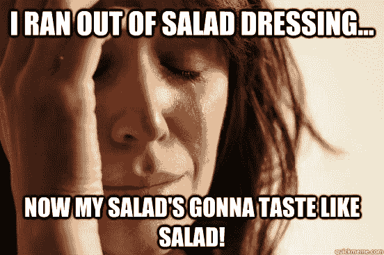

# 关于我如何发明 React 的虚构叙述:React 如何工作的简化视角

> 原文：<https://dev.to/simple_thread/a-fictional-account-of-how-i-invented-react-a-simplified-perspective-of-how-react-works-4hc1>

在过去的一年里，我决定赶上 JavaScript 框架的最新发展，并学习 React。事实上，这不仅仅是学习 React，因为我也渴望学习 ES6 和 Node。无论如何，在经历了角、骨干、余烬、击倒的复杂之后，我发现 React 的清晰度令人惊叹。也就是说，我确实认为我读过的几本书和几十篇文章把 React 的简单性过于复杂化了。

我采纳了导师爱德华多·罗斯(ASNA 公司技术副总裁)的技术理解策略，他说:“(T2)我考虑我可能如何编码。而且，如果设计得好，我通常是对的。“无论如何，当我开始阅读更多关于 React 处理边缘情况的复杂性时，我开始对 React 的工作原理有了一个简单的认识。我开始忽略这些增加的特性，转而开发一个为什么创建 React 以及如何实现 React 的简化视角。

以下是虚构的作品，但它是基于 React 框架的优雅。这个故事是假的，但是方法名和行为是真实的——无辜者的名字没有被改变以保护他们。

## 一种语言，没有沙拉酱

在 Perl 脚本、PHP 和 Java Servlet API 出现之前，我就已经开始研究 Web 了。我是一名作家和培训师，我会告诉你，在 Java Server Pages (JSP)或 Groovy Server Pages (GSP)或 Embedded RuBy (ERB)中混合使用 HTML 和 *INSERT_LANGUAGE_HERE* 是疯狂的。然后 LiveScript 出现了(对不起，是 JavaScript ),事情变得更加复杂。在一个文件中使用多种语言就像把油和醋混合在一起，因为它们不能混合在一起。

实际上，那是沙拉酱，但是，为了使它可口，你必须加入风味并用力摇晃。这就像你的 web 代码需要一个注释:在试图维护之前，用力摇摇头。

What I wanted (what we all wanted) was one language. One language that would rule them all. A language used to create the browser’s Document Object Model (DOM). The obvious language to use is the world’s most prevalent and pervasive — JavaScript. But its syntax would need to be similar to XHTML. So let’s call it JSX for JavaScript XHTML. The following shows the simplest React JSX you might write: