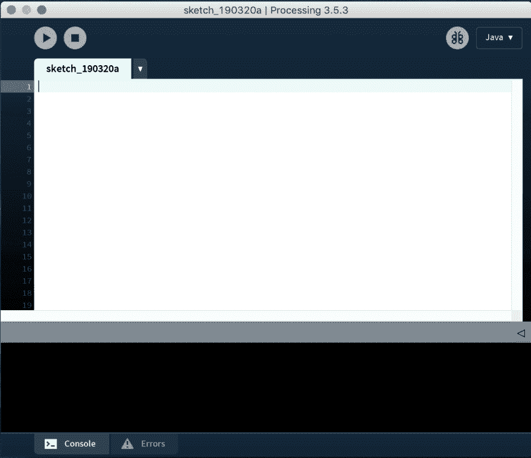
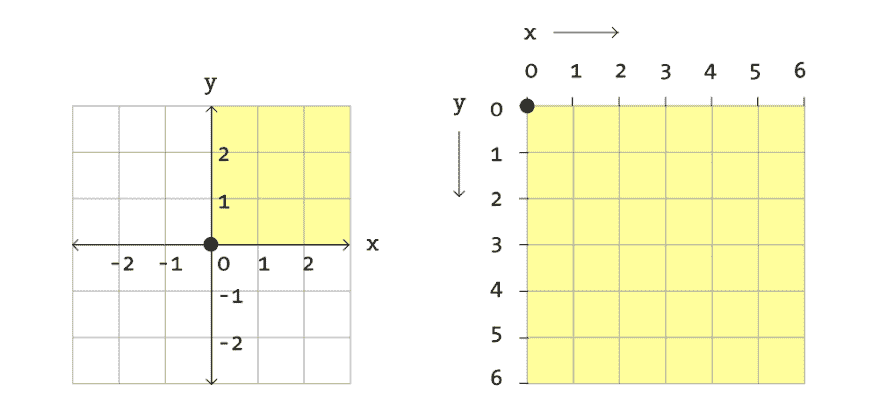
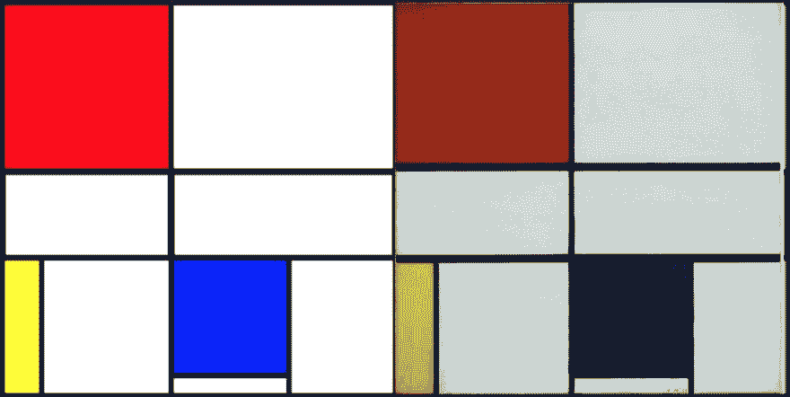
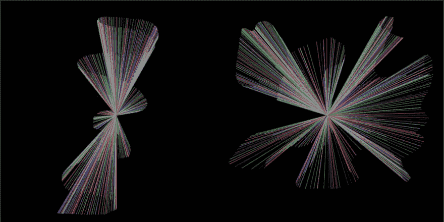

# 用代码创作艺术的首次尝试

> 原文：<https://dev.to/mshin1995/a-first-attempt-at-making-art-with-code-43j0>

为了跟进我的第一篇博文，我想了解如何通过编码语言实际制作某种视觉艺术。在做了一些关于这个主题的研究后，我发现了一个叫做 Processing 的程序，它允许它的用户这样做。这绝不是什么深度教程，而是我探索这个话题的经历。

## **什么是加工？**

Processing 是一个开源软件程序，由麻省理工学院的研究生 Ben Fry 和 Casey Reas 创建，最初是围绕在视觉艺术的背景下学习编码而设计的。该程序提供了一个集成开发环境(IDE ),能够运行代码并在数字速写本上显示结果。尽管 Processing 本身可以被认为是一种编程语言，但它在很大程度上使用了 Java 语言。然而，该程序允许用户将模式更改为不同的语言，如 Javascript 或 Python。

[](https://res.cloudinary.com/practicaldev/image/fetch/s--eozvypkJ--/c_limit%2Cf_auto%2Cfl_progressive%2Cq_auto%2Cw_880/https://thepracticaldev.s3.amazonaws.com/i/a8zz610sald9jwpyu03h.png)

## **画布**

开始一个项目前要考虑的一个重要细节是了解你的画布。计算机上的画布实质上是一个坐标系统，其中的点被分配给屏幕上的一个像素。然而，与传统的坐标系不同，这个坐标系从左上角的(0，0)开始。要设置这个画布的大小，使用函数 **size(x，y)** ，足够简单了吧？

<figure>

[](https://res.cloudinary.com/practicaldev/image/fetch/s--SAWFmf0r--/c_limit%2Cf_auto%2Cfl_progressive%2Cq_auto%2Cw_880/https://thepracticaldev.s3.amazonaws.com/i/a4csselbdz6rfkoh95tw.png)

<figcaption>A regular coordinate system and a computer coordinate system</figcaption>

</figure>

## **基本形状**

我发现用代码制作艺术品的一个很好的起点是熟悉四种基本形状。这些是点、线、矩形和椭圆。虽然这看起来不算多，但我惊喜地发现仅仅使用这四种形状就能做这么多事情。这些形状中的每一个都有一些函数，这些函数将画布的坐标点作为参数来指定它们将出现在哪里。这些职能是:

**点(x，y)**
**线(x1，y1，x2，y2)**
**矩形(x，y，宽度，高度)**
**椭圆(x，y，宽度，高度)**

## **静态 vs .互动**

有两种类型的草图可以通过编码来绘制。一个是静态的，一个是交互的。静态草图是通过一系列的功能创建一个单独的，静止的图像。没有与此类型相关联的动画，也不需要与查看者进行任何交互。另一方面，交互式草图是由一系列框架组成的，就像它的名字一样，允许观众与之互动。这些大部分时间都是动画。

这是一个静态草图的例子，我模仿了皮耶·蒙德里安的一幅画及其代码。

<figure>

[](https://res.cloudinary.com/practicaldev/image/fetch/s--GChGklbu--/c_limit%2Cf_auto%2Cfl_progressive%2Cq_auto%2Cw_880/https://thepracticaldev.s3.amazonaws.com/i/oy3lrfa9wg10bazofuw2.png)

<figcaption>On the left is the code version, on the right is the real one</figcaption>

</figure>

```
size(500, 500);
background(255);

fill(255, 0, 0);
strokeWeight(6);
rect(0, 0, 215, 215);

fill(255);
strokeWeight(6);
rect(215, 0, 285, 215);

fill(255);
strokeWeight(8);
rect(0, 215, 215, 110);

fill(255);
strokeWeight(8);
rect(215, 215, 285, 110);

fill(255, 255, 0);
strokeWeight(6);
rect(0, 325, 50, 175);

fill(255);
strokeWeight(6);
rect(50, 325, 165, 175);

fill(0, 0, 255);
strokeWeight(6);
rect(215, 325, 150, 150);

fill(255);
strokeWeight(6);
rect(215, 475, 150, 25);

fill(255);
strokeWeight(6);
rect(365, 325, 135, 175); 
```

## **设置和绘制**

编写静态草图非常简单，只需编写几行代码，运行一次就可以生成一幅静态图像。交互式草图需要更多的组织。这就是**无效设置()**和**无效抽取()**发挥作用的地方。顾名思义，void setup 就是你编写代码来设置一切的地方，比如画布的大小。安装程序块中的每段代码只在开始时运行一次。至于 draw 块中的所有代码，它们会不断循环，产生动画。

接下来的两张图片是我制作的交互式草图的例子，以及用来创建它们的代码。

[](https://res.cloudinary.com/practicaldev/image/fetch/s--ZoYe6zlu--/c_limit%2Cf_auto%2Cfl_progressive%2Cq_auto%2Cw_880/https://thepracticaldev.s3.amazonaws.com/i/roo62bqngrte42gc4dm7.png)T3】

```
void setup() {
  size(750, 750);
  background(0);
}

void draw() {
  if (mousePressed) {
    background(0);
  } 
  stroke(random(0,255), random(0,255), random(0,255));
  line(mouseX, mouseY, 375, 375);
}

void mousePressed(){
  saveFrame();
} 
```

上面的图像明显不同，但它们是用相同的代码制作的。通过将线的 x 和 y 坐标设置为鼠标光标所在的位置，我能够与程序进行交互，并根据我移动鼠标的方式产生不同的结果。我还添加了鼠标点击功能，可以将画布重置为空白状态，并在图像被擦除之前捕捉图像。

## **外卖**

在与这个程序的互动中，我真的很喜欢这样一个事实，那就是在屏幕上产生一个可见的结果并不需要花费太多的时间。看到我写的代码被翻译成可视图像是很有趣的。虽然我对这个话题有很大的体验，但看到别人的作品让我意识到我只是触及了表面。展望未来，我希望我能够从整体上学习更多关于编码的知识，这样我就可以最终将这些知识应用于制作更复杂的作品。

### **资源**

[https://processing.org/](https://processing.org/)