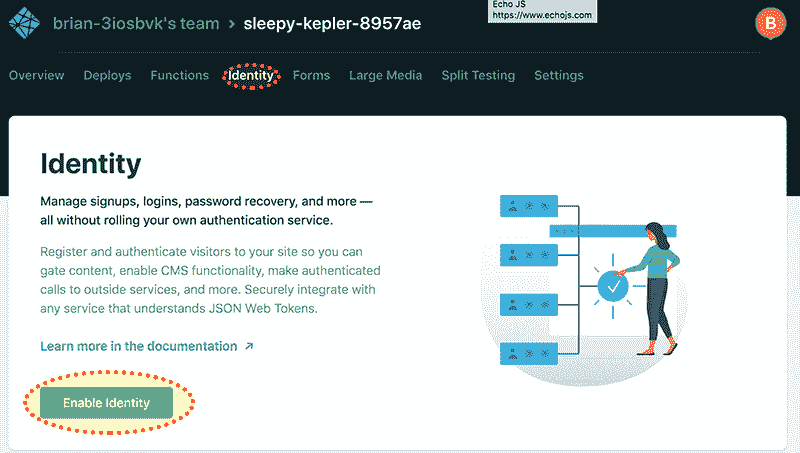
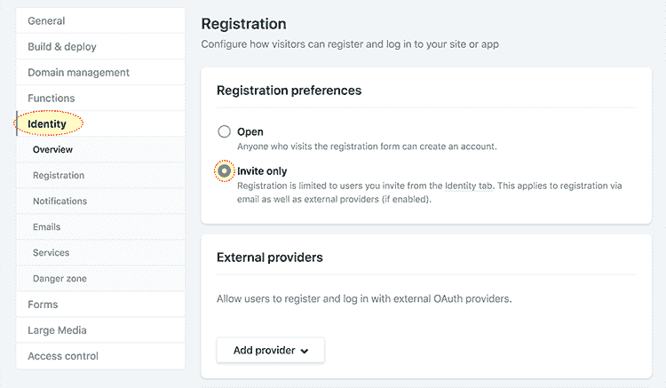
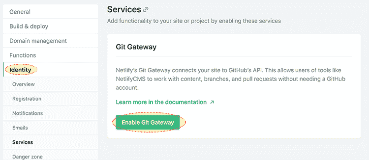
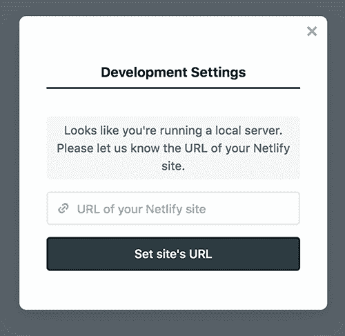
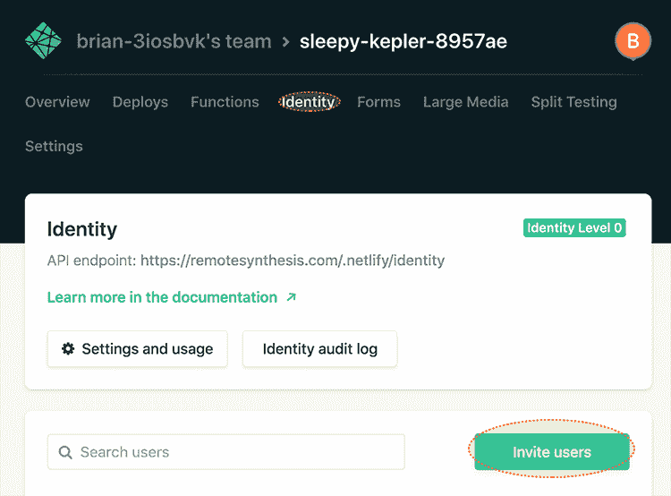
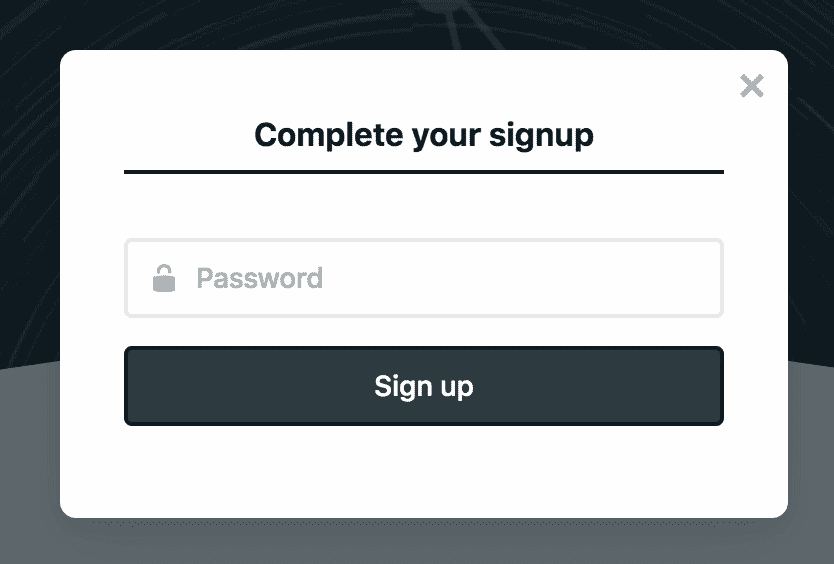
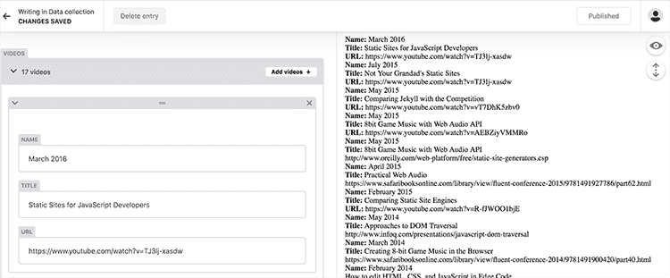

# 重新审视网络生命周期管理系统(下)

> 原文：<https://dev.to/remotesynth/a-fresh-look-at-netlify-cms-part-2-5694>

Netlify CMS 是一个内容管理工具，是为 T2 jam stack 或 T4 Netlify T5 创建的静态网站设计的。它被设计成可以与你选择的任何静态站点生成器一起工作——无论是 Jekyll、Hugo、Hexo 还是其他什么。

在第一部分中，我看到了使用 Netlify CMS 建立一个新网站是多么容易。在这篇文章中，我想看看如何将 Netlify CMS 添加到现有的站点中。在这种情况下，我们将探索把它添加到[我的个人博客](https://www.remotesynthesis.com/)，它使用了一个已经部署到 Netlify 的非常标准的 Jekyll 实现。

## 添加管理员

我需要做的第一件事就是在我的博客上添加管理文件。为此，您需要使用的位置取决于您使用的静态站点引擎以及您的设置。[文档](https://www.netlifycms.org/docs/add-to-your-site/#app-file-structure)列出了放置许多流行引擎的管理文件夹和文件的标准位置。因为我使用的是 Jekyll，所以 admin 文件夹可以放在项目根目录下。

在 admin 文件夹中，我需要创建两个文件:`config.yml`和`index.html`，并在其中放置一些基本代码。为了不完全重复文档，这些文件中需要的基线代码可以在[这里](https://www.netlifycms.org/docs/add-to-your-site/#app-file-structure)找到。

> 请注意，如果您愿意，可以通过 npm 安装 Netlify CMS。当然，我在这里遵循的指示会有所不同。

## 基本配置

您为标准安装 Netlify CMS 所做的几乎所有事情都将在编辑 config.yml 中处理。有一些高级功能允许您在编辑器窗格中创建自定义小部件和预览，这需要额外的代码，但除此之外，它只是编辑 YAML 配置。

我们来看看`config.yml` :
中已经有的基本配置

```
backend:
  name: git-gateway
  branch: master 
```

Enter fullscreen mode Exit fullscreen mode

这里的后端将使我的 CMS 能够向 GitHub 库发布内容。因为我在 Netlify 上托管这个，所以配置很简单，但是如果你愿意的话，还有其他的选项和网关允许你使用 GitHub 和 Netlify 的替代品。网关允许这些提交发生，而不需要让每个用户访问存储库本身。显然，该分支是 CMS 中所做的任何编辑都将被提交的分支。

我需要在基本配置中指定的下一件事是我想要放置上传的图像和其他媒体的位置。我在我的根图像文件夹中有一个子文件夹来放置这些，所以我将下面的内容添加到我的 YAML `media_folder: "images/posts"`(注意这一行不应该缩进)。

## 配置内容收藏

接下来，我需要配置 CMS，以便它知道我的内容在哪里。由于这是一个相当标准的 Jekyll 博客，我的帖子都在`_posts`文件夹中，我使用相当标准的封面材料。这里有一个帖子中最重要的例子，这对配置编辑器很重要。

```
--------
layout: post
title: "Promoting  Perceived  Performance  with  Prefetching"
date: "2019-04-24"
categories:
    - web development
    - general
description: A look at two libraries designed to help improve the perceived performance of web apps
comments: true
-------- 
```

Enter fullscreen mode Exit fullscreen mode

那些了解 Jekyll 的人会认识到这几乎是默认的前端问题，所以集合配置类似于在[文档](https://www.netlifycms.org/docs/add-to-your-site/#collections)中显示的例子。一个重要的补充是使用了多个类别。这利用了编辑器中的[列表小部件](https://www.netlifycms.org/docs/widgets/#list)，该小部件用于处理类似这样的多个项目。指定一个小部件决定了如何在编辑器中编辑字段，Netlify CMS 内置了许多默认的[小部件](https://www.netlifycms.org/docs/widgets/#default-widgets)。

这是我最后的帖子配置的样子:

```
collections:
  - name: "blog"
    label: "Blog"
    folder: "_posts"
    create: true
    slug: "{{year}}-{{month}}-{{day}}-{{slug}}"
    fields:
      - {label: "Layout", name: "layout", widget: "hidden", default: "blog"}
      - {label: "Title", name: "title", widget: "string"}
      - {label: "Publish  Date", name: "date", widget: "datetime"}
      - {label: "Categories", name: "categories", widget: "list"}
      - {label: "Description", name: "title", widget: "string"}
      - {label: "Body", name: "body", widget: "markdown"}
      - {label: "Comments", name: "comments", widget: "hidden", default: "true"} 
```

Enter fullscreen mode Exit fullscreen mode

## 启用认证

在测试我的配置工作之前，我需要启用身份验证。因为我使用 Netlify 来托管我的站点，所以我将利用 Netlify CMS 中已经支持的 [Netlify 身份](https://www.netlify.com/docs/identity/)特性(同样，使用 Netlify 并不是必需的，也支持其他身份验证方法)。

第一步是在管理中启用身份。

[](https://res.cloudinary.com/practicaldev/image/fetch/s--Ykho9cow--/c_limit%2Cf_auto%2Cfl_progressive%2Cq_auto%2Cw_880/https://thepracticaldev.s3.amazonaws.com/i/hpclldoobgce005pfh86.png)

接下来，我需要在设置下设置身份邀请。Netlify 免费帐户最多允许 5 个邀请(显然，如果你需要更多，你可以添加他们，他们将根据使用情况收费)。

[](https://res.cloudinary.com/practicaldev/image/fetch/s--_aN0YKok--/c_limit%2Cf_auto%2Cfl_progressive%2Cq_auto%2Cw_880/https://thepracticaldev.s3.amazonaws.com/i/637pdjm4i8sg0n4ohodt.png)

您可以选择允许第三方认证(例如:Google 认证)，但是，由于这是我的博客，我坚持使用基本的 Netlify 认证。

我还需要启用我之前在配置中提到的 git 网关(这也在设置下)。

[](https://res.cloudinary.com/practicaldev/image/fetch/s--8w3AihkW--/c_limit%2Cf_auto%2Cfl_progressive%2Cq_auto%2Cw_880/https://thepracticaldev.s3.amazonaws.com/i/98yve0wg8h9ft2583mxm.png)

接下来，我需要添加身份脚本到管理员的`index.html`和我的主页:

```
<script src="https://identity.netlify.com/v1/netlify-identity-widget.js"></script> 
```

Enter fullscreen mode Exit fullscreen mode

在[文档](https://www.netlifycms.org/docs/add-to-your-site/#add-the-netlify-identity-widget)中有额外的脚本，也应该添加到站点的`index.html`页面中。

一旦我在本地测试中重新加载 admin，我就会看到这个屏幕来设置站点的 URL。

[](https://res.cloudinary.com/practicaldev/image/fetch/s--AKd1U02A--/c_limit%2Cf_auto%2Cfl_progressive%2Cq_auto%2Cw_880/https://thepracticaldev.s3.amazonaws.com/i/j5o1h011lwfmcxmtc67p.png)

然而，一旦完成，我仍然不能登录，因为我实际上没有邀请自己成为 CMS 的管理员。我回到 Netlfiy admin 中做这件事(我遇到的一个非常小的问题是，如果没有推送 admin live 或复制/修改确认电子邮件中链接的 URL，我就无法接受邀请，因为链接指向了 live URL)。我还应该注意，即使是本地测试也会将更改推送到 GitHub 并实时发布内容，所以要小心(如果您想防止页面自动实时发布，可以启用[编辑工作流](https://www.netlifycms.org/docs/add-to-your-site/#editorial-workflow))。

要邀请我自己，我在网络管理中选择“身份”，然后选择“邀请用户”

[](https://res.cloudinary.com/practicaldev/image/fetch/s--1cGTFpCx--/c_limit%2Cf_auto%2Cfl_progressive%2Cq_auto%2Cw_880/https://thepracticaldev.s3.amazonaws.com/i/6gc68g07nny5bp0ol01p.png)

为了完成这个过程，我使用 invite 进行注册。

[](https://res.cloudinary.com/practicaldev/image/fetch/s--qkG75alx--/c_limit%2Cf_auto%2Cfl_progressive%2Cq_auto%2Cw_880/https://thepracticaldev.s3.amazonaws.com/i/4osimjvfcwxk89xd86hk.png)

一旦所有这些变化都被实时发布，我就可以添加和编辑帖子了！

[](https://res.cloudinary.com/practicaldev/image/fetch/s--L-fLmYCi--/c_limit%2Cf_auto%2Cfl_progressive%2Cq_auto%2Cw_880/https://thepracticaldev.s3.amazonaws.com/i/fgbje82uxzd193dfoda4.png)

## 编辑页面和数据

除了博客帖子，我还想通过 CMS 编辑我的“关于我”页面。由于这是我的网站上唯一一个真正的独立页面，我用一个[文件集合配置](https://www.netlifycms.org/docs/collection-types/#file-collections)添加了它。这与[文件夹集合](https://www.netlifycms.org/docs/collection-types/#folder-collections)的区别在于，我必须单独指定每个文件。它非常适合像这样的一次性页面，或者具有不同前页配置的页面。

下面是我在配置中的`collections`下使用的配置，以启用对我的“关于”页面的编辑——您会注意到，在这种情况下，它与上面的文件夹配置没有什么不同:

```
- name: "pages"
    label: "Pages"
    files:
      - name: "about"
        label: "About  Page"
        file: "_pages/about.md"
        fields:
          - {label: "Layout", name: "layout", widget: "hidden", default: "blog"}
          - {label: "Title", name: "title", widget: "string"}
          - {label: "Permalink", name: "permalink", widget: "string"}
          - {label: "Body", name: "body", widget: "markdown"} 
```

Enter fullscreen mode Exit fullscreen mode

最后，我的出版物列表和演示文稿是从包含 YAML 数据的 [Jekyll 数据文件](https://jekyllrb.com/docs/datafiles/)中生成的。这种编辑也可以使用文件配置来设置。

例如，关于我的会话记录的数据是相当简单的 YAML。

```
videos:
  -   name: "March  2016"
      title: "Static  Sites  for  JavaScript  Developers"
      URL: "https://www.youtube.com/watch?v=TJ3lj-xasdw"
  -   name: "July  2015"
      title: "Not  Your  Grandad's  Static  Sites"
      URL: "https://www.youtube.com/watch?v=TJ3lj-xasdw"
  ... 
```

Enter fullscreen mode Exit fullscreen mode

为了对其进行编辑，我将它设置为一个列表小部件，包含您在上面看到的字段。

```
- name: "data"
  label: "Data"
  files:
    - name: "videoslist"
      label: "Videos"
      file: "_data/videos.yaml"
      fields:
        - name: "videos"
          label: "Videos"
          widget: list
          fields:
            - {label: "Name", name: "name", widget: "string"}
            - {label: "Title", name: "title", widget: "string"}
            - {label: "URL", name: "URL", widget: "string"} 
```

Enter fullscreen mode Exit fullscreen mode

展开单个字段后，您可以在下面看到编辑器的样子。

[](https://res.cloudinary.com/practicaldev/image/fetch/s--RbUOAnde--/c_limit%2Cf_auto%2Cfl_progressive%2Cq_auto%2Cw_880/https://thepracticaldev.s3.amazonaws.com/i/3mkpm2k6tr86oe34m0u2.png)

这里的预览面板看起来不太好，但对我自己的目的来说还可以。然而，如果你是为一个客户构建这个，这可能是你依赖于创建[定制预览窗口小部件](https://www.netlifycms.org/docs/customization/)的地方。

我的出版物和演示文稿数据列表稍微复杂一点，因为它们在列表中有列表。

```
publications:
  - name: "O'Reilly  Media"
    articles:
      - title: "Static  Site  Generators  -  Modern  Tools  for  Static  Website  Development"
        URL: "http://www.oreilly.com/web-platform/free/static-site-generators.csp"
      - title: "Working  with  Static  Sites  (co-author  with  Raymond  Camden)"
        URL: "http://shop.oreilly.com/product/0636920051879.do"
  - name: "CSS  Tricks"
    articles:
      - title: "What  Really  Makes  a  Static  Site  Generator?"
        URL: "https://css-tricks.com/really-makes-static-site-generator/"
... 
```

Enter fullscreen mode Exit fullscreen mode

幸运的是，您可以在列表小部件中嵌套列表小部件。

```
- name: "pubslist"
  label: "Publications"
  file: "_data/publications.yaml"
  fields:
    - name: "publications"
      label: "Publications"
      widget: list
      fields:
        - {label: "Name", name: "name", widget: "string"}
        - name: "articles"
          label: "articles"
          widget: list
          fields:
            - {label: "Title", name: "title", widget: "string"}
            - {label: "URL", name: "URL", widget: "string"} 
```

Enter fullscreen mode Exit fullscreen mode

由于显而易见的原因，编辑器有点复杂。

[](https://res.cloudinary.com/practicaldev/image/fetch/s--l4mgzrnF--/c_limit%2Cf_auto%2Cfl_progressive%2Cq_auto%2Cw_880/https://thepracticaldev.s3.amazonaws.com/i/5fg1s0arucgszgku8peh.png)

> 这里值得注意的是，在开发过程中，由于某些原因，我经常看不到像本地管理中列出的附加集合这样的更改，即使我已经实时推送了这些更改。这可能只是某种缓存，但我提到它是为了防止您遇到它。

## 整理完毕

我应该强调的是，我没有涉及 Netlify CMS 中的所有配置选项和特性。这只是最基本的。然而，总的来说，我重申我在本系列第一部分中表达的感受——Netlify CMS 确实取得了很大的进步。对于许多站点来说，它提供的编辑功能已经足够了，而且作为开发人员，它很容易安装和运行——无论是作为新的安装还是添加到现有的站点。

重要的是，Netlify 将它作为一个开源项目来维护，这意味着你可以[贡献](https://www.netlifycms.org/docs/contributor-guide/)或[派生](https://github.com/netlify/netlify-cms)(这是在麻省理工学院的许可下)。这已经鼓励了利用 CMS 特性的新工具。在这个系列的后续文章中，我将看看刚刚发布的其中一个。