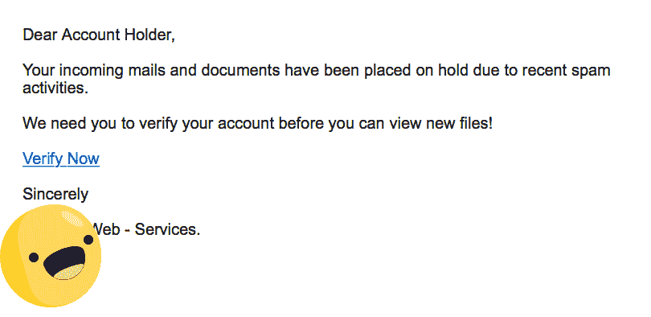
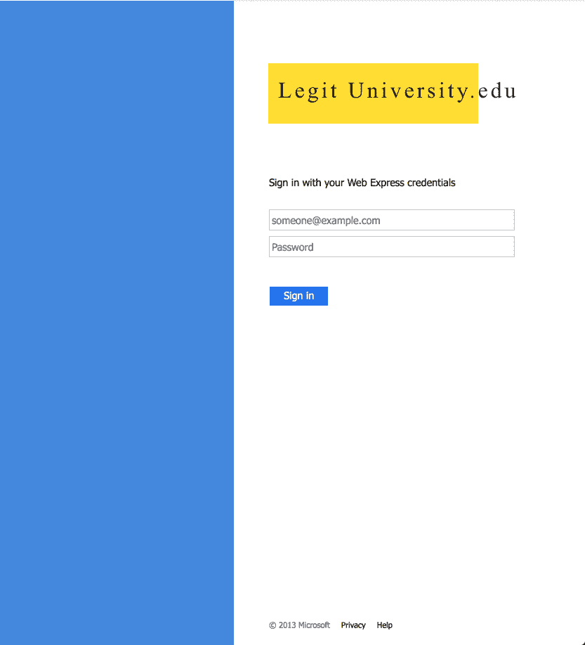
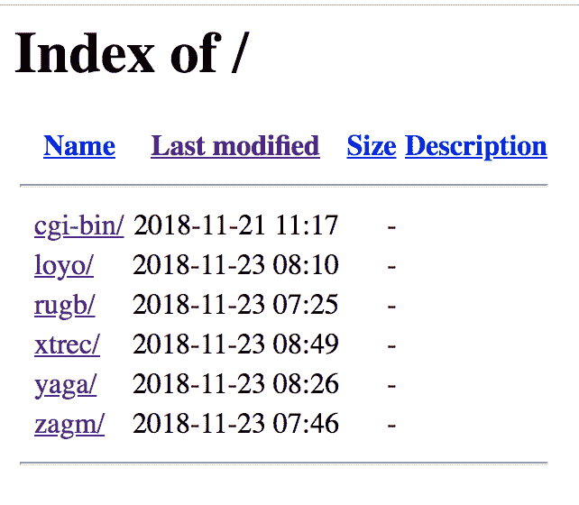

# 一个假想的网络钓鱼攻击案例

> 原文：<https://dev.to/flaque/a-hypothetical-case-of-a-phishing-attack-4ig7>

假设我们收到一封来自旧大学地址的电子邮件，内容如下:

[](https://res.cloudinary.com/practicaldev/image/fetch/s--ZQiwHK9d--/c_limit%2Cf_auto%2Cfl_progressive%2Cq_auto%2Cw_880/https://i.imgur.com/gNeME22.png)

相貌👌**合法的。**👌

它来自一个`.edu`电子邮件地址！看起来不像恶搞。信头和地址相符。

可能只是 5 年前毕业的人，真的喜欢用生日当密码。我们甚至可以招募现在的大四学生麦克斯韦·杜林来帮助我们探索。

让我们说，纯粹为了故事的目的，我们点击这个“立即验证”的业务，看看所有大惊小怪的是什么。

# 密码广场

它可能看起来像，我不知道，这个:

[](https://res.cloudinary.com/practicaldev/image/fetch/s--YQrt3Ze---/c_limit%2Cf_auto%2Cfl_progressive%2Cq_auto%2Cw_880/https://i.imgur.com/5Mo7PRs.png)

也许它来自某个 url，比如:

```
https://bougurh.club/%20yaga/legit.edu/index.html 
```

Enter fullscreen mode Exit fullscreen mode

# 让我们来看一看

我们应该检查谁是这个`https://bougurh.club`站点的根。

他们只是向你展示他们的结构。他们甚至同时袭击多所大学:

[](https://res.cloudinary.com/practicaldev/image/fetch/s--ggqFVdDd--/c_limit%2Cf_auto%2Cfl_progressive%2Cq_auto%2Cw_880/https://thepracticaldev.s3.amazonaws.com/i/5e8i45lhg5ujyxykzcaj.png)

## 嗯我们能发现什么？

网站用的是 https，那么那个证书是哪里来的呢？我们可以用 [SSLHopper](https://www.sslshopper.com/) 看看它是从哪里来的。我们的 SSL 是几天前才创建的，所以这个人可能还没干多久。

嗯，我们可以用`dig`来窥探他的域名系统。这家伙没用 www！[恐怖！](https://dev.to/flaque/what-wait-why-heroku-doesnt-want-you-to-be-naked-1j0h)他也有一个这样的 IP:

```
184.95.x.x 
```

Enter fullscreen mode Exit fullscreen mode

如果我们谷歌一下这个 IP 地址，就会发现他使用的是 Secured Servers LLC，这家公司在处理滥用指控方面并没有什么好名声。

# 我们登录后会发生什么？

如果我们试图在这个网站上输入我们的详细信息，他们会试图发送一个`POST`到一个`/post.php`,后者只是以明文形式记录电子邮件和密码，然后将我们重定向到 Microsoft Outlook。

由于大多数学生已经登录了他们的电子邮件，看起来好像登录成功了。受害者可能都不会注意到。

那就是...可能很糟糕。

# 那么我们能做什么呢？

我们可以联系学校的 IT 部门。但是现在是假期，没有人会回来找我们。

我们可以联系他们的域名提供商。但还是那句话:假期。

主机提供商？让我给你拼出来

```
them.stuffFaceWithTurkey(); 
```

Enter fullscreen mode Exit fullscreen mode

# 那么我们*真的*能做什么呢？

嗯，我们*可以*给他们发送狗的 ascii 艺术图片:

```
 _.-.._         _._
                                     _,/^^,y./  ^^^^"""^^\= \
                                     \y###XX;/  /     \    ^\^\
                                       '\Y^   /   .-==||==-.)^^
                   ,.-=""""=-.__       /^ (  (   -/<0>++<0>(
                 .^      .: . . :^===(^ \ (  (  /'''^^^^^^^)
                /      .: .,GGGGp,_ .(   \   /    /-(o'~'o))
              .^      : . gGG"""YGG}. \   )   / /  _/-====-\
             /       (. .gGP  __ ~~ . .\  \  (    (  _.---._)
            /        (. (GGb,,)GGp. . . \_-^-.__(_ /______./
           (          \ . '"!GGP^ . . . . ^=-._--_--^^^^^~)
           (        /^^^\_. . . . . . . . . . . . . . . . )
           )       /     /._. . . . . . . . . . . . . ._.=)
           \      /      |  ^"=.. . . . . . . ._++""\"^    \
            \    |       |       )^|^^~'---'~^^      \     )
            )   /        )      /   \                 \    \
            |'  |        \     /\    \                (    /
            |   |         (   (  \ . .\               |   (
            )   |         )   )   ^^^^^^              |   |
           /. . \         |  '|                       )   (
           ^^^^^^         )    \                      /. . \
                          / . . \                     ^^^^^^
                          ^^^^^^^

                     s'ko go dem zig zags
                        zippity zooms 
```

Enter fullscreen mode Exit fullscreen mode

看，如果我是一个`l33t`黑客，我肯定会**喜欢**看到我的~~受害者~~最好的朋友把狗的 ascii 艺术图片作为`username`发给我，把随机的赞美和有趣的事实作为`password` :

```
const passwords = [
    'hello mr hackerman we love you very much',
    'mr hackerman come join our club, we need new members',
    'do it dude we wana be your friends',
    'did you know bunnies actually die if they eat too many carrots',
    'https://i.ytimg.com/vi/Lv4SQy_9VLI/maxresdefault.jpg',
    'https://b0bcbb6c170cbb78f6d6-94268459969555eabeaba635a28d70e3.ssl.cf2.rackcdn.com/landing/april2015/bunny5.jpg',
    'http://3.bp.blogspot.com/-xfI3IZT7-8E/UgQb6czrRpI/AAAAAAAAEvA/FOICuW1x_YY/s1600/36+forgot+to+stop+being+a+fetus.jpg',
    'https://readjack.files.wordpress.com/2012/02/cute_bunny.jpg',
    'mr hackerman dont feed bunnies too much lettuce; its like candy for them and theyll get fat',
    'mr hackerman feed your bunnies a lot of lettuce so theyll get fat its adorable',
    'mr hackerman you should rate our bunnies 0-10 how good of a bunny is it (this is a test the answer is 11)',
    'if our ascii art doesnt show up correctly blame cpanel not us',
    'mr hackerman did you red pandas use their tails as blankets',
    'mr hackerman did you know sheep can recognize facial expression and they like smiles',
    'mr hackerman did you know polarbears touch noses when they meet each other',
    'mr hackerman did you know baby elephants suck on their trunk for comfort',
    'mr hackerman did you know that monkeys make snowballs and throw them at each other',
    'mr hackerman did you know that a cat has been the mayor of a town in alaska for 17 years',
    'mr hackerman did you know that dogs exist',
    'mr hackerman did you know that cats exist',
    'mr hackerman did you know that you can save 15% or more when you switch to geico'
] 
```

Enter fullscreen mode Exit fullscreen mode

没有什么比看着我的日志被淹没更让我开心的了，以至于很难读到任何“合法”的请求。

# 好吧好吧，我们可以送他们赞美和狗吗？那又怎样？他们不会直接过滤掉吗？

是啊。但是如果我们做点更狡猾的事情。

相反，如果我们给他们发送“真正的”请求会怎么样呢？我们可以像这样做一个小的`cURL`:

```
const curl = (username, password, userAgent) => {

  const cmd = `curl '${kiddysite}' 
    -H 'User-Agent: ${userAgent}' 
    -H 'Accept: text/html,application/xhtml+xml,application/xml;q=0.9,*/*;q=0.8' 
    -H 'Accept-Language: en-US,en;q=0.5' --compressed 
    -H 'Referer: https://bougurh.club/%20yaga/someuni.edu/Sign-In.html' 
    -H 'Content-Type: application/x-www-form-urlencoded' 
    -H 'Connection: keep-alive' 
    -H 'Upgrade-Insecure-Requests: 1' 
    --data
    'UserName=${username}&Password=${password}&AuthMethod=FormsAuthentication'`

  exec(cmd, (err, stdout, stderr) => {
    console.log(`stdout: ${stdout}`);
    console.log(`stderr: ${stderr}`);
    if (err !== null) {
        console.log(`exec error: ${err}`);
    }
  })
} 
```

Enter fullscreen mode Exit fullscreen mode

然后，我们可以使用类似于 [faker.js](https://github.com/Marak/faker.js) 的东西来生成听起来真实的电子邮件地址，比如:

```
jwhite@someUniversity.edu
mMcarthy2@otherUniversity.edu 
```

Enter fullscreen mode Exit fullscreen mode

然后，我们可以用这样一个小函数生成“听起来真实”的密码:

```
function randomFakePassword() {
    switch (Math.floor(Math.random() * 10)) {
        case 0:
            return randomFakeEmail()
        case 1:
            return faker.date.past() + faker.commerce.color()
        case 2:
            return faker.hacker.abbreviation + Math.floor(Math.random() * 10)
        case 3:
            return faker.address.streetAddress()
        case 4:
            return faker.address.country() + Math.floor(Math.random() * 10) + faker.address.state()
        case 5:
            return "passw" +  Math.floor(Math.random() * 10) + "rd" + faker.commerce.color()
        case 6:
            return faker.company.companyName()
        case 7: 
            return faker.finance.bitcoinAddress()
        case 8:
            return faker.address.streetName() + Math.floor(Math.random() * 10) + "pass"
        default:
            return faker.finance.accountName()
    }
} 
```

Enter fullscreen mode Exit fullscreen mode

为了获得额外的乐趣，我们甚至可以再次使用`faker`创建不同的用户代理。

然后，随着时间的推移，我们可以创建随机的超时和请求。这样，我们的黑客就被 ascii 艺术“抓住”了，但也不能轻易地过滤掉“好的”数据。

# 这到底是在做什么？

很多 l33t 黑客都是新手。他们复制/粘贴代码，设置得很糟糕。他们不是专家。

这意味着他们经常容易受惊。在这种情况下，他们只需要一百个请求就可以关闭他们的网站。

但假设他们没有在恐慌中关闭所有的网站。这能达到什么目的呢？

这可能会减慢他们的速度。

他们从 CPanel 日志上读取电子邮件和密码。他们不是国家安全局。他们的许多工作将是手工的。

如果我们能给他们加载一堆假密码和电子邮件，我们就能给 IT 部门封锁域名和向学生发出警告的机会。

我们也给自己时间联系他们的主机提供商并报告滥用。

# 这是处理这种情况的正确方法吗？

不。向当局报告，让他们处理。这毕竟只是假设。

* * *

*这篇文章在创作、内容和意外事故方面得到了[马克斯韦尔·杜林](http://maxwelldulin.com/)的大力帮助，他是一位狂热的安全爱好者和正在找工作的工程师！给我发信息，我会给你他的联系方式。*