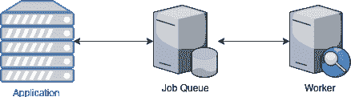
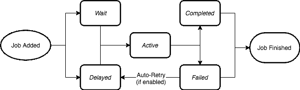
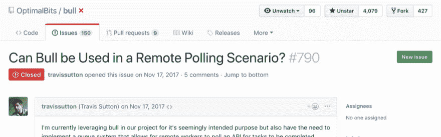

# 使用 Bull.js 管理 Node.js 微服务堆栈中的作业队列

> 原文：<https://dev.to/aleccool213/a-job-queue-for-a-micro-service-world--4b26>

> 想要更多这样的精彩内容？注册订阅我的时事通讯，请访问:[Alec . coffee/注册](//alec.coffee/newsletter)

当切换到面向微服务的堆栈而不是单一的整体时，新的问题出现了。过去简单的作业处理器不适合这种新的体系结构。我们找到了 Bull，一个 Node.js 包，来满足我们的需求，但是需要调整以适应这个新世界。由于这个模块是开源的，我知道我们对它的改进可以很容易地集成到主远程 repo 中。

## 目标

比方说，我们想做一些专门的工作，例如扫描图像提取文本。在这种情况下，作业队列可以派上用场，这项工作在后台完成，远离面向用户的界面。

*   从用户获取图像
*   将附有图像的作业排队
*   工作开始了
*   作业结果被发送回应用程序数据库

两种在野外很受欢迎的包装可以帮助你做前面提到的工作，它们是 DelayedJob 和芹菜。这些允许您使用像 Redis 这样的快速密钥库来管理作业。这些假设**作业的处理和作业队列生活在同一个服务**中。如果你有一个服务执行一个任务，例如图像处理器，而另一个服务作为一个作业队列，我们不能使用这些传统的结构。

This (Diagram 1)

|  |

对抗

This (Diagram 2)

|  |

## 一解

我和我的同事发现自己处于这种情况，当寻找答案时，我们发现 Bull 可能就足够了。保持它 2018，这个 Node.js 包快得像闪电一样，是为了与 Redis 一起工作而构建的，并且有一个活跃的社区。起初，它并不完全符合我们的需求，因为它在与队列机制相同的应用程序中处理作业，见图 1。这对于传统的应用程序来说很好，但是对于我们的设置，我们需要跨系统管理作业(见图 2)。我们需要以一种异步的方式完成这项工作，在这种方式下，工作人员可能与运行 Bull 本身的服务不在同一个 repo 或服务中。

我们需要考虑如何管理工作的生命周期。好消息是最近有人为 Github 项目贡献了一个图表。

Bull's Job Lifecycle [Diagram](https://github.com/OptimalBits/bull/blob/develop/docs/job-lifecycle.png)

|  |

Bull 有一个简单的方法来定义处理逻辑(参见图 1)，当一个作业在`active`队列中时做什么:

```
queue.process(async () => {
  doWork()
}) 
```

Enter fullscreen mode Exit fullscreen mode

这样，每当一个任务进入`waiting`队列时，Bull 知道如何处理它，并把它扔给`completed`队列。现在，Bull 自己管理所有的状态转换，我们需要切换到手动。你可能会想，“为了以这种新的方式工作，我们不定义这个`process`方法怎么样？”，我们试过这个，它*起作用了！*。我们前进到杂草中。

> 但是对于我们的设置，我们需要跨系统管理作业

在深入研究了代码之后，Bull 在两个简单的对象上定义了状态转换方法，`Job`和`Queue`。

经过研究，进行手动状态转换的方法是私有的。这意味着作者没有编写这些公开使用的方法。这是有道理的，因为 Bull 从来就不是为了做我们想做的事情而设计的。我们需要做些什么来将这些公之于众？经过进一步挖掘，我们发现有人试图做和我们一样的事情。

The issue can be found [here.](https://github.com/OptimalBits/bull/issues/790)

|  |

仅仅使用私有函数就可以了，但是我们是专业的开发者。T3】

> 我建议您编写一些单元测试，专门测试使用私有函数的代码...- @manast

维护者有一个很好的建议，为私有函数编写单元测试。下一个最好的方法是至少为这些函数编写文档，这样它们就能被社区所理解，并增强其公开使用的可行性。这就是我们所做的。

## 开源红利

对于我们在开始描述的实际模式(图 2)，添加了参考文档[和](https://github.com/OptimalBits/bull/pull/1017/files#diff-375fc823554b090375d9c47199cb5ee2R201)以使其成为可行的模式。使这成为一个已知的模式会鼓励使用该特性，并可能导致其他用户在生产中使用时发现问题。打字稿类型也是可用的，所以我们也更新了[和那些](https://github.com/DefinitelyTyped/DefinitelyTyped/pull/27816)。使用一段时间后(处理大约。500，000 个任务)，我们发现了一个 bug，[用我们扩展的软件包知识轻松修复了这个 bug。谈谈把三等舱的功能带到头等舱吧！](https://github.com/OptimalBits/bull/pull/1096)

我对这个项目的结果非常满意，因为我们不仅满足了我们的需求，还做出了开源贡献。这让我们理解了包的内部结构，也让我们能够轻松地为我们的用例添加特性。拥有一个了解内部和外部的积极的项目维护者也使得整个过程顺利进行。