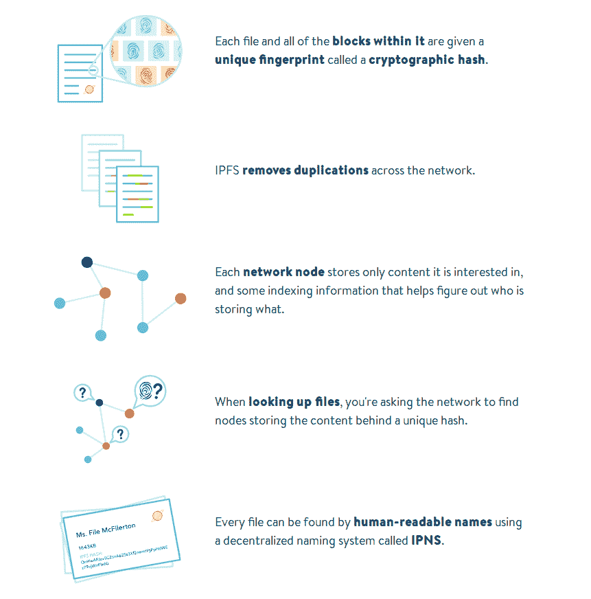

# 关于 IPFS 的一点点

> 原文：<https://dev.to/chenge/a-little-about-ipfs-2l4o>

今天，我看了关于 IPFS 的视频。我不能完全理解它，我会再看一遍。

[https://www.youtube.com/embed/jONZtXMu03w](https://www.youtube.com/embed/jONZtXMu03w)

下面是 IPFS 的简短介绍:

> 正如官方网站描述的那样，IPFS 是“让网络更快、更安全、更开放的对等超媒体协议”。

 [## 安全冲刺:新互联网

### 宝拉 11 月 9 日 182 分钟阅读

#protocol #ipfs #security](/terceranexus6/security-sprint-the-new-internet-7fj)