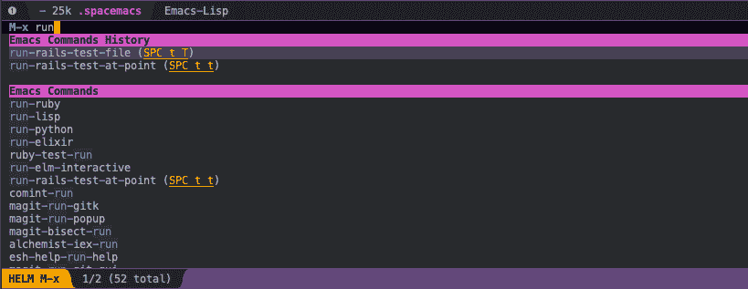
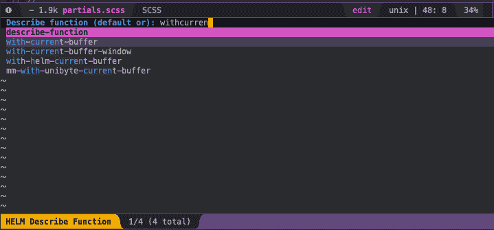
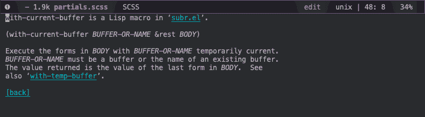
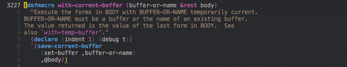

# 一点点 ELISP 来改进您的 RAILS 测试

> 原文：<https://dev.to/zimski/a-little-of-elisp-to-improve-your-rails-testing-5fma>

## 为什么选择 spacemacs

我是 **vim** 的超级粉丝，但是当我在同一时间为多个项目编码时，我很纠结。
最大的痛苦也是当我需要在承诺之前看到差异的时候。

所以几年前我开始使用 spacemacs (vim 模式),我很喜欢它。我仍然使用 vim 来编辑一些配置文件，但主要代码在 spacemacs 上。

## 太空飞船内部测试轨道很烂

现在，我主要为 rails 项目编写了大量的 ruby 代码，官方`ruby layer`中包含的测试函数并不适合用`minitest`进行现代 rails 测试。

现在有了`rails`，当我们调用`bundle exec rails test`时，代码将试图找到`spring`进程并调用里面的测试。
`spring`进程通过缓存大大缩短了 ruby 的启动时间和所有 rails 项目的加载时间。

在 spacemacs 中，您的光标在测试方法中，您点击了`space m t t`，这将只运行这个测试，但是他通过使用`ruby ..... [your test file]`调用您的测试，这将不会利用 rails 中提供的 rake test 命令中完成的所有优化。

更危险的是，这将刷新您的`dev`数据库，并用您的测试夹具填充它。

坏坏....非常糟糕的事情。

## 在得到 elips 的帮助之前，我在做什么

我在某个地方打开了一个终端，当我需要运行测试时，我切换到它并尝试键入测试的名称和测试的行号。

```
bundle exec rails test test/system/ ... / ... / ... / my_test_file_test.rb:123 
```

Enter fullscreen mode Exit fullscreen mode

## Elisp，请帮帮我！

我用`Elisp`写了一个小函数，因为我想学习&练习这种强大的语言。

这是代码，可以改进，但谁在乎呢，这是在做:D 的工作

```
 (defun run-rails-test-file ()
    (interactive)
    (let ((filename (ruby-test-find-file)))
      (compile (format "bundle exec rails test %s" filename))))

  (defun run-rails-test-at-point ()
    (interactive)
    (let* ((filename (ruby-test-find-file))
           (buffername (get-file-buffer filename)))
      (with-current-buffer buffername
        (let ((line (line-number-at-pos (point))))
          (compile (format "bundle exec rails test %s:%s" filename line))))
      )
    )

  (spacemacs/set-leader-keys "mtt" 'run-rails-test-at-point)
  (spacemacs/set-leader-keys "mtT" 'run-rails-test-file) 
```

Enter fullscreen mode Exit fullscreen mode

## 我们来解释一下这段代码

`(interactive)`:用`space space`
[](https://res.cloudinary.com/practicaldev/image/fetch/s--YsHop4sd--/c_limit%2Cf_auto%2Cfl_progressive%2Cq_auto%2Cw_880/https://thepracticaldev.s3.amazonaws.com/i/kcocx45m3lkbq2zp1ji5.png) 使您的函数可调用

`ruby-test-find-file`:如果是测试文件，该函数将输出当前缓冲区的路径....(要说出令人吃惊或高兴的事情)听着....如果您在一个非测试文件中，它还将返回最后访问的测试文件。

这非常有用，想象你当前的缓冲区是一个测试文件，你运行测试，它失败了，所以你切换到包含代码的实际文件，你调整它，你想重新运行测试，**不需要再次切换到测试文件**，这个函数会为你处理它。

我重用了在`spacemacs ruby layer`中定义的函数。

## 自己理解代码

在 Emacs 中，一切都是一个函数，您可以阅读所有这些函数的实际代码。在 spacemacs 中，**最好的**助手是`Space h d f`，它会自动补全你的函数名，并向你显示文档/代码。

让我们试着理解一下`with-current-buffer`是什么意思

键入`SPACE h d f`并开始键入函数的名称。

[](https://res.cloudinary.com/practicaldev/image/fetch/s--EZLHD7xF--/c_limit%2Cf_auto%2Cfl_progressive%2Cq_auto%2Cw_880/https://thepracticaldev.s3.amazonaws.com/i/aowq9oo688wfpi4txxek.png)

哦看这个这个小可爱，打`enter`

[](https://res.cloudinary.com/practicaldev/image/fetch/s--n-_WiChf--/c_limit%2Cf_auto%2Cfl_progressive%2Cq_auto%2Cw_880/https://thepracticaldev.s3.amazonaws.com/i/jz0zxg7ktjyf2jacke2z.png) 
一切都有据可查！

现在让我们来看代码，将光标移到文件名上，然后点击 Enter
[](https://res.cloudinary.com/practicaldev/image/fetch/s--PiCPhXOs--/c_limit%2Cf_auto%2Cfl_progressive%2Cq_auto%2Cw_880/https://thepracticaldev.s3.amazonaws.com/i/pyy2n44nr0aoh1200ivw.png)

我们可以递归搜索，并在每次按键时学习更多的东西。

希望你已经学到了一些新的东西，也许这将有助于你在这个不可思议的软件 Emacs 上的 rails 工作流程！