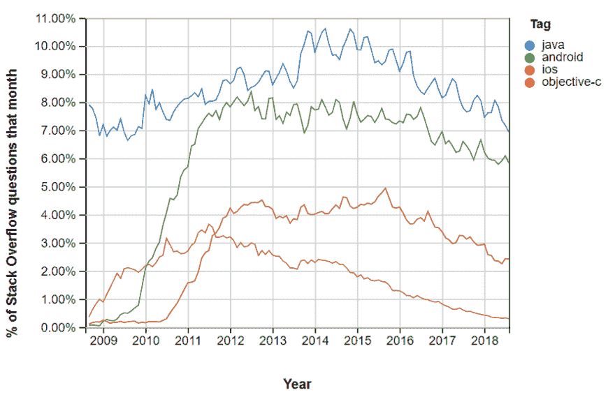
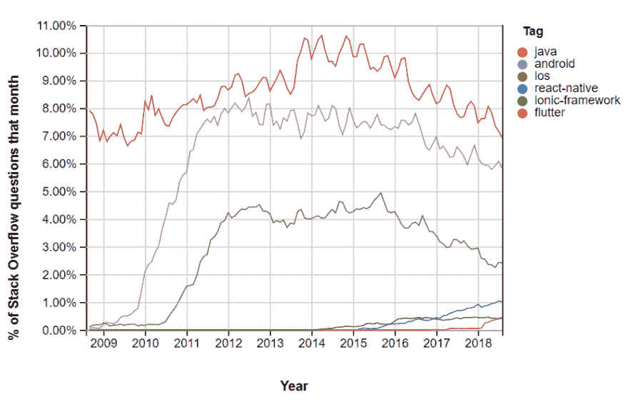
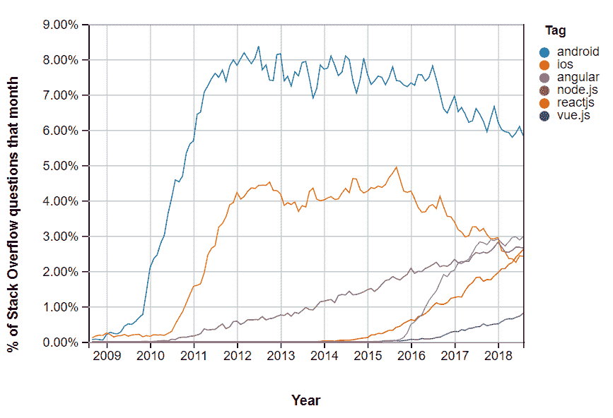

# 看看堆栈溢出移动与网络流行趋势

> 原文：<https://dev.to/ben/a-look-at-stack-overflow-mobile-vs-web-popularity-trends-43ci>

我想分享一个有趣的对话，它出现在另一个关于语言趋势的话题中...

 [ Thomas Iguchi ](/tiguchi) • [<time datetime="2018-12-12T21:13:33Z" class="date-short-year"> Dec 12 '18 </time>](https://dev.to/tiguchi/comment/7g80) 

实际上，在尝试了不同的关键词后，我注意到，当涉及到移动应用开发的问题时，总体上有一个下降的趋势，这里是 android 和 ios 之间的[比较](https://insights.stackoverflow.com/trends?tags=java%2Cobjective-c%2Candroid%2Cios)，为了更好地衡量，我还添加了 Java 和 Objective-C:

我最初认为像 React-Native 和 Flutter 这样的跨平台开发平台正在大量增加，但是情况似乎并没有发展到这种程度:

但是[网络开发问题](https://insights.stackoverflow.com/trends?tags=android%2Cios%2Cvue.js%2Creactjs%2Cangular%2Cnode.js)有一个显著的上升趋势:

 [ Casey Brooks ](/cjbrooks12) • [<time datetime="2018-12-13T00:03:24Z" class="date-short-year"> Dec 13 '18 </time>](https://dev.to/cjbrooks12/comment/7ga4) 

我真的想知道这些图表的下降趋势有多少实际上是由于兴趣降低，或者仅仅是因为答案已经存在，不再需要问了。上升趋势肯定表明增长，但下降趋势...也许只是成熟和时间的标志，不一定是人气下降。

 [ Thomas Iguchi ](/tiguchi) • [<time datetime="2018-12-13T00:24:53Z" class="date-short-year"> Dec 13 '18 </time>](https://dev.to/tiguchi/comment/7ga9) 

有趣的想法...还有几个可能起作用的因素:

*   Android 文档和教程在过去几年里有了很大的改进
*   Stackoverflow 戒备森严。副本通常是关闭的。差问题删除。我想知道这些在“堆栈溢出趋势”中是否也被考虑在内
*   有些问题没有标签。这很少见，但是搜索“android-[Android]”(Android 这个词减去标签 Android)会出现 10 万个结果

所以，是的，我想这是有道理的，我们已经达到了类似“问答饱和”的 Android。

我也在想一些其他的事情...该图的 Y 轴单位是每月提问的所有问题的百分比，而不是问题的绝对数量。我假设每月问的问题数量会随着时间的推移而变化。

假设活跃的 Stackoverflow 社区在过去几年中也在增长，我想与 Java 和 Android 处于鼎盛时期的几年前相比，我们每个月都会遇到更多的问题。

也许每个月 Java 问题的实际数量没有下降，只是相对于平台上所有问题的相对数量？

近年来，我们确实有了更多发挥更大作用的技术。

但是另一方面...我不是数据科学家或分析师。我不知道这是什么意思

我认为有趣的是，这场对话应该有几个方向，而且有很多有趣的数据。

快乐编码