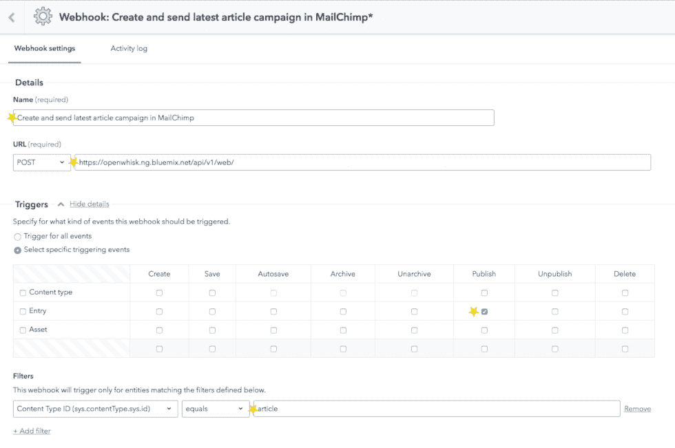
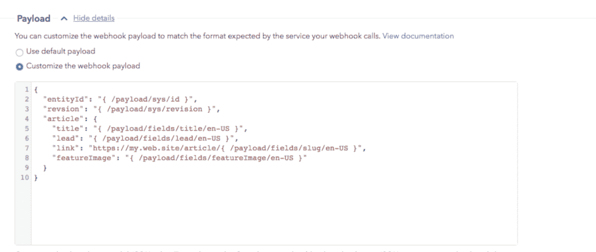
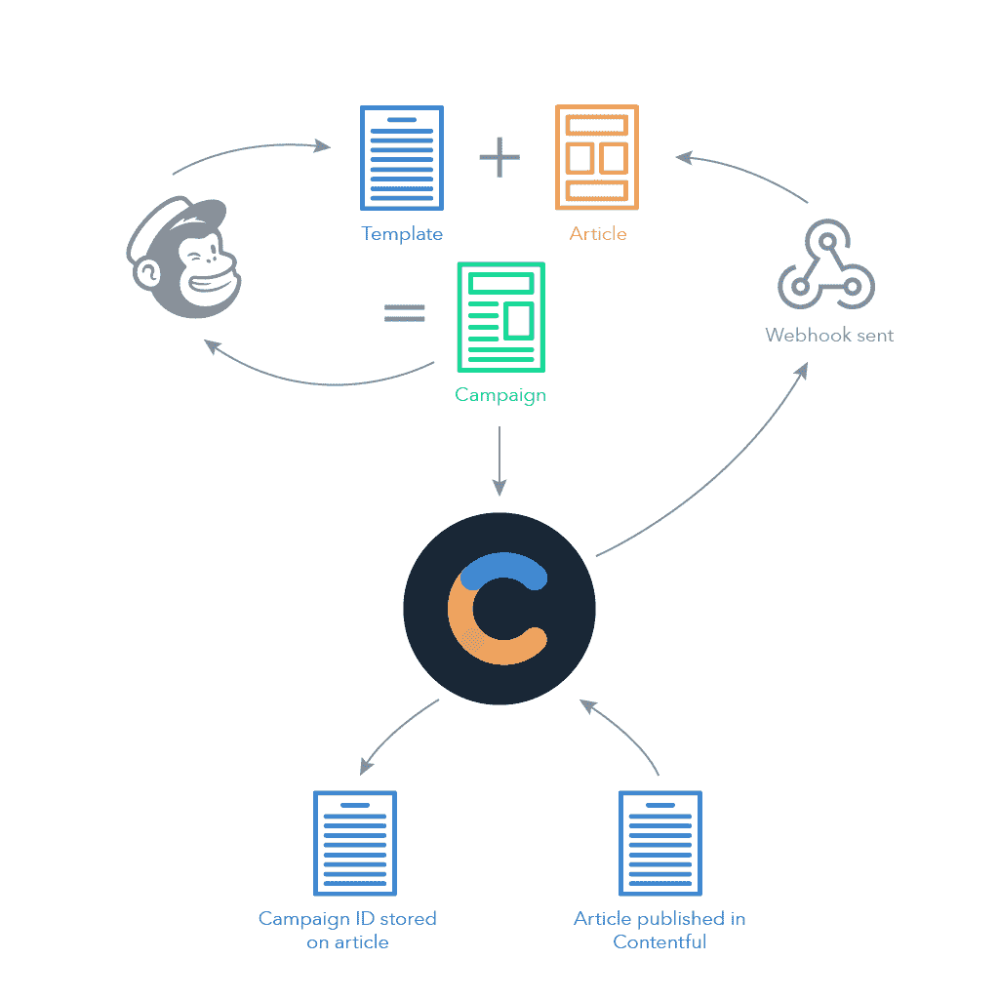

# 用内容丰富的 webhooks 创建 MailChimp 活动的松散耦合方法

> 原文：<https://dev.to/contentful/a-loosely-coupled-approach-to-creating-mailchimp-campaigns-with-contentful-webhooks-18ne>

[](https://res.cloudinary.com/practicaldev/image/fetch/s--XbXxLJnw--/c_limit%2Cf_auto%2Cfl_progressive%2Cq_auto%2Cw_880/https://images.ctfassets.net/fo9twyrwpveg/3sFayiWPLakGoKMmcw0GAK/f9436b3a64bb727a755e43efe0cc7885/20181127-mailchimp-webhooks.png)

如果没有人知道引人注目的内容已经出版，那么制作这些内容就毫无意义。尽管电子邮件的地位由来已久，但它仍然是宣传新内容的一种非常流行和有效的方法。

多年来，主要的群发电子邮件提供商，如 MailChimp，都提供 RSS 活动，当在提要中检测到新帖子时，自动创建并发送电子邮件。

所以，你可以简单地在你的网站上生成一个 RSS 提要，因为这相对容易设置——但是有一些限制，尤其是如果你的电子邮件不简单的话。组合多个数据源(比如添加一个推广)通常意味着多个 RSS 提要。为了得到您想要的格式，您很可能最终会在生成 RSS 提要的函数中包含一些设计。

Contentful 提供了一种非常现代、高度灵活的方法来生成电子邮件通知，使您的代码和设计完全分离，同时省去 RSS 中间人。

通过利用 Contentful 的 webhooks 功能和云功能，我们可以基于发布事件本身创建、安排甚至发送活动，而不是基于不断变化的 RSS 提要。

因此，让我们更深入地研究一下，在 MailChimp 中引发一场运动的必要条件。

## 创建 MailChimp 模板

我们解决方案的一个关键目标是保持设计和代码分离。我们希望能够使用 MailChimp 接口对模板进行更改。如果您不是管理模板设计的人，这一点尤其重要。

为了实现这种分离，我们需要以一种特殊的方式创建一个 MailChimp 模板。

[](//images.ctfassets.net/fo9twyrwpveg/bveM8Nk3uwY4yc6uKwqse/f4fdd11e96f81ffc99e1dd3b8b1f041e/image_0.png)

### 一个 MailChimp 可编辑章节的初级读本

MailChimp 的模板是为可视化编辑器设计的。它们允许设计者通过给 HTML 标签添加一个`mc:edit`属性来定义[可编辑部分](https://mailchimp.com/help/create-editable-content-areas-with-mailchimps-template-language/)。这允许非设计人员通过选择模板和简单地填写部分来创建活动。

MailChimp API 提供了对模板的可编辑部分的访问，并可以返回可编辑部分及其默认值的列表。您可以用自己的内容填充这些区域，并使用更新后的对象来更新您的活动内容。

可编辑部分的最大优势是它们基本不受 MailChimp 重新格式化 HTML 的习惯的影响。但是通过 API 使用可编辑部分也有许多缺点:

**你不能用它们来更新属性**

您只能使用可编辑部分来替换元素的文本值(或 innerHTML)。例如，您不能设置图像标签的`src`属性或超链接标签的`href`属性。

**您不能给两个可编辑部分相同的名称**

如果您想在模板中的多个位置使用相同的值，这显然会很棘手。请记住，模板实际上是为可视化编辑器准备的，这不是问题。

**您不能设置可重复内容的名称**

例如，如果您有一个文章列表，您可以使用`mc:repeatable`属性为列表中的每篇文章重复模板的一部分。这个可编辑的部分将被标记为`repeat_1`，下一组可重复的内容将被标记为`repeat_2`，以此类推。

这不是一个不可克服的问题，但是我们希望我们的解决方案是松散耦合的，不需要依赖于按照一定顺序的可重复部分。

那么，如果我们不能独占使用可编辑的部分，我们如何把我们的内容放到模板中呢？解决方案是一个可编辑的内容区域和一种 JSON 友好的模板语言。

### MailChimp +小胡子

事实证明， [Mustache 模板](http://mustache.github.io)在 MailChimp 中工作得相当好，这是一个好消息，因为 Mustache 学习起来很快，并且已经在许多语言中实现。然而，还是有一些问题...

首先，你不能使用 Mustache 标签作为超链接的一部分，否则 MailChimp 会对标签进行转义(我说过可编辑的部分基本上不受 MailChimp 的影响)。必须是整个环节。

其次，我们的小胡子标签需要包含在一个可编辑的部分中。否则，MailChimp 将删除独立的 Mustache 循环和条件标签。

## 心满意足的去 MailChimp

有了 MailChimp 模板知识，我们现在可以考虑从 Contentful 中的发布事件到在 MailChimp 中发送活动的实际过程。我们不会深究细节，因为您将有自己特定的语言和云函数提供者选择。

[这里是 IBM 云操作](https://github.com/pommiegranit/contentful2mailchimp)的示例 Python 代码。

### 用 webhook 捕获发布事件

一切都从一个内容丰富的 webhook 开始。如果你是 webhooks 的新手，很快[就会达到速度](https://www.contentful.com/developers/docs/concepts/webhooks/?utm_campaign=mailchimp-campaign-contentful-webhooks&utm_medium=referral&utm_source=devto&utm_content=mailchimp-campaign-contentful-webhooks&utm_term=)。

要仅在发布特定内容类型(例如文章)时触发 webhook，我们将执行以下操作:

1.  选择*选择具体的触发事件*，勾选*仅在 Entry *上发布事件
2.  为*内容类型 ID* 添加一个过滤器，并将其设置为*文章*

[](//images.ctfassets.net/fo9twyrwpveg/63TTpQevC0UMOO2CwAaOES/32711724b09c2838ef0818e1234330d0/image_1.png)

### 仅创建一次活动

在 Contentful 中，发布不是一次性事件，但我们肯定只想创建一次活动。

我们的云函数可以检查项目的修订版是 1，以确保它只在初始发布时创建一个活动。但是，该活动不会反映第一次发布事件和发送活动之间所做的任何内容更新。

或者，我们可以跟踪我们是否已经创建了一个活动，方法是让我们的云功能使用 Contentful 的内容管理 API 在创建活动时将 MailChimp 活动 id 添加到文章中。

如果云函数在任何后续调用的有效负载中找到一个活动 id，那么它可以从 MailChimp 中检索现有的活动并更新其内容，而不是创建一个新的活动。

### 准备内容

为了呈现活动的 HTML，云函数需要将 JSON 内容和模板传递给 Mustache 的呈现函数。我们需要考虑如何尽可能简单地使用它，特别是如果模板是由别人在 MailChimp 中设计和管理的话。

默认的 webhook 有效负载是发布项目的 *raw* JSON。它至少包含一个翻译，因此我们的 fields 属性可能如下所示:

```
"fields" : {
    "title": {
      "en-US": "Who’s to blame when driverless cars have an accident?"
    },
} 
```

模板可以使用诸如`{{fields/title/en-US}}`这样的引用，但是这很麻烦。如果 JSON 看起来更像这样，对我们的模板设计者来说就容易多了:

```
"article" : {
    "title": "Who’s to blame when driverless cars have an accident?"
    },
} 
```

这也意味着你可以使用同一个模板进行多种翻译。

那么，我们如何简化 JSON 呢？我们的云函数可以简化 JSON，但是我们需要知道我们想要使用哪种翻译。或者我们可以简单地在内容丰富的 webhook 设置中定制有效负载。

[](//images.ctfassets.net/fo9twyrwpveg/bDXSs4lEDQw4cSuKCisCE/c029d4b031e09787898fd94dac9ddbcb/image_2.png)

使用后一种方法，我们可以重新格式化有效载荷，这样我们的 Contentful webhook 就能以它需要的格式提供我们的云函数需要的数据。这包括创建新的结构，比如文章和新的字段，比如我们使用 slug 属性创建的链接。

现在有效载荷看起来像这样:

```
{
  "entityId": "5Z0zO4TQxquSukOy2AsAqS",
  "revsion": 3,
  "article": {
    "title": "What happens when companies remove expiry dates on gift cards?",
    "lead": "Removing expiry dates should increase sales and give consumers more flexibility, but it could also increase costs.",
    "link": "https://my.web.site/article/what-happens-when-companies-remove-expiry-dates-on-gift-cards",
    "featureImage": {
      "sys": {
        "type": "Link",
        "linkType": "Asset",
        "id": "1htqr8cW3QICCWsuYu22GA"
      }
    }
  }
} 
```

我们的云功能还需要扩展链接资产，比如 featureImage。这需要从 Contentul 中检索每个资产，并用资产的字段属性替换 sys:

```
"featureImage": {
    "sys": {
        "type": "Link",
          "linkType": "Asset",
          "id": "1gvEe7haACqsquQ0MAa6Y4"
    }
} 
```

变成了:

```
"featureImage": {
    "file": {
        "url": "https://example.com/slug",
        "title": "An example image"            }
    }
} 
```

根据您的模板，您可能需要递归地这样做来完全展开内容。

这可能看起来开销很大。但是尽可能简化您的内容是值得的，尤其是当您组合多个数据源时。这将使设计过程更快更容易，更少挫折，更不容易出错。Contentful 最近[发布的 webhook 模板](https://www.contentful.com/blog/2018/11/19/new-features-fall-2018-developer-productivity-modern-stack/?utm_campaign=mailchimp-campaign-contentful-webhooks&utm_medium=referral&utm_source=devto&utm_content=mailchimp-campaign-contentful-webhooks&utm_term=)可以帮助你更容易地做到这一点。

### 渲染 HTML

您可能还记得，mustache 模板位于 MailChimp 模板中一个名为 Mustache 的可编辑部分。

我们的云函数使用 MailChimp API 的[template/{ template _ id }/default-content](https://developer.mailchimp.com/documentation/mailchimp/reference/templates/default-content/)端点检索 MailChimp 模板。Mustache 模板是`sections > mustache`属性的值。

cloud 函数通过将简化的内容和 Mustache 模板传递给 Mustache 引擎的 render 函数来生成 HTML。

现在我们有了 HTML 内容，我们可以创建一个活动。

### 在 MailChimp 中创建活动

为了创建活动，我们的云函数向 MailChimp API 的[活动](https://developer.mailchimp.com/documentation/mailchimp/reference/campaigns/#create-post_campaigns)端点发送以下有效负载:

```
{
        "type" : "regular",
        "recipients" : {
            "list_id" : "<your-list-id>"
        },
        "settings" : {
            "template_id" : <your-template-id>,
            "folder_id" : "<your-folder-id>",
            "title" : "Campaign title in MailChimp",
            "from_name" : "Contentful",
            "reply_to" : "blog@contentful.com",
            "subject_line" : "Email subject line",
            "preview_text" : "Preview text"
        }
} 
```

创建活动时，只有类型和`recipients > list_id`是必需的。但是，如果未设置`from_name`、`reply_to`、`title`和`subject_line`，您将无法发送活动。

在我们的上下文中，`template_id`也是必不可少的。它允许我们通过提供更新的模板对象来更新活动内容。

使用`folder_id`是保持 MailChimp 整洁的好方法。与 RSS 活动不同，我们为每个发布事件创建一个活动，因此创建一个特定的文件夹可以让我们将它们放在一起。

`subject_line`和`preview_text`几乎肯定取决于你的内容。

如果调用成功，MailChimp API 将返回一个 campaign 对象。

### 设置活动内容

为了更新内容，我们使用以下有效负载对 MailChimp API 的[campaign/{ campaign _ id }/content](https://developer.mailchimp.com/documentation/mailchimp/reference/campaigns/content/)端点进行 PUT 调用:

```
 "template" : {
            "id" : <your-template-id>,
            "sections" : {
                "content" : HTML
            }
        } 
```

HTML 是调用 Mustache 的 render 函数的结果。

通过使用模板选项，我们只更新可编辑的部分。在本例中，我们只有一个部分，但是您可以在内容中指定多个部分。如果您想要包含预先渲染和存储的内容(如促销)，这可能会很有用。

我们的活动内容现已完成，可以发送了。

### 发送、调度和测试

虽然你可以使用 MailChimp API 立即发送一个活动，但是 T2 调度是更谨慎的方法。

你不希望你的广告在文章发表前就被发送到订阅者的收件箱里。坚持有规律的时间表进行有规律的运动有相当大的好处。

或者，您可能更喜欢自动[发送一封测试电子邮件](https://developer.mailchimp.com/documentation/mailchimp/reference/campaigns/#action-post_campaigns_campaign_id_actions_test)作为提示，让某人在安排交付之前查看内容。

## 包装完毕

[](//images.ctfassets.net/fo9twyrwpveg/42v9I1TQ3KAago2uS8GyyC/bb339478c9f08d1224d1a517ce2105c9/20181127-DIAGRAM_mailchimp-webhooks.png)

我们已经了解了如何使用 Contentful 中的发布事件在 MailChimp 中自动创建活动。

MailChimp 的一些行为和我们希望在 MailChimp 中保留模板设计的愿望意味着我们必须有点创造性。也就是说，能够在 MailChimp 中使用 Mustache 模板可以使这个过程变得更加容易。

事实上，我们已经看了一个非常简单的例子。你可以用扎皮尔达到同样的效果。所以，只要你的云函数能把数据拉进来，你就可以想怎么复杂就怎么复杂。

而且，一旦你创建了 webhook 并在 Contentful 中捕获了发布事件，你就打开了无数的可能性——电子邮件只是其中之一，你几乎肯定也会想在你的社交媒体渠道上发布。

集成 Contentful 的容易性意味着我们可以自动化这些过程；最大限度地降低出错风险，极大地提高扩展能力。