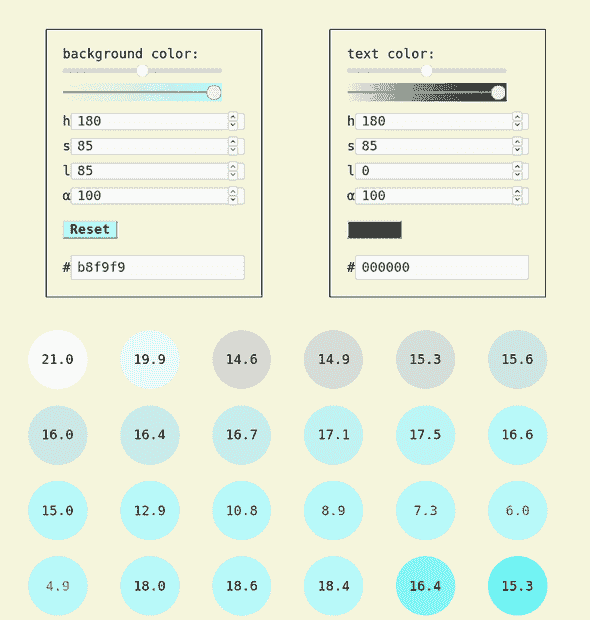

# 带有 HSL 和 React 的单色调色板

> 原文：<https://dev.to/metamn/a-monochromatic-palette-with-hsl-and-react-1pn2>

挑两种颜色…瞧！

## 挑选一种背景色

1.  也许它应该是暖的，这是 HSL 标度的右半部分，就像从 180 度开始的色调。
2.  或许应该去饱和一点(100% → 85%)，而不是完全闪亮。
3.  如果你想让文本颜色变暗，给背景增加更多的亮度(50% → 85%)。这是目前的默认设置。
4.  如果你想让文本颜色变浅，减少背景颜色的亮度(尝试 25%)，增加文本颜色的亮度(尝试 85%)。

## 选择文字颜色

1.  从黑色开始，设置为与背景色相同，但亮度为 0%。
2.  您可以增加/减少亮度，直到文本颜色在背景上仍然合格，即。色彩对比度大于 4.5

## 自动生成单色调色板

1.  你会得到相反的配色方案。
2.  你会得到所有其他配色方案的原色阴影仍然是合格的。

## 去做

1.  我们需要真实的用例，如博客、登录页面或营销网站，以更好地调整算法。
2.  这些真实的用例必须是语义化的，主题化的。选择两种颜色应该足以完全设计这些用例。例如，英雄应该自动具有反转的配色方案，即通过原始配色方案突出显示行动号召按钮。后来，一个不太重要的部分必须有一个主导的配色方案。诸如此类。

## 活例子和代码

在[故事书](https://tinyurl.com/y7mftg53)和 [Github](https://github.com/metamn/mr-ui/tree/master/src/basics/ColorsHSL) 上