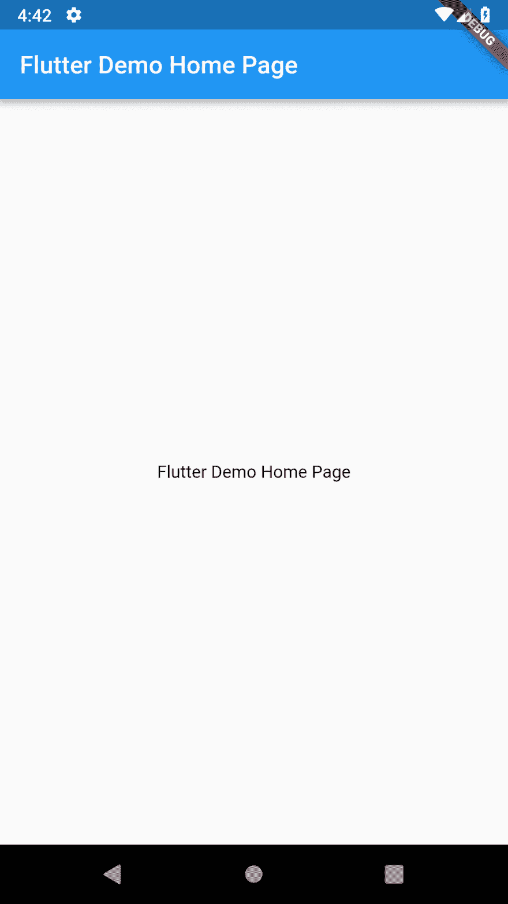

# 动荡的一个月:初始主题

> 原文：<https://dev.to/abraham/a-month-of-flutter-initial-theme-248l>

*最初发表于[bendyworks.com](https://bendyworks.com/blog/a-month-of-flutter-initial-theme)。*

我还没有一个完整的主题设计，但我计划在一个干净和极简的方向。所以让我们采用当前的默认设计，稍微清理一下。

[](https://res.cloudinary.com/practicaldev/image/fetch/s--6gTNopBF--/c_limit%2Cf_auto%2Cfl_progressive%2Cq_auto%2Cw_880/https://thepracticaldev.s3.amazonaws.com/i/s00n8a3140iywc037265.png)

这个主题清理的代码有一些变化。首先，我们将改变[状态栏](https://material.io/design/platform-guidance/android-bars.html#status-bar)和[导航栏](https://material.io/design/platform-guidance/android-bars.html#android-navigation-bar)的颜色。 [`SystemChrome`](https://docs.flutter.io/flutter/services/SystemChrome-class.html) 变化将进入`main`功能。我们还必须导入`services`才能访问`SystemChrome`。

```
import 'package:flutter/services.dart';

void main() {
  runApp(MyApp());

  SystemChrome.setSystemUIOverlayStyle(
    const SystemUiOverlayStyle(
      statusBarColor: Colors.white,
      systemNavigationBarColor: Colors.white,
      systemNavigationBarDividerColor: Colors.black,
      systemNavigationBarIconBrightness: Brightness.dark,
    ),
  );
}
~~~

_Note that a full restart of the app is needed for the system UI color changes._

The next change is customizing the [theme](https://flutter.io/docs/cookbook/design/themes) on `MaterialApp`. These changes disable the debug banner, tell `MaterialApp` to be in `light` [brightness mode](https://docs.flutter.io/flutter/material/ThemeData/brightness.html), and set a few colors to white. The title is also changed to just `Birb`.

~~~dart
MaterialApp(
  debugShowCheckedModeBanner: false,
  title: 'Birb',
  theme: ThemeData(
    brightness: Brightness.light,
    primaryColor: Colors.white,
    scaffoldBackgroundColor: Colors.white,
  ),
  home: const MyHomePage(title: 'Birb'),
);
~~~

The next change is to center the title of the `AppBar` and remove it's `elevation` (shadow).

~~~dart
AppBar(
  title: Center(
    child: Text(widget.title),
  ),
  elevation: 0.0,
),
~~~

And the final change is to update and center the placeholder text. This will eventually turn into a widget to display when there are no images to show.

~~~dart
const Center(
  child: Text('No Birbs a birbing'),
)
~~~

Now we have this nice clean base theme to continue building on.


If you want to learn more about theming Flutter apps, check out the [Building Beautiful UIs with Flutter](https://codelabs.developers.google.com/codelabs/flutter/index.html) codelab.

## Code changes

- [#15 Implement a clean theme](https://github.com/abraham/birb/pull/15) 
```

Enter fullscreen mode Exit fullscreen mode