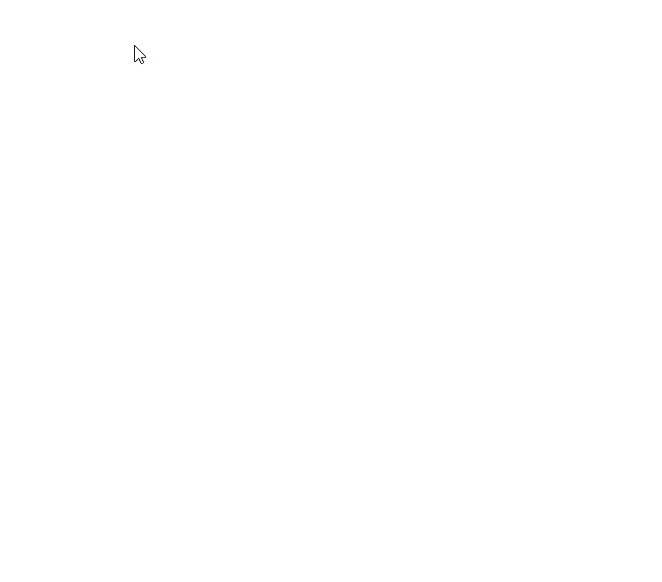
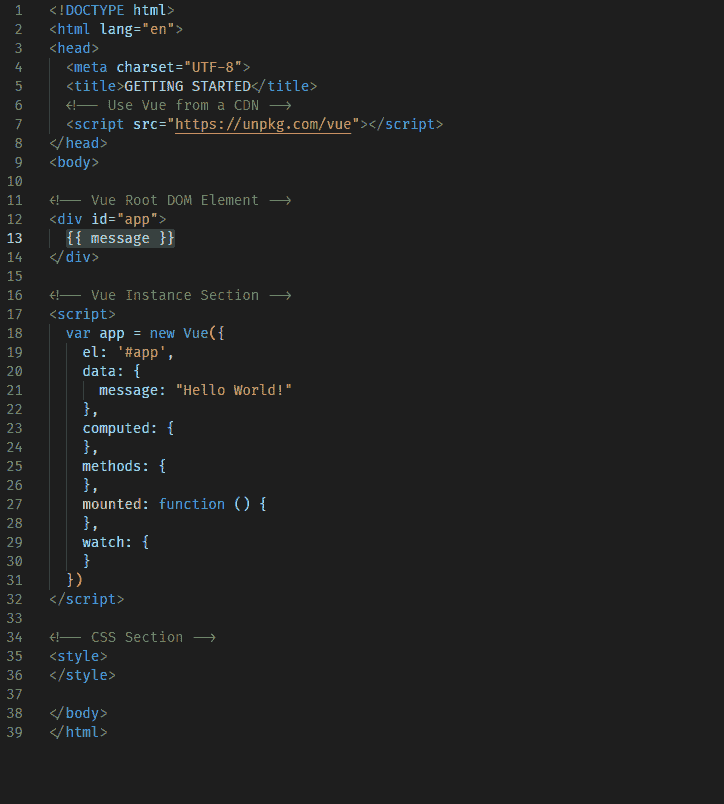

# JavaScript30 - 08 上的新 Vue 与 HTML5 Canvas 一起玩

> 原文：<https://dev.to/davefollett/a-new-vue-on-javascript30---08-fun-with-html5-canvas-86m>

本文是 JavaScript30 系列文章【T1 A New Vue】的一部分，该系列文章探索了使用 [Vue](https://vuejs.org) 重新实现 Wes Bos 的([@ Wes Bos](https://twitter.com/wesbos))[# JavaScript 30](https://JavaScript30.com)项目。今天我将使用#JavaScript30 的 **08 Fun with HTML5 Canvas** 项目。这个项目使用了一个`<canvas>`元素来提供一种有趣的方式，通过点击和拖动鼠标在浏览器窗口中绘图。当你画的时候，线条会变大变小，颜色也会改变。这是一个动态的 gif 图片。

## 🔑“概念”视图

*   `mounted`生命周期挂钩
*   事件绑定
*   方法
*   特殊属性-参考

## 🏗️ Vue 实施

第一步和我的其他文章一样，从我的[入门](https://dev.to/davefollett/a-new-vue-on-javascript30---getting-started-4o61)文章中抓取[基础启动文件](https://github.com/davefollett/JavaScript30/blob/master/00%20-%20Getting%20Started/index-VUE.html)，并将原始#JavaScript30 项目中的代码插入到它们对应的 Vue 位置。

*   HTML 部分被放在根目录`
`中
*   将`cxt`、`isDrawing`、`lastX`、`lastY`、`hue`和`direction`变量放入`data`部分
*   `draw()`功能被放入`methods`部分
*   页面加载时执行的 JavaScript 被放在了`mounted`函数中
*   不需要`computed`和`watch`部分，将其移除
*   `<style>`部分被原封不动地移到我的 Vue 版本中

这一次，“开始”步骤几乎是所有需要做的事情，但是我们仍然有一些事情要做。首先，我们需要处理`<canvas>`元素上的事件。在 [#JavaScript30](https://JavaScript30.com) 版本中，用`addEventListener()`函数调用设置了`mousedown`、`mousemove`、`mouseup`和`mouseout`的事件。对于 Vue 版本，我使用 Vue 事件绑定`@mousedown`、`@mousemove`、`@mouseup`和`@mouseout`将事件直接附加到`<canvas>`元素上。注意，我使用 Vue 的简写符号进行事件绑定，而不是使用`v-on`。

然后，为了获得对`<canvas>`元素的引用，我使用了 Vue 的特殊属性 [ref](https://vuejs.org/v2/api/#ref) ，而不是 [#JavaScript30](https://JavaScript30.com) 如何使用`document.querySelector('#draw')`。通过在 html `<canvas>`元素上设置一个`myCanvas`的`ref`，我可以在以后作为`this.$refs.myCanvas`直接访问它。这就完成了 HTML 部分，如下图所示。