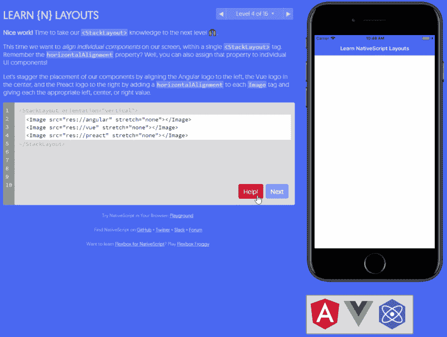
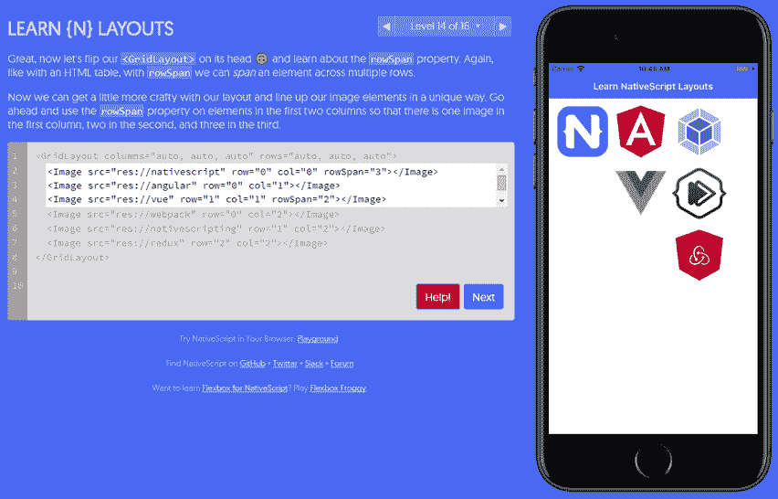

# 学习原生脚本布局的新方法

> 原文：<https://dev.to/progress/a-new-way-to-learn-nativescript-layouts-2nig>

当你与刚接触移动应用开发的人谈论 NativeScript 时，通常对话中会包含这样一句话:

你甚至可以使用你的网络技能，比如 JavaScript、CSS 和 XML

那个人看着你说，“所以...XML 是 web 技能？”😕。

的确如此，就像 HTML 定义了 UI 元素的表示一样，XML(在 NativeScript-land 中)对真正的本地 UI 元素的表示也做了同样的事情。

```
<Page>
  <StackLayout>
    <Label text="This is a Label!" />
    <Button text="Tap Me" />
  </StackLayout>
</Page> 
```

Enter fullscreen mode Exit fullscreen mode

大多数情况下，人们会联想到`<TextField>` == `<input type="text">`、`<Button>` == `<input type="button">`等概念。当您引入 [NativeScript 布局容器](https://docs.nativescript.org/ui/layout-containers)的概念时，有时会出现混淆。

> 关于 NativeScript 布局的概述，请查看 Jen Looper 的文章[揭开 NativeScript 布局的神秘面纱](https://developer.telerik.com/featured/demystifying-nativescript-layouts/)

## 布局容器？

NativeScript 布局容器实际上是某种 HTML `<div>`。然而，不止是一个`<div>`，它们描述了原生 UI 元素应该在屏幕上呈现的方式。例如，`<StackLayout orientation="vertical">` *将*元素堆叠在彼此之上，*将*垂直堆叠。够简单吗？

[](https://res.cloudinary.com/practicaldev/image/fetch/s--lRkBSxrJ--/c_limit%2Cf_auto%2Cfl_progressive%2Cq_66%2Cw_880/https://raw.githubusercontent.com/rdlauer/articles/master/nativescript/learn-ns-layouts/stack-layout.gif)

但是布局会很快变得复杂。这就是为什么学习如何构造适当和有效的布局是学习用 NativeScript 编码的关键部分。

## 学习 NativeScript 布局

进入一个我亲切地称之为*学习 NativeScript 布局*的新工具。我知道，我花了一段时间才想出这个名字。😜

**在[nslayouts.com](https://www.nslayouts.com/)**可用，新的和有经验的 NativeScript 开发者都可以仔细阅读各种练习，学习如何使用几乎每种类型的 NativeScript 布局容器。

[](https://res.cloudinary.com/practicaldev/image/fetch/s--d5oc806Q--/c_limit%2Cf_auto%2Cfl_progressive%2Cq_66%2Cw_880/https://raw.githubusercontent.com/rdlauer/articles/master/nativescript/learn-ns-layouts/stack-layout-advanced.gif)

基于支持 [Flexbox Froggy](http://flexboxfroggy.com/) 的相同代码库， *Learn NativeScript Layouts* 让你轻松地学习布局容器，从基本的`<StackLayout>`开始，到更复杂(更强大)的`<GridLayout>`结束。

[](https://res.cloudinary.com/practicaldev/image/fetch/s--fVLM0tJr--/c_limit%2Cf_auto%2Cfl_progressive%2Cq_auto%2Cw_880/https://raw.githubusercontent.com/rdlauer/articles/master/nativescript/learn-ns-layouts/grid-layout.png)

你还在等什么？今天就试试[nslayouts.com](https://www.nslayouts.com/)吧，让我知道你的想法(一定要把它传给任何本地的书呆子！).一切都是开源的，所以你可以在[的 Github repo](https://github.com/rdlauer/nslayouts) 中尽情抱怨。