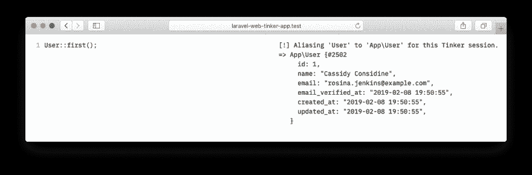
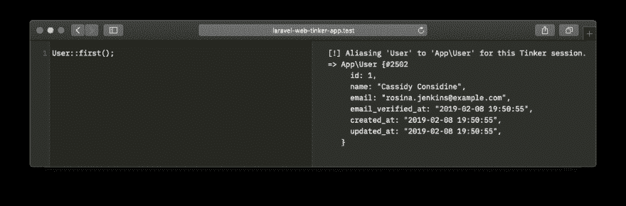

# ★在浏览器中使用 Artisan Tinker 的包

> 原文：<https://dev.to/freekmurze/a-package-to-use-artisan-tinker-in-your-browser-4aj1>

Laravel 自带了一个非常方便的 [`tinker`](https://laravel.com/docs/5.7/artisan#tinker) 开箱命令。不幸的是，在命令行上运行多行代码，或者编辑刚刚执行的代码，可能会有点麻烦。这就是为什么我们创造了[一个叫做 laravel-web-tinker](https://github.com/spatie/laravel-web-tinker) 的新包，它允许你在浏览器中运行任意代码。

安装后，它看起来是这样的:

[](https://res.cloudinary.com/practicaldev/image/fetch/s--IQjfs9pH--/c_limit%2Cf_auto%2Cfl_progressive%2Cq_auto%2Cw_880/https://freek.dev/uploads/media/laravel-web-tinker/light.png)

还有一种黑暗模式可用:

[](https://res.cloudinary.com/practicaldev/image/fetch/s--dh2BlH3o--/c_limit%2Cf_auto%2Cfl_progressive%2Cq_auto%2Cw_880/https://freek.dev/uploads/media/laravel-web-tinker/dark.png)

引擎盖下，是这样工作的。每当您按下`cmd+enter`时，代码将通过 HTTP 请求发送到服务器。 [`WebTinkerContoller`](https://github.com/spatie/laravel-web-tinker/blob/0c8c4eacb982554a5fb8e98b1598debbb1c60d08/src/Http/Controllers/WebTinkerController.php) 将通过 [`Tinker`](https://github.com/spatie/laravel-web-tinker/blob/master/src/Tinker.php) 类传递代码。代码将在那里执行，结果将作为响应返回。那里没什么特别的。

因为这个包可以任意运行代码，所以我们建议不要将它安装在生产环境中，或者任何处理真实世界数据的环境中。我们强烈建议您使用`--dev`标志
来安装包

```
composer require spatie/laravel-web-tinker --dev 
```

这意味着当您在生产服务器上运行`composer install --no-dev`时，这个包不会被安装(这是您应该已经在做的事情)。

还有一些配置选项。查看 GitHub 上的自述文件，了解关于这个包的更多信息。

快乐修补！