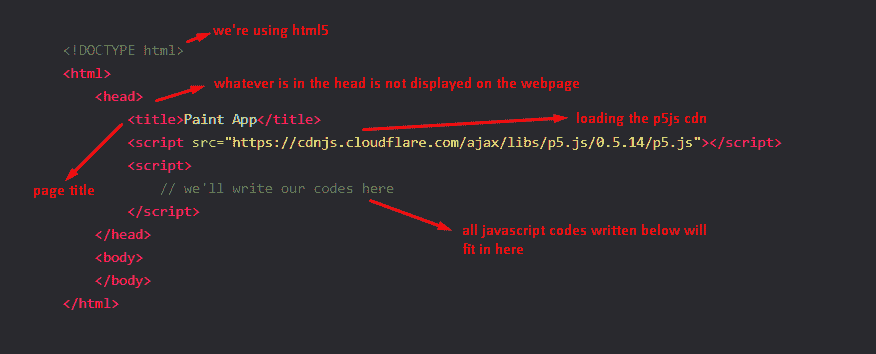
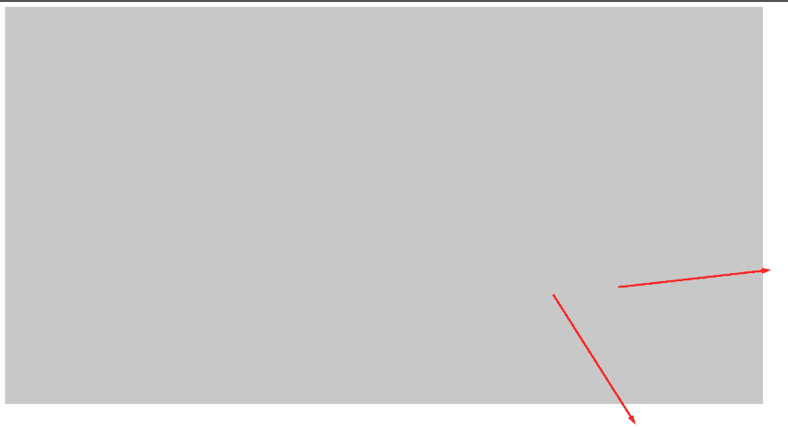
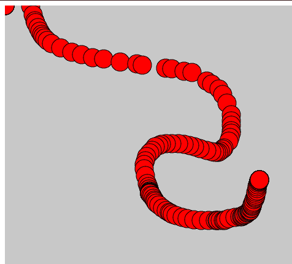
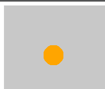
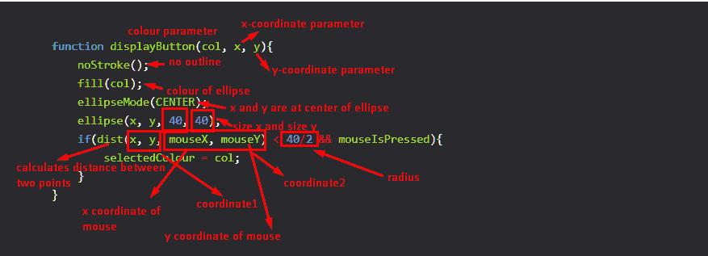
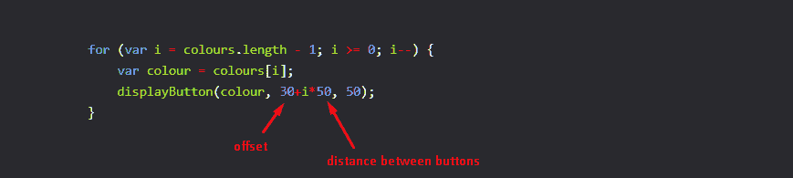
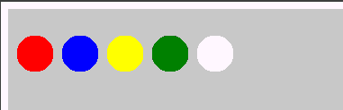
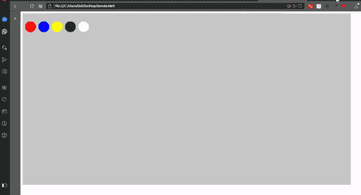

# 25 行 Js 代码的绘画应用程序

> 原文：<https://dev.to/abdurrahmaanj/a-paint-app-in-25-written-js-lines-1eal>

一个轻松的画图 app，用 p5js。和一些 p5js 信息，以防你是新手！

## 解释标题

**嗯我为什么要写呢？**

很简单，因为在 25 行 JS 中，不像你说的那样，p5js 有 1000+行，所以你的整个程序是 1000+行。

**我为什么放 Js？**

那是因为它在一个 HtML 页面中，而且...我明确指出我们谈论的是 Js。

让我们开始吧！

## 骷髅来陷害你

```
<!DOCTYPE html>
<html>
    <head>
        Paint App
        <script src="https://cdnjs.cloudflare.com/ajax/libs/p5.js/0.5.14/p5.js"></script>
        <script>
            // we'll write our codes here
        </script>
    </head>
    <body>
    </body>
</html> 
```

给你一些信息

[](https://res.cloudinary.com/practicaldev/image/fetch/s--tDpLBKNx--/c_limit%2Cf_auto%2Cfl_progressive%2Cq_auto%2Cw_880/https://thepracticaldev.s3.amazonaws.com/i/j3xlpjloa549axoxvyhs.png)

## 加工简介

处理有两个主要功能，设置和绘制功能

setup 函数包含初始化，draw 函数包含我们想要更新的内容

```
...
<script>
function setup(){

}

function draw(){

}
</script>
... 
```

## 大小和背景

```
...
<script>
function setup(){
    createCanvas(windowWidth-50, windowHeight-50);
    background(200);
}
function draw(){

}
</script>
... 
```

给了我们这个

[](https://res.cloudinary.com/practicaldev/image/fetch/s--YOus_Cuc--/c_limit%2Cf_auto%2Cfl_progressive%2Cq_auto%2Cw_880/https://thepracticaldev.s3.amazonaws.com/i/1yl8j9r64w407529e5t3.png)

这两个箭头向我们显示，由于我们指定了-50，所以遗漏了一些空格。我这样做是为了不让页面滚动

背景(200)；实际上是告诉把背景涂成灰色。0 代表黑色，255 代表白色，200 介于两者之间

真正的办法是

```
background(200, 200, 200); 
```

代表相同数量的红、蓝、绿

## 颜色和全局变量

让我们添加两个全局变量，在绘制前选择颜色

```
var colours = ['red', 'blue', 'yellow', 'green', '#fdf'];
var selectedColour = 'red'; 
```

指定一个数组使我们可以很容易地改变可用的选项。请注意，我们可以在这里传入正常的 css 颜色(#fdf)

选择颜色意味着当我们画画时，我们只用一种颜色。改变颜色会改变画笔的颜色。我们只需要在点击按钮时改变这个变量。

## 我们将使用的技巧

让我们把它们添加到我们的绘图函数中

```
function draw(){
    fill(selectedColour);
    ellipse(mouseX, mouseY, 30, 30);
} 
```

我们得到
[](https://res.cloudinary.com/practicaldev/image/fetch/s--tHQfQNKO--/c_limit%2Cf_auto%2Cfl_progressive%2Cq_auto%2Cw_880/https://thepracticaldev.s3.amazonaws.com/i/zs5xaebzv9j1hffgsog5.png)

这是因为在我们的绘图函数中没有背景

## 本店显示按钮功能

在设置功能
前增加显示按钮功能

```
function displayButton(col, x, y){
    noStroke();
    fill(col);
    ellipseMode(CENTER);
    ellipse(x, y, 40, 40);
    if(dist(x, y, mouseX, mouseY) < 40/2 && mouseIsPressed){
        selectedColour = col;
    }
} 
```

它在绘图功能
中的一种用法

```
displayButton('orange', 100, 100); 
```

给了我们

[](https://res.cloudinary.com/practicaldev/image/fetch/s--G67enX-U--/c_limit%2Cf_auto%2Cfl_progressive%2Cq_auto%2Cw_880/https://thepracticaldev.s3.amazonaws.com/i/1ak3kwxivq6qvakrkpl9.png)

以下是一些解释

[](https://res.cloudinary.com/practicaldev/image/fetch/s--1hEfLW6g--/c_limit%2Cf_auto%2Cfl_progressive%2Cq_auto%2Cw_880/https://thepracticaldev.s3.amazonaws.com/i/nbyxtdw6e7554myohptm.png)

## 显示按钮

在绘图功能中

```
 for (var i = colours.length - 1; i >= 0; i--) {
        var colour = colours[i];
        displayButton(colour, 30+i*50, 50);
    } 
```

一些注释

[](https://res.cloudinary.com/practicaldev/image/fetch/s--xaXTy5Tw--/c_limit%2Cf_auto%2Cfl_progressive%2Cq_auto%2Cw_880/https://thepracticaldev.s3.amazonaws.com/i/m3d81xqc9pr1pv59dobe.png)

这给了我们

[](https://res.cloudinary.com/practicaldev/image/fetch/s--8EzVHBKt--/c_limit%2Cf_auto%2Cfl_progressive%2Cq_auto%2Cw_880/https://thepracticaldev.s3.amazonaws.com/i/fe5kpfmawrbggfx9f6ux.png)

## 现在绘图

绘图是通过使用
(在我们的绘图函数中)实现的

```
 if(mouseIsPressed){
        fill(selectedColour);
        ellipse(mouseX, mouseY, 20, 20);
    } 
```

## 我们的全部代码

```
<!DOCTYPE html>
<html>
    <head>
        Paint App
        <script src="https://cdnjs.cloudflare.com/ajax/libs/p5.js/0.5.14/p5.js"></script>
        <script>
function displayButton(col, x, y){
    noStroke();
    fill(col);
    ellipseMode(CENTER);
    ellipse(x, y, 40, 40);
    if(dist(x, y, mouseX, mouseY) < 40/2 && mouseIsPressed){
        selectedColour = col;
    }
}
function setup(){
    createCanvas(windowWidth-50, windowHeight-50);
    background(200);
}
var colours = ['red', 'blue', 'yellow', 'green', '#fdf'];
var selectedColour = 'red';
function draw(){
    for (var i = colours.length - 1; i >= 0; i--) {
        var colour = colours[i];
        displayButton(colour, 30+i*50, 50);
    }
    if(mouseIsPressed){
        fill(selectedColour);
        ellipse(mouseX, mouseY, 20, 20);
    }
}
        </script>
    </head>
    <body>
    </body>
</html> 
```

## 在行动

[](https://res.cloudinary.com/practicaldev/image/fetch/s--rGSx56TA--/c_limit%2Cf_auto%2Cfl_progressive%2Cq_66%2Cw_880/https://thepracticaldev.s3.amazonaws.com/i/cczo7xh4n0psrxlxyonr.gif)

## 包装完毕

处理很容易，任何问题只需 ping！

img 鸣谢:Unsplash 上的 David Pisnoy