# 一幅画胜过千言万语

> 原文：<https://dev.to/jskongress/a-picture-is-worth-a-thousand-words-2pai>

图片中的#jskongress 2019 日程表— #throwbackthursday

[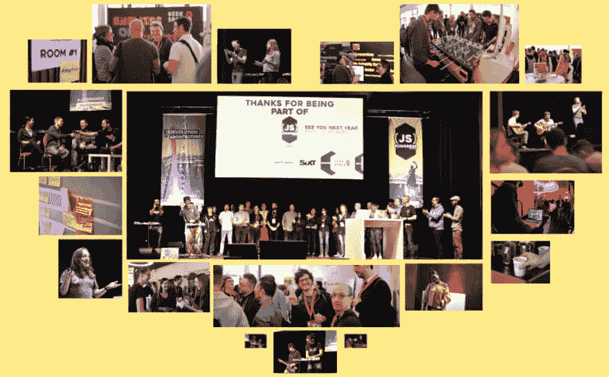](https://res.cloudinary.com/practicaldev/image/fetch/s--MRSamRTc--/c_limit%2Cf_auto%2Cfl_progressive%2Cq_auto%2Cw_880/https://cdn-images-1.medium.com/max/1200/1%2AaaVeOuKneQ1cctU8WNFNVw.png)

首先，非常感谢[计划委员会](https://medium.com/@jskongress/the-program-committee-of-js-kongress-19-4a3dd4457c5c)！  他们做得很好，挑选了出色的演讲者，他们把这个有趣又鼓舞人心的节目的精彩部分组合在一起:

[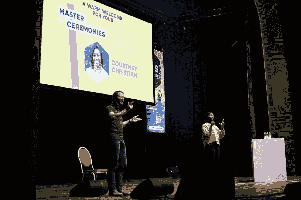](https://res.cloudinary.com/practicaldev/image/fetch/s--KQI-2DIX--/c_limit%2Cf_auto%2Cfl_progressive%2Cq_auto%2Cw_880/https://cdn-images-1.medium.com/max/600/1%2AoxKAOb6RyCP_mxtwn8eQ1Q.jpeg)

<figure>[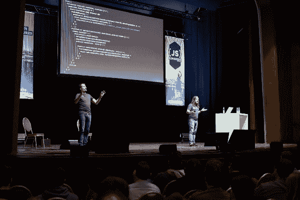](https://res.cloudinary.com/practicaldev/image/fetch/s--CgmnHurk--/c_limit%2Cf_auto%2Cfl_progressive%2Cq_auto%2Cw_880/https://cdn-images-1.medium.com/max/600/1%2Ax6JjyTx6Eb7FygLKWIes_g.jpeg) 

<figcaption>欢迎来到第一天！[手语翻译](https://medium.com/@jskongress/jskongress-for-the-deaf-community-dc8dc69b373c) Christian 和司仪 Courtney 欢迎人群，并以
[Sean t . Larkin](https://medium.com/@jskongress/we-proudly-present-sean-larkin-is-keynote-speaker-for-jsk-2019-66f4db4d399e)的开场主题“一切都是插件:从内到外理解 web pack”开始新的一天。</figcaption>

T13】</figure>

[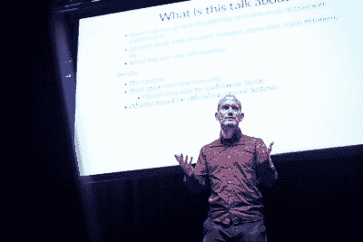](https://res.cloudinary.com/practicaldev/image/fetch/s--zWHdSB5m--/c_limit%2Cf_auto%2Cfl_progressive%2Cq_auto%2Cw_880/https://cdn-images-1.medium.com/max/400/1%2AlYYmbkjU9DuBCEBRpU7ynQ.jpeg)

[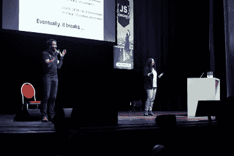](https://res.cloudinary.com/practicaldev/image/fetch/s--MzjZUStB--/c_limit%2Cf_auto%2Cfl_progressive%2Cq_auto%2Cw_880/https://cdn-images-1.medium.com/max/400/1%2ApC8oJqP6oyu7Io7KDNt9aQ.jpeg)

<figure>[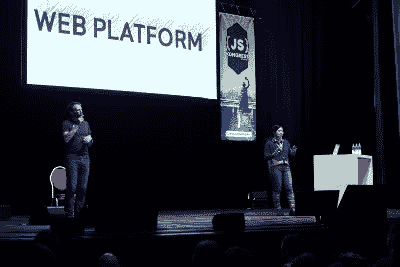](https://res.cloudinary.com/practicaldev/image/fetch/s--XylOsoIm--/c_limit%2Cf_auto%2Cfl_progressive%2Cq_auto%2Cw_880/https://cdn-images-1.medium.com/max/400/1%2AhzjHtxzMZqHTiUyuy3AWvw.jpeg) 

<figcaption>以下是媒体报道:[阿克塞尔·劳施迈尔](https://medium.com/u/7fab51e62203)关于“未来的 JavaScript:还缺少什么？”、 [Tamar Twena](https://medium.com/u/e115ff49f4fd) 关于“如何在 Node.js 服务器中结合事件源架构”和[真理子小坂](https://medium.com/u/12579b0cb1b5)关于“一个 web 平台特性诞生了！——大规模分布式多人工程”。</figcaption>

T12】</figure>

除了为节目提供结构，吉普赛摇摆二重奏还为节目增添了一些艺术元素。

[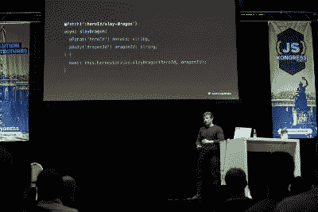](https://res.cloudinary.com/practicaldev/image/fetch/s--fo7VFxbx--/c_limit%2Cf_auto%2Cfl_progressive%2Cq_auto%2Cw_880/https://cdn-images-1.medium.com/max/400/1%2AQZUSO3ZeIASA_HhGbLvSzQ.jpeg)

[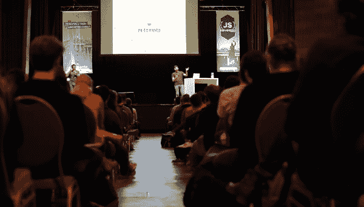](https://res.cloudinary.com/practicaldev/image/fetch/s--I5Vb5ZK_--/c_limit%2Cf_auto%2Cfl_progressive%2Cq_auto%2Cw_880/https://cdn-images-1.medium.com/max/600/1%2ApdKeL_7Dki_aZzNgo7HEgw.png)

<figure>[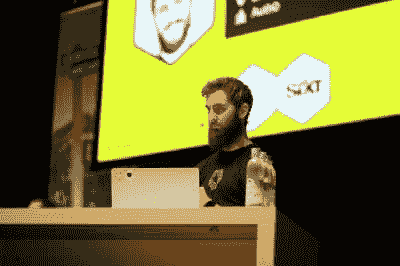](https://res.cloudinary.com/practicaldev/image/fetch/s--ir49rfRH--/c_limit%2Cf_auto%2Cfl_progressive%2Cq_auto%2Cw_880/https://cdn-images-1.medium.com/max/400/1%2Aq7lkOPeUjhCgR5oBRzN0Pw.jpeg) 

<figcaption>下午， [Kamil Mysliwiec](https://medium.com/u/f7cc8266ff67) 分享了如何“驯服 reactive node.js:用 Nest 实现面向流的架构”， [Rubén Sospedra](https://medium.com/u/47396088edc7) “用有限状态机掌握 ui”， [Sam Bellen](https://medium.com/u/357dd491686a) “用 JSON Web Tokens 认证你的单页应用”。</figcaption>

T12】</figure>

[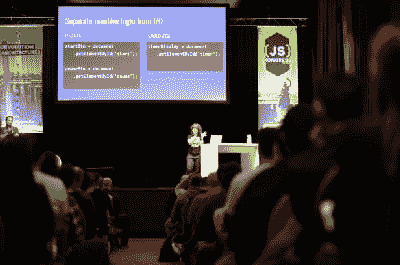](https://res.cloudinary.com/practicaldev/image/fetch/s--orMKqIy4--/c_limit%2Cf_auto%2Cfl_progressive%2Cq_auto%2Cw_880/https://cdn-images-1.medium.com/max/400/1%2AcAbyn9uSivB0L1dJ9_M3sg.jpeg)

[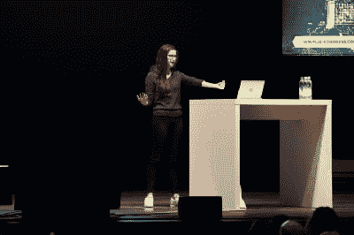](https://res.cloudinary.com/practicaldev/image/fetch/s--AuOn84td--/c_limit%2Cf_auto%2Cfl_progressive%2Cq_auto%2Cw_880/https://cdn-images-1.medium.com/max/400/1%2AZXyTJBN3RXNX-e814642oQ.jpeg)

<figure> 

<figcaption>再深入一点，接下来的会议有 [Netta Bondy](https://medium.com/u/741877312965) 的《像外科医生一样——第一次解剖完全功能反应式的 JavaScript 应用程序》、 [Monica Lent](https://medium.com/u/bb1533445c69) 的《用 Docker 和 Kubernetes 独立部署前端》和 Michael Hladky 的《打造状态管理——基于原则的架构》。</figcaption>

</figure>

[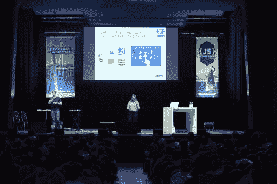](https://res.cloudinary.com/practicaldev/image/fetch/s--MVBK5V8c--/c_limit%2Cf_auto%2Cfl_progressive%2Cq_auto%2Cw_880/https://cdn-images-1.medium.com/max/400/1%2Aki7AaLYar1hTyDEObbuwhA.jpeg)

<figure>[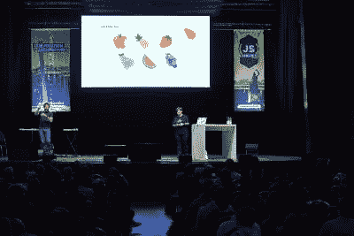](https://res.cloudinary.com/practicaldev/image/fetch/s--IvC8hjKT--/c_limit%2Cf_auto%2Cfl_progressive%2Cq_auto%2Cw_880/https://cdn-images-1.medium.com/max/400/1%2AAStHYCiSViz7CMivfSY3xw.jpeg) 

<figcaption>令人振奋的第二天由令人惊叹的乐队 9v 拉开帷幕，[开幕主题演讲“后灯派的大块”](https://medium.com/@jskongress/offering-you-a-big-piece-of-the-post-lamp-pie-keynote-by-maria-shoaib-af55776b491b)由 [Maria Shoaib](https://medium.com/u/d2c23995f29) 和 [Nadia Makarevich](https://medium.com/u/bcdf0570e41c) 的“分解与超越:大规模前端工程”。</figcaption>

T12】</figure>

[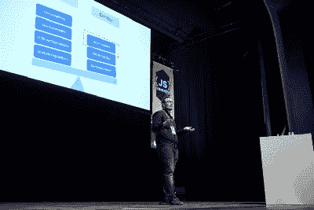](https://res.cloudinary.com/practicaldev/image/fetch/s--B0JVtrv2--/c_limit%2Cf_auto%2Cfl_progressive%2Cq_auto%2Cw_880/https://cdn-images-1.medium.com/max/400/1%2A8yPpD02ZZYnurB70LXW6qg.jpeg)

<figure>[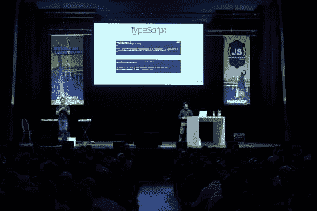](https://res.cloudinary.com/practicaldev/image/fetch/s--ICmbKWXW--/c_limit%2Cf_auto%2Cfl_progressive%2Cq_auto%2Cw_880/https://cdn-images-1.medium.com/max/400/1%2AUn4nhcH1eMV70xo_2gE2tA.jpeg) 

<figcaption>添加了更多的观点，[曼弗雷德·施泰尔](https://medium.com/u/acb3f1945710)介绍了“Angular，React，Vue and co .——得益于 Web 组件和微应用程序的和平联合”，[埃里克·温德尔](https://medium.com/u/a0d7369532ea)“使用 Kubernetes 和 Docker 的 Scaled Node.js 应用程序”，以及[朱利安·安东内利](https://medium.com/u/bafaf6aaa2df)热情洋溢的[# 1 演讲者](https://medium.com/@jskongress/first-time-speaker-support-team-e1f6cdfad2cf)会议“超越 JavaScript:现代 Web 的语言”给我们留下了深刻的印象。</figcaption>

</figure>

[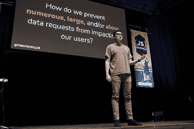](https://res.cloudinary.com/practicaldev/image/fetch/s--jR9Gi1EF--/c_limit%2Cf_auto%2Cfl_progressive%2Cq_auto%2Cw_880/https://cdn-images-1.medium.com/max/400/1%2AJRamswt2X_UPmoeatSu5uQ.jpeg)

[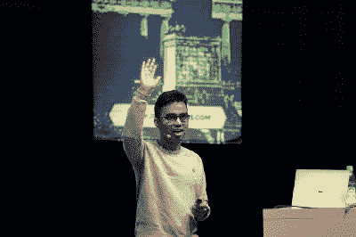](https://res.cloudinary.com/practicaldev/image/fetch/s--fzxutMK1--/c_limit%2Cf_auto%2Cfl_progressive%2Cq_auto%2Cw_880/https://cdn-images-1.medium.com/max/400/1%2AUC8AF560FfGaVhRldWETMQ.jpeg)

<figure>[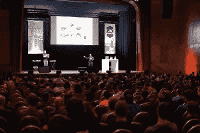](https://res.cloudinary.com/practicaldev/image/fetch/s--0aPBg6Kj--/c_limit%2Cf_auto%2Cfl_progressive%2Cq_auto%2Cw_880/https://cdn-images-1.medium.com/max/400/1%2AABFxOiVitY8NMliFlBuozg.jpeg) 

<figcaption>午休后， [Trent Willis](https://medium.com/u/68bdce81aeab) 通过“编织工人之网”展示了如何使用 Web 工人， [Narendra N Shetty](https://medium.com/u/5dd0a232236e) 要求“让你的用户决定他们想要什么”，强调 A/B 测试的重要性，[极客紫色独角兽](https://medium.com/u/38dc232848f2) (Keerthana Krishnan)分享了随着无服务器架构的出现，“前端孤立存在”。</figcaption>

T12】</figure>

[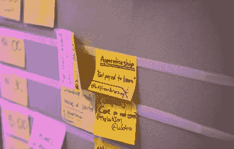](https://res.cloudinary.com/practicaldev/image/fetch/s--fuftXORj--/c_limit%2Cf_auto%2Cfl_progressive%2Cq_auto%2Cw_880/https://cdn-images-1.medium.com/max/400/1%2AeU-khTT3q6IzKJDswR8PUQ.jpeg)

[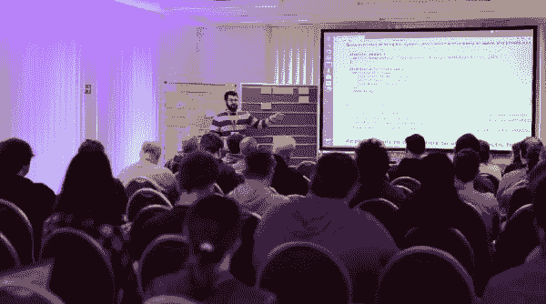](https://res.cloudinary.com/practicaldev/image/fetch/s--5uC597pS--/c_limit%2Cf_auto%2Cfl_progressive%2Cq_auto%2Cw_880/https://cdn-images-1.medium.com/max/600/1%2ANESNFd0aEkh-knotEC4tgw.jpeg)

[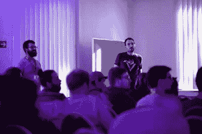](https://res.cloudinary.com/practicaldev/image/fetch/s--D1iIXKyG--/c_limit%2Cf_auto%2Cfl_progressive%2Cq_auto%2Cw_880/https://cdn-images-1.medium.com/max/400/1%2AQ0IrUQIn9we0RyCYcvaTXQ.jpeg)

[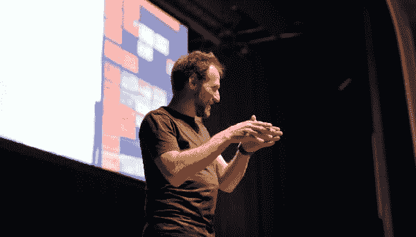](https://res.cloudinary.com/practicaldev/image/fetch/s--cwttdEY---/c_limit%2Cf_auto%2Cfl_progressive%2Cq_auto%2Cw_880/https://cdn-images-1.medium.com/max/600/1%2AqAUgoujl8GPqhK6tFnMXOQ.jpeg)

<figure>[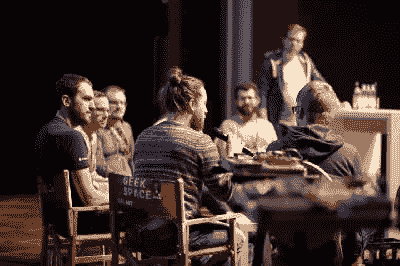](https://res.cloudinary.com/practicaldev/image/fetch/s---IIwveaO--/c_limit%2Cf_auto%2Cfl_progressive%2Cq_auto%2Cw_880/https://cdn-images-1.medium.com/max/400/1%2ACh7U088nKKeTBBB-uJGicg.jpeg) 

<figcaption>除了主舞台，#DeepTrack 一直是面对面分享想法、共同工作、讨论和倾听他人的创意空间。</figcaption>

</figure>

[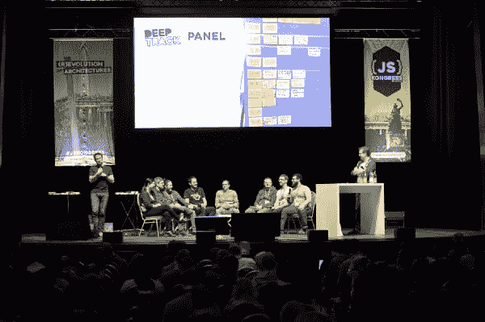](https://res.cloudinary.com/practicaldev/image/fetch/s--PN2h_qfh--/c_limit%2Cf_auto%2Cfl_progressive%2Cq_auto%2Cw_880/https://cdn-images-1.medium.com/max/600/1%2AR5zD0zO94ddaofsy2lifGw.jpeg)

<figure>[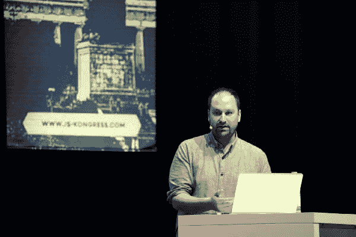](https://res.cloudinary.com/practicaldev/image/fetch/s--NRy7vpFI--/c_limit%2Cf_auto%2Cfl_progressive%2Cq_auto%2Cw_880/https://cdn-images-1.medium.com/max/600/1%2AWyY1mUeHAFA_LPad9zgaCA.jpeg) 

<figcaption>分享创新的想法、讨论和方法，#DeepTrack 小组以及 Rob Richard 的“流 HTTP 和 GraphQL”圆满结束了第 2 天的会议，向我们展示了许多有趣的东西，可供我们学习和实践。</figcaption>

</figure>

[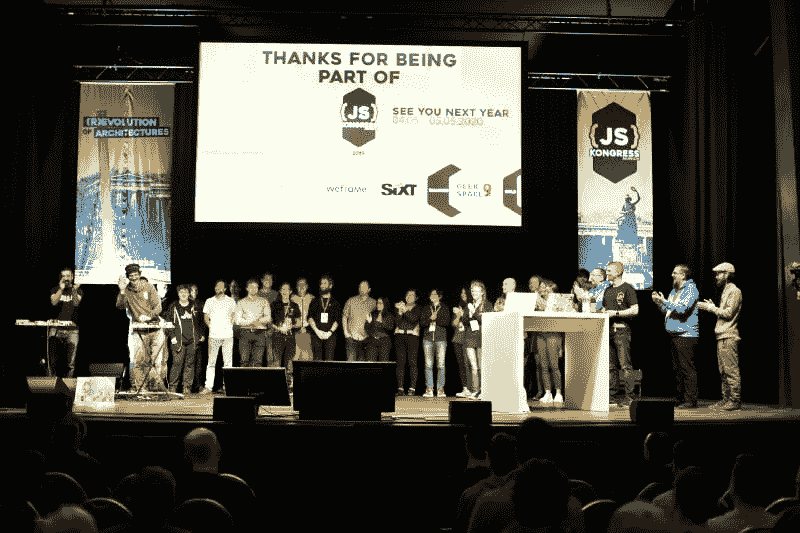](https://res.cloudinary.com/practicaldev/image/fetch/s--wnW74y4s--/c_limit%2Cf_auto%2Cfl_progressive%2Cq_auto%2Cw_880/https://cdn-images-1.medium.com/max/800/1%2AgzKlrrUqy2fFImMSnfO_vA.jpeg)

感谢大家参与#jskongress 2019！明年 5 月 4 日至 0 日，2020 年慕尼黑见。  [售票已经开始](https://ti.to/munich-dev-events/js-kongress-2020)

更多关于今年的版本在[素描笔记和幻灯片集](https://medium.com/@jskongress/jskongress-2019-in-sketches-and-slides-53ed69f27d7e)，以及[会议录音](https://medium.com/@jskongress/session-recordings-from-march-2019-90fd36bd62eb)，所有的会谈都有记录。

* * *

敬请期待！[订阅我们的时事通讯](https://js-kongress.us13.list-manage.com/subscribe/post?u=9c3420f6b5269855b07422fb5&id=f490a69da5)尽快了解下一版的座右铭何时确定，征稿何时开始，以及更多见解。你的团队

帖子[一张图胜过千言万语](https://js-kongress.com/2019/05/09/a-picture-is-worth-a-thousand-words/)最早出现在 [JS KONGRESS 2020:扩展 JS——挑战极限:大规模平台、数据驱动架构和现代 API。](https://js-kongress.com)。