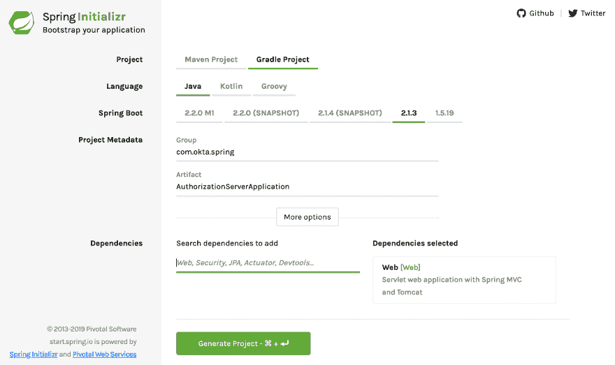
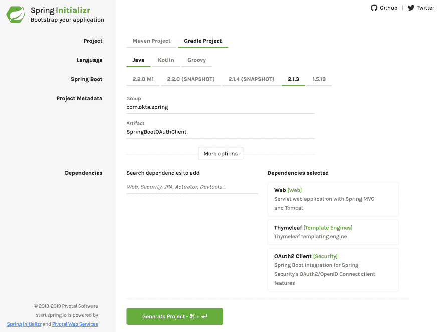
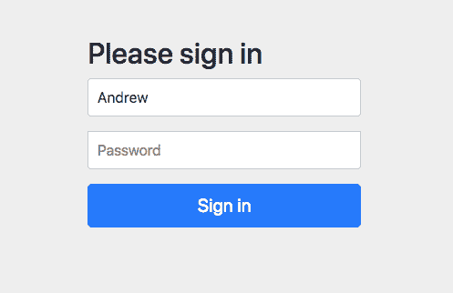
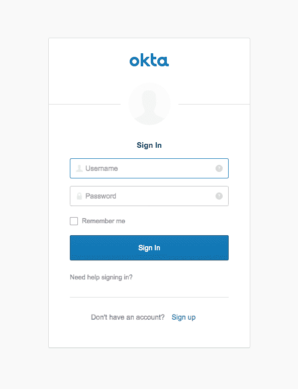

# 使用 Spring Security 的 OAuth 2.0 快速指南

> 原文：<https://dev.to/oktadev/a-quick-guide-to-oauth-2-0-with-spring-security-1cad>

构建 web 应用程序时，身份验证和授权是必须的。然而，做好这件事并不简单。计算机安全是一门真正的专业。大批开发人员夜以继日地与同样多的国际黑客对抗，形成了一个不断寻找漏洞、攻击漏洞并修复漏洞的开发周期。独自完成所有这些将是痛苦的(如果不是不可能的话)。

幸运的是，不需要。Spring Security 和 Spring Boot 使得使用 OAuth 2.0 实现 web 应用程序变得又好又简单。软件即服务身份访问提供商 Okta 已经在 Spring Boot 的基础上建立起来，使这个过程变得更加容易。

在本教程中，您将首先使用 Spring Boot 和 Spring Security 构建一个 OAuth 2.0 web 应用程序和认证服务器。之后，您将使用 Okta 来摆脱您的自托管认证服务器，并进一步简化您的 Spring Boot 应用程序。

我们开始吧！

## 创建 OAuth 2.0 服务器

首先转到 [Spring Initializr](https://start.spring.io/) ，用以下设置创建一个新项目:

*   将项目类型从 Maven 更改为 **Gradle** 。
*   把群改成 **com.okta.spring** 。
*   将工件更改为**AuthorizationServerApplication**。
*   添加一个依赖: **Web** 。

[](https://res.cloudinary.com/practicaldev/image/fetch/s--ox6bM8HF--/c_limit%2Cf_auto%2Cfl_progressive%2Cq_auto%2Cw_880/https://d33wubrfki0l68.cloudfront.net/240d55888b02a96001645664da68cf73e6582bfb/a8c89/assets-jekyll/blog/spring-boot-authz-server/start.spring.io-565197ee764d2183a22151a7fbc4f6ae7861635fdee4ac0a27a0ed4784e1bf53.png)

下载项目，并将其复制到硬盘上有意义的地方。在本教程中，您将创建三个不同的项目，所以您可能想要创建一个父目录，类似于某处的`SpringBootOAuth`。

您需要向`build.gradle`文件添加一个依赖项:

```
implementation 'org.springframework.security.oauth:spring-security-oauth2:2.3.3.RELEASE' 
```

这增添了春天的美好。

更新`src/main/resources/application.properties`以匹配:

```
server.port=8081
server.servlet.context-path=/auth
user.oauth.clientId=R2dpxQ3vPrtfgF72
user.oauth.clientSecret=fDw7Mpkk5czHNuSRtmhGmAGL42CaxQB9
user.oauth.redirectUris=http://localhost:8082/login/oauth2/code/
user.oauth.user.username=Andrew
user.oauth.user.password=abcd 
```

这将设置服务器端口、servlet 上下文路径、内存中的一些默认值、服务器将返回给客户机的特别生成的令牌，以及我们的用户的用户名和密码。在生产中，您需要一个更复杂的真实认证服务器后端，而不需要硬编码的重定向 URIs、用户名和密码。

更新`AuthorizationServerApplication`类以添加`@EnableResourceServer` :

```
package com.okta.spring.AuthorizationServerApplication;

import org.springframework.boot.SpringApplication;
import org.springframework.boot.autoconfigure.SpringBootApplication;
import org.springframework.security.oauth2.config.annotation.web.configuration.EnableResourceServer;

@SpringBootApplication
@EnableResourceServer
public class AuthorizationServerApplication {

    public static void main(String[] args) {
        SpringApplication.run(AuthorizationServerApplication.class, args);
    }
} 
```

在`src/main/java`下的应用程序类`com.okta.spring.AuthorizationServerApplication`所在的包中创建一个新类`AuthServerConfig`(从现在开始，请在`src/main/java/com/okta/spring/AuthorizationServerApplication`中创建 Java 类)。这个 Spring 配置类启用并配置 OAuth 授权服务器。

```
package com.okta.spring.AuthorizationServerApplication;

import org.springframework.beans.factory.annotation.Autowired;
import org.springframework.beans.factory.annotation.Value;
import org.springframework.context.annotation.Configuration;
import org.springframework.security.crypto.bcrypt.BCryptPasswordEncoder;
import org.springframework.security.oauth2.config.annotation.configurers.ClientDetailsServiceConfigurer;
import org.springframework.security.oauth2.config.annotation.web.configuration.AuthorizationServerConfigurerAdapter;
import org.springframework.security.oauth2.config.annotation.web.configuration.EnableAuthorizationServer;
import org.springframework.security.oauth2.config.annotation.web.configurers.AuthorizationServerSecurityConfigurer;

@Configuration
@EnableAuthorizationServer
public class AuthServerConfig extends AuthorizationServerConfigurerAdapter {

    @Value("${user.oauth.clientId}")
    private String ClientID;
    @Value("${user.oauth.clientSecret}")
    private String ClientSecret;
    @Value("${user.oauth.redirectUris}")
    private String RedirectURLs;

   private final PasswordEncoder passwordEncoder;

    public AuthServerConfig(PasswordEncoder passwordEncoder) {
        this.passwordEncoder = passwordEncoder;
    }

    @Override
    public void configure(
        AuthorizationServerSecurityConfigurer oauthServer) throws Exception {
        oauthServer.tokenKeyAccess("permitAll()")
            .checkTokenAccess("isAuthenticated()");
    }

    @Override
    public void configure(ClientDetailsServiceConfigurer clients) throws Exception {
        clients.inMemory()
            .withClient(ClientID)
            .secret(passwordEncoder.encode(ClientSecret))
            .authorizedGrantTypes("authorization_code")
            .scopes("user_info")
            .autoApprove(true)
            .redirectUris(RedirectURLs);
    }
} 
```

`AuthServerConfig`类是在客户端正确认证时创建并返回我们的 JSON web 令牌的类。

创建一个`SecurityConfiguration`类:

```
package com.okta.spring.AuthorizationServerApplication;

import org.springframework.beans.factory.annotation.Value;
import org.springframework.context.annotation.Bean;
import org.springframework.context.annotation.Configuration;
import org.springframework.core.annotation.Order;
import org.springframework.security.config.annotation.authentication.builders.AuthenticationManagerBuilder;
import org.springframework.security.config.annotation.web.builders.HttpSecurity;
import org.springframework.security.config.annotation.web.configuration.WebSecurityConfigurerAdapter;
import org.springframework.security.crypto.bcrypt.BCryptPasswordEncoder;

@Configuration
@Order(1)
public class SecurityConfiguration extends WebSecurityConfigurerAdapter {

    @Value("${user.oauth.user.username}")
    private String username;
    @Value("${user.oauth.user.password}")
    private String password;

    @Override
    protected void configure(HttpSecurity http) throws Exception {
        http.requestMatchers()
            .antMatchers("/login", "/oauth/authorize")
            .and()
            .authorizeRequests()
            .anyRequest().authenticated()
            .and()
            .formLogin().permitAll();
    }

    @Override
    protected void configure(AuthenticationManagerBuilder auth) throws Exception {
        auth.inMemoryAuthentication()
            .withUser(username)
            .password(passwordEncoder().encode(password))
            .roles("USER");
    }

    @Bean
    public BCryptPasswordEncoder passwordEncoder() {
        return new BCryptPasswordEncoder();
    }
} 
```

`SecurityConfiguration`类是实际验证对授权服务器的请求的类。注意靠近顶部的地方，它从`application.properties`文件中提取用户名和密码。

最后，创建名为`UserController` :
的 Java 类

```
package com.okta.spring.AuthorizationServerApplication;

import org.springframework.web.bind.annotation.GetMapping;
import org.springframework.web.bind.annotation.RestController;

import java.security.Principal;

@RestController
public class UserController {

    @GetMapping("/user/me")
    public Principal user(Principal principal) {
        return principal;
    }
} 
```

该文件允许客户端应用程序找到更多关于通过服务器鉴定的用户的信息。

那是你的资源服务器！不算太坏。Spring Boot 让这变得很容易。四个文件和一些属性。稍后，您将使用 Okta 使它变得更加简单，但是现在，继续创建一个可以用来测试 auth 服务器的客户端应用程序。

启动授权服务器:

```
./gradlew bootRun 
```

等待它完成运行。终端应该像这样结束:

```
...
2019-02-23 19:06:49.122 INFO 54333 --- [main] o.s.b.w.embedded.tomcat.TomcatWebServer : Tomcat started on port(s): 8081 (http) with context path '/auth '
2019-02-23 19:06:49.128 INFO 54333 --- [main] c.o.s.A.AuthorizationServerApplication : Started AuthorizationServerApplication in 3.502 seconds (JVM running for 3.945) 
```

**注意:**如果你得到一个关于 JAXB ( `java.lang.ClassNotFoundException: javax.xml.bind.JAXBException`)的错误，那是因为你正在使用 Java 11。要解决这个问题，请将 JAXB 添加到您的`build.gradle`中。

```
implementation 'org.glassfish.jaxb:jaxb-runtime' 
```

## 构建您的客户端应用

回到[弹簧初始状态](https://start.spring.io/)。使用以下设置创建新项目:

*   项目类型应该是 **Gradle** (不是 Maven)。
*   群: **com.okta.spring** 。
*   Artifact: **SpringBootOAuthClient** .
*   添加三个依赖: **Web** 、**百里香**和 **OAuth2 客户端**。

[](https://res.cloudinary.com/practicaldev/image/fetch/s--waEuoPby--/c_limit%2Cf_auto%2Cfl_progressive%2Cq_auto%2Cw_880/https://d33wubrfki0l68.cloudfront.net/becbb6a4476abf0e83f2019500208733e47f702c/de604/assets-jekyll/blog/spring-boot-authz-server/start-client-b150bd99608cbdd4172bfb0a300bf9eec76afedc8b4ddc395f1e0e022d0fbbd5.png)

下载项目，将它复制到它的最终位置，然后解包。

这一次，您需要将以下依赖项添加到您的`build.gradle`文件中:

```
implementation 'org.thymeleaf.extras:thymeleaf-extras-springsecurity5:3.0.4.RELEASE' 
```

将`src/main/resources/application.properties`重命名为`application.yml`，并更新它以匹配下面的 YAML:

```
server:
  port: 8082
  session:
    cookie:
      name: UISESSION
spring:
  thymeleaf:
    cache: false
  security:
    oauth2:
      client:
        registration:
          custom-client:
            client-id: R2dpxQ3vPrtfgF72
            client-secret: fDw7Mpkk5czHNuSRtmhGmAGL42CaxQB9
            client-name: Auth Server
            scope: user_info
            provider: custom-provider
            redirect-uri-template: http://localhost:8082/login/oauth2/code/
            client-authentication-method: basic
            authorization-grant-type: authorization_code
        provider:
          custom-provider:
            token-uri: http://localhost:8081/auth/oauth/token
            authorization-uri: http://localhost:8081/auth/oauth/authorize
            user-info-uri: http://localhost:8081/auth/user/me
            user-name-attribute: name 
```

注意，这里您正在为您的认证服务器配置`clientId`和`clientSecret`，以及各种 URIs。这些需要与其他项目中的值相匹配。

更新`SpringBootOAuthClientApplication`类以匹配:

```
package com.okta.spring.SpringBootOAuthClient;

import org.springframework.boot.SpringApplication;
import org.springframework.boot.autoconfigure.SpringBootApplication;

@SpringBootApplication
public class SpringBootOAuthClientApplication {

    public static void main(String[] args) {
        SpringApplication.run(SpringBootOAuthClientApplication.class, args);
    }
} 
```

创建一个名为`WebController` :
的新 Java 类

```
package com.okta.spring.SpringBootOAuthClient;

import org.springframework.stereotype.Controller;
import org.springframework.ui.Model;
import org.springframework.web.bind.annotation.RequestMapping;

import java.security.Principal;

@Controller
public class WebController {

    @RequestMapping("/securedPage")
    public String securedPage(Model model, Principal principal) {
        return "securedPage";
    }

    @RequestMapping("/")
    public String index(Model model, Principal principal) {
        return "index";
    }
} 
```

这是将传入请求映射到您的百里香模板文件(您将很快制作)的控制器。

创建另一个名为`SecurityConfiguration` :
的 Java 类

```
package com.okta.spring.SpringBootOAuthClient;

import org.springframework.context.annotation.Configuration;
import org.springframework.security.config.annotation.web.builders.HttpSecurity;
import org.springframework.security.config.annotation.web.configuration.WebSecurityConfigurerAdapter;

@Configuration
public class SecurityConfiguration extends WebSecurityConfigurerAdapter {
    @Override
    public void configure(HttpSecurity http) throws Exception {
        http.antMatcher("/**").authorizeRequests()
            .antMatchers("/", "/login**").permitAll()
            .anyRequest().authenticated()
            .and()
            .oauth2Login();
    }
} 
```

这个类为您的应用程序定义了 Spring 安全配置:允许 home 路径上的所有请求，并要求对所有其他路由进行身份验证。它还设置了 Spring Boot OAuth 登录流。

您需要添加的最后一个文件是两个百里香模板文件。全面了解百里香模板已经超出了本教程的范围，但是你可以看看他们的网站了解更多信息。

模板放在`src/main/resources/templates`目录中。您会注意到在上面的控制器中，它们只是返回路由字符串。当百里香叶依赖关系包含在构建中时，Spring Boot 自动假设你正在从控制器返回模板文件的名称，因此应用程序将在`src/main/resources/templates`中查找带有返回字符串加`.html`的文件名。

创建主页模板:`src/main/resources/templates/index.html` :

```
<!DOCTYPE html>  
<html lang="en">  
<head>  
    <meta charset="UTF-8">  
    Home  
</head>  
<body>  
    <h1>Spring Security SSO</h1>  
    <a href="securedPage">Login</a>  
</body>  
</html> 
```

以及安全模板:`src/main/resources/templates/securedPage.html` :

```
<!DOCTYPE html>  
<html xmlns:th="http://www.thymeleaf.org">  
<head>  
    <meta charset="UTF-8">  
    Secured Page  
</head>  
<body>  
    <h1>Secured Page</h1>  
    <span th:text="${#authentication.name}"></span>  
</body>  
</html> 
```

我只指出这一行:

```
<span th:text="${#authentication.name}"></span> 
```

这一行将插入经过身份验证的用户的名称。这一行就是为什么在`build.gradle`文件中需要`org.thymeleaf.extras:thymeleaf-extras-springsecurity5`依赖项的原因。

启动客户端应用:

```
./gradlew bootRun 
```

请稍等片刻，让它结束。终端应该像这样结束:

```
...
2019-02-23 19:29:04.448 INFO 54893 --- [main] o.s.b.w.embedded.tomcat.TomcatWebServer : Tomcat started on port(s): 8082 (http) with context path ''
2019-02-23 19:29:04.453 INFO 54893 --- [main] c.o.s.S.SpringBootOAuthClientApplication : Started SpringBootOAuthClientApplication in 3.911 seconds (JVM running for 4.403) 
```

## 测试资源服务器

在`http://localhost:8082/`时，在您选择的浏览器中导航至您的客户端应用程序。

点击**登录**链接。

您将被引导至登录页面:

[](https://res.cloudinary.com/practicaldev/image/fetch/s--SEvX-9gx--/c_limit%2Cf_auto%2Cfl_progressive%2Cq_auto%2Cw_880/https://d33wubrfki0l68.cloudfront.net/4c1a3bbab3db2e008c125a23974fa170b8980fe2/3b487/assets-jekyll/blog/spring-boot-authz-server/sign-in-form-deb935ce6aca1053701a57904606b0bcb433ea465dc3c9347d8bbf0ca620edcb.png)

输入用户名**安德鲁**和密码 **abcd** (来自认证服务器的`application.properties`文件)。

点击**登录**，你会被带到超级漂亮的**securedPage.html**模板，上面应该写着“安全页面”和“安德鲁”。

太好了！它工作了。现在你要让它变得更简单。

您可以停止服务器和客户端 Spring Boot 应用程序。

## 创建 OpenID 连接应用程序

Okta 是一家 SaaS(软件即服务)认证和授权提供商。我们向开发者提供免费账户，这样他们就可以毫不费力地开发 OIDC 应用。前往[developer.okta.com](https://developer.okta.com/signup/)注册一个账户。验证您的电子邮件后，登录并执行以下步骤:

*   进入**应用** > **添加应用**。
*   选择应用类型 **Web** ，点击**下一步**。
*   给应用程序命名。我给我的取名为“Spring Boot·欧斯”。
*   在**登录重定向下，URIs** 将值改为`http://localhost:8080/login/oauth2/code/okta`。其余的默认值将起作用。
*   点击**完成**。

保持页面打开，记下**客户端 ID** 和**客户端密码**。你马上就会需要它们。

## 创建新的 Spring Boot App

再次回到[弹簧初始状态](https://start.spring.io/)。使用以下设置创建新项目:

*   将项目类型从 Maven 更改为 **Gradle** 。
*   把群改成 **com.okta.spring** 。
*   将工件更改为 **OktaOAuthClient** 。
*   添加三个依赖: **Web** 、**百里叶**、 **Okta** 。
*   点击**生成项目**。

[](https://res.cloudinary.com/practicaldev/image/fetch/s--5YgtX6eA--/c_limit%2Cf_auto%2Cfl_progressive%2Cq_auto%2Cw_880/https://d33wubrfki0l68.cloudfront.net/185f220b0fbd37de0306ad43a1427859f6fa23c1/5f7f3/assets-jekyll/blog/spring-boot-authz-server/okta-oauth2-client-93375dbe5d9cb9e8696b691635224cb8f86df8203120d2967d7ea15d3aeed25e.png)

复制项目并在某个地方将其解包。

在`build.gradle`文件中，添加以下依赖项:

```
implementation 'org.thymeleaf.extras:thymeleaf-extras-springsecurity5:3.0.4.RELEASE' 
```

同样，当你在那里时，注意依赖关系`com.okta.spring:okta-spring-boot-starter:1.1.0`。这是奥克塔 Spring Boot 开胃菜。这是一个方便的项目，使得整合 Okta 和 Spring Boot 很好，很容易。要了解更多信息，请看一下该项目的 GitHub 。

将`src/main/resources/application.properties`改为`application.yml`，并添加以下内容:

```
server:
  port: 8080
okta:
  oauth2:
    issuer: https://{yourOktaDomain}/oauth2/default
    client-id: {yourClientId}
    client-secret: {yourClientSecret}
spring:
  thymeleaf:
    cache: false 
```

记得我在上面说过你需要你的**客户端 ID** 和**客户端密码**。好吧，时候到了。你需要把它们填入文件中，还有你的 Okta 发行商 URL。它看起来会像这样。可以在 **API** > **授权服务器**下找到。

在`src/main/resources/templates`目录中还需要两个相似的模板文件。`index.html`模板文件完全一样，如果你愿意可以复制过来。与您之前构建的简单认证服务器相比，`securedPage.html`模板文件略有不同，因为认证信息从 Okta 返回的方式不同。

创建主页模板:`src/main/resources/templates/index.html` :

```
<!DOCTYPE html>  
<html lang="en">  
<head>  
    <meta charset="UTF-8">  
    Home  
</head>  
<body>  
    <h1>Spring Security SSO</h1>  
    <a href="securedPage">Login</a>  
</body>  
</html> 
```

以及安全模板:`src/main/resources/templates/securedPage.html` :

```
<!DOCTYPE html>  
<html xmlns:th="http://www.thymeleaf.org">  
<head>  
    <meta charset="UTF-8">  
    Secured Page  
</head>  
<body>  
    <h1>Secured Page</h1>  
    <span th:text="${#authentication.principal.attributes.name}">Joe Coder</span>  
</body>  
</html> 
```

在`com.okta.spring.SpringBootOAuth`包中创建一个名为`WebController`的 Java 类:

```
package com.okta.spring.OktaOAuthClient;

import org.springframework.stereotype.Controller;
import org.springframework.ui.Model;
import org.springframework.web.bind.annotation.RequestMapping;

import java.security.Principal;

@Controller
public class WebController {

    @RequestMapping("/securedPage")
    public String securedPage(Model model, Principal principal) {
        return "securedPage";
    }

    @RequestMapping("/")
    public String index(Model model, Principal principal) {
        return "index";
    }
} 
```

该类简单地创建了两条路由，一条用于本地路由，一条用于安全路由。同样，Spring Boot 和百里香会自动将其映射到`src/main/resources/templates`中的两个模板文件中。

最后，创建另一个 Java 类名`SecurityConfiguration` :

```
package com.okta.spring.OktaOAuthClient;

import org.springframework.context.annotation.Configuration;
import org.springframework.security.config.annotation.web.builders.HttpSecurity;
import org.springframework.security.config.annotation.web.configuration.WebSecurityConfigurerAdapter;

@Configuration
public class SecurityConfiguration extends WebSecurityConfigurerAdapter {
    @Override
    public void configure(HttpSecurity http) throws Exception {
        http.antMatcher("/**").authorizeRequests()
            .antMatchers("/").permitAll()
            .anyRequest().authenticated()
            .and()
            .oauth2Login();
    }
} 
```

就是这样！嘭！

运行 Okta-OAuth 支持的客户端:

```
./gradlew bootRun 
```

您应该会看到一串以
结尾的输出

```
...
2019-02-23 20:09:03.465 INFO 55890 --- [main] o.s.b.w.embedded.tomcat.TomcatWebServer : Tomcat started on port(s): 8080 (http) with context path ''
2019-02-23 20:09:03.470 INFO 55890 --- [main] c.o.s.O.OktaOAuthClientApplication : Started OktaOAuthClientApplication in 3.285 seconds (JVM running for 3.744) 
```

导航到 [http://localhost:8080](http://localhost:8080) 。

点击**登录**按钮。

这一次，您将被引导到 Okta 登录页面。您可能需要使用匿名浏览器或在此处注销您的 developer.okta.com 仪表板，这样您就不会跳过登录页面而直接进入安全端点。

[](https://res.cloudinary.com/practicaldev/image/fetch/s--49_27Zhc--/c_limit%2Cf_auto%2Cfl_progressive%2Cq_auto%2Cw_880/https://d33wubrfki0l68.cloudfront.net/5a507d253535a8b3eee9fe025ef700aef81de6ba/7bb85/assets-jekyll/blog/spring-boot-authz-server/okta-login-c689b6b1793dc3aed41d8fd719c57944d8887baaa17400dd40e6dfb537bc6db4.png)

登录，你会看到有你名字的安全页面！

## 了解有关 Spring Boot、Spring Security 和 OAuth 2.0 的更多信息

原来如此。超级简单。在上一个教程中，您了解了如何使用 Spring Boot 和 Spring Security 来实现一个非常基本的认证服务器和客户端应用程序。接下来，您使用 Okta 创建了一个更简单的客户端应用程序，它具有全功能的 SSO 和 OAuth 认证。

你可以在 GitHub 上的[okta developer/okta-spring-boot-authz-server-example](https://github.com/oktadeveloper/okta-spring-boot-authz-server-example)看到本教程的完整代码。

如果您有兴趣了解关于 Spring Boot、OAuth 2.0 和 Spring Security 的更多信息，请查看这些有用的教程:

*   [开始使用 Spring Boot、OAuth 2.0 和 Okta](https://developer.okta.com/blog/2017/03/21/spring-boot-oauth)
*   OAuth 到底是什么？
*   [开始使用 Spring Security 5.0 和 OIDC](https://developer.okta.com/blog/2017/12/18/spring-security-5-oidc)
*   [身份、声明、&令牌 OpenID Connect Primer，第 1 部分，共 3 部分](https://developer.okta.com/blog/2017/07/25/oidc-primer-part-1)
*   [用 Spring Boot 和 GraphQL 构建一个安全的 API](https://developer.okta.com/blog/2018/08/16/secure-api-spring-boot-graphql)

如果你对这篇文章有任何问题，请在下面添加评论。更多精彩内容，关注 Twitter 上的 [@oktadev](https://twitter.com/oktadev) ，或者订阅[我们的 YouTube 频道](https://www.youtube.com/channel/UC5AMiWqFVFxF1q9Ya1FuZ_Q)！