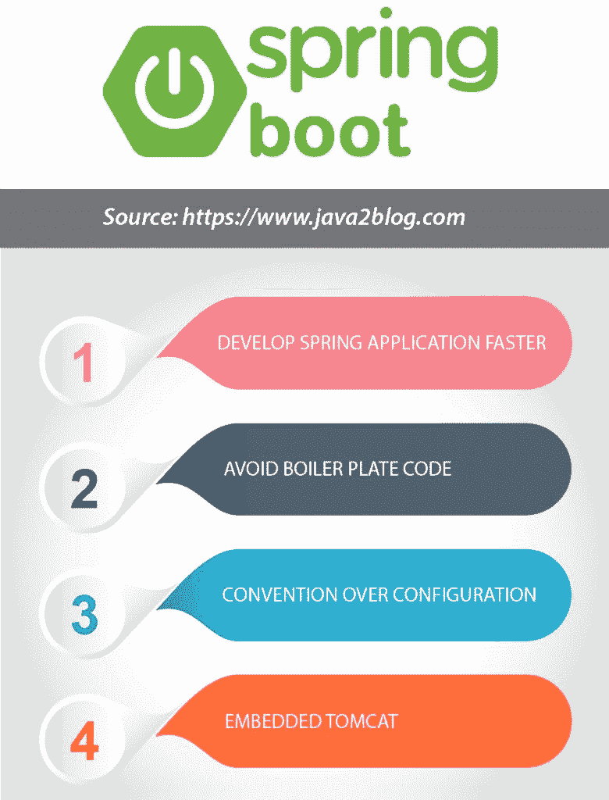

# 弹簧靴快速入门

> 原文：<https://dev.to/arpitmandliya/a-quick-introduction-to-spring-boot-5a7n>

Spring 框架是非常流行的开发各种 web 和企业应用的框架。随着时间的推移，Spring 开发了各种项目，Spring Boot 是其中之一。

在本教程中，我们将通过各种示例来学习 Spring boot 教程。

在学习 Spring Boot 应用之前，你必须对 Spring 框架中的 [XML](http://www.java2blog.com/2012/08/spring-hello-world-example-in-eclipse.html) 和 [Java 配置](http://www.java2blog.com/2016/02/spring-java-based-configuration-example.html)有所了解。

## 什么是 Spring Boot？

Spring Boot 是一种引导或快速创建任何 Spring 应用程序的方式。

这是 Spring Boot 的官方定义。

Spring Boot 使得创建独立的、生产级的基于 Spring 的应用程序变得容易，你可以“直接运行”。

Spring Boot 可以帮助你立刻创建任何 Spring 应用程序。它提供了默认的配置，可以帮助您避免维护大量的样板代码。

## 为什么是 Spring Boot？

假设你要创建 [Spring MVC Hibernate MySQL 项目](http://www.java2blog.com/2016/08/spring-mvc-hibernate-mysql-crud-example.html)。当你在做这个项目时，你可能会对它所需要的许多依赖关系感到困惑。您可能也会对版本感到困惑。您需要配置 DataSource、EntitymanagerFactory、TransactionManager 等 beans。如果 Spring 能自动为我们做这件事岂不是很好？

是的，你猜对了。当你想快速创建 Spring 应用程序时，Spring Boot 将负责上述所有配置，这是一件很痛苦的事情。我还创建了 [Spring boot Hibernate MySQL 项目](http://www.java2blog.com/2017/05/spring-boot-hibernate-example.html)。当你比较上面两个例子的代码时，你会发现 Spring Boot 减少了将近一半的代码。

当你想快速创建 Spring 应用程序时，Spring Boot 将负责上述所有配置，这是一件很痛苦的事情。

正如我之前所说，Spring boot 提供了很多默认配置，因此 Spring Boot 将帮助你更快地创建 Spring 应用程序。Spring boot 提供了许多 [starter](https://java2blog.com/spring-boot-starters/) 项目来帮助你创建一个不同类型的 Spring 应用程序。一旦你浏览了这些例子，你将会更加了解起始项目。
T3T5】

## Spring Boot 的优势

*   它提供了许多默认配置，帮助您更快地创建 Spring 应用程序。
*   它带有嵌入式 tomcat 或 jetty 服务器，因此您不必部署 jar。
*   它通过避免大量样板代码来减少开发代码。
*   它提高了生产率，因为您可以快速创建 Spring 应用程序。
*   它提供了许多易于 maven 集成的入门项目。你不用担心版本不匹配。
*   您可以使用 [spring boot initializer](https://start.spring.io/) 快速创建示例项目

## Spring Boot 教程示例

我创造了很多 Spring Boot 的例子。这里是春季启动教程列表。

### [Spring boot web 应用示例](http://www.java2blog.com/2017/04/spring-boot-web-application-example.html)

您可以使用 JSP 作为视图创建一个简单的 hello world 示例。它还将帮助您理解如何覆盖默认配置。

### [春季开机 Hello world 使用百里香叶的例子](http://www.java2blog.com/2017/05/spring-boot-hello-world-example-thymeleaf.html)

您可以使用百里香叶作为视图创建一个简单的 hello world 示例。

### [Spring boot 独立应用](http://www.java2blog.com/2017/05/spring-boot-hello-world-standalone-application.html)

所有关于创建的项目都是 web 项目。在这个例子中，我们将看到如何使用 Spring Boot 创建简单的独立的非 web 项目。

### [Spring boot Restful web 服务示例](http://www.java2blog.com/2017/04/create-restful-web-services-using-spring-boot.html)

使用 Spring boot 创建 rest web 服务比使用 Spring MVC 中的传统方式创建要容易得多。

### [Spring Boot 冬眠的例子](http://www.java2blog.com/2017/05/spring-boot-hibernate-example.html)

这个例子将向你展示如何集成 Hibernate 和 SpringBoot。你不用担心配置 DataSource，EntitymanagerFactory，TransactionManager，Spring boot 会帮你搞定。您只需要在属性文件中提供所需的配置。

### [弹簧靴角度示例](http://www.java2blog.com/2017/05/spring-boot-angularjs-example.html)

这个例子将向你展示如何将 AngularJS 与 Spring Boot 相结合。

### [Spring Boot ActiveMQ 示例](http://www.java2blog.com/2017/05/spring-boot-activemq-example.html)

这个例子将帮助你集成 ActiveMQ 和 Spring Boot。

### [Spring Boot 安全范例](http://www.java2blog.com/2017/05/spring-boot-spring-security-example.html)

这个例子将帮助您将 Spring Security 与 SpringBoot 集成在一起。

### [如何找到/打印 Spring Boot 加载的所有 bean】](http://www.java2blog.com/2017/05/print-beans-loaded-spring-boot.html)

和你一样，Spring Boot 提供了很多默认配置。你可能想让 Spring Boot 在幕后装载所有的豆子。这个例子将帮助您找到 Spring Boot 加载的所有 beans。

### [春天和 Spring Boot 的区别](https://java2blog.com/difference-spring-spring-boot/)

### [春季新兵面试问题](https://java2blog.com/spring-boot-interview-questions/)

以上就是关于 [Spring Boot 教程](https://java2blog.com/spring-boot-tutorial/)的全部内容。我将继续增加更多的例子，这个 Spring Boot 教程。