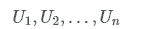
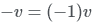
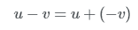
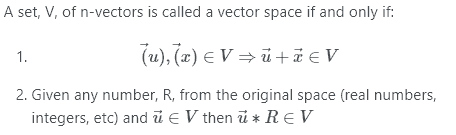

# 向量简介

> 原文：<https://dev.to/brandonskerritt/a-short-introduction-to-vectors-5972>

### 什么是矢量？

向量是一个容器，其中顺序很重要，并且允许重复。一个 N-vector 有 N 个分量(元素)，每个分量称为不同的值，在一个 vector 中可以是相同的，所以:

用向量是完全可能的。

二维向量代表二维空间，三维向量代表三维空间。

### 用向量做数学

两个向量可以这样相加:

结果是一个新的向量，称为 w。

如果向量具有相同数量的分量，则只能添加两个向量。

标量乘是将向量中的每一项增加 R。设 R 是一个实数，则:

向量长度可以用基数来定义。向量 A 的长度是|A|。向量的长度使用以下公式:

如果你试图计算一个负向量的长度，你会得到正向量的长度。

另一件需要注意的事情是:

为了反转一个向量，你将每个分量乘以-1，使所有的都是负的，并且

### 向量空间

从一些数字开始，如实数、整数、整数、有理数等。

一个数集合上的上标数，例如是所有实值(实数中的数)n 向量的集合，其中每个分量都在实数集合中。