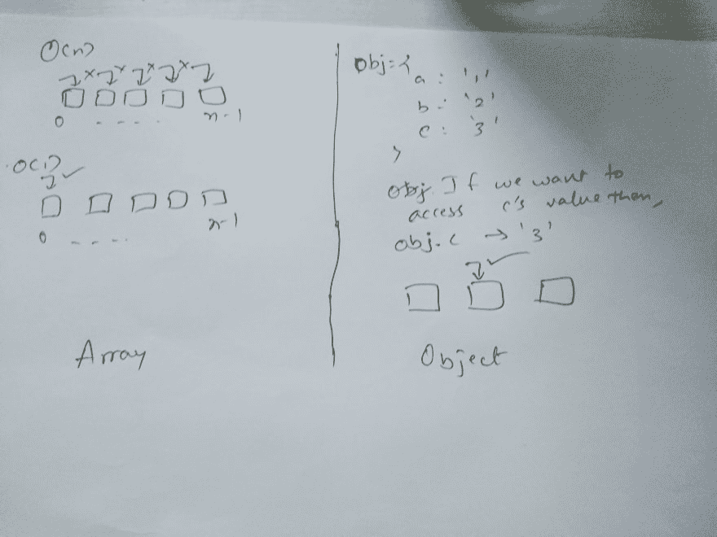

# 理解算法中时间复杂性的一种简单方法

> 原文：<https://dev.to/meet_zaveri/a-simpler-way-to-understand-time-complexity-in-algorithms-2j47>

## 理解它以数组和对象为数据结构

让我们分析一下从数据结构中寻找一个值的时间复杂度，

假设数据结构是一个数组。所以要在数组中找到一个值，你可能需要遍历数组来找到一个值。

`Worst time complexity : O(n)`

`Best time complexity : O(1)`

这里的`O(n)`意味着它将遍历一个大小为`n`的数组中的所有元素。`O(1)`简而言之，意味着不管数组的大小(即提供的输入)，我们都可以在一次尝试中找到价值。

相反，如果一个数据结构是一个对象或散列表，我们可以通过知道分配给它的键直接找到值。所以这里时间复杂度是常数，为 O(1)

`Time complexity : O(1)`

## 数组中的运算

INSERT (PUSH):数组中的 INSERT 操作将花费`O(1)`运行时间来将数据推入数组，因为它知道必须推入数组的最后一个索引。

删除(POP):如果我们想从集合的开始或结尾删除，它的最佳运行时间将与插入操作相同。

但是如果我们想要删除集合中间的项目，它的运行时间将是`O(n)`

## 比喻为它！

许多学生在理解时间复杂性的概念时感到困惑，但是在本文中，我们将用一个非常简单的例子来解释它:

想象一下，在一个有 100 名学生的教室里，你把你的笔给了一个人。现在，你想要那支笔。这里有一些方法来找到笔和 O 顺序是什么。

O(n2):你去问班上的第一个人，他是否有笔。还有，你问这个人教室里其他 99 个人是否有那支笔等等，
这就是我们所说的 O(n2)。

O(n):单独去问每个学生是 O(N)。

O(log n):现在我把全班分成两组，然后问:“是在教室的左边，还是右边？”然后我把那个组一分为二再问一遍，以此类推。重复这个过程，直到剩下一个学生拿着你的笔。这就是你说的 O(log n)的意思。

就是这样，感谢阅读的家伙！