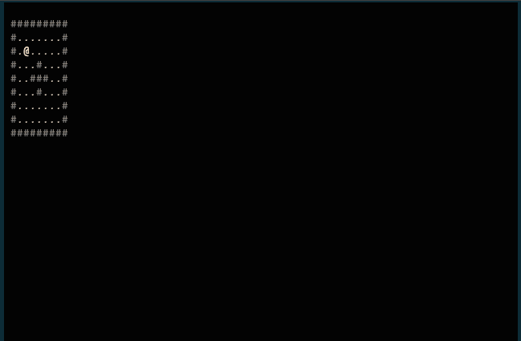

# 流氓围棋的尝试第 2 部分

> 原文：<https://dev.to/shindakun/a-stab-at-roguish-go-part-02-5b45>

# ATLG Rogue

## 继续冒险

在我们完成了上一篇文章后，我继续修改代码。所以，我们将继续我们的短途旅行。这一次，我们正在黑进一个静态地图和一些基本的“碰撞检测”。说到这里，让我们直接开始吧。

[](https://res.cloudinary.com/practicaldev/image/fetch/s--WY4HJ_n8--/c_limit%2Cf_auto%2Cfl_progressive%2Cq_66%2Cw_880/https://thepracticaldev.s3.amazonaws.com/i/e6xppb1q3ix1jf09tt3l.gif)

* * *

## 代码演练

我们代码的第一部分或多或少是相同的。我们修改了玩家结构，添加了代表玩家角色的`rune`。当我们将字符串显示到屏幕上时，我们必须转换成一个`string()`。

```
package main

import (
  "fmt"
  "math/rand"
  "os"
  "time"

  "github.com/gdamore/tcell"
  "github.com/mattn/go-runewidth"
)

type player struct {
  r      rune
  x      int
  y      int
}

func emitStr(s tcell.Screen, x, y int, style tcell.Style, str string) {
  for _, c := range str {
    var comb []rune
    w := runewidth.RuneWidth(c)
    if w == 0 {
      comb = []rune{c}
      c = ' '
      w = 1
    }
    s.SetContent(x, y, c, comb, style)
    x += w
  }
}

func main() {

  debug := false

  player := player{
    r: '@',
    x: 3,
    y: 3,
  }

  var msg string 
```

Enter fullscreen mode Exit fullscreen mode

* * *

## 获取映射

因为我们使用的是静态“地图”,所以我们将使用一个多维数组。对于墙壁，我们使用`#`，地板使用`.`。

```
 mapp := [9][9]rune{
    {'#', '#', '#', '#', '#', '#', '#', '#', '#'},
    {'#', '.', '.', '.', '.', '.', '.', '.', '#'},
    {'#', '.', '.', '.', '.', '.', '.', '.', '#'},
    {'#', '.', '.', '.', '#', '.', '.', '.', '#'},
    {'#', '.', '.', '#', '#', '#', '.', '.', '#'},
    {'#', '.', '.', '.', '#', '.', '.', '.', '#'},
    {'#', '.', '.', '.', '.', '.', '.', '.', '#'},
    {'#', '.', '.', '.', '.', '.', '.', '.', '#'},
    {'#', '#', '#', '#', '#', '#', '#', '#', '#'},
  } 
```

Enter fullscreen mode Exit fullscreen mode

* * *

## 颜色

我们已经添加了一些颜色，我们将在绘制时用于墙壁和地面。没有什么太令人兴奋的，只是一些棕色和灰色。

```
 tcell.SetEncodingFallback(tcell.EncodingFallbackASCII)
  s, e := tcell.NewScreen()
  if e != nil {
    fmt.Fprintf(os.Stderr, "%v\n", e)
    os.Exit(1)
  }
  if e = s.Init(); e != nil {
    fmt.Fprintf(os.Stderr, "%v\n", e)
    os.Exit(1)
  }

  white := tcell.StyleDefault.
    Foreground(tcell.ColorWhite).
    Background(tcell.ColorBlack)
  grey := tcell.StyleDefault.
    Foreground(tcell.ColorGrey).
    Background(tcell.ColorBlack)
  burlyWood := tcell.StyleDefault.
    Foreground(tcell.ColorBurlyWood).
    Background(tcell.ColorBlack)
  brown := tcell.StyleDefault.
    Foreground(tcell.ColorBrown).
    Background(tcell.ColorBlack)

  s.SetStyle(tcell.StyleDefault.
    Foreground(tcell.ColorWhite).
    Background(tcell.ColorBlack))
  s.Clear() 
```

Enter fullscreen mode Exit fullscreen mode

* * *

## 控制和碰撞

我们的控制部分仍在进行中。由于`tcell.EventKey`的工作方式，我们必须检查`tcell.KeyRune`和`ev.Rune()`。这样我们可以看到我们是否收到了正常的字母键。我们希望能够使用 Vim 键来移动，所以现在，我们在代码中有一点重复。在此之前，让我们仔细看看我们是如何实现基本的碰撞检测的。

> ```
> r, _, _, _ := s.GetContent(player.x-1, player.y)
> if r == '#' {
> 
> } else if player.x-1 >= 0 {
>   player.x--
> } 
> ```

我们使用`GetContent()`来获取玩家想要移动到的符文。如果那是一个墙壁符文，什么也不会发生。我们可以在未来扩展这一功能，允许战斗、开门和其他互动。

现在，我们将处理重复。我将仔细研究一下`tcell`代码，看看是否有另一种选择。

```
 quit := make(chan struct{})
  go func() {
    for {
      x, y := s.Size()
      ev := s.PollEvent()
      switch ev := ev.(type) {
      case *tcell.EventKey:

        switch ev.Key() {
        case tcell.KeyRune:
          switch ev.Rune() {
          case 'h':
            r, _, _, _ := s.GetContent(player.x-1, player.y)
            if r == '#' {

            } else if player.x-1 >= 0 {
              player.x--
            }
          case 'l':
            r, _, _, _ := s.GetContent(player.x+1, player.y)
            if r == '#' {

            } else if player.x+1 < x {
              player.x++
            }
          case 'k':
            r, _, _, _ := s.GetContent(player.x, player.y-1)
            if r == '#' {

            } else if player.y-1 >= 0 {
              player.y--
            }
          case 'j':
            r, _, _, _ := s.GetContent(player.x, player.y+1)
            if r == '#' {

            } else if player.y+1 < y {
              player.y++
            }
          }
        case tcell.KeyEscape, tcell.KeyEnter:
          close(quit)
          return
        case tcell.KeyRight:
          r, _, _, _ := s.GetContent(player.x+1, player.y)
          if r == '#' {

          } else if player.x+1 < x {
            player.x++
          }
        case tcell.KeyLeft:
          r, _, _, _ := s.GetContent(player.x-1, player.y)
          if r == '#' {

          } else if player.x-1 >= 0 {
            player.x--
          }
        case tcell.KeyUp:
          r, _, _, _ := s.GetContent(player.x, player.y-1)
          if r == '#' {

          } else if player.y-1 >= 0 {
            player.y--
          }
        case tcell.KeyDown:
          r, _, _, _ := s.GetContent(player.x, player.y+1)
          if r == '#' {

          } else if player.y+1 < y {
            player.y++
          }
        case tcell.KeyCtrlD:
          debug = !debug
        case tcell.KeyCtrlL:
          s.Sync()
        }
      case *tcell.EventResize:
        s.Sync()
      }
    }
  }() 
```

Enter fullscreen mode Exit fullscreen mode

我们标记循环的第一部分没有改变。

```
loop:
  for {
    select {
    case <-quit:
      break loop
    case <-time.After(time.Millisecond * 50):
    }
    s.Clear()
    dbg := fmt.Sprintf("player x: %d y: %d", player.x, player.y)
    if debug == true {
      var yy int
      if player.y == 0 {
        _, yy = s.Size()
        yy--
      } else {
        yy = 0
      }
      emitStr(s, 0, yy, white, dbg)
    }
    var color tcell.Style 
```

Enter fullscreen mode Exit fullscreen mode

* * *

## 映射

现在，我们终于到了我们的基本地图绘制程序。如你所见，这是一个基本的循环。我们将在玩家角色之前将地图绘制到屏幕上。

```
 for i := 0; i < 9; i++ {
      for j := 0; j < 9; j++ {
        if mapp[i][j] == '#' {
          color = grey
        }
        if mapp[i][j] == '.' {
            color = burlyWood
          }
        }
        emitStr(s, i+1, j+1, color, string(mapp[i][j]))
      }
    }

    emitStr(s, 0, 0, white, msg)

    emitStr(s, player.x, player.y, white, player.r)
    s.Show()
  }

  s.Fini()
} 
```

Enter fullscreen mode Exit fullscreen mode

* * *

## 包装完毕

这是对我们原始代码的一个很好的简单的补充，也是一种框架，如果我们愿意，我们可以构建它。我有点想在这上面多花点时间，看看我是否能添加一个简单的系统来添加生物和物品。我可能会先看看我们是否能简化运动代码——我们看看情绪会把我们带到哪里。

* * *

你可以在 GitHub 上的 repo 中找到这个和大多数其他试图学习围棋的帖子的代码。

##  [【新达昆】](https://github.com/shindakun) / [ atlg](https://github.com/shindakun/atlg)

### 我在 dev.to 上发布的“尝试学习围棋”帖子的来源报告

<article class="markdown-body entry-content container-lg" itemprop="text">

# 尝试学习围棋

在这里你可以找到我为尝试学习围棋而写的代码，这些代码是我在 [Dev.to](https://dev.to/shindakun) 上写的。

## 帖子索引

| 邮政 | 密码 |
| --- | --- |
| [制作下载器第 01 部分](https://dev.to/shindakun/attempting-to-learn-go---building-a-downloader-part-01-44gl) | - |
| [制作下载器第 02 部分](https://dev.to/shindakun/attempting-to-learn-go---building-a-downloader-part-02-2k7i) | - |
| [制作下载器第 03 部分](https://dev.to/shindakun/attempting-to-learn-go---building-a-downloader-part-03-2214) | - |
| [制作下载器第 4 部分](https://dev.to/shindakun/attempting-to-learn-go---building-a-downloader-part-04-3ln9) | - |
| [建造下载器第 05 部分](https://dev.to/shindakun/attempting-to-learn-go---building-a-downloader-part-05-44o) | - |
| [使用 REST API](https://dev.to/shindakun/attempting-to-learn-go---consuming-a-rest-api-5c7g) | [src](https://raw.githubusercontent.com/shindakun/atlg/master//go-api-01/main.go) |
| [继续休息冒险](https://dev.to/shindakun/attempting-to-learn-go---continuing-rest-adventures-2l4l) | [src](https://raw.githubusercontent.com/shindakun/atlg/master//go-api-02/main.go) |
| [现在发送休息请求](https://dev.to/shindakun/attempting-to-learn-go---now-sending-rest-requests-akp) | [src](https://raw.githubusercontent.com/shindakun/atlg/master//go-api-03/main.go) |
| [REST API 和模板上的位](https://dev.to/shindakun/attempting-to-learn-go---rest-api-and-a-bit-on-templates-4kca) | [src](https://raw.githubusercontent.com/shindakun/atlg/master//go-api-04/main.go) |
| [再次通过 API 发送电子邮件](https://dev.to/shindakun/attempting-to-learn-go---sending-email-via-api-again-2e4e) | [src](https://raw.githubusercontent.com/shindakun/atlg/master//go-api-05/main.go) |
| [让我们模块化吧！](https://dev.to/shindakun/attempting-to-learn-go---lets-get-modular-390i) | [src](https://github.com/shindakun/mailgunner) |
| [让我们再一次模块化！](https://dev.to/shindakun/attempting-to-learn-go---lets-get-modular---again-10cd) | [src](https://github.com/shindakun/mailgunner) |
| [构建开发日志第 1 部分](https://dev.to/shindakun/attempting-to-learn-go---building-dev-log-part-01-1c3m) | [src](https://raw.githubusercontent.com/shindakun/atlg/master//go-devsite-01/main.go) |
| [构建开发日志第 2 部分](https://dev.to/shindakun/attempting-to-learn-go---building-dev-log-part-02-179c) | [src](https://raw.githubusercontent.com/shindakun/atlg/master//go-devsite-02/main.go) |
| [构建开发日志第 3 部分](https://dev.to/shindakun/attempting-to-learn-go---building-dev-log-part-03-7lk) | [src](https://raw.githubusercontent.com/shindakun/atlg/master//go-devsite-03/main.go) |
| [构建开发日志第 4 部分](https://dev.to/shindakun/attempting-to-learn-go---building-dev-log-part-04-2bok) | [src](https://raw.githubusercontent.com/shindakun/atlg/master//go-devsite-04/main.go) |
| [构建开发日志第 5 部分](https://dev.to/shindakun/attempting-to-learn-go---building-dev-log-part-05-4mo1) | [src](https://raw.githubusercontent.com/shindakun/atlg/master//go-devsite-05/main.go) |
| [按扩展名 01 列出文件](https://dev.to/shindakun/attempting-to-learn-go---listing-files-by-extension-1n10) | [src](https://raw.githubusercontent.com/shindakun/atlg/master//go-sort-01/main.go) |
| [按扩展名 02 列出文件](https://dev.to/shindakun/attempting-to-learn-go---sorting-and-moving-files-by-extension-227j) | [src](https://raw.githubusercontent.com/shindakun/atlg/master//go-sort-01/main.go) |
| [开发至 API 01](https://dev.to/shindakun/interacting-with-the-devto-article-api-4g34) | [src](https://raw.githubusercontent.com/shindakun/atlg/master//go-devtoapi-01/main.go) |
| [开发至 API 02](https://dev.to/shindakun/interacting-with-the-devto-article-api---again-sort-of-2o8g) | 参见上面的代码 |
| [发行人](https://dev.to/shindakun/attempting-to-learn-go-issuer-01-5f0k) |

…</article>

[View on GitHub](https://github.com/shindakun/atlg)

* * *

| 喜欢这篇文章吗？ |
| --- |
| 给我买杯咖啡怎么样？ |

* * *