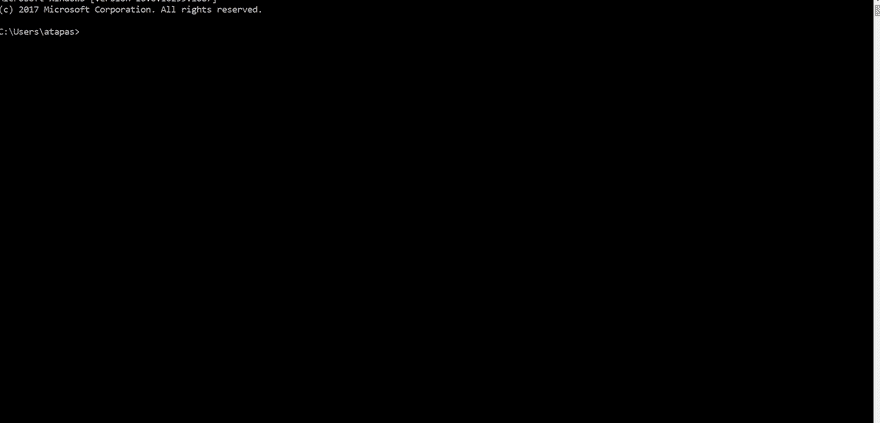
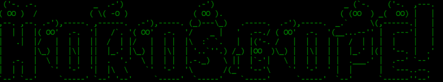
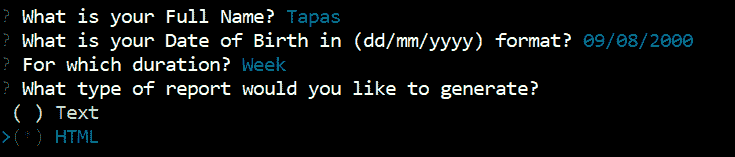
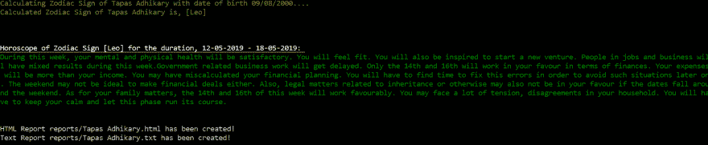
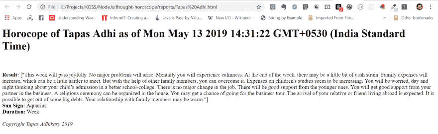
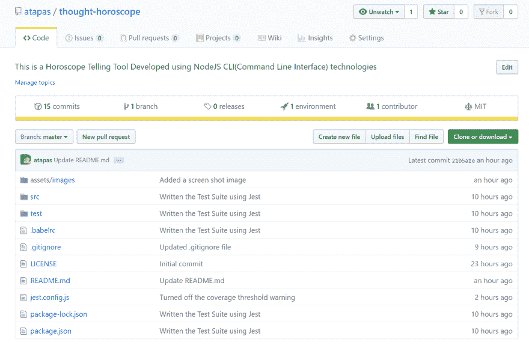

# 使用 Node.js 构建 CLI(命令行界面)应用程序的分步指南

> 原文：<https://dev.to/atapas/a-step-by-step-guide-to-build-a-cli-command-line-interface-app-using-node-js-b7m>

上周日，我本该参加一个关于使用 Node 开发第一个 CLI 的[的](https://www.meetup.com/jschannel-Bengaluru/events/261067974/)[会议](https://www.meetup.com)。写这篇博文的时候，我和现在一样兴奋。但不幸的是，我不得不错过了会议，这时候我想，我会写一个自己的和大家分享。因此有了这个帖子！

如果您遵循这篇文章，您将能够使用 Node.js 基础设施开发一个非常棒的命令行界面(CLI)。我向你保证，这将是有趣和有启发性的。你会在文章的最后找到完整的源代码。然而，如果你愿意的话，可以随意下载/克隆它。

# 先决条件

*   JavaScript:嗯...你知道为什么！
*   Node.js(我用的是 8.11.1 版本):有 Node.js 的基础知识就够了。
*   一颗好奇的心！

# 那么，这个 App 是关于什么的呢？

而是预测你的未来。是啊，还有什么比创造一个真实的(嗯，接近真实的！)算命 app 那个要求，

*   你的一些个人信息，比如，名字，出生日期。
*   如果你想知道今天、周、月或年的星座？
*   如果你想生成一个文本或 HTML 报告的预测？哇，太酷了！

一旦应用程序处理了所有输入，它就会提供，

*   全面的星座预测。
*   如果你选择了一份报告。

不如我们称之为，`thought-horoscope`？激动的😲？

下面是我们要构建的应用程序的工作输出:
[](https://res.cloudinary.com/practicaldev/image/fetch/s--lmH4smtq--/c_limit%2Cf_auto%2Cfl_progressive%2Cq_66%2Cw_880/https://cdn.hashnode.com/res/hashnode/image/upload/v1557727619156/uCuoZ9CCJ.gif)

### 安装和设置

*   下载并安装 [Node.js](https://nodejs.org/en/download/)
*   打开命令提示符并使用以下命令来设置项目

```
> mkdir horoscope
> cd horoscope
> npm init 
```

Enter fullscreen mode Exit fullscreen mode

会问你几个问题。回答这些问题并确认创建一个名为`package.json`的节点项目。

*   使用以下命令来安装我们将需要这个项目的依赖关系

```
npm install --save chalk figlet inquirer fs-extra request 
```

Enter fullscreen mode Exit fullscreen mode

一旦安装成功，您应该会在`package.json`文件中看到这样的一个部分(注意——库的版本可能会因其可用性而有所不同):

```
"dependencies": {
    "chalk": "^2.4.2",
    "figlet": "^1.2.1",
    "fs-extra": "^8.0.0",
    "inquirer": "^6.3.1",
    "request": "^2.88.0"
  } 
```

Enter fullscreen mode Exit fullscreen mode

我们都准备好了！

### 关于依赖性的一点

在上一节中，我要求您安装 5 个依赖项。让我解释一下这些是什么，为什么我们的项目需要它们。

*   [Figlet](https://github.com/patorjk/figlet.js) :它的目标是在 JavaScript 中使用 FIGFont。更多关于 FIGFont 的信息请点击这里。我们只是想在我们的应用程序中有点花哨，并打算使用一些像这样的字体，酷吗？它说，`HOROSCOPE` ( *把你的眼睛向后移一点，以便看得更清楚。* ) 
*   [询问者](https://github.com/SBoudrias/Inquirer.js):这是命令行用户界面的集合，也是我们 app 所需要的最重要的一个。我们将创建各种问题，并要求我们的用户收集进一步处理的答案。以下所有问题都是使用它创建的:
*   [粉笔](https://github.com/chalk/chalk#readme):用于端子串造型。Css 对浏览器上呈现的字符串所做的事情，Chalk 试图对终端上显示的字符串和文本做类似的事情。由于我们正在构建一个基于 CLI 的应用程序，我们将使用枯燥的黑白终端..生活中我们需要一些色彩！你在上面的图片中看到的所有颜色都是用粉笔画的。
*   [请求](https://github.com/request/request#readme):这是以最简单的方式进行 HTTP 调用所必需的。还有其他选择，但这对于我们的应用程序来说已经足够了。
*   [fs-extra](https://github.com/jprichardson/node-fs-extra) :处理文件系统，因为我们将把一些报告保存为文件。
*   现在特别提一下！这个[超级酷的回购](https://github.com/tapaswenipathak/Horoscope-API)由 [Tapasweni Pathak](https://github.com/tapaswenipathak) 创造。这提供了占星的 API，我们的应用程序将使用这些 API 的响应。

### 第一步:提问并收集回答

我们将使用[询问者](https://github.com/SBoudrias/Inquirer.js)来形成我们想问用户的问题。下面的方法定义问题，提示问题，并返回一个承诺和一组用户响应的答案:

```
const questionAnswer = () => {
    const questions = [
        {
            name: "NAME",
            type: "input",
            message: "What is your Full Name?"
        },
        {
            name: "DOB",
            type: "input",
            message: "What is your Date of Birth in (dd/mm/yyyy) format?"
        },
        {
            name: "DURATION",
            type: "list",
            message: "For which duration?",
            choices: ["Today", "Week", "Month", "Year"]
        },
        {
            name: "REPORT_TYPES",
            type: "checkbox",
            message: "What type of report would you like to generate?",
            choices: ["Text", "HTML"]
        }

    ];
    return inquirer.prompt(questions);
} 
```

Enter fullscreen mode Exit fullscreen mode

注意每个问题的结构。它有一个`name`,这是稍后将用于检索答案的标识符。什么问题`type`以及`message`字段中的实际问题是什么。

下面的代码说明，我们将如何检索用户提供的答案:

```
questionAnswer().then(answers => {
        // Calculate Zodiac Sun-Sign
        console.log(
            chalk.yellow(
                `Calculating Zodiac Sign of ${answers.NAME} with date of birth ${answers.DOB}....`
            )
        );
        const sunSign = new SunSign().getSunSign(answers.DOB);
        console.log(
            chalk.yellow(
                `Calculated Zodiac Sign of ${answers.NAME} is, [${sunSign}]`
            )
        );

        const dataToProcess = {};
        dataToProcess['name'] = answers.NAME;
        dataToProcess['dob'] = answers.DOB;
        dataToProcess['report'] = answers.REPORT_TYPES;
        dataToProcess['sunsign'] = sunSign;
        dataToProcess['duration'] = answers.DURATION;

        // console.log(dataToProcess);
        // Call API to get the Horoscope based on the sunSign
        horoscope.getHoroscope(dataToProcess);
    }); 
```

Enter fullscreen mode Exit fullscreen mode

请注意，我们使用类似于`answers.NAME`的问题关键字来检索答案，然后将它们进一步用于我们的业务逻辑

### 第二步:处理响应

正如在步骤 1 中看到的，我们可以在一个数组中获得用户响应，并可以通过问题键使用它们。对于我们的应用程序，

*   我们首先使用出生日期值来获取用户的星座。
*   然后通过黄道十二宫以及其他一些信息来获得星座。

### 第三步:获取星座运势

我们调用[星座 API](https://github.com/tapaswenipathak/Horoscope-API)来获取用户的星座。它需要几个输入，

*   星座
*   我们需要星座的持续时间，例如，今天、星期、月或年。

下面是代码:

```
exports.getHoroscope = (dataToProcess) => {

    let constURI = `http://horoscope-api.herokuapp.com//horoscope/${dataToProcess.duration.toLowerCase()}/${dataToProcess.sunsign}`;
    // console.log('constURI ', constURI);
    request(constURI, function (error, response, body) {
        if (!error && response.statusCode == 200) {
            let info = JSON.parse(body);
            dataToProcess['output'] = info;
            printHoroscope(dataToProcess);

            const report = new GenerateReport();
            if (dataToProcess.report.indexOf('Text') > -1) {
                report.saveText(dataToProcess);
            } 
            if(dataToProcess.report.indexOf('HTML') > -1) {
                report.saveHTML(dataToProcess);
            }

        } else {
            if (error) {
                console.log(chalk.red(`${response.statusCode}: Failed to get Horoscope at this time, Try Later!`));
            }
        }
    });
} 
```

Enter fullscreen mode Exit fullscreen mode

注意，一旦我们得到来自占星 API 的响应，我们就在控制台上打印它来输出结果，如果用户选择的话，还可以创建报告。

### 第四步:输出结果

作为结果输出，我们将它打印在控制台上。我们利用`chalk`来更好地设计文本的样式。

```
printHoroscope = (dataToProcess) => {
    console.log('\n\n');

    if (dataToProcess.duration === 'Today') {
        console.log(
            chalk.white.underline.bold(
                `Horoscope of Zodiac Sign [${dataToProcess.output.sunsign}] for the date, ${dataToProcess.output.date}: `
            )
        );
    } else if (dataToProcess.duration === 'Week') {
        console.log(
            chalk.white.underline.bold(
                `Horoscope of Zodiac Sign [${dataToProcess.output.sunsign}] for the duration, ${dataToProcess.output.week}: `
            )
        );

    } else if (dataToProcess.duration === 'Month') {
        console.log(
            chalk.white.underline.bold(
                `Horoscope of Zodiac Sign [${dataToProcess.output.sunsign}] for the Month, ${dataToProcess.output.month}: `
            )
        );

    }else if (dataToProcess.duration === 'Year') {
        console.log(
            chalk.white.underline.bold(
                `Horoscope of Zodiac Sign [${dataToProcess.output.sunsign}] for the Year, ${dataToProcess.output.year}: `
            )
        );
    }

    console.log(chalk.green(dataToProcess.output.horoscope));
    console.log('\n');
} 
```

Enter fullscreen mode Exit fullscreen mode

它将输出如下结果:
[](https://res.cloudinary.com/practicaldev/image/fetch/s--Ngkp-uzE--/c_limit%2Cf_auto%2Cfl_progressive%2Cq_auto%2Cw_880/https://cdn.hashnode.com/res/hashnode/image/upload/v1557738400635/7G7yEPX0U.png)

### 第五步:创建报表

创建报告(文本或 HTML)只不过是在一个目录下创建适当的文件。下面是实现这一点的代码:

*   要生成基于文本的报告:

```
saveText(data) {
        let textData = `Horocope of ${data.name} as of ${new Date()}:\n
        Result: ${data.output.horoscope}\n
        Sun Sign: ${data.output.sunsign}\n
        Duration: ${data.duration}\n\n
        Copyright Tapas Adhikary 2019`;

        let fileName = `reports/${data.name}.txt`;
        fse.outputFile(fileName, textData, (err) => {
            if (err) {
                console.log(err);
            }
            console.log(`Text Report ${fileName} has been created!`);
        });
    } 
```

Enter fullscreen mode Exit fullscreen mode

*   要生成基于 HTML 的报告:

```
saveHTML(data) {
        let textData = "<h1> Horocope of " + data.name +" as of " + new Date() + "</h1><br><br>"
                    + "<b>Result:</b> " + data.output.horoscope + "<br>"
                    + "<b>Sun Sign:</b> " + data.output.sunsign + "<br>"
                    + "<b>Duration:</b> " + data.duration + "<br><br>"
                    +"<i>Copyright Tapas Adhikary 2019</i>";

        let fileName = `reports/${data.name}.html`;
        fse.outputFile(fileName, textData, (err) => {
            if (err) {
                console.log(err);
            }
            console.log(`HTML Report ${fileName} has been created!`);
        });
    } 
```

Enter fullscreen mode Exit fullscreen mode

HTML 报表示例:
[](https://res.cloudinary.com/practicaldev/image/fetch/s--a4tw2VZ5--/c_limit%2Cf_auto%2Cfl_progressive%2Cq_auto%2Cw_880/https://cdn.hashnode.com/res/hashnode/image/upload/v1557738496998/os8yV9-xY.png)

这就是这个应用程序的全部内容。你可以根据你的创造力和需要即兴创作。创建基于 CLI 的应用程序很有趣，在搭建、自动化或任何其他脚本语言可能提供的任何其他情况下，它们都有很大帮助。

# 代码

上面提到的所有源代码都是开源的，可以在这里找到:[https://github.com/atapas/thought-horoscope](https://github.com/atapas/thought-horoscope)。通过克隆来尝试一下。
T3T5】

### 运行它

*   npm 安装
*   npm 运行应用程序

### 测试一下

*   npm 运行测试(我只使用 [Jest](https://atapas.hashnode.dev/setup-javascript-testing-with-jest-be-a-super-hero-cjval6rd4000skls11i5366t0) 写过几个单元测试用例。请随意完成剩余部分，并打开一个拉取请求。)

# 你注意到了吗？

大家有没有注意到，在占星 app 的演示中，我打开一个终端，只要输入`horoscope`这个词就可以了？这样做，应用程序就可以正常运行了？我不做，`npm run app`或`node index.js`等。
[T6】](https://res.cloudinary.com/practicaldev/image/fetch/s--yLmDPSQ2--/c_limit%2Cf_auto%2Cfl_progressive%2Cq_66%2Cw_880/https://cdn.hashnode.com/res/hashnode/image/upload/v1557736176318/Az0m5RRk0.gif)

### 遇见 *npm 链接*

这里有一个很棒的工具叫做，

```
 npm link 
```

Enter fullscreen mode Exit fullscreen mode

`npm link`为依赖关系创建一个全局符号链接。一个**符号链接**，或符号链接，是一个指向你系统上另一个目录或文件的快捷方式。更多关于`npm link`的信息可以在这里找到[。](https://docs.npmjs.com/cli/link)

你只需要再做一件事就可以让`npm link`工作了。在`package.json`文件中添加这个:

```
"bin": {
    "horoscope": "./src/index.js"
  } 
```

Enter fullscreen mode Exit fullscreen mode

*   给出一个符号链接名称，在我们的例子中是“星座”。
*   将它指向主文件，在我们的例子中是“index.js”文件。
*   运行命令`npm link`。

您已经获得了一个以您给定的名称创建的链接。你可以在任何地方使用终端使用相同的名称来启动应用程序。你现在感觉到创建一个基于 CLI 的工具的力量了吗？是不是很牛逼？

希望你喜欢这篇文章。编码快乐，干杯！🍻

*本文最初发表于@ [我的 HashNode 博客](https://atapas.hashnode.dev/a-step-by-step-guide-to-your-first-clicommand-line-interface-app-using-nodejs-cjvm6woau000mkvs1sd8u3qxm)。*