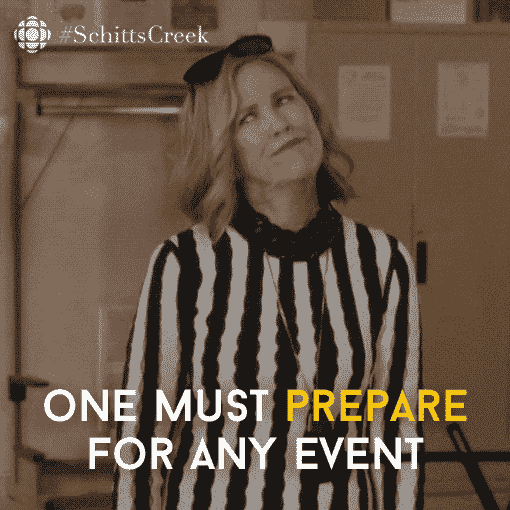
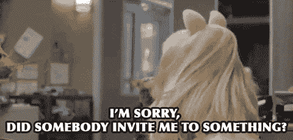
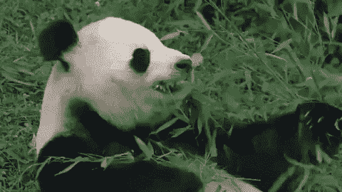
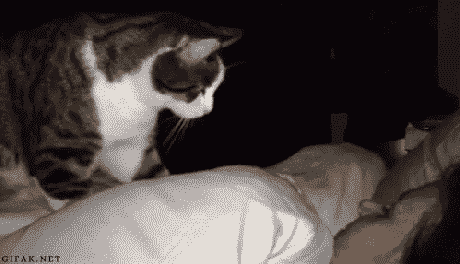
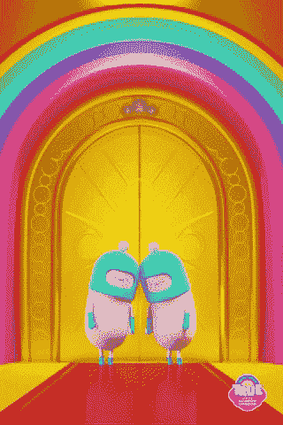
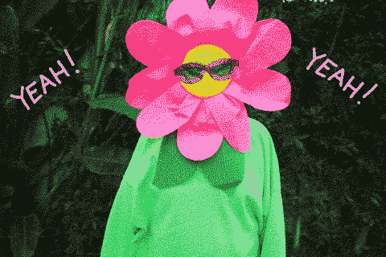
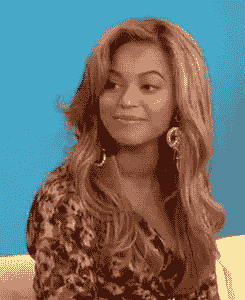

# 在办公室举办包容性开发者聚会或活动的分步指南

> 原文：<https://dev.to/listencommunity/a-step-by-step-guide-to-hosting-inclusive-developer-meetups-or-events-in-your-office-48g4>

*封面图片由[# WOCinTech Chat](https://www.wocintechchat.com/)T3】*

# 为什么举办活动？

活动是发展、激活和留住社区成员的绝佳方式，也能吸引员工。当我在 2015-2017 年在 [Keen IO](http://keen.io) 的开发者社区团队工作时，我帮助举办了大量的活动。到我在那里工作结束时，我想我个人已经在我们办公室帮助主持了至少 30 场活动。更多的是在没有我的支持下进行的，部分原因是我为我们的内部团队准备了这个方便的指南和清单。我把它放在 [GitHub](https://github.com/listen-community/resources/blob/master/guide.md) 上，那里积满了数字灰尘，所以我想我应该给它一点更新，并在这里 [dev.to](http://dev.to) 上分享它，在那里它可以被广泛使用！

举办活动既耗时又耗费资源。从寻找演讲者，协调食物和座位等后勤工作，到对与会者的需求感同身受，有很多事情需要考虑。

以下是一个指南，让你能够在办公室的活动空间中掌控和组织自己的活动，扩大和丰富你的社区，创造一个安全的空间，并让与会者兴奋不已！这对没有专门活动团队的初创公司尤其有帮助。假设您有合适的视听设备(投影仪、屏幕、麦克风和扬声器)、存储食物的地方以及折叠椅、桌子、专用客人 Wifi 和不分性别的洗手间等用品。

**注意:**本指南将包含 2016 年湾区的一些细节，以及我们当时设立的具体办公室，但我在此过程中更新了一些链接，这里有大量有价值的知识和资源，可以让任何人的活动规划更容易、更成功！

# 大事机不可失！

一个活动机会正在你的雷达上。你觉得举办这个活动会很棒。酷！为什么？你的活动符合你公司的使命和价值观吗？这是你想参加的吗？你的与会者会度过一段美好的时光并为他们的到来感到高兴吗？

如果你认为这个活动对你的社区和活动的参与者有益，你的下一步就是选择一个日期。如果适用，请查看您公司的活动日历，了解即将发生的活动。

既然你有了约会，让我们开始计划吧！

## 任务列表:活动前 3-4 周(或更长时间)

✔选择你的**活动日期**
✔不确定你的活动应该在什么时候举行？看看这篇伟大的文章，它是对通常的晚间技术聚会的一种替代:

 [## 让技术聚会变得更加容易

### 吉姆·班尼特·☁️1918 年 5 月 24 日阅读

#meetup #community #inclusion](/jimbobbennett/making-technology-meetups-more-accessible-4gb0)
✔ **Book the time** on your company’s event calendar
✔ If the event is open to employees, be sure to send a **calendar invite** to everyone in advance so everyone can be aware of and plan for the event.
✔ **Capacity:** Be sure you know your event space capacity in advance, to help know what to cap our registration numbers at. Between 30% and half of your registrants will actually show up for a free event. Asking folks to pay a small fee is one way to ensure you have a better understanding on your total number of registrants, but since most tech meetups are free, this can be a slippery slope and may exclude some otherwise awesome attendees.
✔ Now’s a great time to **secure resources**: Typically, a successful event requires a team of 5-6 (Emcee/host, “Stage Manager” to act as a speaker/sponsor resource and ensure everything is running smoothly, two folks to greet and welcome guests and keep the space clean and drink tub full, and one to two people to register guests at the front and stay at the door). Send any volunteers a calendar request so they don’t forget their duties!
✔ If you find yourself having trouble securing the team of 5-6 needed from your internal team, **consider allocating some budget to hiring [Taskrabbits](https://www.taskrabbit.com) to help with event tasks.**
✔ Consider having your **event recorded** and edited? Hiring a videographer can get expensive, [this article from Vimeo](https://vimeo.com/blog/post/how-to-find-and-hire-a-film-crew-when-you-re-on-a/) is full of ideas on getting a videographer or film crew together on a budget.

## 音箱

✔:你的活动中会有哪位**演讲者**吗？你知道他们是谁吗？
✔如果您已经确定了一位演讲者，但还想邀请更多，请**注意尽可能邀请代表性不足的演讲者。**白人女性(顺便说一句，她们在编程社区的代表性不足，在营销社区的代表性更少——这一点要记住，取决于你的活动主题)、有色人种女性、有色人种男性和非二元人种应该至少占你的演讲者名册或小组的 33%(如果 3 人或更多)，理想情况下是 50%。
✔如果你有一位来自公司的演讲人，最好**增加非公司的演讲人**让活动面向更广泛的受众，扩大你的社区，增加活动参与者的价值。
✔一个[巨大且不断增长的资源](https://github.com/iheanyi/speakers-who-want-a-platform)供**希望发言的未被充分代表的演讲者使用！**

## 事件页面创建

✔:一旦你确定了你的发言人，我推荐使用 [Eventbrite](http://eventbrite.com) 或 [Tito](http://tito.com) 来**管理 RSVP**。两者都是免费的——Tito 有一些很棒的分析和工具，Eventbrite 在公开发布时会增加你的活动的观众数量。选择一个最适合你的！
✔您的活动页面应包含以下信息，顺序大致如此(查看我们的[往期活动](http://www.eventbrite.com/o/keen-io-6663825521)页面获取灵感):

*   **引人注目的事件照片:**股票图片的主要来源是 [WOCinTech Chat](https://www.flickr.com/photos/wocintechchat/albums) (请提供署名: [#WOCinTech Chat](https://www.wocintechchat.com/) )或[Unsplash.com](https://unsplash.com/)。 *PS:这里有一些很棒的整体[包容性资源](https://listen.community/inclusion-resources)，可能会对你的活动规划和整体开发者社区管理有所帮助。*
*   **简要描述和推介:**本次活动的总体主题是什么？与会者对这个主题的哪些方面感兴趣？他们为什么想参加？会回答哪些问题？
*   **发言人名单:**每位发言人的姓名、照片和 3-4 句简短简历
*   议程:你可以在这里加入关于食物和饮料的有用信息(或缺少信息)。议程示例:

    *   下午 6:00-6:30:饮料、小吃和酒吧
    *   下午 6:30-7:30:演讲者演讲
    *   晚上 7:30-8:00:小组讨论会
    *   晚上 8:00-8:30:更多的饮料，小吃和酒吧

✔一定要包括一个行为准则的链接(Keen 的可以在[这里](https://github.com/keen/community-code-of-conduct)找到)和一些上下文信息。我们在 2016 年 9 月的“聚焦盟友谈话”中举了一个例子:

> “关注盟友:2016 年的多样性和包容性是一项针对来自许多不同背景的人的活动。因此，本次活动的所有与会者、
> 发言人、赞助商和志愿者都需要同意
> 与 [Keen IO 行为准则](https://github.com/keen/community-code-of-conduct)

✔一定要弄清楚你的活动空间是否真的**无障碍:**方便轮椅的入口和坡道是必不可少的，但主楼层的洗手间也是如此，如果有多个楼层，电梯，房间周围和桌椅之间有足够的空间供轮椅或助行器使用，为助行器预留过道座位，椅子可以舒适地容纳较大的身体，以及良好的照明，等等。
✔明确表示，浴室将不分性别。([佩里·艾森](https://twitter.com/perrysetgo)写了这篇惊人的帖子，更详细地介绍了性别包容的科技活动[这里](https://blog.usejournal.com/gender-inclusive-tech-events-a-hands-on-how-to-guide-ec93ee477035)。读吧！✔考虑雇用美国手语翻译，让这项活动对听障人士开放。我用过 [Linguabee](http://www.linguabee.com) ，它们棒极了！
✔考虑将以下建议添加到您的**活动文案**中:

> “本着促进科技多样性和包容性的精神，考虑带一个看起来不像你的朋友。男人们，带上一个女性朋友。白人，带个 POC 朋友。直男们，带一个 LGBTQ 社区的朋友。身体健全的人，带一个残疾的朋友。”

### Eventbrite 特有的提示(这样可以节省你的时间和困惑):

✔ [确保你的门票限制在每个名字一张](https://www.eventbrite.com/support/articles/en_US/How_To/how-to-limit-how-many-tickets-one-attendee-can-purchase)，否则你会冒一个人买了 20 张票，却有 3 个人到场的风险。
✔ [确保您的门票销售开始和结束日期与您的销售期一致，并提前到活动当天。](https://www.eventbrite.com/support/articles/en_US/How_To/how-to-change-the-start-end-date-and-time-for-ticket-sales)。通常，Eventbrite 会在这里默认奇怪的日期，所以检查这一点很重要。

# 任务列表:活动前 2-3 周

## 晋升

往前走**提拔**！这是你的促销清单:

✔如果你的公司有**活动日历**，确保你的活动已经包括在内。
✔ **在推特上发布事件**。如果可能的话，试着从你公司的 twitter 账户中获取推文，以获得更大的影响力！如果合适的话，考虑为事件添加一个标签。
✔确保在你的推广推文中包含**演讲者推特账号**，以及他们为之工作的公司的任何推特账号。这是一个伟大的方式来确保转发！
✔想**安排一些推文**？加一些很酷的图形？试着通过 [Buffer](https://buffer.com) 安排一些推文，并使用他们很酷的社交图片功能 [Pablo](https://pablo.buffer.com) 。带有[图片](https://twitter.com/keen_io/status/775409902143545344)的推文被证明更有吸引力(更多的转发、点赞等)。)
✔寻找并联系当地主题相关的 **[meetup group](https://www.meetup.com) 组织者进行联合推广**。许多 meetup 团体很乐意与他们的社区分享相关事件。
✔伸出手，**邀请[技术领域代表名额不足的群体](https://tctechcrunch2011.files.wordpress.com/2016/03/include-diversity-directory1.pdf)** 。他们不仅渴望听到新的事件，将你的社区扩大到更广泛的人群将会丰富它！
✔询问你的营销和社区团队，有限的**电子邮件群发或包含在即将发布的时事通讯**中是否对现有客户和活动社区相关且及时。
✔我通常看到大多数**注册发生在活动**前的两周内，所以你最好的办法是计划在活动前的两周争取注册。在离活动更近的地方注册的人也更有可能出现，尤其是对于免费活动！

# 任务列表:活动前一周

✔ **通过电子邮件**联系你的演讲者，询问以下问题:

*   他们有他们需要的东西吗？
*   你能先睹为快吗？(没有什么比惊喜[进攻滑步](https://www.businessinsider.com.au/atlassian-atlas-conference-gender-gap-tech-horror-2014-6)！)
*   他们对技术规格有什么样的期望:他们想展示自己的电脑吗？如果是这样，请务必让他们提前到达，在您的设备上检查他们的演示设置和 A/V，并让他们向您发送他们演示的备份(最好通过 PDF 或 Google drive，以确保格式的一致性。通过电子邮件发送的 Keynote 和 PowerPoint 文件是灾难的根源)
*   询问他们是否有自己的“点击器”(*官方术语*)来浏览幻灯片，或者是否需要一个(确保在办公室有一个，在 Keen 我们使用[这个](https://www.cdw.com/shop/products/Logitech-Wireless-Presenter-R400-presentation-remote-control/1831321.aspx)，它已经在我们连接的每台机器上工作过)

✔鼓励演讲者在活动当天中午或前一天晚上通过 Google Drive 或 Dropbox 发送他们的幻灯片，并在一台机器上运行所有演示。这可以防止在扬声器之间切换电脑时出现尴尬的停顿和潜在的技术故障。
✔知道你的投影仪的**细节**。在 Keen，我们的投影仪可以通过 thunderbolt 端口或 HDMI 轻松连接 Macbooks。扬声器可能需要为任何其他配置提供加密狗。
✔与你指定的司仪预约一些**时间，确保他们对活动的流程、议程和他们要展示的内容感到舒适，这些内容可以是:**

*   如果相关的话，[领土承认](https://coco-net.org/thinking-about-land-acknowledgements-here-are-some-resources/)是对举办活动的土著领土表达尊重和敬意的一种方式。(感谢 [Alain Wong](https://twitter.com/alainwong) 的这个建议！)
    *   短扬声器 bios
    *   关于行为准则、浴室位置和食物/饮料位置的客房信息(如果不明显)通常是必须的)

✔:如果可以的话，**计划在演讲者开始之前向听众简要介绍你的公司和产品**。✔:你的注册号码怎么样了？

*   总是假设对于任何免费的活动(在你的空间举行的 99%的活动应该是免费的，假设你正在寻找建立社区，而不是从活动中赚钱)，你将有 30-50%的出席率。
*   因此，注册目标应该考虑到这一点。如果你想看到 50 个参与者，计划推广，直到你达到 100-150 个注册者。

✔确保你有足够的名牌和记号笔，让与会者写下他们的名字！如果需要，订购一些。名牌可能是陈词滥调，但确实是很好的社交/破冰工具！
✔ **提供代词贴或按钮**。在这篇精彩的文章中，你可能想知道的关于代词标签和按钮的一切:

 [## 代词按钮的组织者指南

### fen Slattery 10 月 25 日 189 分钟读取

#community #conference #inclusion #diversity](/sublimemarch/an-organizers-guide-to-pronoun-buttons-afb)
✔ Make sure you have the desired amount of **swag** available to distribute at the event. I won't get into what that swag should be, but let's avoid things like [this](https://twitter.com/IanColdwater/status/1131558760693084160) and lean towards things like [this](https://shop.dev.to/).

# 任务列表:活动前 3-4 天

## 餐饮盛会

✔:在活动开始前 3-4 天，你应该有个主意，你的注册号码会去哪里，所以开始考虑餐饮选择。 *请注意，在某些情况下，推荐的厂商是特定于三藩市的。*
【✔】无论你的预算如何，**多样化的饮食需求可以而且应该得到满足**:纯素、素食、无奶和无麸质。
✔如果你有预算，可以考虑一下 bi-rite[的精致、美味和营养的餐饮服务，它可以获得优秀的参与者反馈，让人们吃饱、健康和快乐。大约 1500 美元养活 100 个人。
✔一个不错的中层预算选择是](http://www.biritemarket.com/catering/) [La Mediteranée](https://cafelamedfillmore.com/catering/) 花 900 美元养活 100 个人。✔如果你的预算不多，你还有其他选择。尝试墨西哥玉米卷或许多其他选择。🌮[披萨](http://goathill.com/)偶尔也不错，只是要确保每 50 个左右的客人点几个品种，包括一个无麸质馅饼。🍕你还应该包括沙拉选项与比萨饼。🥗
✔计划为~.75 酒鬼🍻和 1 杯不含酒精的饮料🥤每位与会者(因为不是每个人都喝酒，很多人都想两种都喝)。你通常需要超额订购，以确保多样化，因为大多数啤酒是 6 包或几打出售。✔计划提供大量非酒精饮料(水、果汁、白兰地、低糖和普通苏打水，如果可以的话，还有鸡尾酒)以及葡萄酒和啤酒(在公共活动中，烈性酒可能会导致危险，在大多数情况下通常不被推荐🤢).
✔如果你没有足够数量的可重复使用的**盘子/餐具**，食品供应商的订单也应该尽可能包括可生物降解的盘子/餐具，确保你在订购时详细说明。✔别忘了去拿或点冰块！❄️

# 任务列表:事件前 2 天

✔:现在你应该对与会人数有个很好的了解，所以现在是时候**点餐了**。订购足够 50%注册人数的食物(100 RSVPs =人的食物)。
✔确保你让同事和**志愿者准备好在夜间**值班，并有关于如何[上报任何事件的明确指示](https://github.com/keen/community-code-of-conduct/blob/master/incident-reporting.md)。确保所有在门口工作的人都有组织者的手机号码。
✔准备**带有 wifi 信息的占位符幻灯片**
✔准备带有贵公司徽标和活动名称(如果适用)的介绍性幻灯片

# 任务列表:事件前一天

✔向所有与会者发出关于活动及其相关信息(位置、方向、可达性、食物等)的**提醒。你可以直接通过 Eventbrite 或者 [Tito](https://ti.to/docs/messages) 来做这个[。](https://www.eventbrite.com/support/articles/en_US/How_To/how-to-email-your-attendees-through-eventbrite)**

# 任务列表:事件发生的日期

## 上午:

✔在 Instacart 上点饮料和冰(如果你在旧金山或其他 Instacart 市场)，或者用传统方式去买杂货。

## PM:

**看家！**
✔清空当前的垃圾/堆肥/回收利用
✔将袋子放入容器
✔整理活动区域并确保在附近工作的搬迁人员
✔接收食品杂货，将供应品放在餐桌区域附近
✔为门口打印活动标志
✔如果需要，请放下两个酒吧凳子/座椅，让签到志愿者坐在上面
✔设置并测试投影仪/幻灯片
✔确保“点击器”已准备就绪，可以在正在使用的计算机上运行。演讲者可能会提供自己的“响片”(*应该有更好的说法* )
✔在需要时打开并测试麦克风/扬声器(由于我们空间的音响效果，我们只在 50 人以上的活动中使用它们)
✔摆放折叠椅，确保椅子之间留有足够的空间供轮椅/助行器使用。 在可能的情况下，在组合中分发一些较大的椅子
✔设置食物桌和饮料区(我建议用牛皮纸覆盖你的桌子，这样看起来很棒，清理起来也不在话下，买三个饮料桶，就像[这些](https://www.amazon.com/Behrens-3-OV-16-Gallon-Oval-Steel/dp/B002YJJJQ6/ref%3Dpd_rhf_se_s_cp_8) )
✔在开门前一个小时冰镇饮料桶(先把饮料放在桶里，然后倒冰——相信我😂✔如果你在分发 t 恤和贴纸， 将它们整齐地摆放在房间后面的一张桌子上(远离食物)
✔准备好笔记本电脑/ipad，打开 Eventbrite 或 Tito 帐户/列表[准备好签到](https://www.eventbrite.com/support/articles/en_US/How_To/how-to-use-a-laptop-to-check-in-attendees-at-your-event)在入口附近的签到区
✔在签到区为与会者布置姓名标签、记号笔、代词按钮/贴纸
✔告诉所有与会员工要对与会者的快乐保持高度警惕，如果有人似乎遇到麻烦，要插话或[向主持人报告](https://github.com/keen/community-code-of-conduct/blob/master/incident-reporting.md)

## 事件发生前 30 分钟:

✔深呼吸，喝杯水。尽量在客人到达前花点时间吃饭，因为我保证你现在不吃就不吃。如果有什么事情要出错，而且很可能会出错，你可以处理好。🙌
✔如果雇佣了摄像师，他们应该到达并布置好
✔，如果可能的话，为客人的到来播放一些很棒的、低音量的乐器破冰音乐(无歌词确保你不会碰到任何性别歧视/种族主义/触发性歌词！爵士乐总是优雅的！)
如果你要求的话，大多数餐饮服务公司会为你贴标签，但是你可能需要自己贴标签。如果你不确定，总是假设食物可能含有过敏原。
✔报到志愿者应在活动开始前 10 分钟到位并为提前到达者开门

# 活动启动！

✔，这是我们期待已久的时刻！打开那些门！✨
✔入住并欢迎客人！
✔对与会者的快乐保持高度警惕，如果任何人似乎遇到了麻烦，插话或[向主持人报告](https://github.com/keen/community-code-of-conduct/blob/master/incident-reporting.md)
✔如果你是活动背后的驱动力，现在是混合、交往和建立关系网的时候了...享受你的劳动成果，让你的志愿者来管理活动细节。你努力了，这是你应得的
✔你的志愿者应该是:

*   确保任何看起来害羞或孤独的人受到欢迎并被介绍给别人
*   补充饮料/冰
*   处理任何溢出/混乱
*   在活动进行过程中，将空瓶子/空罐子扔进回收站

# 任务列表:事件结束

✔清理-所有的瓶子/罐子
✔清空溢出的垃圾/回收/堆肥
✔如果可能，食物不会在一夜之间变质，考虑让[食物管理员](http://www.foodrunners.org/donate-food/)收集第二天剩余的食物，重新分配给无家可归的人
✔如果可行，折叠椅子并存放起来
✔确保离开前办公室/空间安全
✔确保花时间向志愿者表达你的谢意，无论是通过一个小礼物，一个轻松的呼喊，还是其他形式的认可！

# 任务列表:跟进/事后

✔:你应该发送一封跟进邮件来感谢你的与会者的到来。你可以通过 Eventbrite 或[Tito](https://ti.to/docs/messages)
✔[来做这件事如果你的活动被记录下来，通常最好等到你收到录音后再发给你的与会者
✔考虑通过](https://www.eventbrite.com/support/articles/en_US/How_To/how-to-email-your-attendees-through-eventbrite)[Rev.com](https://www.rev.com)来转录录音，这对于撰写摘要
✔考虑在你的公司博客上写一篇**博文摘要**！不幸的是，自从 [Keen IO 被收购](https://techcrunch.com/2017/12/23/scaleworks-announces-pre-holiday-surprise-with-keen-io-acquisition/)后，我的事件摘要不再在 Keen 博客上发布。这里有一个[超级旧的 tumblr](https://masherydev.tumblr.com/) 我们曾经在 Mashery 上用它来总结我们所有的黑客马拉松。不要告诉任何人它还在直播😂

现在，拍拍自己的背。你做得很好！

我错过了什么吗？你想补充什么？下面评论我来补充！

*感谢[佩里·艾辛](https://twitter.com/perrysetgo)在活动中为性别包容提供更多资源，并帮助我考虑使用助行器的人们的需求*

这篇文章有帮助吗？希望此任务列表的电子表格版本运行您自己的包容性 office 事件？给我发信息，我会帮你联系的！