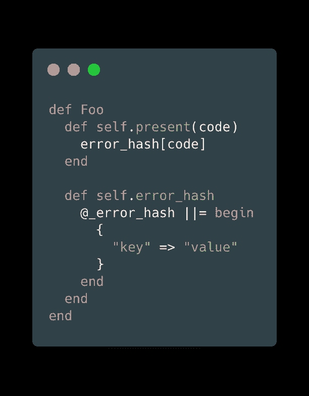

# 工作中好奇心的故事——工作不一定是无聊的

> 原文：<https://dev.to/edisonywh/a-tale-of-curiosity-at-work-work-doesn-t-have-to-be-boring-2122>

我通常的文章都很无聊，所以今天我要改变一下。今天我要讲的是，一天的工作。或者，如果你愿意的话，可以叫它*一个好奇的故事*。我保证会很有趣，或者至少我会努力让它变得有趣。

[](https://i.giphy.com/media/3KCOFfdqmptLi/giphy.gif)

最近，我和我的团队一直在与第三方 API 集成，我的任务是将第三方 API 返回的错误转换成我们可以向用户显示的内容。

例如，如果第三方 API 响应:

```
{
  "code": "123",
  "message": "Error message from third-party"
} 
```

Enter fullscreen mode Exit fullscreen mode

我们不一定要将他们的信息呈现给我们的用户，因为这很可能是一些用户不理解的随机错误(例如`Required argument is not passed in`)，而且通过将他们的错误代码映射到我们自己的错误代码，我们可以控制我们公司的语气和声音。所以，该工作了！

过了一会儿，我完成了我的任务，我把它交给一个同事审阅，就像万岁，下一个任务的时间到了。

5 分钟后他回来问我: ***你为什么这样做*** ？

相关的拉取请求如下所示:

[](https://res.cloudinary.com/practicaldev/image/fetch/s--_tHd9sFs--/c_limit%2Cf_auto%2Cfl_progressive%2Cq_auto%2Cw_880/https://thepracticaldev.s3.amazonaws.com/i/jum31cohz2djhixg6798.png)

事实上，他特别问我为什么选择记忆我的方法？

对话是这样的:

> 嘿，你为什么要记住这个杂碎？
> 我:嗯，我们会经常访问它，不想一次又一次地重新计算，因为这个值不会改变。
> C:但是你只会记住那些昂贵的计算，比如数据库调用，API 调用等等。我:有道理，但是我希望每个对`error_hash`的调用都返回相同的对象，这样更节省内存。
> 上校:我真的不认为这是一个好理由。真的是这样吗？我:老实说，我不太确定，我只是假设。我能花 10 分钟运行基准测试来找出答案吗？那还用说。

所以我决定做一个快速的基准测试，看看我的假设是否正确(因为我要证明那个小混蛋是错的):记忆将返回给我内存中完全相同的对象，而如果我不这样做，每次都会生成一个新的散列。

由于这是一个与 Ruby 内存交互的例子，我求助于我最好的朋友`ObjectSpace`(我在几篇文章中提到过他)。`ObjectSpace`基本上允许你在运行时与活体进行交互。非常适合我们！

我花了大约 10 分钟完成了这个快速脚本。如果你愿意，你可以看看代码，但基本上我的假设是准确的，如果我不去记忆，它会在内存中产生很多额外的对象。

然而，我是否坚持了我的方法？没有。然后他问我为什么不用常数，我意识到这正是我想要的，所以我更新了我的解决方案，改用常数。

## 外卖

如果我希望你能从中学到什么的话，那就是你应该**乐于学习/接受反馈**。

让我们来看看这个:

*   我的同事质疑我，不是以一种高人一等的语气，而是发自内心的好奇，想知道我为什么这么做。
*   我解释了为什么我这样做，他并不真的同意，但我们决定，我可以运行一些测试来支持我的说法。
*   我正是这样做的，现在我们有更多的数据用于我们的判断。
*   我们都评估了新的信息，并决定有一个更好的方法(常数),我们都选择放下我们以前持有的观点，去用什么是最好的解决方案。

这个小小的互动大概花了 15 分钟？在 15 分钟内，我们能够学习更多关于 Ruby 内部的知识，并且带着更多的知识回家。

起初看起来很平凡的任务已经变成了一个有趣的学习环节，这只是因为我们都很好奇。相信我，好奇心不会杀死猫，放飞你的好奇心吧！

我希望通过阅读这篇文章，我已经鼓励你抱着好奇的心态问自己，不管这个任务看起来多么平凡，我能从中学到什么吗？

如果你有任何类似的故事，你成功地把一个平凡的任务变成了一个很好的学习机会，欢迎在评论中分享！

好吧，在我的经理拍我肩膀之前，我最好现在回去工作。(*他并没有真的那样做*..)