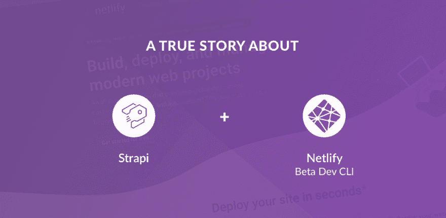

# 关于 Strapi 和新 Netlify Beta Dev CLI 的真实故事

> 原文：<https://dev.to/strapijs/a-true-story-about-strapi-and-the-new-netlify-beta-dev-cli-4ggn>

[](https://res.cloudinary.com/practicaldev/image/fetch/s--WI5UB11b--/c_limit%2Cf_auto%2Cfl_progressive%2Cq_auto%2Cw_880/https://thepracticaldev.s3.amazonaws.com/i/9p9wllra7rtw1k188agg.png)

如果你现在是一名网络开发者，那么几乎可以肯定你听说过 [Netlify](//www.netlify.com) 。事实上，你很可能已经尝试过他们的起步计划，甚至已经在使用了。你可能还没有听说过，这是可以理解的，因为[是加入 Netlify](https://twitter.com/sarah_edo/status/1123226857325891584) 的开发者的另一个标志，是他们的[新开发 CLI (Beta)](https://www.netlify.com/products/dev/) 。

在我们最近发布的系列教程中，[学习如何使用 Strapi 和 Gatsby](https://blog.strapi.io/building-a-static-website-using-gatsby-and-strapi/) ，我们甚至制作了视频来配合。在一个视频中，我们展示了[在 Netlify](https://youtu.be/rzR3yn9Ej3o) 上部署一个 Gatsby 站点是多么容易。但在 2019 年 4 月 18 日，一个不同的视频被安排上线。预定的视频是关于同样的事情，但是我展示了一种不同的做事方式。视频变化的原因是因为那天午饭后，我收到了一封电子邮件，宣布 Netlify 首席执行官马特·比尔曼的[主题演讲，在这里他宣布了**新的 Beta 版 Netlify Dev CLI** 。](https://www.youtube.com/watch?v=RL_gtVZ_79Q)

在与团队快速讨论后，我们决定一切都必须重新记录(使用 Netlify Beta Dev CLI Dev，而不是浏览器导航指令),并且有了一卡车的*不合法的*能量饮料，我准备花一个非常非常长的晚上来做这件事。

但是即使我在下午 1:05 收到邮件，我还是能够按时录制、编辑、记录和回家。因为使用新的 Netlify Dev CLI 更快、更有效，因此更容易使用、更容易讨论和教授。

本文实际上并不是关于使用 Netlify 或 Netlify Dev CLI 的教程。 [Netlify 已经有了优秀的文档](https://www.netlify.com/docs/cli/)。不，在这篇文章中，我会给你几个例子来说明生存还是毁灭(使用 Netlify Dev CLI)的区别，并希望你采取下一步措施，至少尝试一下 Netlify，例如，[是斯特拉皮、盖茨比和 Netlify](https://github.com/strapi/strapi-heroku-cms-demo) 的不可思议、荒诞、神奇的结合。

### 例 1:

在推送您的更改后，打开您的站点时节省几次点击:

**网络开发 CLI 方式**

```
git push
netlify open:site 
```

**注意:**你完全有可能刷新你的浏览器，因为你可能比 Netlify 的重新部署快几秒钟左右。有可能。

### 例二:

如果你想检查你正在使用的钩子。假设你有一个打印错误。看看这个:

```
netlify hhoks
›   Warning: status:hhoks is not a netlify command.
Did you mean status:hooks? [y/n]: y
Site Hook Status │
─────────────────┘
site:  strapi-gatsby-postgresql-demo
hooks:
  5ccc790da0118e8a5b:
    type:     github_commit_status
    event:    deploy_created
    id:       5ccc790da0118e8a5b
    disabled: false
    repo_url: https://github.com/davidkartuzinski/strapi-gatsby-postgresql-demo
  5ccc790fc3c6bcba0a36:
    type:     github_commit_status
    event:    deploy_building
    id:       5ccc790fc3c6bcba0a36
    disabled: false
    repo_url: https://github.com/davidkartuzinski/strapi-gatsby-postgresql-demo 
```

你听到了吗？它不仅能发现你的错别字，还能让继续下去变成一件简单的“是”或“不是”的事情。

### 例 3:

在我刚刚完成的教程中，在 Netlify 上完成[初始账户创建后，我只需要简单的四个步骤就可以托管一个完整的网站！
基本上，我在本地完成了实际网站的工作。接下来，我需要将最终的更改推送到 GitHub。
下面是使用 Netlify CLI Dev 托管一个](https://app.netlify.com/signup) [Strapi 支持的 Gatsby 站点](https://blog.strapi.io/building-a-static-website-using-gatsby-and-strapi)有多容易:

##### 1。安装 Netlify CLI Dev 并登录到您的帐户:

```
npm install netlify-cli -g  
netlify login 
```

##### 2。按下一个按钮即可授权同步。

##### 3。初始化并设置您的项目:

```
netlify init  
? What would you like to do? + Create & configure a new site
? Site name (optional): 
? Team: YOUR NAME HERE

Site Created

Admin url: https://app.netlify.com/sites/SITE-NAME  
Site url:  https://SITE-NAME.netlify.com  
Site ID: YOUR-UNIQUE-SITE-ID

? Your build command (hugo/yarn run build/etc): gatsby build
? Directory to deploy (blank for current dir): public
? No netlify.toml detected. Would you like to create one with these build settings? Yes

Creating Netlify Github Notification Hooks...  
Netlify Notification Hooks configured!

Netlify CI/CD Configured!
The site is now configured to automatically deploy from github branches & pull requests.

Next steps:

  git push       Push to your git repository to trigger new site builds
  netlify open   Open the Netlify admin URL of your site 
```

##### 4。Git 推送附加的 Netlify 配置文件并打开您的站点:

```
git add .  
git commit -m "netlify config settings files"  
git push  
netlify open 
```

现在，每当我更新 GitHub 时，Netlify 都会在几分钟内自动实时更新更改。所有这些都在 Netlify CLI Dev 中完成。事实是，即使是基于浏览器的点击也是网络生活的一大魅力。他们拥有出色的 UX，显然非常关心用户的体验。
如果所有这些新奇和精彩真的让你不安，并且你错过了[上传文件怪物](https://filezilla-project.org/)，不要担心， [Netlify 会支持你](https://www.netlify.com/docs/manual-deploys/)。