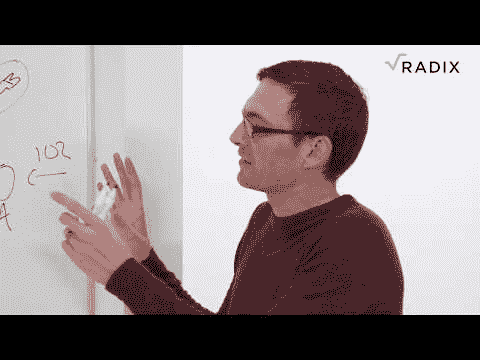

# Radix 的视频介绍-什么是区块链缩放问题，我们如何解决它们？

> 原文：<https://dev.to/radixdlt/a-video-introduction-to-radix-what-are-blockchains-scaling-issues-and-how-can-we-fix-them-4dde>

区块链绝对是一个革命性的变化——这是我们第一次可以在没有一个中央党来检查每个人的情况下处理双重支出问题。但是区块链到底是如何运作的，它的局限性是什么？让我们和我们的创始人丹·休斯一起进一步探讨这个问题吧！

如果您有任何问题，请加入 Radix 社区！

[电报](https://t.me/radix_dlt)普通聊天
[不和](https://discord.gg/7Q7HSZZ)开发者聊天
[Reddit](https://reddit.com/r/radix) 普通讨论
[论坛](https://forum.radixdlt.com/)技术讨论
[推特](https://twitter.com/radixdlt)发布公告
[电子邮件](https://radixdlt.typeform.com/to/nyKvMV)简讯每周更新
邮件[hello@radixdlt.com](//hello@radixdlt.com)普通查询